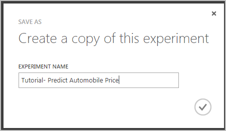
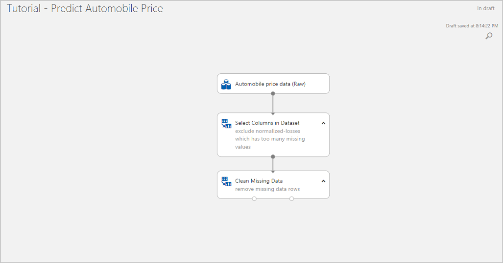

# Tutorial: Predict automobile price with the visual interface

In this tutorial, you take an extended look at developing a predictive analytics solution in the Azure Machine Learning service visual interface. You'll learn how to create a machine learning model, deploy it as an Azure web service, and consume your web service to make predictions on new data.

By the end of this tutorial, you'll have a solution that can predict the price of any car based on technical specifications you send it.

This tutorial [continues from the quickstart](ui-quickstart-run-experiment.md) and is **part one of a two-part tutorial series**. However, you don't have to complete the quickstart before starting.

In part one of the tutorial series you'll learn how to:

> [!div class="checklist"]
> * Import and clean data (the same steps as the quickstart)
> * Train a machine learning model
> * Score and evaluate a model

In [part two](ui-tutorial-automobile-price-deploy.md) of the tutorial series, you'll learn how to deploy your predictive model as an Azure web service.

> [!NOTE]
> A completed version of this tutorial is available as a sample experiment.
> From the Experiments page, go to **Add New** > **Sample 1 - Regression: Automobile Price Prediction(Basic)**

## Create a workspace

If you have an Azure Machine Learning service workspace, skip to the [next section](#start). Otherwise, create one now.

[!INCLUDE [aml-create-portal](../../../includes/aml-create-in-portal.md)]

##  Open the visual interface webpage

1. Open your workspace in the [Azure portal](https://portal.azure.com/).  

1. In your workspace, select **Visual interface (preview)**.  Then select **Launch visual interface**.  

    

    The interface webpage opens in a new browser page.  

## Import and clean the data

The first thing you need is data, but raw data is typically too messy to train a model directly. You'll have to do some basic data cleaning to prepare your data. If you completed the quickstart, you can reuse your data prep experiment here.

### Reuse the quickstart experiment

1. Open your quickstart experiment.

1. Select **Save As** at the bottom of the window.

1. Give it a new name in the pop-up dialog that appears.
    

1. The experiment should now look something like this:
    

If you successfully reused your quickstart experiment, skip the next section to begin [training your model](#train-the-model).

### Start from a new experiment

If you didn't complete the quickstart, follow these steps to quickly create a new experiment that imports and cleans the automobile data set.

1. Create a new experiment by clicking **+NEW** at the bottom of the visual interface window.

1. Select **EXPERIMENT** >  **Blank Experiment**.

1. Select the default experiment name at the top of the canvas and rename it to something meaningful. For example, **Automobile price prediction**. The name doesn't need to be unique.

1. To the left of the experiment canvas is a palette of datasets and modules. Type **automobile** in the Search box at the top of this palette to find the dataset labeled **Automobile price data (Raw)**. Drag this dataset to the experiment canvas.

    Now that you have your data, you can add a module that removes the **normalized-losses** column completely. Then, add another module that removes any row that has missing data.

1. Type **select columns** in the search box at the top of the module palette to find the **Select Columns in Dataset** module. Then drag it to the experiment canvas. This module allows you to select which columns of data you want to include or exclude in the model.

1. Connect the output port of the **Automobile price data (Raw)** dataset to the input port of the Select Columns in Dataset.

1. Click the Select Columns in Dataset module and click **Launch column selector** in the **Properties** pane.

   * On the left, click **With rules**
   * Under **Begin With**, click **All columns**. These rules direct **Select Columns in Dataset** to pass through all the columns (except those columns we're about to exclude).
   * From the drop-downs, select **Exclude** and **column names**, and then click inside the text box. A list of columns is displayed. Select **normalized-losses**, and it's added to the text box.
   * Click the check mark (OK) button to close the column selector (on the lower right).

     Now the properties pane for **Select Columns in Dataset** indicates that it will pass through all columns from the dataset except **normalized-losses**.

1. Add a comment to the **Select Columns in Dataset** module by double-clicking the module and entering "Exclude normalized losses.". This can help you see, at a glance, what the module is doing in your experiment.

1. Drag the **Clean Missing Data** module to the experiment canvas and connect it to the **Select Columns in Dataset** module. In the **Properties** pane, select **Remove entire row** under **Cleaning mode**. These options direct **Clean Missing Data** to clean the data by removing rows that have any missing values. Double-click the module and type the comment "Remove missing value rows."

## Train the model

Now that the data is ready, you can construct a predictive model. You'll use your data to train the model. Then you'll test the model to see how closely it's able to predict prices.

**Classification** and **regression** are two types of supervised machine learning algorithms. **Classification** predicts an answer from a defined set of categories, such as a color (red, blue, or green). **Regression** is used to predict a number.

Because you want to predict price, which is a number, you can use a regression algorithm. For this example, you'll use a linear regression model.

Train the model by giving it a set of data that includes the price. The model scans the data and looks for correlations between a car's features and its price. Then test the model by giving it a set of features for automobiles it's familiar with and see how close the model comes to predicting the known price.

Use your data for both training the model and testing it by splitting the data into separate training and testing datasets.

1. Select and drag the **Split Data** module to the experiment canvas and connect it to the right port of **Clear Missing Data** module.

1. Click the **Split Data** module to select it. Find the Fraction of rows in the first output dataset (in the Properties pane to the right of the canvas) and set it to 0.7. This way, we'll use 70 percent of the data to train the model, and hold back 30 percent for testing.

    

1. To select the learning algorithm, expand the **Machine Learning** category in the module palette to the left of the canvas, and then expand **Initialize Model**. This displays several categories of modules that can be used to initialize machine learning algorithms. For this experiment, select the **Linear Regression** module under the Regression category, and drag it to the experiment canvas. (You can also find the module by typing "linear regression" in the palette Search box.)

1. Find and drag the **Train Model** module to the experiment canvas. Connect the output of the Linear Regression module to the left input of the Train Model module, and connect the training data output (left port) of the **Split Data** module to the right input of the **Train Model** module.

    

1. Click the **Train Model** module, click Launch column selector in the Properties pane, and then select the price column. Price is the value that your model is going to predict

     

    Now the experiment should look like.
     

     You can click **Run** to train the model.

## Score and evaluate the model

Now that you've trained the model using 70 percent of your data, you can use it to score the other 30 percent of the data to see how well your model functions.

1. Find and drag the **Score Model** module to the experiment canvas. Connect the output of the **Train Model** module to the left input port of **Score Model**. Connect the test data output (right port) of the **Split Data** module to the right input port of **Score Model**.

1. Select and drag the **Evaluate Model** module to the experiment canvas, and connect the output of the **Score Model** module to the left input of **Evaluate Model**. The final experiment should look something like this:

    

1. Run the experiment.

1. View the output from the **Score Model** module by clicking the output port of **Score Model** and select Visualize. The output shows the predicted values for price and the known values from the test data.

    

1. To view the output from the Evaluate Model module, click the output port, and then select Visualize.

The following statistics are shown for your model:

* **Mean Absolute Error (MAE)**: The average of absolute errors (an error is the difference between the predicted value and the actual value).
* **Root Mean Squared Error (RMSE)**: The square root of the average of squared errors of predictions made on the test dataset.
* **Relative Absolute Error**: The average of absolute errors relative to the absolute difference between actual values and the average of all actual values.
* **Relative Squared Error**: The average of squared errors relative to the squared difference between the actual values and the average of all actual values.
* **Coefficient of Determination**: Also known as the R squared value, this is a statistical metric indicating how well a model fits the data.

For each of the error statistics, smaller is better. A smaller value indicates that the predictions more closely match the actual values. For Coefficient of Determination, the closer its value is to one (1.0), the better the predictions.

## Clean up resources

[!INCLUDE [aml-ui-cleanup](../../../includes/aml-ui-cleanup.md)]

## Next steps

In this tutorial, you completed these steps:

* Reuse the experiment created in the Quickstart
* Prepare the data
* Train the model
* Score and evaluate the model

> [!div class="nextstepaction"]
> [Continue with part 2 of the tutorial to deploy your model as an Azure web service](ui-tutorial-automobile-price-deploy.md)
