# Tutorial: Predict automobile price with the visual interface

In this tutorial, you learn to develop a predictive solution in the Azure Machine Learning service visual interface. At the end of this tutorial series, you'll have a managed cloud web service that can predict the price of any car based on technical specifications you send it.

> [!VIDEO https://www.microsoft.com/videoplayer/embed/RE2X1GY]

In part one of the tutorial you learn how to:

> [!div class="checklist"]
> * Import and clean data
> * Train a machine learning model
> * Score and evaluate a model

In [part two](ui-tutorial-automobile-price-deploy.md) of the tutorial, you'll learn how to deploy your predictive model as an Azure web service.

A completed version of this tutorial is available as a sample experiment.

To find it, from the **Experiments page**, select **Add New**, then select the **Sample 1 - Regression: Automobile Price Prediction(Basic)** experiment.

## Create a workspace

If you have an Azure Machine Learning service workspace, skip to the [next section](#open-the-visual-interface-webpage).

[!INCLUDE [aml-create-portal](../../../includes/aml-create-in-portal.md)]

## Open the visual interface webpage

1. Open your workspace in the [Azure portal](https://portal.azure.com/).

1. In your workspace, select **Visual interface**. Then select **Launch visual interface**. 

    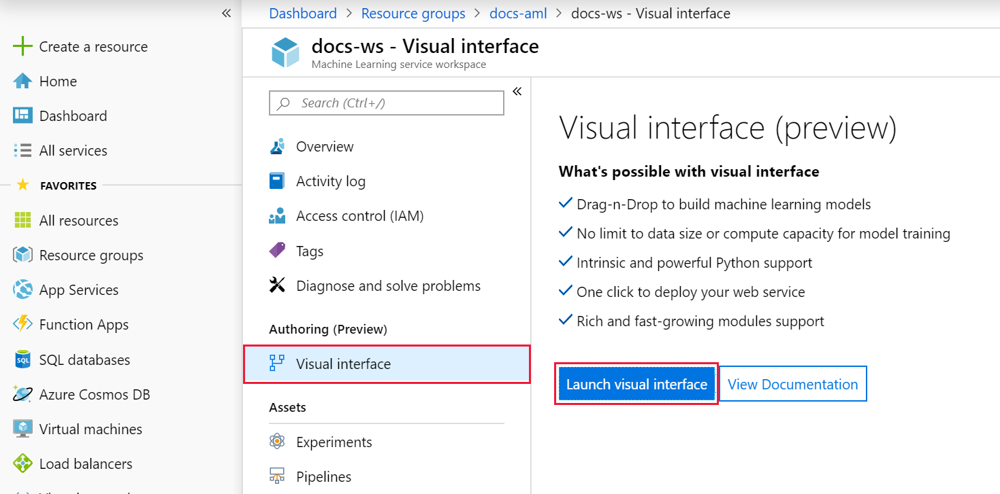

## Create your first experiment

The visual interface tool provides an interactive, visual place to build predictive analytic models. Drag-and-drop datasets and analysis modules onto an interactive canvas, and connect them together to create an *experiment*.

1. Create a new experiment by selecting **+New** at the bottom of the visual interface window.

    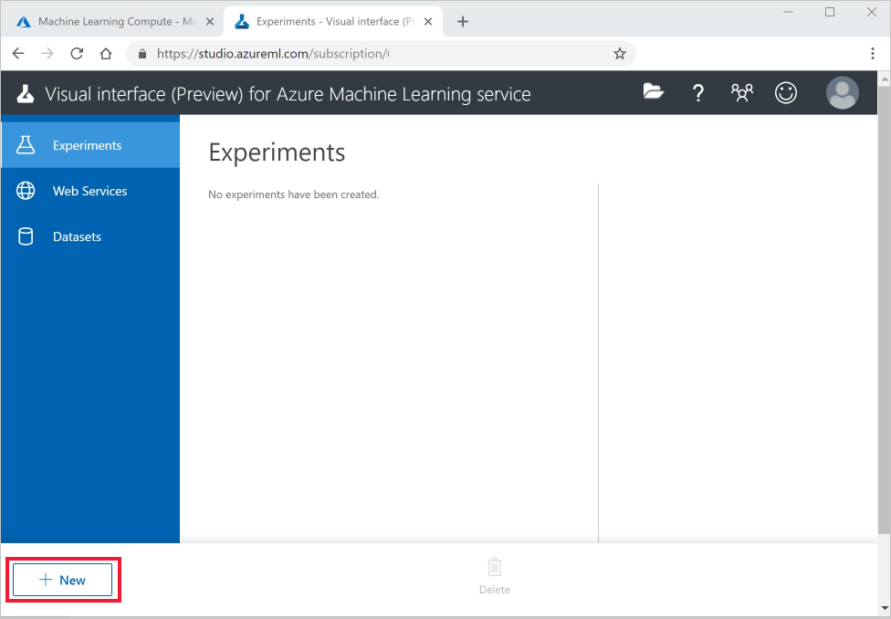

1. Select **Blank Experiment**.

1. Select the default experiment name **"Experiment created on ...**" at the top of the canvas and rename it to something meaningful. For example, **"Automobile price prediction"**. The name doesn't need to be unique.

## Add data

Machine learning depends on data. Luckily, there are several sample datasets included in this interface available for you to experiment with. For this tutorial, use the sample dataset **Automobile price data (Raw)**. 

1. To the left of the experiment canvas is a palette of datasets and modules. Select **Saved Datasets** then select **Samples** to view the available sample datasets.

1. Select the dataset, **Automobile price data (raw)**, and drag it onto the canvas.

   

## Select columns

Select which columns of data to work with. To start with, configure the module to show all available columns.

> [!TIP]
> Use the search bar at the top of the palette to find modules quickly. The rest of the tutorial will use this shortcut.

1. Type **Select** in the Search box to find the **Select Columns in Dataset** module.

1. Click and drag the **Select Columns in Dataset** onto the canvas. Drop the module below the dataset module.

1. Connect the dataset to the **Select Columns in Dataset**: click and drag from the output port of the dataset to the input port of **Select Columns in Dataset**.

    > [!TIP]
    > Datasets and modules have input and output ports represented by small circles - input ports at the top, output ports at the bottom. You create a flow of data through your experiment when you connect the output port of one module to an input port of another.
    >

    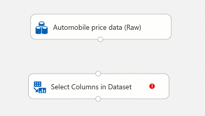

    The red exclamation mark indicates that you haven't set the properties for the module yet.

1. Select the **Select Columns in Dataset** module.

1. In the **Properties** pane to the right of the canvas, select **Edit columns**.

    In the **Select columns** dialog, select **ALL COLUMNS** and include **all features**. The dialog should look like this:

     

1. On the lower right, select **OK** to close the column selector.

## Run the experiment

At any time, click the output port of a dataset or module to see what the data looks like at that point in the data flow. If the **Visualize** option is disabled, you first need to run the experiment.

An experiment runs on a compute target, which is a compute resource that is attached to your workspace. Once you create a compute target, you can reuse it for future runs.

[!INCLUDE [aml-ui-create-training-compute](../../../includes/aml-ui-create-training-compute.md)]

After the compute target is available, the experiment runs. When the run is complete, a green check mark appears on each module.

## Preview the data

Now that you have run your initial experiment, you can visualize the data to understand more about the dataset you have to work with.

1. Select the output port at the bottom of the **Select Columns in Dataset** then select **Visualize**.

1. Click on different columns in the data window to view information about that column.

    In this dataset, each row represents an automobile, and the variables associated with each automobile appear as columns. There are 205 rows and 26 columns in this dataset.

     Each time you click a column of data, the **Statistics** information and **Visualization** image of that column appears on the left. For example, when you click on **num-of-doors** you see it has two unique values and two missing values. Scroll down to see the values: two and four doors.

     

1. Click on each column to understand more about your dataset, and think about whether these columns will be useful to predict the price of an automobile.

## Prepare data

A dataset usually requires some preprocessing before it can be analyzed. You might have noticed some missing values when visualizing the dataset. These missing values need to be cleaned so the model can analyze the data correctly. You'll remove any rows that have missing values. Also, the **normalized-losses** column has a large proportion of missing values, so you'll exclude that column from the model altogether.

> [!TIP]
> Cleaning the missing values from input data is a prerequisite for using most of the modules.

### Remove column

First, remove the **normalized-losses** column completely.

1. Select the **Select Columns in Dataset** module.

1. In the **Properties** pane to the right of the canvas, select **Edit columns**.

    * Leave **With rules** and **ALL COLUMNS** selected.

    * From the drop-downs, select **Exclude** and **column names**, and then click inside the text box. Type **normalized-losses**.

    * On the lower right, select **OK** to close the column selector.

    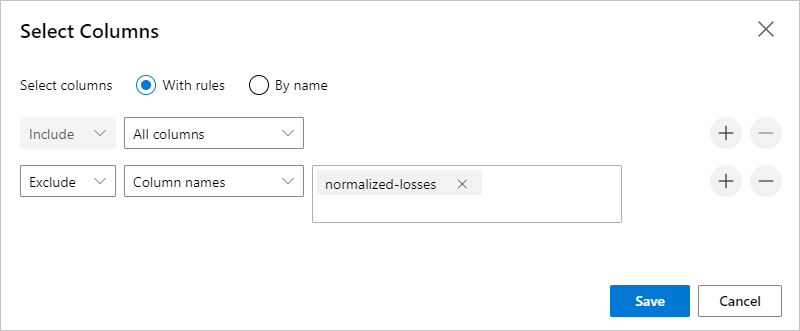
        
    Now the properties pane for Select Columns in Dataset indicates that it will pass through all columns from the dataset except **normalized-losses**.
        
    The properties pane shows that the **normalized-losses** column is excluded.
        
    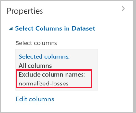
        
    You can add a comment to a module by double-clicking the module and entering text. This can help you see at a glance what the module is doing in your experiment. 

1. Double-click the **Select Columns in Dataset** module and type the comment "Exclude normalized losses." 
    
    After you type the comment, click outside the module. A down-arrow appears to show that the module contains a comment.

1. Click on the down-arrow to display the comment.

    The module now shows an up-arrow to hide the comment.
        
    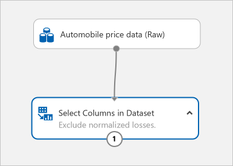

### Clean missing data

When you train a model, you have to do something about the data that is missing. In this case, you'll add a module to remove any remaining row that has missing data.

1. Type **Clean** in the Search box to find the **Clean Missing Data** module.

1. Drag the **Clean Missing Data** module to the experiment canvas and connect it to the **Select Columns in Dataset** module. 

1. In the Properties pane, select **Remove entire row** under **Cleaning mode**.

1. Double-click the module and type the comment "Remove missing value rows."
 
    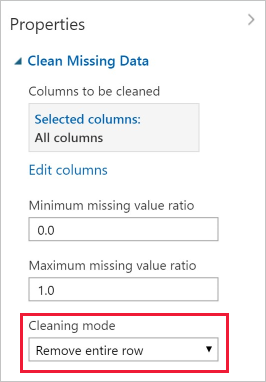

    Your experiment should now look something like this:
    
    

## Train the model

Now that the data is ready, you can construct a predictive model. You'll use your data to train the model. Then you'll test the model to see how closely it's able to predict prices.

**Classification** and **regression** are two types of supervised machine learning algorithms. **Classification** predicts an answer from a defined set of categories, such as a color (red, blue, or green). **Regression** is used to predict a number.

Because you want to predict price, which is a number, you can use a regression algorithm. For this example, you'll use a linear regression model.

Train the model by giving it a set of data that includes the price. The model scans the data and looks for correlations between a car's features and its price.

Use your data for both training the model and testing it by splitting the data into separate training and testing datasets.

1. Type **split data** in the search box to find the **Split Data** module and connect it to the left port of the **Clean Missing Data** module.

1. Select the **Split Data** module. In the Properties pane, set the Fraction of rows in the first output dataset to 0.7. This way, we'll use 70 percent of the data to train the model, and hold back 30 percent for testing.

    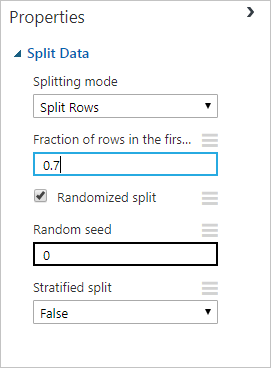

1. Double-click the **Split Data** and type the comment "Split the dataset into training set(0.7) and test set(0.3)"

1. To select the learning algorithm, clear your module palette search box.

1. Expand the **Machine Learning** then expand **Initialize Model**. This displays several categories of modules that can be used to initialize machine learning algorithms.

1. For this experiment, select **Regression** > **Linear Regression** and drag it to the experiment canvas.

    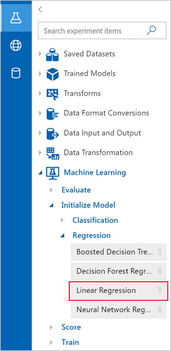

1. Find and drag the **Train Model** module to the experiment canvas. Connect the output of the Linear Regression module to the left input of the Train Model module, and connect the training data output (left port) of the **Split Data** module to the right input of the **Train Model** module.

    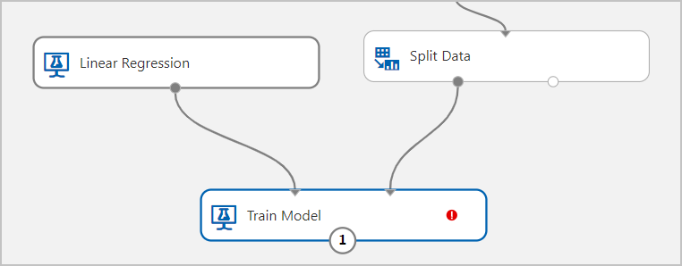

1. Select the **Train Model** module. In the Properties pane, Select Launch column selector and then type **price** next to **Include column names**. Price is the value that your model is going to predict

    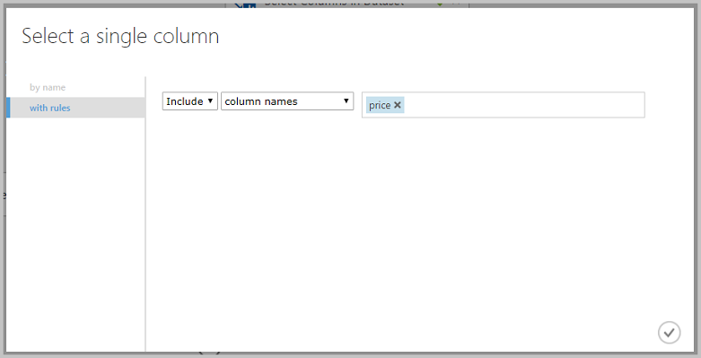

    Your experiment should look like this:

    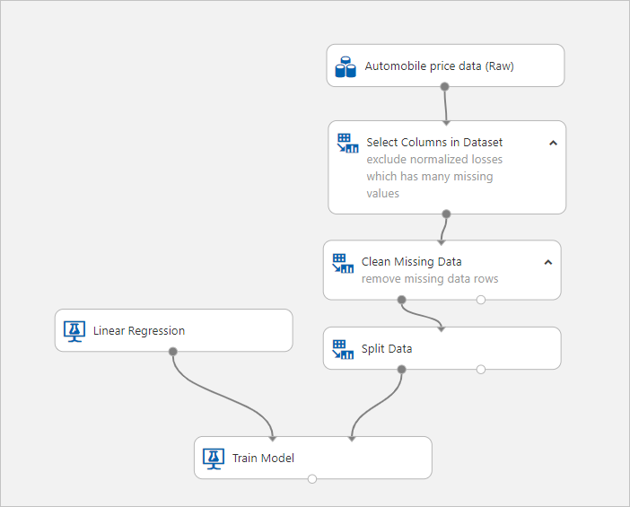

## Score and evaluate the model

Now that you've trained the model using 70 percent of your data, you can use it to score the other 30 percent of the data to see how well your model functions.

1. Type **score model** in the search box to find the **Score Model** module and drag the module to the experiment canvas. Connect the output of the **Train Model** module to the left input port of **Score Model**. Connect the test data output (right port) of the **Split Data** module to the right input port of **Score Model**.

1. Type **evaluate** in the search box to find the **Evaluate Model** and drag the module to the experiment canvas. Connect the output of the **Score Model** module to the left input of **Evaluate Model**. The final experiment should look something like this:

    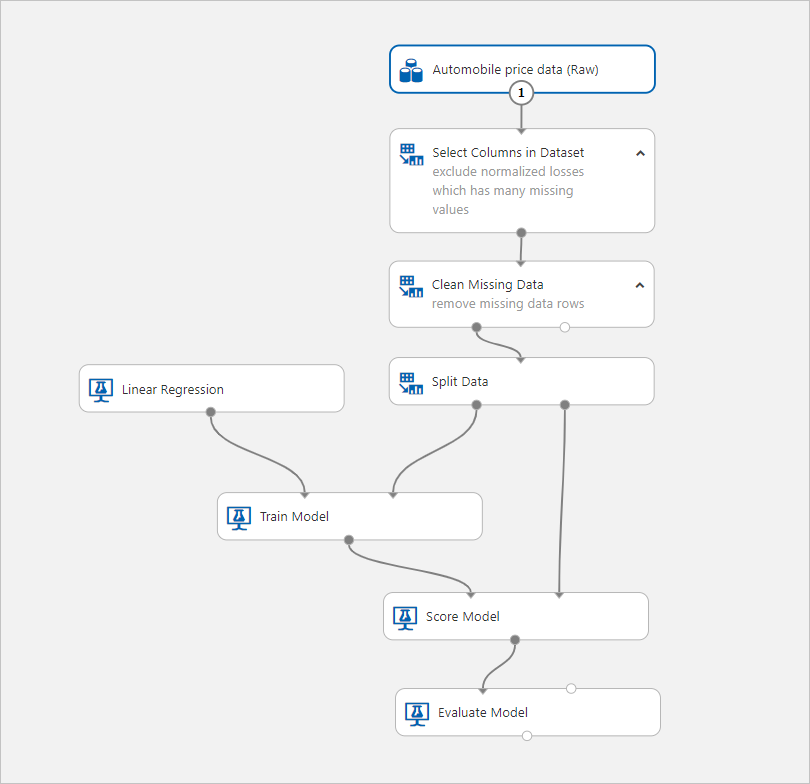

1. Run the experiment using the compute resource you created earlier.

1. View the output from the **Score Model** module by selecting the output port of **Score Model** and select **Visualize**. The output shows the predicted values for price and the known values from the test data.

    

1. To view the output from the **Evaluate Model** module, select the output port, and then select **Visualize**.

    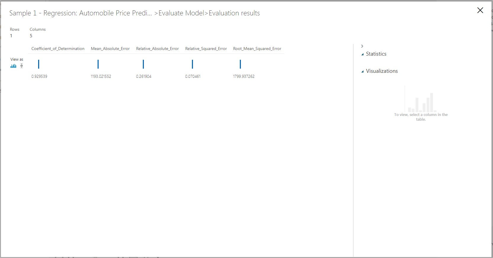

The following statistics are shown for your model:

* **Mean Absolute Error (MAE)**: The average of absolute errors (an error is the difference between the predicted value and the actual value).
* **Root Mean Squared Error (RMSE)**: The square root of the average of squared errors of predictions made on the test dataset.
* **Relative Absolute Error**: The average of absolute errors relative to the absolute difference between actual values and the average of all actual values.
* **Relative Squared Error**: The average of squared errors relative to the squared difference between the actual values and the average of all actual values.
* **Coefficient of Determination**: Also known as the R squared value, this is a statistical metric indicating how well a model fits the data.

For each of the error statistics, smaller is better. A smaller value indicates that the predictions more closely match the actual values. For Coefficient of Determination, the closer its value is to one (1.0), the better the predictions.

## Manage experiments in Azure Machine Learning service workspace

The experiments you create in the visual interface can be managed from the Azure Machine Learning service workspace. Use the workspace to see more detailed information such as individuals experiment runs, diagnostic logs, execution graphs, and more.

1. Open your workspace in the [Azure portal](https://portal.azure.com/).  

1. In your workspace, select **Experiments**. Then select the experiment you created.

    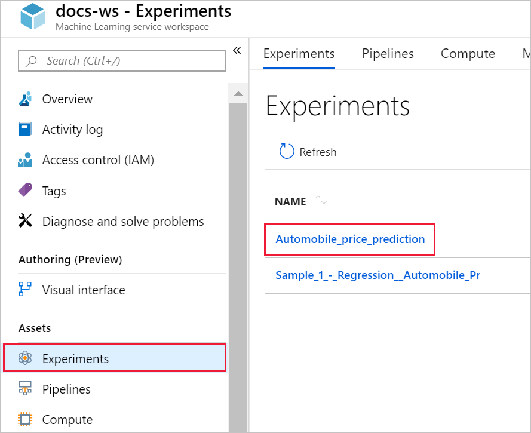

    On this page, you'll see an overview of the experiment and its latest runs.

    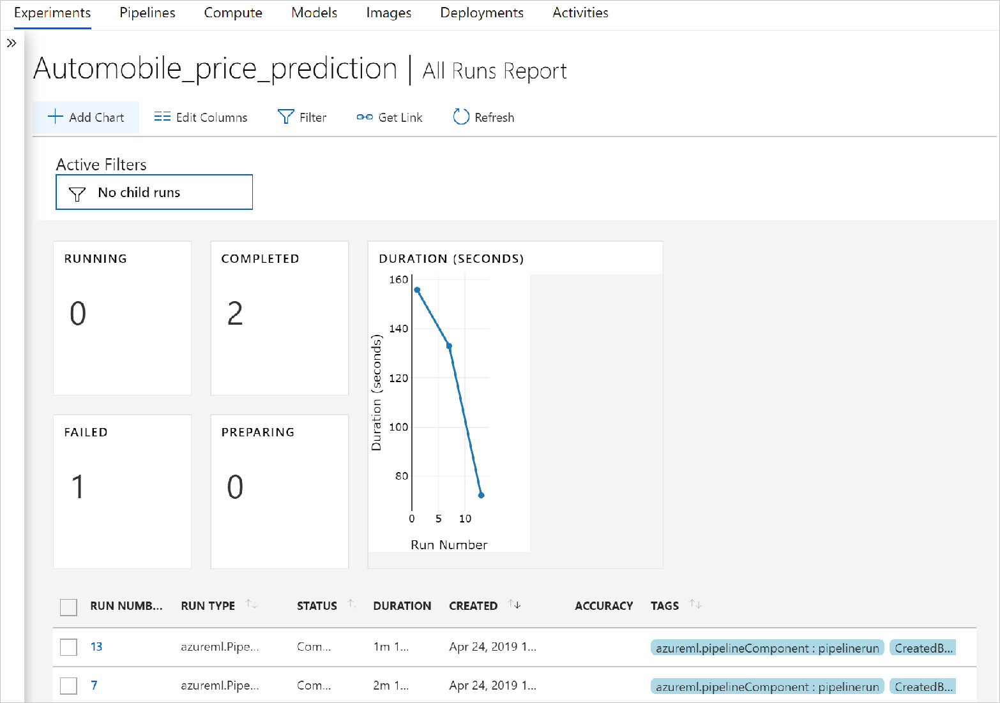

1. Select a run number to see more details about a specific execution.

    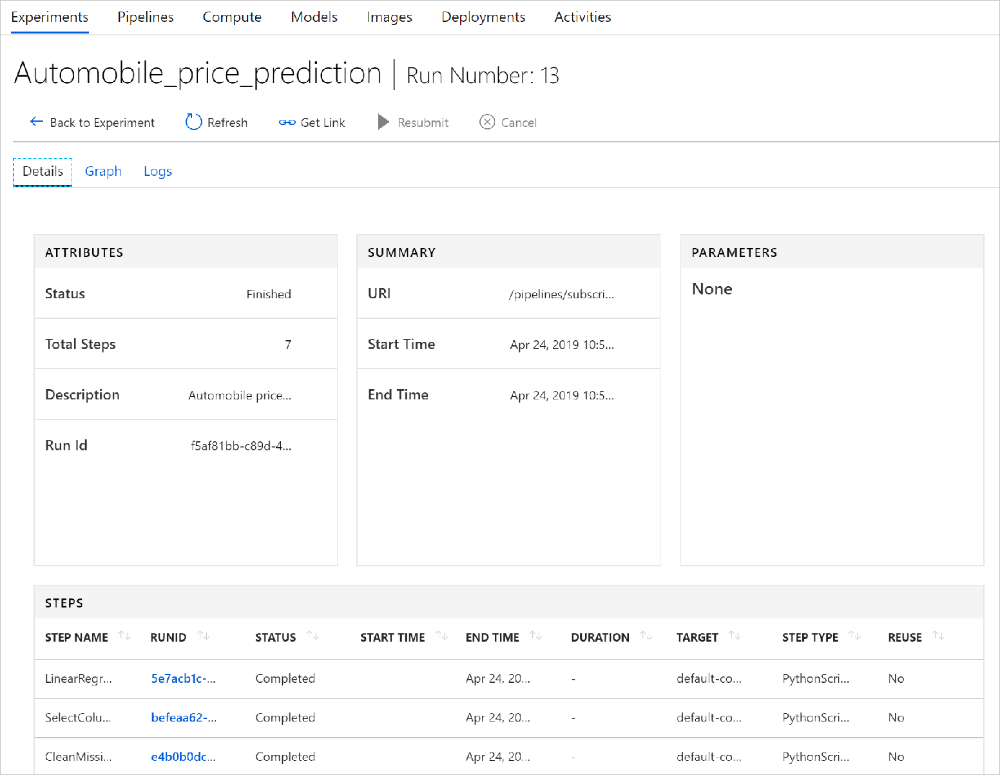

    The run report is updated in real time. If you used an **Execute Python Script** or **Execute R Script** module in your experiment, you can specify script logs to output in the **Logs** tab.

## Clean up resources

[!INCLUDE [aml-ui-cleanup](../../../includes/aml-ui-cleanup.md)]

## Next steps

In part one of this tutorial, you completed these steps:

* Created an experiment
* Prepare the data
* Train the model
* Score and evaluate the model

In part two, you'll learn how to deploy your model as an Azure web service.

> [!div class="nextstepaction"]
> [Continue to deploying models](ui-tutorial-automobile-price-deploy.md)
