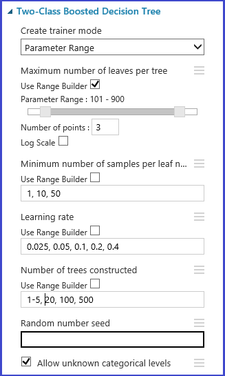
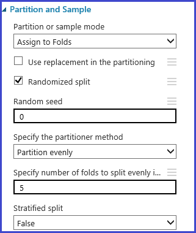
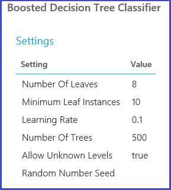

# Choose parameters to optimize your algorithms in Azure Machine Learning Studio

This topic describes how to choose the right hyperparameter set for an algorithm in Azure Machine Learning Studio. Most machine learning algorithms have parameters to set. When you train a model, you need to provide values for those parameters. The efficacy of the trained model depends on the model parameters that you choose. The process of finding the optimal set of parameters is known as *model selection*.

There are various ways to do model selection. In machine learning, cross-validation is one of the most widely used methods for model selection, and it is the default model selection mechanism in Azure Machine Learning Studio. Because Azure Machine Learning Studio supports both R and Python, you can always implement their own model selection mechanisms by using either R or Python.

There are four steps in the process of finding the best parameter set:

1. **Define the parameter space**: For the algorithm, first decide the exact parameter values you want to consider.
2. **Define the cross-validation settings**: Decide how to choose cross-validation folds for the dataset.
3. **Define the metric**: Decide what metric to use for determining the best set of parameters, such as accuracy, root mean squared error, precision, recall, or f-score.
4. **Train, evaluate, and compare**: For each unique combination of the parameter values, cross-validation is carried out by and based on the error metric you define. After evaluation and comparison, you can choose the best-performing model.

The following image illustrates shows how this can be achieved in Azure Machine Learning Studio.

## Define the parameter space
You can define the parameter set at the model initialization step. The parameter pane of all machine learning algorithms has two trainer modes: *Single Parameter* and *Parameter Range*. Choose Parameter Range mode. In Parameter Range mode, you can enter multiple values for each parameter. You can enter comma-separated values in the text box.

 Alternately, you can define the maximum and minimum points of the grid and the total number of points to be generated with **Use Range Builder**. By default, the parameter values are generated on a linear scale. But if **Log Scale** is checked, the values are generated in the log scale (that is, the ratio of the adjacent points is constant instead of their difference). For integer parameters, you can define a range by using a hyphen. For example, “1-10” means that all integers between 1 and 10 (both inclusive) form the parameter set. A mixed mode is also supported. For example, the parameter set “1-10, 20, 50” would include integers 1-10, 20, and 50.

## Define cross-validation folds
The [Partition and Sample][partition-and-sample] module can be used to randomly assign folds to the data. In the following sample configuration for the module, we define five folds and randomly assign a fold number to the sample instances.

## Define the metric
The [Tune Model Hyperparameters][tune-model-hyperparameters] module provides support for empirically choosing the best set of parameters for a given algorithm and dataset. In addition to other information regarding training the model, the **Properties** pane of this module includes the metric for determining the best parameter set. It has two different drop-down list boxes for classification and regression algorithms, respectively. If the algorithm under consideration is a classification algorithm, the regression metric is ignored and vice versa. In this specific example, the metric is **Accuracy**.   

## Train, evaluate, and compare
The same [Tune Model Hyperparameters][tune-model-hyperparameters] module trains all the models that correspond to the parameter set, evaluates various metrics, and then creates the best-trained model based on the metric you choose. This module has two mandatory inputs:

* The untrained learner
* The dataset

The module also has an optional dataset input. Connect the dataset with fold information to the mandatory dataset input. If the dataset is not assigned any fold information, then a 10-fold cross-validation is automatically executed by default. If the fold assignment is not done and a validation dataset is provided at the optional dataset port, then a train-test mode is chosen and the first dataset is used to train the model for each parameter combination.

The model is then evaluated on the validation dataset. The left output port of the module shows different metrics as functions of parameter values. The right output port gives the trained model that corresponds to the best-performing model according to the chosen metric (**Accuracy** in this case).  

You can see the exact parameters chosen by visualizing the right output port. This model can be used in scoring a test set or in an operationalized web service after saving as a trained model.

<!-- Module References -->
[partition-and-sample]: https://msdn.microsoft.com/library/azure/a8726e34-1b3e-4515-b59a-3e4a475654b8/
[tune-model-hyperparameters]: https://msdn.microsoft.com/library/azure/038d91b6-c2f2-42a1-9215-1f2c20ed1b40/
