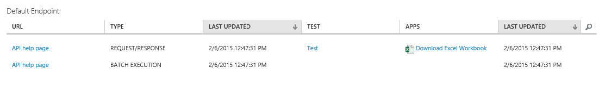
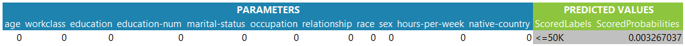

# Consuming an Azure Machine Learning Studio Web Service from Excel

 Azure Machine Learning Studio makes it easy to call web services directly from Excel without the need to write any code.

If you are using Excel 2013 (or later) or Excel Online, then we recommend that you use the Excel [Excel add-in](excel-add-in-for-web-services.md).

## Steps
Publish a web service. [Tutorial 3: Deploy credit risk model](tutorial-part3-credit-risk-deploy.md) explains how to do it. Currently the Excel workbook feature is only supported for Request/Response services that have a single output (that is, a single scoring label). 

Once you have a web service, click on the **WEB SERVICES** section on the left of the studio, and then select the web service to consume from Excel.

**Classic Web Service**

1. On the **DASHBOARD** tab for the web service is a row for the **REQUEST/RESPONSE** service. If this service had a single output, you should see the **Download Excel Workbook** link in that row.

    
2. Click on **Download Excel Workbook**.

**New Web Service**

1. In the Azure Machine Learning Web Service portal, select **Consume**.
2. On the Consume page, in the **Web service consumption options** section, click the Excel icon.

**Using the workbook**

1. Open the workbook.
2. A Security Warning appears; click on the **Enable Editing** button.

    
3. A Security Warning appears. Click on the **Enable Content** button to run macros on your spreadsheet.

    
4. Once macros are enabled, a table is generated. Columns in blue are required as input into the RRS web service, or **PARAMETERS**. Note the output of the RRS service, **PREDICTED VALUES** in green. When all columns for a given row are filled, the workbook automatically calls the scoring API, and displays the scored results.

    
5. To score more than one row, fill the second row with data and the predicted values are produced. You can even paste several rows at once.

You can use any of the Excel features (graphs, power map, conditional formatting, etc.) with the predicted values to help visualize the data.

## Sharing your workbook
For the macros to work, your API Key must be part of the spreadsheet. That means that you should share the workbook only with entities/individuals you trust.

## Automatic updates
An RRS call is made in these two situations:

1. The first time a row has content in all of its **PARAMETERS**
2. Any time any of the **PARAMETERS** changes in a row that had all of its **PARAMETERS** entered.