# Quickstart: Create your first data science experiment in Azure Machine Learning Studio

In this quickstart, you create a machine learning experiment in [Azure Machine Learning Studio](what-is-ml-studio.md) that predicts the price of a car based on different variables such as make and technical specifications.

If you're brand new to machine learning, the video series [Data Science for Beginners](data-science-for-beginners-the-5-questions-data-science-answers.md) is a great introduction to machine learning using everyday language and concepts.

This quickstart follows the default workflow for an experiment:

1. **Create a model**
    - [Get the data]
    - [Prepare the data]
    - [Define features]
1. **Train the model**
    - [Choose and apply an algorithm]
1. **Score and test the model**
    - [Predict new automobile prices]

[Get the data]: #get-the-data
[Prepare the data]: #prepare-the-data
[Define features]: #define-features
[Choose and apply an algorithm]: #choose-and-apply-an-algorithm
[Predict new automobile prices]: #predict-new-automobile-prices

If you don't have a Studio account, go to the [Studio homepage](https://studio.azureml.net) and select **Sign up here** to create a free account. The free workspace will have all the features you need for this quickstart.

## Get the data

The first thing you need in machine learning is data.
There are several sample datasets included with Studio that you can use, or you can import data from many sources. For this example, we'll use the sample dataset, **Automobile price data (Raw)**, that's included in your workspace.
This dataset includes entries for various individual automobiles, including information such as make, model, technical specifications, and price.

> [!TIP]
> You can find a working copy of the following experiment in the [Azure AI Gallery](https://gallery.azure.ai). Go to **[Your first data science experiment - Automobile price prediction](https://gallery.azure.ai/Experiment/Your-first-data-science-experiment-Automobile-price-prediction-1)** and click **Open in Studio** to download a copy of the experiment into your Machine Learning Studio workspace.

Here's how to get the dataset into your experiment.

1. Create a new experiment by clicking **+NEW** at the bottom of the Machine Learning Studio window. Select **EXPERIMENT** >  **Blank Experiment**.

1. The experiment is given a default name that you can see at the top of the canvas. Select this text and rename it to something meaningful, for example, **Automobile price prediction**. The name doesn't need to be unique.

    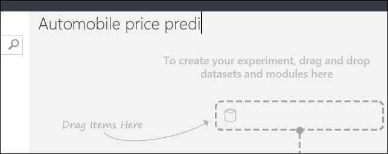

1. To the left of the experiment canvas is a palette of datasets and modules. Type **automobile** in the Search box at the top of this palette to find the dataset labeled **Automobile price data (Raw)**. Drag this dataset to the experiment canvas.

    

To see what this data looks like, click the output port at the bottom of the automobile dataset then select **Visualize**.

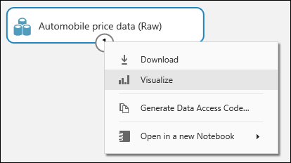

> [!TIP]
> Datasets and modules have input and output ports represented by small circles - input ports at the top, output ports at the bottom.
To create a flow of data through your experiment,
you'll connect an output port of one module to an input port of another.
At any time, you can click the output port of a dataset or module to see what the data looks like at that point in the data flow.

In this dataset, each row represents an automobile, and the variables associated with each automobile appear as columns. We'll predict the price in far-right column (column 26, titled "price") using the variables for a specific automobile.

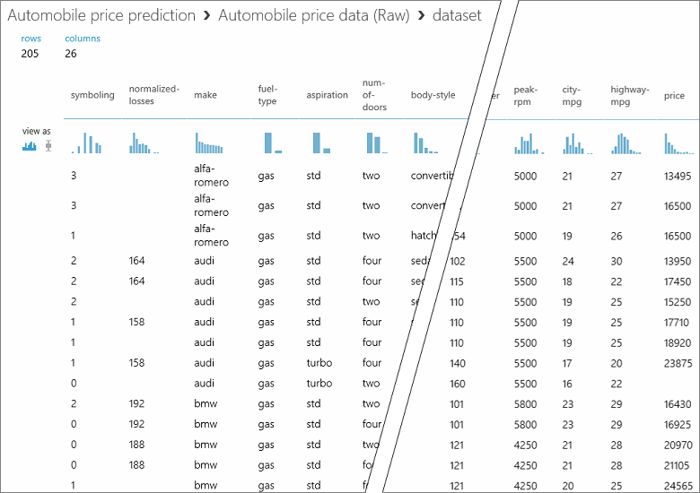

Close the visualization window by clicking the "**x**" in the upper-right corner.

## Prepare the data

A dataset usually requires some preprocessing before it can be analyzed. You might have noticed the missing values present in the columns of various rows. These missing values need to be cleaned so the model can analyze the data correctly. We'll remove any rows that have missing values. Also, the **normalized-losses** column has a large proportion of missing values, so we'll exclude that column from the model altogether.

> [!TIP]
> Cleaning the missing values from input data is a prerequisite for using most of the modules.

First, we add a module that removes the **normalized-losses** column completely. Then we add another module that removes any row that has missing data.

1. Type **select columns** in the search box at the top of the module palette to find the [Select Columns in Dataset][select-columns] module. Then drag it to the experiment canvas. This module allows us to select which columns of data we want to include or exclude in the model.

1. Connect the output port of the **Automobile price data (Raw)** dataset to the input port of the Select Columns in Dataset.

    

1. Click the [Select Columns in Dataset][select-columns] module and click **Launch column selector** in the **Properties** pane.

   - On the left, click **With rules**
   - Under **Begin With**, click **All columns**. These rules direct [Select Columns in Dataset][select-columns] to pass through all the columns (except those columns we're about to exclude).
   - From the drop-downs, select **Exclude** and **column names**, and then click inside the text box. A list of columns is displayed. Select **normalized-losses**, and it's added to the text box.
   - Click the check mark (OK) button to close the column selector (on the lower right).

     

     Now the properties pane for **Select Columns in Dataset** indicates that it will pass through all columns from the dataset except **normalized-losses**.

     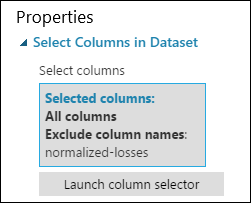

     > [!TIP] 
     > You can add a comment to a module by double-clicking the module and entering text. This can help you see at a glance what the module is doing in your experiment. In this case double-click the [Select Columns in Dataset][select-columns] module and type the comment "Exclude normalized losses."

     

1. Drag the [Clean Missing Data][clean-missing-data] module to the experiment canvas and connect it to the [Select Columns in Dataset][select-columns] module. In the **Properties** pane, select **Remove entire row** under **Cleaning mode**. These options direct [Clean Missing Data][clean-missing-data] to clean the data by removing rows that have any missing values. Double-click the module and type the comment "Remove missing value rows."

    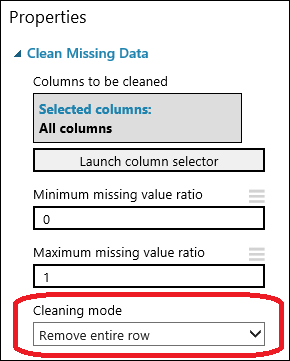

1. Run the experiment by clicking **RUN** at the bottom of the page.

    When the experiment has finished running, all the modules have a green check mark to indicate that they finished successfully. Notice also the **Finished running** status in the upper-right corner.

    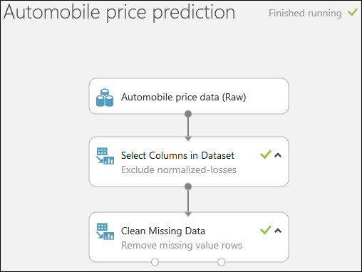

> [!TIP]
> Why did we run the experiment now? By running the experiment, the column definitions for our data pass from the dataset, through the [Select Columns in Dataset][select-columns] module, and through the [Clean Missing Data][clean-missing-data] module. This means that any modules we connect to [Clean Missing Data][clean-missing-data] will also have this same information.

Now we have clean data. If you want to view the cleaned dataset, click the left output port of the [Clean Missing Data][clean-missing-data] module and select **Visualize**. Notice that the **normalized-losses** column is no longer included, and there are no missing values.

Now that the data is clean, we're ready to specify what features we're going to use in the predictive model.

## Define features

In machine learning, *features* are individual measurable properties of something you’re interested in. In our dataset, each row represents one automobile, and each column is a feature of that automobile.

Finding a good set of features for creating a predictive model requires experimentation and knowledge about the problem you want to solve. Some features are better for predicting the target than others. Some features have a strong correlation with other features and can be removed. For example, city-mpg and highway-mpg are closely related so we can keep one and remove the other without significantly affecting the prediction.

Let's build a model that uses a subset of the features in our dataset. You can come back later and select different features, run the experiment again, and see if you get better results. But to start, let's try the following features:

    make, body-style, wheel-base, engine-size, horsepower, peak-rpm, highway-mpg, price

1. Drag another [Select Columns in Dataset][select-columns] module to the experiment canvas. Connect the left output port of the [Clean Missing Data][clean-missing-data] module to the input of the [Select Columns in Dataset][select-columns] module.

    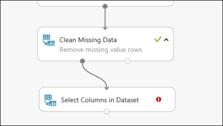

1. Double-click the module and type "Select features for prediction."

1. Click **Launch column selector** in the **Properties** pane.

1. Click **With rules**.

1. Under **Begin With**, click **No columns**. In the filter row, select **Include** and **column names** and select our list of column names in the text box. This filter directs the module to not pass through any columns (features) except the ones that we specify.

1. Click the check mark (OK) button.

    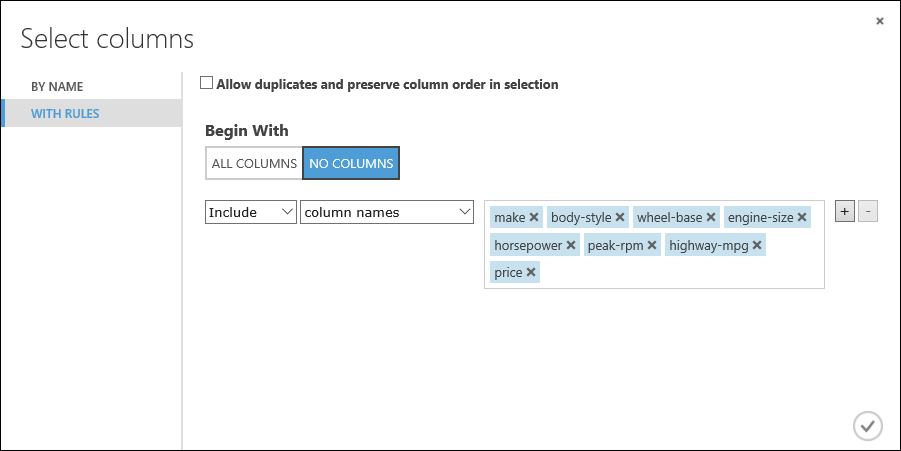

This module produces a filtered dataset containing only the features we want to pass to the learning algorithm we'll use in the next step. Later, you can return and try again with a different selection of features.

## Choose and apply an algorithm

Now that the data is ready, constructing a predictive model consists of training and testing. We'll use our data to train the model, and then we'll test the model to see how closely it's able to predict prices.
<!-- For now, don't worry about *why* we need to train and then test a model.-->

*Classification* and *regression* are two types of supervised machine learning algorithms. Classification predicts an answer from a defined set of categories, such as a color (red, blue, or green). Regression is used to predict a number.

Because we want to predict price, which is a number, we'll use a regression algorithm. For this example, we'll use a *linear regression* model.

We train the model by giving it a set of data that includes the price. The model scans the data and look for correlations between an automobile's features and its price. Then we'll test the model - we'll give it a set of features for automobiles we're familiar with and see how close the model comes to predicting the known price.

We'll use our data for both training the model and testing it by splitting the data into separate training and testing datasets.

1. Select and drag the [Split Data][split] module to the experiment canvas and connect it to the last [Select Columns in Dataset][select-columns] module.

1. Click the [Split Data][split] module to select it. Find the **Fraction of rows in the first output dataset** (in the **Properties** pane to the right of the canvas) and set it to 0.75. This way, we'll use 75 percent of the data to train the model, and hold back 25 percent for testing.

    

    > [!TIP]
    > By changing the **Random seed** parameter, you can produce different random samples for training and testing. This parameter controls the seeding of the pseudo-random number generator.

1. Run the experiment. When the experiment is run, the [Select Columns in Dataset][select-columns] and [Split Data][split] modules pass column definitions to the modules we'll be adding next.  

1. To select the learning algorithm, expand the **Machine Learning** category in the module palette to the left of the canvas, and then expand **Initialize Model**. This displays several categories of modules that can be used to initialize machine learning algorithms. For this experiment, select the [Linear Regression][linear-regression] module under the **Regression** category, and drag it to the experiment canvas. (You can also find the module by typing "linear regression" in the palette Search box.)

1. Find and drag the [Train Model][train-model] module to the experiment canvas. Connect the output of the [Linear Regression][linear-regression] module to the left input of the [Train Model][train-model] module, and connect the training data output (left port) of the [Split Data][split] module to the right input of the [Train Model][train-model] module.

    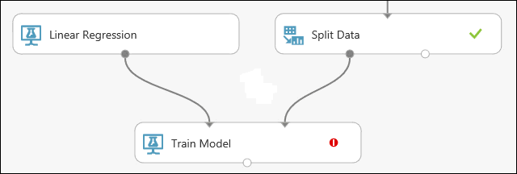

1. Click the [Train Model][train-model] module, click **Launch column selector** in the **Properties** pane, and then select the **price** column. **Price** is the value that our model is going to predict.

    You select the **price** column in the column selector by moving it from the **Available columns** list to the **Selected columns** list.

    

1. Run the experiment.

We now have a trained regression model that can be used to score new automobile data to make price predictions.

## Predict new automobile prices

Now that we've trained the model using 75 percent of our data, we can use it to score the other 25 percent of the data to see how well our model functions.

1. Find and drag the [Score Model][score-model] module to the experiment canvas. Connect the output of the [Train Model][train-model] module to the left input port of [Score Model][score-model]. Connect the test data output (right port) of the [Split Data][split] module to the right input port of [Score Model][score-model].

    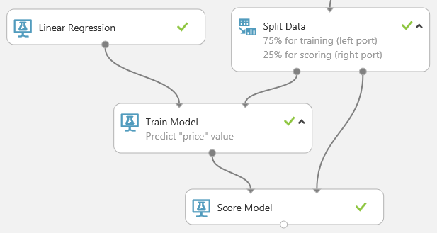

1. Run the experiment and view the output from the [Score Model][score-model] module by clicking the output port of [Score Model][score-model] and select **Visualize**. The output shows the predicted values for price and the known values from the test data.  

    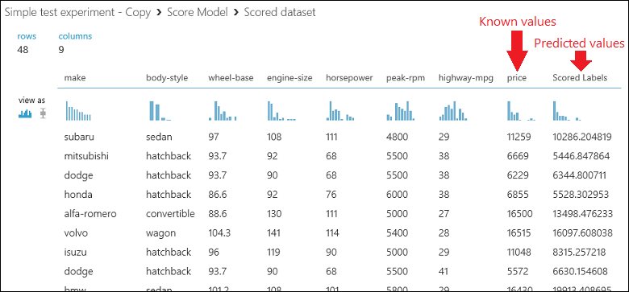

1. Finally, we test the quality of the results. Select and drag the [Evaluate Model][evaluate-model] module to the experiment canvas, and connect the output of the [Score Model][score-model] module to the left input of [Evaluate Model][evaluate-model]. The final experiment should look something like this:

    

1. Run the experiment.

To view the output from the [Evaluate Model][evaluate-model] module, click the output port, and then select **Visualize**.

The following statistics are shown for our model:

- **Mean Absolute Error** (MAE): The average of absolute errors (an *error* is the difference between the predicted value and the actual value).
- **Root Mean Squared Error** (RMSE): The square root of the average of squared errors of predictions made on the test dataset.
- **Relative Absolute Error**: The average of absolute errors relative to the absolute difference between actual values and the average of all actual values.
- **Relative Squared Error**: The average of squared errors relative to the squared difference between the actual values and the average of all actual values.
- **Coefficient of Determination**: Also known as the **R squared value**, this is a statistical metric indicating how well a model fits the data.

For each of the error statistics, smaller is better. A smaller value indicates that the predictions more closely match the actual values. For **Coefficient of Determination**, the closer its value is to one (1.0), the better the predictions.

## Clean up resources

[!INCLUDE [machine-learning-studio-clean-up](../../../includes/machine-learning-studio-clean-up.md)]

## Next steps

In this quickstart, you created a simple experiment using a sample dataset. To explore the process of creating and deploying a model in more depth, continue to the predictive solution tutorial.

> [!div class="nextstepaction"]
> [Tutorial: Develop a predictive solution in Studio](tutorial-part1-credit-risk.md)

<!-- Module References -->
[evaluate-model]: https://msdn.microsoft.com/library/azure/927d65ac-3b50-4694-9903-20f6c1672089/
[linear-regression]: https://msdn.microsoft.com/library/azure/31960a6f-789b-4cf7-88d6-2e1152c0bd1a/
[clean-missing-data]: https://msdn.microsoft.com/library/azure/d2c5ca2f-7323-41a3-9b7e-da917c99f0c4/
[select-columns]: https://msdn.microsoft.com/library/azure/1ec722fa-b623-4e26-a44e-a50c6d726223/
[score-model]: https://msdn.microsoft.com/library/azure/401b4f92-e724-4d5a-be81-d5b0ff9bdb33/
[split]: https://msdn.microsoft.com/library/azure/70530644-c97a-4ab6-85f7-88bf30a8be5f/
[train-model]: https://msdn.microsoft.com/library/azure/5cc7053e-aa30-450d-96c0-dae4be720977/
