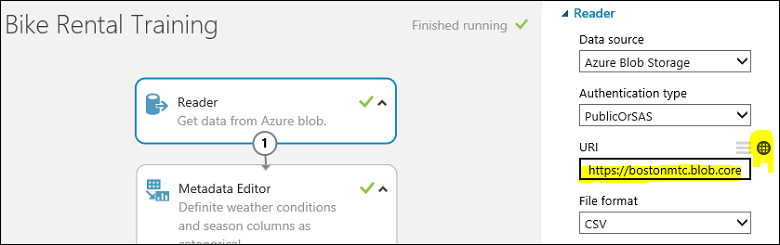
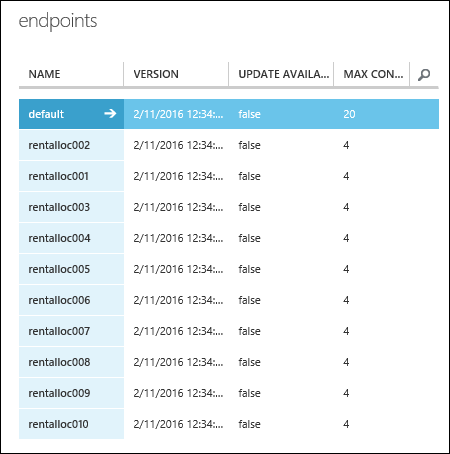

# Create multiple web service endpoints from one experiment with ML Studio (classic) and PowerShell

Here's a common machine learning problem: You want to create many models that have the same training workflow and use the same algorithm. But you want them to have different training datasets as input. This article shows you how to do this at scale in Azure Machine Learning Studio (classic) using just a single experiment.

For example, let's say you own a global bike rental franchise business. You want to build a regression model to predict the rental demand based on historic data. You have 1,000 rental locations across the world and you've collected a dataset for each location. They include important features such as date, time, weather, and traffic that are specific to each location.

You could train your model once using a merged version of all the datasets across all locations. But, each of your locations has a unique environment. So a better approach would be to train your regression model separately using the dataset for each location. That way, each trained model could take into account the different store sizes, volume, geography, population, bike-friendly traffic environment, and more.

That may be the best approach, but you don't want to create 1,000 training experiments in Azure Machine Learning Studio (classic) with each one representing a unique location. Besides being an overwhelming task, it also seems inefficient since each experiment would have all the same components except for the training dataset.

Fortunately, you can accomplish this by using the [Azure Machine Learning Studio (classic) retraining API](/azure/machine-learning/studio/retrain-machine-learning-model) and automating the task with [Azure Machine Learning Studio (classic) PowerShell](powershell-module.md).

> [!NOTE]
> To make your sample run faster, reduce the number of locations from 1,000 to 10. But the same principles and procedures apply to 1,000 locations. However, if you do want to train from 1,000 datasets you might want to run the following PowerShell scripts in parallel. How to do that is beyond the scope of this article, but you can find examples of PowerShell multi-threading on the Internet.  
> 
> 

## Set up the training experiment
Use the example [training experiment](https://gallery.azure.ai/Experiment/Bike-Rental-Training-Experiment-1) that's in the [Cortana Intelligence Gallery](https://gallery.azure.ai). Open this experiment in your [Azure Machine Learning Studio (classic)](https://studio.azureml.net) workspace.

> [!NOTE]
> In order to follow along with this example, you may want to use a standard workspace rather than a free workspace. You create one endpoint for each customer - for a total of 10 endpoints - and that requires a standard workspace since a free workspace is limited to 3 endpoints.
> 
> 

The experiment uses an **Import Data** module to import the training dataset *customer001.csv* from an Azure storage account. Let's assume you have collected training datasets from all bike rental locations and stored them in the same blob storage location with file names ranging from *rentalloc001.csv* to *rentalloc10.csv*.

Note that a **Web Service Output** module has been added to the **Train Model** module.
When this experiment is deployed as a web service, the endpoint associated with that output returns the trained model in the format of an .ilearner file.

Also note that you set up a web service parameter that defines the URL that the **Import Data** module uses. This allows you to use the parameter to specify individual training datasets to train the model for each location.
There are other ways you could have done this. You can use a SQL query with a web service parameter to get data from a database in Azure SQL Database. Or you can use a  **Web Service Input** module to pass in a dataset to the web service.

Now, let's run this training experiment using the default value *rental001.csv* as the training dataset. If you view the output of the **Evaluate** module (click the output and select **Visualize**), you can see you get a decent performance of *AUC* = 0.91. At this point, you're ready to deploy a web service out of this training experiment.

## Deploy the training and scoring web services
To deploy the training web service, click the **Set Up Web Service** button below the experiment canvas and select **Deploy Web Service**. Call this web service "Bike Rental Training".

Now you need to deploy the scoring web service.
To do this, click **Set Up Web Service** below the canvas and select **Predictive Web Service**. This creates a scoring experiment.
You need to make a few minor adjustments to make it work as a web service. Remove the label column "cnt" from the input data and limit the output to only the instance id and the corresponding predicted value.

To save yourself that work, you can open the [predictive experiment](https://gallery.azure.ai/Experiment/Bike-Rental-Predicative-Experiment-1) in the Gallery that has already been prepared.

To deploy the web service, run the predictive experiment, then click the **Deploy Web Service** button below the canvas. Name the scoring web service "Bike Rental Scoring".

## Create 10 identical web service endpoints with PowerShell
This web service comes with a default endpoint. But you're not as interested in the default endpoint since it can't be updated. What you need to do is to create 10 additional endpoints, one for each location. You can do this with PowerShell.

First, you set up the PowerShell environment:

    Import-Module .\AzureMLPS.dll
    # Assume the default configuration file exists and is properly set to point to the valid Workspace.
    $scoringSvc = Get-AmlWebService | where Name -eq 'Bike Rental Scoring'
    $trainingSvc = Get-AmlWebService | where Name -eq 'Bike Rental Training'

Then, run the following PowerShell command:

    # Create 10 endpoints on the scoring web service.
    For ($i = 1; $i -le 10; $i++){
        $seq = $i.ToString().PadLeft(3, '0');
        $endpointName = 'rentalloc' + $seq;
        Write-Host ('adding endpoint ' + $endpointName + '...')
        Add-AmlWebServiceEndpoint -WebServiceId $scoringSvc.Id -EndpointName $endpointName -Description $endpointName     
    }

Now you created 10 endpoints and they all contain the same trained model trained on *customer001.csv*. You can view them in the Azure portal.

## Update the endpoints to use separate training datasets using PowerShell
The next step is to update the endpoints with models uniquely trained on each customer's individual data. But first you need to produce these models from the **Bike Rental Training** web service. Let's go back to the **Bike Rental Training** web service. You need to call its BES endpoint 10 times with 10 different training datasets in order to produce 10 different models. Use the **InovkeAmlWebServiceBESEndpoint** PowerShell cmdlet to do this.

You will also need to provide credentials for your blob storage account into `$configContent`. Namely, at the fields `AccountName`, `AccountKey`, and `RelativeLocation`. The `AccountName` can be one of your account names, as seen in the **Azure portal** (*Storage* tab). Once you click on a storage account, its `AccountKey` can be found by pressing the **Manage Access Keys** button at the bottom and copying the *Primary Access Key*. The `RelativeLocation` is the path relative to your storage where a new model will be stored. For instance, the path `hai/retrain/bike_rental/` in the following script points to a container named `hai`, and `/retrain/bike_rental/` are subfolders. Currently, you cannot create subfolders through the portal UI, but there are [several Azure Storage Explorers](../../storage/common/storage-explorers.md) that allow you to do so. It is recommended that you create a new container in your storage to store the new trained models (.iLearner files) as follows: from your storage page, click the **Add** button at the bottom and name it `retrain`. In summary, the necessary changes to the following script pertain to `AccountName`, `AccountKey`, and `RelativeLocation` (:`"retrain/model' + $seq + '.ilearner"`).

    # Invoke the retraining API 10 times
    # This is the default (and the only) endpoint on the training web service
    $trainingSvcEp = (Get-AmlWebServiceEndpoint -WebServiceId $trainingSvc.Id)[0];
    $submitJobRequestUrl = $trainingSvcEp.ApiLocation + '/jobs?api-version=2.0';
    $apiKey = $trainingSvcEp.PrimaryKey;
    For ($i = 1; $i -le 10; $i++){
        $seq = $i.ToString().PadLeft(3, '0');
        $inputFileName = 'https://bostonmtc.blob.core.windows.net/hai/retrain/bike_rental/BikeRental' + $seq + '.csv';
        $configContent = '{ "GlobalParameters": { "URI": "' + $inputFileName + '" }, "Outputs": { "output1": { "ConnectionString": "DefaultEndpointsProtocol=https;AccountName=<myaccount>;AccountKey=<mykey>", "RelativeLocation": "hai/retrain/bike_rental/model' + $seq + '.ilearner" } } }';
        Write-Host ('training regression model on ' + $inputFileName + ' for rental location ' + $seq + '...');
        Invoke-AmlWebServiceBESEndpoint -JobConfigString $configContent -SubmitJobRequestUrl $submitJobRequestUrl -ApiKey $apiKey
    }

> [!NOTE]
> The BES endpoint is the only supported mode for this operation. RRS cannot be used for producing trained models.
> 
> 

As you can see above, instead of constructing 10 different BES job configuration json files, you dynamically create the config string instead. Then feed it to the *jobConfigString* parameter of the **InvokeAmlWebServceBESEndpoint** cmdlet. There's really no need to keep a copy on disk.

If everything goes well, after a while you should see 10 .iLearner files, from *model001.ilearner* to *model010.ilearner*, in your Azure storage account. Now you're ready to update the 10 scoring web service endpoints with these models using the **Patch-AmlWebServiceEndpoint** PowerShell cmdlet. Remember again that you can only patch the non-default endpoints you programmatically created earlier.

    # Patch the 10 endpoints with respective .ilearner models
    $baseLoc = 'http://bostonmtc.blob.core.windows.net/'
    $sasToken = '<my_blob_sas_token>'
    For ($i = 1; $i -le 10; $i++){
        $seq = $i.ToString().PadLeft(3, '0');
        $endpointName = 'rentalloc' + $seq;
        $relativeLoc = 'hai/retrain/bike_rental/model' + $seq + '.ilearner';
        Write-Host ('Patching endpoint ' + $endpointName + '...');
        Patch-AmlWebServiceEndpoint -WebServiceId $scoringSvc.Id -EndpointName $endpointName -ResourceName 'Bike Rental [trained model]' -BaseLocation $baseLoc -RelativeLocation $relativeLoc -SasBlobToken $sasToken
    }

This should run fairly quickly. When the execution finishes, you'll have successfully created 10 predictive web service endpoints. Each one will contain a trained model uniquely trained on the dataset specific to a rental location, all from a single training experiment. To verify this, you can try calling these endpoints using the **InvokeAmlWebServiceRRSEndpoint** cmdlet, providing them with the same input data. You should expect to see different prediction results since the models are trained with different training sets.

## Full PowerShell script
Here's the listing of the full source code:

    Import-Module .\AzureMLPS.dll
    # Assume the default configuration file exists and properly set to point to the valid workspace.
    $scoringSvc = Get-AmlWebService | where Name -eq 'Bike Rental Scoring'
    $trainingSvc = Get-AmlWebService | where Name -eq 'Bike Rental Training'

    # Create 10 endpoints on the scoring web service
    For ($i = 1; $i -le 10; $i++){
        $seq = $i.ToString().PadLeft(3, '0');
        $endpointName = 'rentalloc' + $seq;
        Write-Host ('adding endpoint ' + $endpontName + '...')
        Add-AmlWebServiceEndpoint -WebServiceId $scoringSvc.Id -EndpointName $endpointName -Description $endpointName     
    }

    # Invoke the retraining API 10 times to produce 10 regression models in .ilearner format
    $trainingSvcEp = (Get-AmlWebServiceEndpoint -WebServiceId $trainingSvc.Id)[0];
    $submitJobRequestUrl = $trainingSvcEp.ApiLocation + '/jobs?api-version=2.0';
    $apiKey = $trainingSvcEp.PrimaryKey;
    For ($i = 1; $i -le 10; $i++){
        $seq = $i.ToString().PadLeft(3, '0');
        $inputFileName = 'https://bostonmtc.blob.core.windows.net/hai/retrain/bike_rental/BikeRental' + $seq + '.csv';
        $configContent = '{ "GlobalParameters": { "URI": "' + $inputFileName + '" }, "Outputs": { "output1": { "ConnectionString": "DefaultEndpointsProtocol=https;AccountName=<myaccount>;AccountKey=<mykey>", "RelativeLocation": "hai/retrain/bike_rental/model' + $seq + '.ilearner" } } }';
        Write-Host ('training regression model on ' + $inputFileName + ' for rental location ' + $seq + '...');
        Invoke-AmlWebServiceBESEndpoint -JobConfigString $configContent -SubmitJobRequestUrl $submitJobRequestUrl -ApiKey $apiKey
    }

    # Patch the 10 endpoints with respective .ilearner models
    $baseLoc = 'http://bostonmtc.blob.core.windows.net/'
    $sasToken = '?test'
    For ($i = 1; $i -le 10; $i++){
        $seq = $i.ToString().PadLeft(3, '0');
        $endpointName = 'rentalloc' + $seq;
        $relativeLoc = 'hai/retrain/bike_rental/model' + $seq + '.ilearner';
        Write-Host ('Patching endpoint ' + $endpointName + '...');
        Patch-AmlWebServiceEndpoint -WebServiceId $scoringSvc.Id -EndpointName $endpointName -ResourceName 'Bike Rental [trained model]' -BaseLocation $baseLoc -RelativeLocation $relativeLoc -SasBlobToken $sasToken
    }
