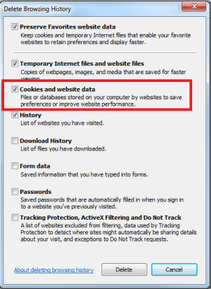

# Create and share an Azure Machine Learning Studio (classic) workspace

To use Azure Machine Learning Studio (classic), you need to have a Machine Learning Studio (classic) workspace. This workspace contains the tools you need to create, manage, and publish experiments.

## Create a Studio (classic) workspace

To open a workspace in Machine Learning Studio (classic), you must be signed in to the Microsoft Account you used to create the workspace, or you need to receive an invitation from the owner to join the workspace. From the Azure portal you can manage the workspace, which includes the ability to configure access.

1. Sign in to the [Azure portal](https://portal.azure.com/)

    > [!NOTE]
    > To sign in and create a Studio (classic) workspace, you need to be an Azure subscription administrator. 
    >
    > 

2. Click **+New**

3. In the search box, type **Machine Learning Studio (classic) Workspace** and select the matching item. Then, select click **Create** at the bottom of the page.

4. Enter your workspace information:

   - The *workspace name* may be up to 260 characters, not ending in a space. The name can't include these characters: `< > * % & : \ ? + /`
   - The *web service plan* you choose (or create), along with the associated *pricing tier* you select, is used if you deploy web services from this workspace.

     

5. Click **Create**.

   Machine Learning is currently available in a limited number of regions. If your subscription does not include one of these regions, you may see the error message, "You have no subscriptions in the allowed regions."  To request that a region be added to your subscription, create a new Microsoft support request from the Azure portal, choose **Billing** as the problem type, and follow the prompts to submit your request.

> [!NOTE]
> Machine Learning Studio (classic) relies on an Azure storage account that you provide to save intermediary data when it executes the workflow. After the workspace is created, if the storage account is deleted, or if the access keys are changed, the workspace will stop functioning and all experiments in that workspace will fail.
If you accidentally delete the storage account, recreate the storage account with the same name in the same region as the deleted storage account and resync the access key. If you changed storage account access keys, resync the access keys in the workspace by using the Azure portal.

Once the workspace is deployed, you can open it in Machine Learning Studio (classic).

1. Browse to Machine Learning Studio (classic) at [https://studio.azureml.net/](https://studio.azureml.net/).

2. Select your workspace in the upper-right-hand corner.

    

3. Click **my experiments**.

    

For information about managing your Studio (classic) workspace, see [Manage an Azure Machine Learning Studio (classic) workspace](manage-workspace.md).
If you encounter a problem creating your workspace, see [Troubleshooting guide: Create and connect to a Machine Learning Studio (classic) workspace](troubleshooting-creating-ml-workspace.md).

## Share an Azure Machine Learning Studio (classic) workspace
Once a Machine Learning Studio (classic) workspace is created, you can invite users to your workspace to share access to your workspace and all its experiments, datasets, notebooks, etc. You can add users in one of two roles:

* **User** - A workspace user can create, open, modify, and delete experiments, datasets, etc. in the workspace.
* **Owner** - An owner can invite and remove users in the workspace, in addition to what a user can do.

> [!NOTE]
> The administrator account that creates the workspace is automatically added to the workspace as workspace Owner. However, other administrators or users in that subscription are not automatically granted access to the workspace - you need to invite them explicitly.
> 
> 

### To share a Studio (classic) workspace

1. Sign in to Machine Learning Studio (classic) at [https://studio.azureml.net/Home](https://studio.azureml.net/Home)

2. In the left panel, click **SETTINGS**

3. Click the **USERS** tab

4. Click **INVITE MORE USERS** at the bottom of the page

    

5. Enter one or more email addresses. The users need a valid Microsoft account or an organizational account (from Azure Active Directory).

6. Select whether you want to add the users as Owner or User.

7. Click the **OK** checkmark button.

Each user you add will receive an email with instructions on how to sign in to the shared workspace.

> [!NOTE]
> For users to be able to deploy or manage web services in this workspace, they must be a contributor or administrator in the Azure subscription. 

## Troubleshoot storage accounts

The Machine Learning service needs a storage account to store data. You can use an existing storage account, or you can create a new storage account when you create the new Machine Learning Studio (classic) workspace (if you have quota to create a new storage account).

After the new Machine Learning Studio (classic) workspace is created, you can sign in to Machine Learning Studio (classic) by using the Microsoft account you used to create the workspace. If you encounter the error message, "Workspace Not Found" (similar to the following screenshot), please use the following steps to delete your browser cookies.

**To delete browser cookies**

1. If you use Internet Explorer, click the **Tools** button in the upper-right corner and select **Internet options**.  

   

2. Under the **General** tab, click **Delete…**

   

3. In the **Delete Browsing History** dialog box, make sure **Cookies and website data** is selected, and click **Delete**.

   

After the cookies are deleted, restart the browser and then go to the [Microsoft Azure Machine Learning Studio (classic)](https://studio.azureml.net) page. When you are prompted for a user name and password, enter the same Microsoft account you used to create the workspace.

## Next steps

For more information on managing a workspace, see [Manage an Azure Machine Learning Studio (classic) workspace](manage-workspace.md).
