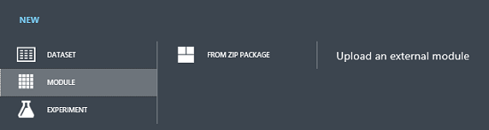

# Define custom R modules for Azure Machine Learning Studio (classic)

This topic describes how to author and deploy a custom R Studio (classic). It explains what custom R modules are and what files are used to define them. It illustrates how to construct the files that define a module and how to register the module for deployment in a Machine Learning workspace. The elements and attributes used in the definition of the custom module are then described in more detail. How to use auxiliary functionality and files and multiple outputs is also discussed. 

A **custom module** is a user-defined module that can be uploaded to your workspace and executed as part of Azure Machine Learning Studio (classic) experiment. A **custom R module** is a custom module that executes a user-defined R function. **R** is a programming language for statistical computing and graphics that is widely used by statisticians and data scientists for implementing algorithms. Currently, R is the only language supported in custom modules, but support for additional languages is scheduled for future releases.

Custom modules have **first-class status** in Azure Machine Learning Studio (classic) in the sense that they can be used just like any other module. They can be executed with other modules, included in published experiments or in visualizations. You have control over the algorithm implemented by the module, the input and output ports to be used, the modeling parameters, and other various runtime behaviors. An experiment that contains custom modules can also be published into the Azure AI Gallery for easy sharing.

## Files in a custom R module
A custom R module is defined by a .zip file that contains, at a minimum, two files:

* A **source file** that implements the R function exposed by the module
* An **XML definition file** that describes the custom module interface

Additional auxiliary files can also be included in the .zip file that provides functionality that can be accessed from the custom module. This option is discussed in the **Arguments** part of the reference section **Elements in the XML definition file** following the quickstart example.

## Quickstart example: define, package, and register a custom R module
This example illustrates how to construct the files required by a custom R module, package them into a zip file, and then register the module in your Machine Learning workspace. The example zip package and sample files can be downloaded from [Download CustomAddRows.zip file](https://go.microsoft.com/fwlink/?LinkID=524916&clcid=0x409).

## The source file
Consider the example of a **Custom Add Rows** module that modifies the standard implementation of the **Add Rows** module used to concatenate rows (observations) from two datasets (data frames). The standard **Add Rows** module appends the rows of the second input dataset to the end of the first input dataset using the `rbind` algorithm. The customized `CustomAddRows` function similarly accepts two datasets, but also accepts a Boolean swap parameter as an additional input. If the swap parameter is set to **FALSE**, it returns the same data set as the standard implementation. But if the swap parameter is **TRUE**, the function appends rows of first input dataset to the end of the second dataset instead. The CustomAddRows.R file that contains the implementation of the R `CustomAddRows` function exposed by the **Custom Add Rows** module has the following R code.

    CustomAddRows <- function(dataset1, dataset2, swap=FALSE) 
    {
        if (swap)
        {
            return (rbind(dataset2, dataset1));
        }
        else
        {
            return (rbind(dataset1, dataset2));
        } 
    } 

### The XML definition file
To expose this `CustomAddRows` function as the Azure Machine Learning Studio (classic) module, an XML definition file must be created to specify how the **Custom Add Rows** module should look and behave. 

    <!-- Defined a module using an R Script -->
    <Module name="Custom Add Rows">
        <Owner>Microsoft Corporation</Owner>
        <Description>Appends one dataset to another. Dataset 2 is concatenated to Dataset 1 when Swap is FALSE, and vice versa when Swap is TRUE.</Description>

    <!-- Specify the base language, script file and R function to use for this module. -->        
        <Language name="R" 
         sourceFile="CustomAddRows.R" 
         entryPoint="CustomAddRows" />  

    <!-- Define module input and output ports -->
    <!-- Note: The values of the id attributes in the Input and Arg elements must match the parameter names in the R Function CustomAddRows defined in CustomAddRows.R. -->
        <Ports>
            <Input id="dataset1" name="Dataset 1" type="DataTable">
                <Description>First input dataset</Description>
            </Input>
            <Input id="dataset2" name="Dataset 2" type="DataTable">
                <Description>Second input dataset</Description>
            </Input>
            <Output id="dataset" name="Dataset" type="DataTable">
                <Description>The combined dataset</Description>
            </Output>
        </Ports>

    <!-- Define module parameters -->
        <Arguments>
            <Arg id="swap" name="Swap" type="bool" >
                <Description>Swap input datasets.</Description>
            </Arg>
        </Arguments>
    </Module>

It is critical to note that the value of the **id** attributes of the **Input** and **Arg** elements in the XML file must match the function parameter names of the R code in the CustomAddRows.R file EXACTLY: (*dataset1*, *dataset2*, and *swap* in the example). Similarly, the value of the **entryPoint** attribute of the **Language** element must match the name of the function in the R script EXACTLY: (*CustomAddRows* in the example). 

In contrast, the **id** attribute for the **Output** element does not correspond to any variables in the R script. When more than one output is required, simply return a list from the R function with results placed *in the same order* as **Outputs** elements are declared in the XML file.

### Package and register the module
Save these two files as *CustomAddRows.R* and *CustomAddRows.xml* and then zip the two files together into a *CustomAddRows.zip* file.

To register them in your Machine Learning workspace, go to your workspace in Azure Machine Learning Studio (classic), click the **+NEW** button on the bottom and choose **MODULE -> FROM ZIP PACKAGE** to upload the new **Custom Add Rows** module.

The **Custom Add Rows** module is now ready to be accessed by your Machine Learning experiments.

## Elements in the XML definition file
### Module elements
The **Module** element is used to define a custom module in the XML file. Multiple modules can be defined in one XML file using multiple **module** elements. Each module in your workspace must have a unique name. Register a custom module with the same name as an existing custom module and it replaces the existing module with the new one. Custom modules can, however, be registered with the same name as an existing Azure Machine Learning Studio (classic) module. If so, they appear in the **Custom** category of the module palette.

    <Module name="Custom Add Rows" isDeterministic="false"> 
        <Owner>Microsoft Corporation</Owner>
        <Description>Appends one dataset to another...</Description>/> 

Within the **Module** element, you can specify two additional optional elements:

* an **Owner** element that is embedded into the module  
* a **Description** element that contains text that is displayed in quick help for the module and when you hover over the module in the Machine Learning UI.

Rules for characters limits in the Module elements:

* The value of the **name** attribute in the **Module** element must not exceed 64 characters in length. 
* The content of the **Description** element must not exceed 128 characters in length.
* The content of the **Owner** element must not exceed 32 characters in length.

A module's results can be deterministic or nondeterministic.** By default, all modules are considered to be deterministic. That is, given an unchanging set of input parameters and data, the module should return the same results eacRAND or a function time it is run. Given this behavior, Azure Machine Learning Studio (classic) only reruns modules marked as deterministic if a parameter or the input data has changed. Returning the cached results also provides much faster execution of experiments.

There are functions that are nondeterministic, such as RAND or a function that returns the current date or time. If your module uses a nondeterministic function, you can specify that the module is non-deterministic by setting the optional **isDeterministic** attribute to **FALSE**. This insures that the module is rerun whenever the experiment is run, even if the module input and parameters have not changed. 

### Language Definition
The **Language** element in your XML definition file is used to specify the custom module language. Currently, R is the only supported language. The value of the **sourceFile** attribute must be the name of the R file that contains the function to call when the module is run. This file must be part of the zip package. The value of the **entryPoint** attribute is the name of the function being called and must match a valid function defined with in the source file.

    <Language name="R" sourceFile="CustomAddRows.R" entryPoint="CustomAddRows" />

### Ports
The input and output ports for a custom module are specified in child elements of the **Ports** section of the XML definition file. The order of these elements determines the layout experienced (UX) by users. The first child **input** or **output** listed in the **Ports** element of the XML file becomes the left-most input port in the Machine Learning UX.
Each input and output port may have an optional **Description** child element that specifies the text shown when you hover the mouse cursor over the port in the Machine Learning UI.

**Ports Rules**:

* Maximum number of **input and output ports** is 8 for each.

### Input elements
Input ports allow you to pass data to your R function and workspace. The **data types** that are supported for input ports are as follows: 

**DataTable:** This type is passed to your R function as a data.frame. In fact, any types (for example, CSV files or ARFF files) that are supported by Machine Learning and that are compatible with **DataTable** are converted to a data.frame automatically. 

        <Input id="dataset1" name="Input 1" type="DataTable" isOptional="false">
            <Description>Input Dataset 1</Description>
           </Input>

The **id** attribute associated with each **DataTable** input port must have a unique value and this value must match its corresponding named parameter in your R function.
Optional **DataTable** ports that are not passed as input in an experiment have the value **NULL** passed to the R function and optional zip ports are ignored if the input is not connected. The **isOptional** attribute is optional for both the **DataTable** and **Zip** types and is *false* by default.

**Zip:** Custom modules can accept a zip file as input. This input is unpacked into the R working directory of your function

        <Input id="zippedData" name="Zip Input" type="Zip" IsOptional="false">
            <Description>Zip files to be extracted to the R working directory.</Description>
           </Input>

For custom R modules, the ID for a Zip port does not have to match any parameters of the R function. This is because the zip file is automatically extracted to the R working directory.

**Input Rules:**

* The value of the **id** attribute of the **Input** element must be a valid R variable name.
* The value of the **id** attribute of the **Input** element must not be longer than 64 characters.
* The value of the **name** attribute of the **Input** element must not be longer than 64 characters.
* The content of the **Description** element must not be longer than 128 characters
* The value of the **type** attribute of the **Input** element must be *Zip* or *DataTable*.
* The value of the **isOptional** attribute of the **Input** element is not required (and is *false* by default when not specified); but if it is specified, it must be *true* or *false*.

### Output elements
**Standard output ports:**
Output ports are mapped to the return values from your R function, which can then be used by subsequent modules. *DataTable* is the only standard output port type supported currently. (Support for *Learners* and *Transforms* is forthcoming.) A *DataTable* output is defined as:

    <Output id="dataset" name="Dataset" type="DataTable">
        <Description>Combined dataset</Description>
    </Output>

For outputs in custom R modules, the value of the **id** attribute does not have to correspond with anything in the R script, but it must be unique. For a single module output, the return value from the R function must be a *data.frame*. In order to output more than one object of a supported data type, the appropriate output ports need to be specified in the XML definition file and the objects need to be returned as a list. The output objects are assigned to output ports from left to right, reflecting the order in which the objects are placed in the returned list.

For example, if you want to modify the **Custom Add Rows** module to output the original two datasets, *dataset1* and *dataset2*, in addition to the new joined dataset, *dataset*, (in an order, from left to right, as: *dataset*, *dataset1*, *dataset2*), then define the output ports in the CustomAddRows.xml file as follows:

    <Ports> 
        <Output id="dataset" name="Dataset Out" type="DataTable"> 
            <Description>New Dataset</Description> 
        </Output> 
        <Output id="dataset1_out" name="Dataset 1 Out" type="DataTable"> 
            <Description>First Dataset</Description> 
        </Output> 
        <Output id="dataset2_out" name="Dataset 2 Out" type="DataTable"> 
            <Description>Second Dataset</Description> 
        </Output> 
        <Input id="dataset1" name="Dataset 1" type="DataTable"> 
            <Description>First Input Table</Description>
        </Input> 
        <Input id="dataset2" name="Dataset 2" type="DataTable"> 
            <Description>Second Input Table</Description> 
        </Input> 
    </Ports> 

And return the list of objects in a list in the correct order in 'CustomAddRows.R':

    CustomAddRows <- function(dataset1, dataset2, swap=FALSE) { 
        if (swap) { dataset <- rbind(dataset2, dataset1)) } 
        else { dataset <- rbind(dataset1, dataset2)) 
        } 
    return (list(dataset, dataset1, dataset2)) 
    } 

**Visualization output:**
You can also specify an output port of type *Visualization*, which displays the output from the R graphics device and console output. This port is not part of the R function output and does not interfere with the order of the other output port types. To add a visualization port to the custom modules, add an **Output** element with a value of *Visualization* for its **type** attribute:

    <Output id="deviceOutput" name="View Port" type="Visualization">
      <Description>View the R console graphics device output.</Description>
    </Output>

**Output Rules:**

* The value of the **id** attribute of the **Output** element must be a valid R variable name.
* The value of the **id** attribute of the **Output** element must not be longer than 32 characters.
* The value of the **name** attribute of the **Output** element must not be longer than 64 characters.
* The value of the **type** attribute of the **Output** element must be *Visualization*.

### Arguments
Additional data can be passed to the R function via module parameters which are defined in the **Arguments** element. These parameters appear in the rightmost properties pane of the Machine Learning UI when the module is selected. Arguments can be any of the supported types or you can create a custom enumeration when needed. Similar to the **Ports** elements, **Arguments** elements can have an optional **Description** element that specifies the text that appears when you hover the mouse over the parameter name.
Optional properties for a module, such as defaultValue, minValue, and maxValue can be added to any argument as attributes to a **Properties** element. Valid properties for the **Properties** element depend on the argument type and are described with the supported argument types in the next section. Arguments with the **isOptional** property set to **"true"** do not require the user to enter a value. If a value is not provided to the argument, then the argument is not passed to the entry point function. Arguments of the entry point function that are optional need to be explicitly handled by the function, e.g. assigned a default value of NULL in the entry point function definition. An optional argument will only enforce the other argument constraints, i.e. min or max, if a value is provided by the user.
As with inputs and outputs, it is critical that each of the parameters have unique ID values associated with them. In our quickstart example the associated id/parameter was *swap*.

### Arg element
A module parameter is defined using the **Arg** child element of the **Arguments** section of the XML definition file. As with the child elements in the **Ports** section, the ordering of parameters in the **Arguments** section defines the layout encountered in the UX. The parameters appear from top down in the UI in the same order in which they are defined in the XML file. The types supported by Machine Learning for parameters are listed here. 

**int** – an Integer (32-bit) type parameter.

    <Arg id="intValue1" name="Int Param" type="int">
        <Properties min="0" max="100" default="0" />
        <Description>Integer Parameter</Description>
    </Arg>

* *Optional Properties*: **min**, **max**, **default** and **isOptional**

**double** – a double type parameter.

    <Arg id="doubleValue1" name="Double Param" type="double">
        <Properties min="0.000" max="0.999" default="0.3" />
        <Description>Double Parameter</Description>
    </Arg>

* *Optional Properties*: **min**, **max**, **default** and **isOptional**

**bool** – a Boolean parameter that is represented by a check-box in UX.

    <Arg id="boolValue1" name="Boolean Param" type="bool">
        <Properties default="true" />
        <Description>Boolean Parameter</Description>
    </Arg>

* *Optional Properties*: **default** - false if not set

**string**: a standard string

    <Arg id="stringValue1" name="My string Param" type="string">
        <Properties isOptional="true" />
        <Description>String Parameter 1</Description>
    </Arg>    

* *Optional Properties*: **default** and **isOptional**

**ColumnPicker**: a column selection parameter. This type renders in the UX as a column chooser. The **Property** element is used here to specify the ID of the port from which columns are selected, where the target port type must be *DataTable*. The result of the column selection is passed to the R function as a list of strings containing the selected column names. 

        <Arg id="colset" name="Column set" type="ColumnPicker">      
          <Properties portId="datasetIn1" allowedTypes="Numeric" default="NumericAll"/>
          <Description>Column set</Description>
        </Arg>

* *Required Properties*: **portId** - matches the ID of an Input element with type *DataTable*.
* *Optional Properties*:
  
  * **allowedTypes** - Filters the column types from which you can pick. Valid values include: 
    
    * Numeric
    * Boolean
    * Categorical
    * String
    * Label
    * Feature
    * Score
    * All
  * **default** - Valid default selections for the column picker include: 
    
    * None
    * NumericFeature
    * NumericLabel
    * NumericScore
    * NumericAll
    * BooleanFeature
    * BooleanLabel
    * BooleanScore
    * BooleanAll
    * CategoricalFeature
    * CategoricalLabel
    * CategoricalScore
    * CategoricalAll
    * StringFeature
    * StringLabel
    * StringScore
    * StringAll
    * AllLabel
    * AllFeature
    * AllScore
    * All

**DropDown**: a user-specified enumerated (dropdown) list. The dropdown items are specified within the **Properties** element using an **Item** element. The **id** for each **Item** must be unique and a valid R variable. The value of the **name** of an **Item** serves as both the text that you see and the value that is passed to the R function.

    <Arg id="color" name="Color" type="DropDown">
      <Properties default="red">
        <Item id="red" name="Red Value"/>
        <Item id="green" name="Green Value"/>
        <Item id="blue" name="Blue Value"/>
      </Properties>
      <Description>Select a color.</Description>
    </Arg>    

* *Optional Properties*:
  * **default** - The value for the default property must correspond with an ID value from one of the **Item** elements.

### Auxiliary Files
Any file that is placed in your custom module ZIP file is going to be available for use during execution time. Any directory structures present are preserved. This means that file sourcing works the same locally and in the Azure Machine Learning Studio (classic) execution. 

> [!NOTE]
> Notice that all files are extracted to 'src' directory so all paths should have 'src/' prefix.
> 
> 

For example, say you want to remove any rows with NAs from the dataset, and also remove any duplicate rows, before outputting it into CustomAddRows, and you've already written an R function that does that in a file RemoveDupNARows.R:

    RemoveDupNARows <- function(dataFrame) {
        #Remove Duplicate Rows:
        dataFrame <- unique(dataFrame)
        #Remove Rows with NAs:
        finalDataFrame <- dataFrame[complete.cases(dataFrame),]
        return(finalDataFrame)
    }
You can source the auxiliary file RemoveDupNARows.R in the CustomAddRows function:

    CustomAddRows <- function(dataset1, dataset2, swap=FALSE) {
        source("src/RemoveDupNARows.R")
            if (swap) { 
                dataset <- rbind(dataset2, dataset1))
             } else { 
                  dataset <- rbind(dataset1, dataset2)) 
             } 
        dataset <- removeDupNARows(dataset)
        return (dataset)
    }

Next, upload a zip file containing 'CustomAddRows.R', 'CustomAddRows.xml', and 'RemoveDupNARows.R' as a custom R module.

## Execution Environment
The execution environment for the R script uses the same version of R as the **Execute R Script** module and can use the same default packages. You can also add additional R packages to your custom module by including them in the custom module zip package. Just load them in your R script as you would in your own R environment. 

**Limitations of the execution environment** include:

* Non-persistent file system: Files written when the custom module is run are not persisted across multiple runs of the same module.
* No network access

