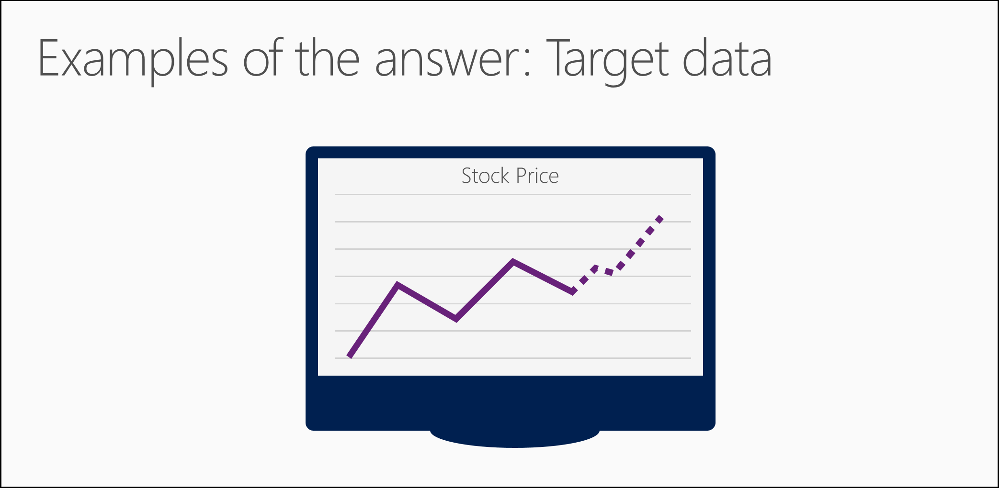
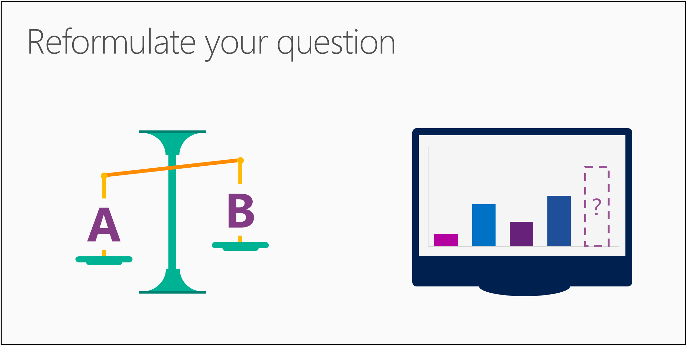

# Ask a question you can answer with data
## Video 3: Data Science for Beginners series
Learn how to formulate a data science problem into a question in Data Science for Beginners video 3. This video includes a comparison of questions for classification and regression algorithms.

To get the most out of the series, watch them all. [Go to the list of videos](#other-videos-in-this-series)
 

> [!VIDEO https://channel9.msdn.com/Blogs/Azure/Data-science-for-beginners-Ask-a-question-you-can-answer-with-data/player]
>
>

## Other videos in this series
*Data Science for Beginners* is a quick introduction to data science in five short videos.

* Video 1: [The 5 questions data science answers](data-science-for-beginners-the-5-questions-data-science-answers.md) *(5 min 14 sec)*
* Video 2: [Is your data ready for data science?](data-science-for-beginners-is-your-data-ready-for-data-science.md) *(4 min 56 sec)*
* Video 3: Ask a question you can answer with data
* Video 4: [Predict an answer with a simple model](data-science-for-beginners-predict-an-answer-with-a-simple-model.md) *(7 min 42 sec)*
* Video 5: [Copy other people's work to do data science](data-science-for-beginners-copy-other-peoples-work-to-do-data-science.md) *(3 min 18 sec)*

## Transcript: Ask a question you can answer with data
Welcome to the third video in the series "Data Science for Beginners."  

In this one, you'll get some tips for formulating a question you can answer with data.

You might get more out of this video, if you first watch the two earlier videos in this series: "The 5 questions data science can answer" and "Is your data is ready for data science?"

## Ask a sharp question
We've talked about how data science is the process of using names (also called categories or labels) and numbers to predict an answer to a question. But it can't be just any question; it has to be a *sharp question.*

A vague question doesn't have to be answered with a name or a number. A sharp question must.

Imagine you found a magic lamp with a genie who will truthfully answer any question you ask. But it's a mischievous genie, who will try to make their answer as vague and confusing as they can get away with. You want to pin them down with a question so airtight that they can't help but tell you what you want to know.

If you were to ask a vague question, like "What's going to happen with my stock?", the genie might answer, "The price will change". That's a truthful answer, but it's not very helpful.

But if you were to ask a sharp question, like "What will my stock's sale price be next week?", the genie can't help but give you a specific answer and predict a sale price.

## Examples of your answer: Target data
Once you formulate your question, check to see whether you have examples of the answer in your data.

If our question is "What will my stock's sale price be next week?" then we have to make sure our data includes the stock price history.

If our question is "Which car in my fleet is going to fail first?" then we have to make sure our data includes information about previous failures.

These examples of answers are called a target. A target is what we are trying to predict about future data points, whether it's a category or a number.

If you don't have any target data, you'll need to get some. You won't be able to answer your question without it.

## Reformulate your question
Sometimes you can reword your question to get a more useful answer.

The question "Is this data point A or B?" predicts the category (or name or label) of something. To answer it, we use a *classification algorithm*.

The question "How much?" or "How many?" predicts an amount. To answer it we use a *regression algorithm*.

To see how we can transform these, let's look at the question, "Which news story is the most interesting to this reader?" It asks for a prediction of a single choice from many possibilities - in other words "Is this A or B or C or D?" - and would use a classification algorithm.

But, this question may be easier to answer if you reword it as "How interesting is each story on this list to this reader?" Now you can give each article a numerical score, and then it's easy to identify the highest-scoring article. This is a rephrasing of the classification question into a regression question or How much?

How you ask a question is a clue to which algorithm can give you an answer.

You'll find that certain families of algorithms - like the ones in our news story example - are closely related. You can reformulate your question to use the algorithm that gives you the most useful answer.

But, most important, ask that sharp question - the question that you can answer with data. And be sure you have the right data to answer it.

We've talked about some basic principles for asking a question you can answer with data.

Be sure to check out the other videos in "Data Science for Beginners" from Microsoft Azure Machine Learning Studio.

## Next steps
* [Try a first data science experiment with Machine Learning Studio](create-experiment.md)
* [Get an introduction to Machine Learning on Microsoft Azure](/azure/machine-learning/preview/overview-what-is-azure-ml)
