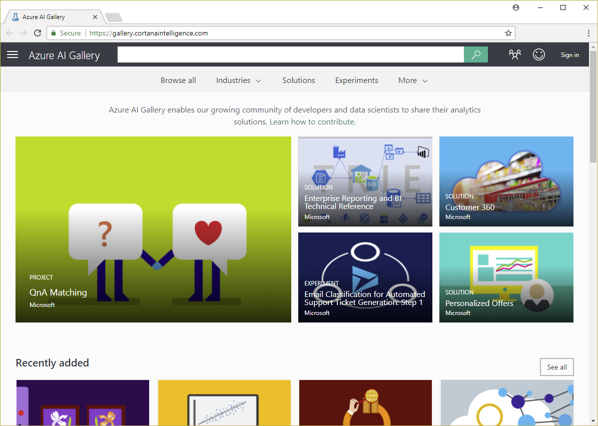
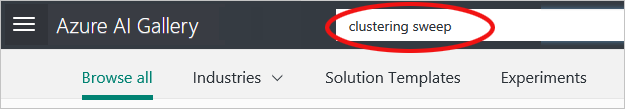
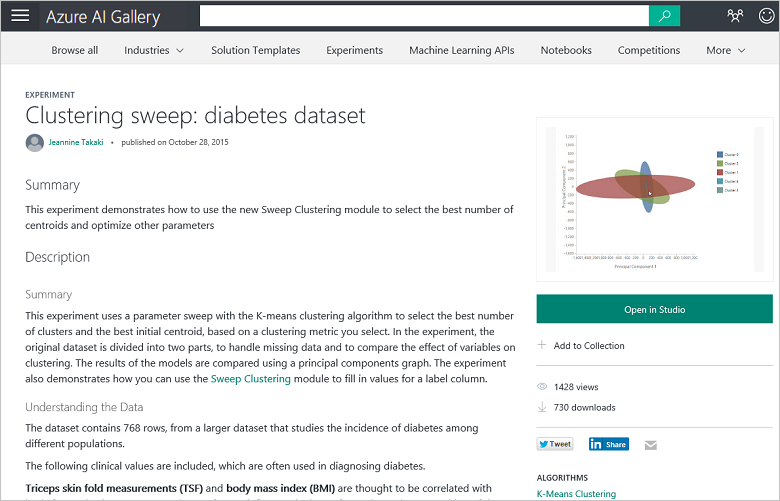
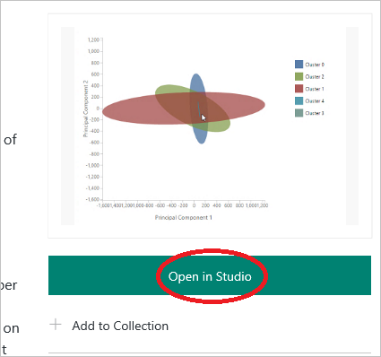
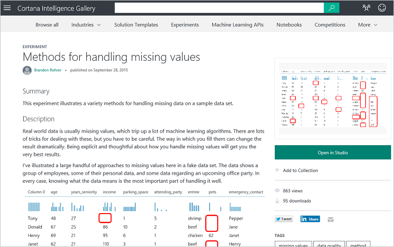

# Copy other people's work to do data science
## Video 5: Data Science for Beginners series
One of the trade secrets of data science is getting other people to do your work for you. Find a clustering algorithm example in Azure AI Gallery to use for your own machine learning experiment.

> [!IMPORTANT]
> **Cortana Intelligence Gallery** was renamed **Azure AI Gallery**. As a result, text and images in this transcript vary slightly from the video, which uses the former name.
>

To get the most out of the series, watch them all. [Go to the list of videos](#other-videos-in-this-series)
 

> [!VIDEO https://channel9.msdn.com/Blogs/Azure/data-science-for-beginners-series-copy-other-peoples-work-to-do-data-science/player]
>
>

## Other videos in this series
*Data Science for Beginners* is a quick introduction to data science in five short videos.

* Video 1: [The 5 questions data science answers](data-science-for-beginners-the-5-questions-data-science-answers.md) *(5 min 14 sec)*
* Video 2: [Is your data ready for data science?](data-science-for-beginners-is-your-data-ready-for-data-science.md) *(4 min 56 sec)*
* Video 3: [Ask a question you can answer with data](data-science-for-beginners-ask-a-question-you-can-answer-with-data.md) *(4 min 17 sec)*
* Video 4: [Predict an answer with a simple model](data-science-for-beginners-predict-an-answer-with-a-simple-model.md) *(7 min 42 sec)*
* Video 5: Copy other people's work to do data science

## Transcript: Copy other people's work to do data science
Welcome to the fifth video in the series "Data Science for Beginners."

In this one, you’ll discover a place to find examples that you can borrow from as a starting point for your own work. You might get the most out of this video if you first watch the earlier videos in this series.

One of the trade secrets of data science is getting other people to do your work for you.

## Find examples in the Azure AI Gallery

Microsoft has a cloud-based service called [Azure Machine Learning Studio (classic)](https://azure.microsoft.com/services/machine-learning-studio/). It provides you with a workspace where you can experiment with different machine learning algorithms, and, when you've got your solution worked out, you can launch it as a web service.

Part of this service is something called the **[Azure AI Gallery](https://gallery.azure.ai/)**. It contains resources, including a collection of Azure Machine Learning Studio (classic) experiments, or models, that people have built and contributed for others to use. These experiments are a great way to leverage the thought and hard work of others to get you started on your own solutions. Everyone is welcome to browse through it.

If you click **Experiments** at the top, you'll see a number of the most recent and popular experiments in the gallery. You can search through the rest of experiments by clicking **Browse All** at the top of the screen, and there you can enter search terms and choose search filters.

## Find and use a clustering algorithm example
So, for instance, let's say you want to see an example of how clustering works, so you search for **"clustering sweep"** experiments.

Here's an interesting one that someone contributed to the gallery.

Click on that experiment and you get a web page that describes the work that this contributor did, along with some of their results.

Notice the link that says **Open in Studio (classic)**.

I can click on that and it takes me right to **Azure Machine Learning Studio (classic)**. It creates a copy of the experiment and puts it in my own workspace. This includes the contributor's dataset, all the processing that they did, all of the algorithms that they used, and how they saved out the results.

And now I have a starting point. I can swap out their data for my own and do my own tweaking of the model. This gives me a running start, and it lets me build on the work of people who really know what they’re doing.

## Find experiments that demonstrate machine learning techniques
There are other experiments in the [Azure AI Gallery](https://gallery.azure.ai) that were contributed specifically to provide how-to examples for people new to data science. For instance, there's an experiment in the gallery that demonstrates how to handle missing values ([Methods for handling missing values](https://gallery.azure.ai/Experiment/Methods-for-handling-missing-values-1)). It walks you through 15 different ways of substituting empty values, and talks about the benefits of each method and when to use it.

[Azure AI Gallery](https://gallery.azure.ai) is a place to find working experiments that you can use as a starting point for your own solutions.

Be sure to check out the other videos in "Data Science for Beginners" from Microsoft Azure Machine Learning Studio (classic).

## Next steps
* [Try your first data science experiment with Azure Machine Learning Studio (classic)](create-experiment.md)
* [Get an introduction to Machine Learning on Microsoft Azure](/azure/machine-learning/overview-what-is-azure-ml)
