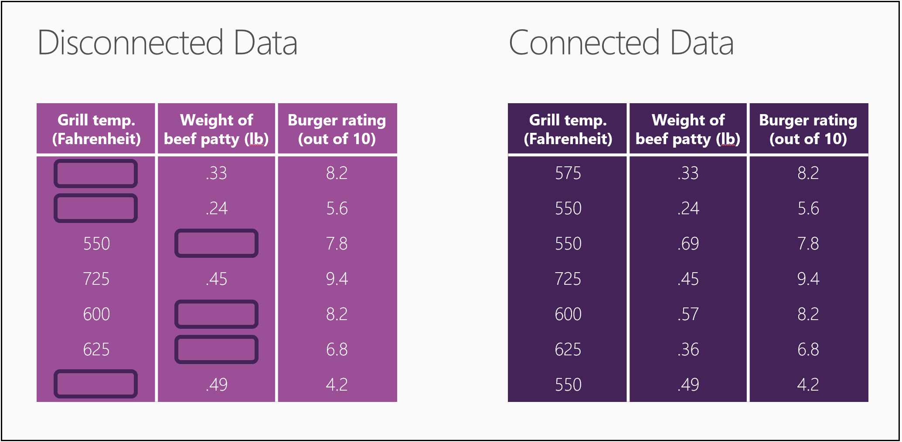

# Is your data ready for data science?
## Video 2: Data Science for Beginners series
Learn how to evaluate your data to make sure it meets basic criteria to be ready for data science.

To get the most out of the series, watch them all. [Go to the list of videos](#other-videos-in-this-series)
 

> [!VIDEO https://channel9.msdn.com/Shows/SupervisionNotRequired/9/player]
>
>

## Other videos in this series
*Data Science for Beginners* is a quick introduction to data science in five short videos.

* Video 1: [The 5 questions data science answers](data-science-for-beginners-the-5-questions-data-science-answers.md) *(5 min 14 sec)*
* Video 2: Is your data ready for data science?
* Video 3: [Ask a question you can answer with data](data-science-for-beginners-ask-a-question-you-can-answer-with-data.md) *(4 min 17 sec)*
* Video 4: [Predict an answer with a simple model](data-science-for-beginners-predict-an-answer-with-a-simple-model.md) *(7 min 42 sec)*
* Video 5: [Copy other people's work to do data science](data-science-for-beginners-copy-other-peoples-work-to-do-data-science.md) *(3 min 18 sec)*

## Transcript: Is your data ready for data science?
Welcome to "Is your data ready for data science?" the second video in the series *Data Science for Beginners*.  

Before data science can give you the answers you want, you have to give it some high-quality raw materials to work with. Just like making a pizza, the better the ingredients you start with, the better the final product. 

## Criteria for data
In data science, there are certain ingredients that must be pulled together including:

* Relevant
* Connected
* Accurate
* Enough to work with

## Is your data relevant?
So the first ingredient - you need data that's relevant.

On the left, the table presents the blood alcohol level of seven people tested outside a Boston bar, the Red Sox batting average in their last game, and the price of milk in the nearest convenience store.

This is all perfectly legitimate data. It’s only fault is that it isn’t relevant. There's no obvious relationship between these numbers. If someone gave you the current price of milk and the Red Sox batting average, there's no way you could guess their blood alcohol content.

Now look at the table on the right. This time each person’s body mass was measured as well as the number of drinks they’ve had.  The numbers in each row are now relevant to each other. If I gave you my body mass and the number of Margaritas I've had, you could make a guess at my blood alcohol content.

## Do you have connected data?
The next ingredient is connected data.

Here is some relevant data on the quality of hamburgers: grill temperature, patty weight, and rating in the local food magazine. But notice the gaps in the table on the left.

Most data sets are missing some values. It's common to have holes like this and there are ways to work around them. But if there's too much missing, your data begins to look like Swiss cheese.

If you look at the table on the left, there's so much missing data, it's hard to come up with any kind of relationship between grill temperature and patty weight. This example shows disconnected data.

The table on the right, though, is full and complete - an example of connected data.

## Is your data accurate?
The next ingredient is accuracy. Here are four targets to hit.

Look at the target in the upper right. There is a tight grouping right around the bulls eye. That, of course, is accurate. Oddly, in the language of data science, performance on the target right below it is also considered accurate.

If you mapped out the center of these arrows, you'd see that it's very close to the bulls eye. The arrows are spread out all around the target, so they're considered imprecise, but they're centered around the bulls eye, so they're considered accurate.

Now look at the upper-left target. Here the arrows hit very close together, a tight grouping. They're precise, but they're inaccurate because the center is way off the bulls eye. The arrows in the bottom-left target are both inaccurate and imprecise. This archer needs more practice.

## Do you have enough data to work with?
Finally, ingredient #4 is sufficient data.

Think of each data point in your table as being a brush stroke in a painting. If you have only a few of them, the painting can be fuzzy - it's hard to tell what it is.

If you add some more brush strokes, then your painting starts to get a little sharper.

When you have barely enough strokes, you only see enough to make some broad decisions. Is it somewhere I might want to visit? It looks bright, that looks like clean water – yes, that’s where I’m going on vacation.

As you add more data, the picture becomes clearer and you can make more detailed decisions. Now you can look at the three hotels on the left bank. You can notice the architectural features of the one in the foreground. You might even choose to stay on the third floor because of the view.

With data that's relevant, connected, accurate, and enough, you have all the ingredients needed to do some high-quality data science.

Be sure to check out the other four videos in *Data Science for Beginners* from Microsoft Azure Machine Learning Studio.

## Next steps
* [Try a first data science experiment with Machine Learning Studio](create-experiment.md)
* [Get an introduction to Machine Learning on Microsoft Azure](/azure/machine-learning/preview/overview-what-is-azure-ml)
