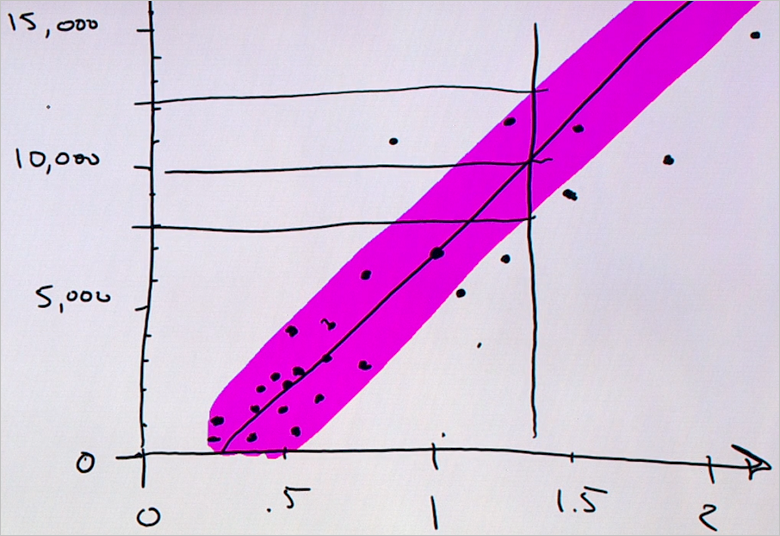

# Predict an answer with a simple model
## Video 4: Data Science for Beginners series
Learn how to create a simple regression model to predict the price of a diamond in Data Science for Beginners video 4. We'll draw a regression model with target data.

To get the most out of the series, watch them all. [Go to the list of videos](#other-videos-in-this-series)
 

> [!VIDEO https://channel9.msdn.com/Blogs/Azure/data-science-for-beginners-series-predict-an-answer-with-a-simple-model/player]
>
>

## Other videos in this series
*Data Science for Beginners* is a quick introduction to data science in five short videos.

* Video 1: [The 5 questions data science answers](data-science-for-beginners-the-5-questions-data-science-answers.md) *(5 min 14 sec)*
* Video 2: [Is your data ready for data science?](data-science-for-beginners-is-your-data-ready-for-data-science.md) *(4 min 56 sec)*
* Video 3: [Ask a question you can answer with data](data-science-for-beginners-ask-a-question-you-can-answer-with-data.md) *(4 min 17 sec)*
* Video 4: Predict an answer with a simple model
* Video 5: [Copy other people's work to do data science](data-science-for-beginners-copy-other-peoples-work-to-do-data-science.md) *(3 min 18 sec)*

## Transcript: Predict an answer with a simple model
Welcome to the fourth video in the "Data Science for Beginners" series. In this one, we'll build a simple model and make a prediction.

A *model* is a simplified story about our data. I'll show you what I mean.

## Collect relevant, accurate, connected, enough data
Say I want to shop for a diamond. I have a ring that belonged to my grandmother with a setting for a 1.35 carat diamond, and I want to get an idea of how much it will cost. I take a notepad and pen into the jewelry store, and I write down the price of all of the diamonds in the case and how much they weigh in carats. Starting with the first diamond - it's 1.01 carats and $7,366.

Now I go through and do this for all the other diamonds in the store.

Notice that our list has two columns. Each column has a different attribute - weight in carats and price - and each row is a single data point that represents a single diamond.

We've actually created a small data set here - a table. Notice that it meets our criteria for quality:

* The data is **relevant** - weight is definitely related to price
* It's **accurate** - we double-checked the prices that we write down
* It's **connected** - there are no blank spaces in either of these columns
* And, as we'll see, it's **enough** data to answer our question

## Ask a sharp question
Now we'll pose our question in a sharp way: "How much will it cost to buy a 1.35 carat diamond?"

Our list doesn't have a 1.35 carat diamond in it, so we'll have to use the rest of our data to get an answer to the question.

## Plot the existing data
The first thing we'll do is draw a horizontal number line, called an axis, to chart the weights. The range of the weights is 0 to 2, so we'll draw a line that covers that range and put ticks for each half carat.

Next we'll draw a vertical axis to record the price and connect it to the horizontal weight axis. This will be in units of dollars. Now we have a set of coordinate axes.

We're going to take this data now and turn it into a *scatter plot*. This is a great way to visualize numerical data sets.

For the first data point, we eyeball a vertical line at 1.01 carats. Then, we eyeball a horizontal line at $7,366. Where they meet, we draw a dot. This represents our first diamond.

Now we go through each diamond on this list and do the same thing. When we're through, this is what we get: a bunch of dots, one for each diamond.

## Draw the model through the data points
Now if you look at the dots and squint, the collection looks like a fat, fuzzy line. We can take our marker and draw a straight line through it.

By drawing a line, we created a *model*. Think of this as taking the real world and making a simplistic cartoon version of it. Now the cartoon is wrong - the line doesn't go through all the data points. But, it's a useful simplification.

The fact that all the dots don't go exactly through the line is OK. Data scientists explain this by saying that there's the model - that's the line - and then each dot has some *noise* or *variance* associated with it. There's the underlying perfect relationship, and then there's the gritty, real world that adds noise and uncertainty.

Because we're trying to answer the question *How much?* this is called a *regression*. And because we're using a straight line, it's a *linear regression*.

## Use the model to find the answer
Now we have a model and we ask it our question: How much will a 1.35 carat diamond cost?

To answer our question, we eyeball 1.35 carats and draw a vertical line. Where it crosses the model line, we eyeball a horizontal line to the dollar axis. It hits right at 10,000. Boom! That's the answer: A 1.35 carat diamond costs about $10,000.

## Create a confidence interval
It's natural to wonder how precise this prediction is. It's useful to know whether the 1.35 carat diamond will be very close to $10,000, or a lot higher or lower. To figure this out, let's draw an envelope around the regression line that includes most of the dots. This envelope is called our *confidence interval*: We're pretty confident that prices fall within this envelope, because in the past most of them have. We can draw two more horizontal lines from where the 1.35 carat line crosses the top and the bottom of that envelope.

Now we can say something about our confidence interval:  We can say confidently that the price of a 1.35 carat diamond is about $10,000 - but it might be as low as $8,000 and it might be as high as $12,000.

## We're done, with no math or computers
We did what data scientists get paid to do, and we did it just by drawing:

* We asked a question that we could answer with data
* We built a *model* using *linear regression*
* We made a *prediction*, complete with a *confidence interval*

And we didn't use math or computers to do it.

Now if we'd had more information, like...

* the cut of the diamond
* color variations (how close the diamond is to being white)
* the number of inclusions in the diamond

...then we would have had more columns. In that case, math becomes helpful. If you have more than two columns, it's hard to draw dots on paper. The math lets you fit that line or that plane to your data very nicely.

Also, if instead of just a handful of diamonds, we had two thousand or two million, then you can do that work much faster with a computer.

Today, we've talked about how to do linear regression, and we made a prediction using data.

Be sure to check out the other videos in "Data Science for Beginners" from Microsoft Azure Machine Learning Studio (classic).

## Next steps
* [Try a first data science experiment with Machine Learning Studio (classic)](create-experiment.md)
* [Get an introduction to Machine Learning on Microsoft Azure](/azure/machine-learning/overview-what-is-azure-ml)
