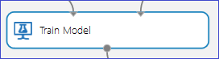
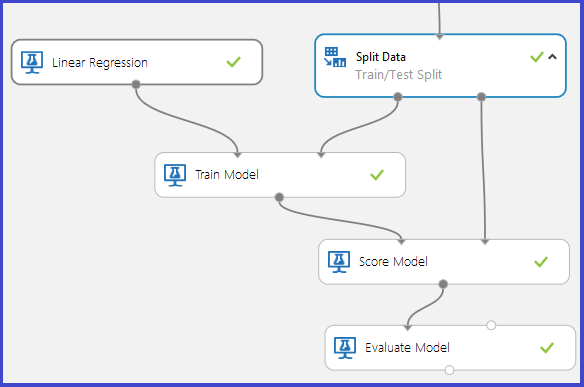

# Debug your model in Azure Machine Learning Studio

When running a model, you may run into the following errors:

* the [Train Model][train-model] module produces an error 
* the [Score Model][score-model] module produces incorrect results 

This article explains potential causes for these errors.

## Train Model Module produces an error

The [Train Model][train-model] Module expects two inputs:

1. The type of machine learning model from the collection of models provided by Azure Machine Learning Studio.
2. The training data with a specified Label column that specifies the variable to predict (the other columns are assumed to be Features).

This module can produce an error in the following cases:

1. The Label column is specified incorrectly. This can happen if either more than one column is selected as the Label or an incorrect column index is selected. For example, the second case would apply if a column index of 30 is used with an input dataset that has only 25 columns.

2. The dataset does not contain any Feature columns. For example, if the input dataset has only one column, which is marked as the Label column, there would be no features with which to build the model. In this case, the [Train Model][train-model] module produces an error.

3. The input dataset (Features or Label) contains Infinity as a value.

## Score Model Module produces incorrect results

In a typical training/testing experiment for supervised learning, the [Split Data][split] module divides the original dataset into two parts: one part is used to train the model and one part is used to score how well the trained model performs. The trained model is then used to score the test data, after which the results are evaluated to determine the accuracy of the model.

The [Score Model][score-model] module requires two inputs:

1. A trained model output from the [Train Model][train-model] module.
2. A scoring dataset that is different from the dataset used to train the model.

It's possible that even though the experiment succeeds, the [Score Model][score-model] module produces incorrect results. Several scenarios may cause this issue to happen:

1. If the specified Label is categorical and a regression model is trained on the data, an incorrect output would be produced by the [Score Model][score-model] module. This is because regression requires a continuous response variable. In this case, it would be more suitable to use a classification model. 

2. Similarly, if a classification model is trained on a dataset having floating point numbers in the Label column, it may produce undesirable results. This is because classification requires a discrete response variable that only allows values that range over a finite, and small, set of classes.

3. If the scoring dataset does not contain all the features used to train the model, the [Score Model][score-model] produces an error.

4. If a row in the scoring dataset contains a missing value or an infinite value for any of its features, the [Score Model][score-model] does not produce any output corresponding to that row.

5. The [Score Model][score-model] may produce identical outputs for all rows in the scoring dataset. This could occur, for example, when attempting classification using Decision Forests if the minimum number of samples per leaf node is chosen to be more than the number of training examples available.

<!-- Module References -->
[score-model]: https://msdn.microsoft.com/library/azure/401b4f92-e724-4d5a-be81-d5b0ff9bdb33/
[split]: https://msdn.microsoft.com/library/azure/70530644-c97a-4ab6-85f7-88bf30a8be5f/
[train-model]: https://msdn.microsoft.com/library/azure/5cc7053e-aa30-450d-96c0-dae4be720977/

