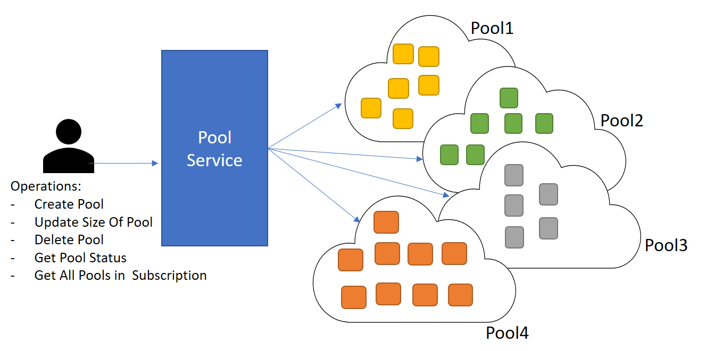

# Azure Batch service for Azure Machine Learning Studio jobs

Machine Learning Batch Pool processing provides customer-managed scale for the Azure Machine Learning Batch Execution Service. Classic batch processing for machine learning takes place in a multi-tenant environment, which limits the number of concurrent jobs you can submit, and jobs are queued on a first-in-first-out basis. This uncertainty means that you can't accurately predict when your job will run.

Batch Pool processing allows you to create pools on which you can submit batch jobs. You control the size of the pool, and to which pool the job is submitted. Your BES job runs in its own processing space providing predictable processing performance and the ability to create resource pools that
correspond to the processing load that you submit.

> [!NOTE]
> You must have a New Resource Manager based Machine Learning web service to create a pool. Once created, you can run any BES web service, both New Resource Manager based and classic, on the pool.

## How to use Batch Pool processing

Configuration of Batch Pool Processing is not currently available through the Azure portal. To use Batch Pool processing, you must:

-   Call CSS to create a Batch Pool Account and obtain a Pool Service URL and an authorization key
-   Create a New Resource Manager based web service and billing plan

To create your account, call Microsoft Customer Service and Support (CSS) and provide your Subscription ID. CSS will work with you to determine the appropriate capacity for your scenario. CSS then configures your account with the maximum number of pools you can create and the maximum number of virtual machines (VMs) that you can place in each pool. Once your account is configured, you are provided your Pool Service URL and an authorization key.

After your account is created, you use the Pool Service URL and authorization key to perform pool management operations on your Batch Pool.



You create pools by calling the Create Pool operation on the pool service URL that CSS provided to you. When you create a pool, specify the number of VMs and the URL of the swagger.json of a New Resource Manager based Machine Learning web service. This web service is provided to establish the billing association. The Batch Pool service uses the swagger.json to associate the pool with a billing plan. You can run any BES web service, both New Resource Manager based and classic, on the pool.

You can use any New Resource Manager based web service, but be aware that the billing for the jobs are charged against the billing plan associated with that service. You may want to create a web service and new billing plan specifically for running Batch Pool jobs.

For more information on creating web services, see [Deploy an Azure Machine Learning web service](publish-a-machine-learning-web-service.md).

Once you have created a pool, you submit the BES job using the Batch Requests URL for the web service. You can choose to submit it to a pool or to classic batch processing. To submit a job to Batch Pool processing, you add the following parameter to the job submission request body:

"AzureBatchPoolId":"&lt;pool ID&gt;"

If you do not add the parameter, the job is run in the classic batch process environment. If the pool has available resources, the job starts running immediately. If the pool does not have free resources, your job is queued until a resource is available.

If you find that you regularly reach the capacity of your pools, and you need increased capacity, you can call CSS and work with a representative to increase your quotas.

Example Request:

https://ussouthcentral.services.azureml.net/subscriptions/80c77c7674ba4c8c82294c3b2957990c/services/9fe659022c9747e3b9b7b923c3830623/jobs?api-version=2.0

```json
{

	"Input":{
	
		"ConnectionString":"DefaultEndpointsProtocol=https;BlobEndpoint=https://sampleaccount.blob.core.windows.net/;TableEndpoint
		=https://sampleaccount.table.core.windows.net/;QueueEndpoint=https://sampleaccount.queue.core.windows.net/;FileEndpoint=https://zhguim
		l.file.core.windows.net/;AccountName=sampleaccount;AccountKey=&lt;Key&gt;;",
		
		"BaseLocation":null,
		
		"RelativeLocation":"testint/AdultCensusIncomeBinaryClassificationDataset.csv",
		
		"SasBlobToken":null
	
	},
	
	"GlobalParameters":{ },
	
	"Outputs":{
	
		"output1":{
		
			"ConnectionString":"DefaultEndpointsProtocol=https;BlobEndpoint=https://sampleaccount.blob.core.windows.net/;TableEndpo
			int=https://sampleaccount.table.core.windows.net/;QueueEndpoint=https://sampleaccount.queue.core.windows.net/;FileEndpoint=https://sampleaccount.file.core.windows.net/;AccountName=sampleaccount;AccountKey=&lt;Key&gt;",
			"BaseLocation":null,
			"RelativeLocation":"testintoutput/testint\_results.csv",
			
			"SasBlobToken":null
		
		}
	
	},
	
	"AzureBatchPoolId":"8dfc151b0d3e446497b845f3b29ef53b"

}
```

## Considerations when using Batch Pool processing

Batch Pool Processing is an always-on billable service and that requires you to associate it with a Resource Manager based billing plan. You are only billed for the number of compute hours the pool is running; regardless of the number of jobs run during that time pool. If you create a pool, you are billed for the compute hours of each virtual machine in the pool until the pool is deleted, even if no batch jobs are running in the pool. Billing for the virtual machines starts when they have finished provisioning and stops when they have been deleted. You can use any of the plans found on the [Machine Learning Pricing page](https://azure.microsoft.com/pricing/details/machine-learning/).

Billing example:

If you create a Batch Pool with 2 virtual machines and delete it after 24 hours your billing plan is debited 48 compute hours; regardless of how many jobs were run during that period.

If you create a Batch Pool with 4 virtual machines and delete it after 12 hours, your billing plan is also debited 48 compute hours.

We recommend that you poll the job status to determine when jobs complete. When all your jobs have finished running, call the Resize Pool operation to set the number of virtual machines in the pool to zero. If you are short on pool resources and you need to create a new pool, for example to bill against a different billing plan, you can delete the pool instead when all your jobs have finished running.


| **Use Batch Pool Processing when**    | **Use classic batch processing when**  |
|---|---|
|You need to run a large number of jobs<br>Or<br/>You need to know that your jobs will run immediately<br/>Or<br/>You need guaranteed throughput. For example, you need to run a number of jobs in a given time frame, and want to scale out your compute resources to meet your needs.    | You are running just a few jobs<br/>And<br/> You don’t need the jobs to run immediately |
