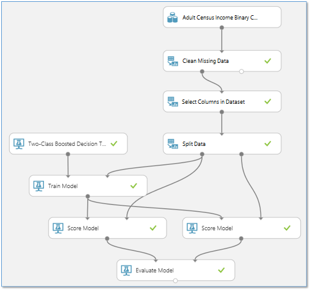
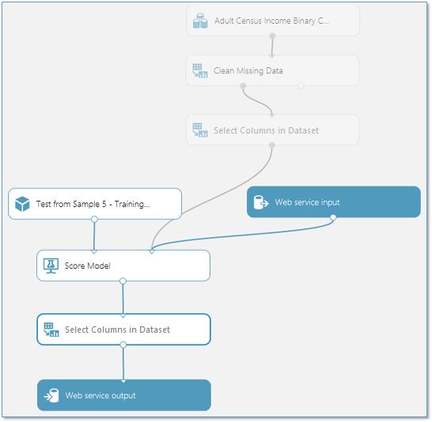
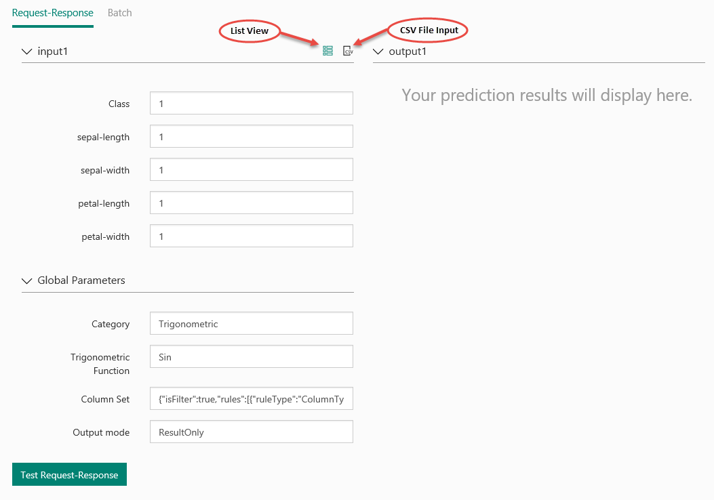
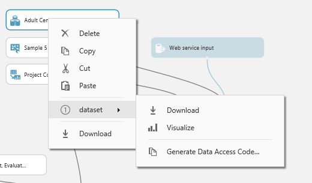
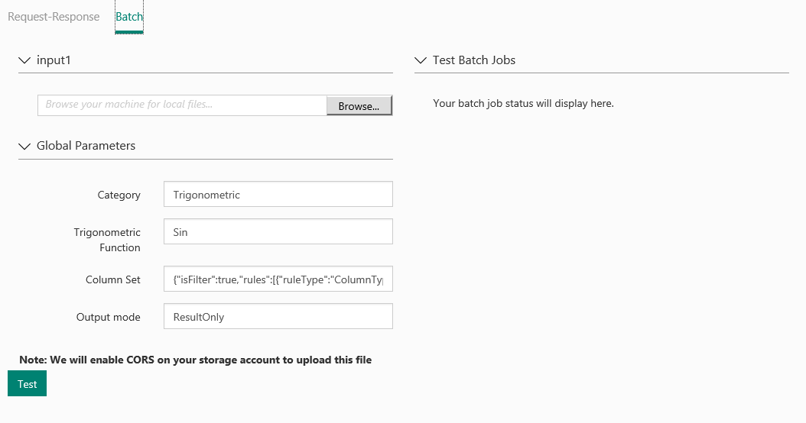
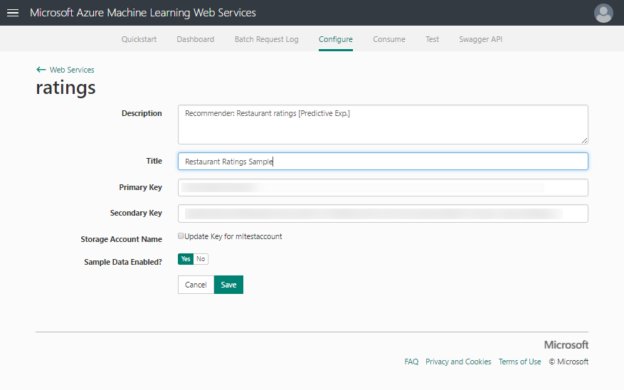
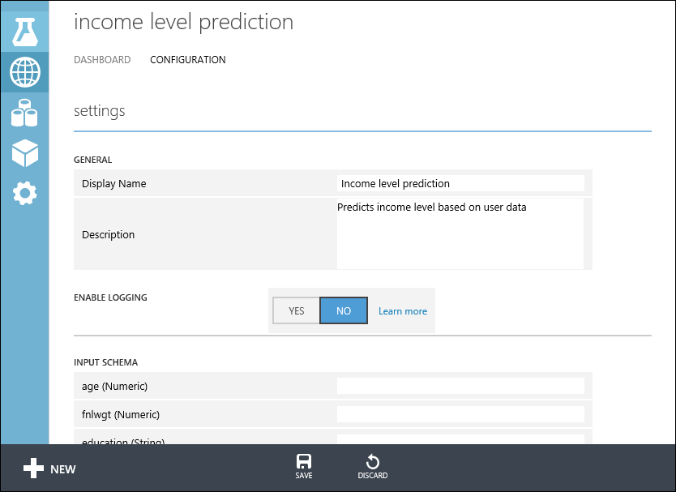

# Deploy an Azure Machine Learning Studio (classic) web service

Azure Machine Learning Studio (classic) enables you to build and test a predictive analytic solution. Then you can deploy the solution as a web service.

Machine Learning Studio (classic) web services provide an interface between an application and a Machine Learning Studio (classic) workflow scoring model. An external application can communicate with a Machine Learning Studio (classic) workflow scoring model in real time. A call to a Machine Learning Studio (classic) web service returns prediction results to an external application. To make a call to a web service, you pass an API key that was created when you deployed the web service. A Machine Learning Studio (classic) web service is based on REST, a popular architecture choice for web programming projects.

Azure Machine Learning Studio (classic) has two types of web services:

* Request-Response Service (RRS): A low latency, highly scalable service that scores a single data record.
* Batch Execution Service (BES): An asynchronous service that scores a batch of data records.

The input for BES is like data input that RRS uses. The main difference is that BES reads a block of records from a variety of sources, such as Azure Blob storage, Azure Table storage, Azure SQL Database, HDInsight (hive query), and HTTP sources.

From a high-level point-of-view, you deploy your model in three steps:

* **[Create a training experiment]** - In Studio (classic), you can train and test a predictive analytics model using training data that you supply, using a large set of built-in machine learning algorithms.
* **[Convert it to a predictive experiment]** - Once your model has been trained with existing data and you're ready to use it to score new data, you prepare and streamline your experiment for predictions.
* **Deploy** it as a **[New web service]** or a **[Classic web service]** - When you deploy your predictive experiment as an Azure web service, users can send data to your model and receive your model's predictions.

## Create a training experiment

To train a predictive analytics model, you use Azure Machine Learning Studio (classic) to create a training experiment where you include various modules to load training data, prepare the data as necessary, apply machine learning algorithms, and evaluate the results. You can iterate on an experiment and try different machine learning algorithms to compare and evaluate the results.

The process of creating and managing training experiments is covered more thoroughly elsewhere. For more information, see these articles:

* [Create a simple experiment in Azure Machine Learning Studio (classic)](create-experiment.md)
* [Develop a predictive solution with Azure Machine Learning Studio (classic)](tutorial-part1-credit-risk.md)
* [Import your training data into Azure Machine Learning Studio (classic)](import-data.md)
* [Manage experiment iterations in Azure Machine Learning Studio (classic)](manage-experiment-iterations.md)

## Convert the training experiment to a predictive experiment

Once you've trained your model, you're ready to convert your training experiment into a predictive experiment to score new data.

By converting to a predictive experiment, you're getting your trained model ready to be deployed as a scoring web service. Users of the web service can send input data to your model and your model will send back the prediction results. As you convert to a predictive experiment, keep in mind how you expect your model to be used by others.

The process of converting a training experiment to a predictive experiment involves three steps:

1. Replace the machine learning algorithm modules with your trained model.
2. Trim the experiment to only those modules that are needed for scoring. A training experiment includes a number of modules that are necessary for training but are not needed once the model is trained.
3. Define how your model will accept data from the web service user, and what data will be returned.

> [!TIP]
> In your training experiment, you've been concerned with training and scoring your model using your own data. But once deployed, users will send new data to your model and it will return prediction results. So, as you convert your training experiment to a predictive experiment to get it ready for deployment, keep in mind how the model will be used by others.

### Set Up Web Service button
After you run your experiment (click **RUN** at the bottom of the experiment canvas), click the **Set Up Web Service** button (select the **Predictive Web Service** option). **Set Up Web Service** performs for you the three steps of converting your training experiment to a predictive experiment:

1. It saves your trained model in the **Trained Models** section of the module palette (to the left of the experiment canvas). It then replaces the machine learning algorithm and [Train Model][train-model] modules with the saved trained model.
2. It analyzes your experiment and removes modules that were clearly used only for training and are no longer needed.
3. It inserts _Web service input_ and _output_ modules into default locations in your experiment (these modules accept and return user data).

For example, the following experiment trains a two-class boosted decision tree model using sample census data:

The modules in this experiment perform basically four different functions:

When you convert this training experiment to a predictive experiment, some of these modules are no longer needed, or they now serve a different purpose:

* **Data** - The data in this sample dataset is not used during scoring - the user of the web service will supply the data to be scored. However, the metadata from this dataset, such as data types, is used by the trained model. So you need to keep the dataset in the predictive experiment so that it can provide this metadata.

* **Prep** - Depending on the user data that will be submitted for scoring, these modules may or may not be necessary to process the incoming data. The **Set Up Web Service** button doesn't touch these - you need to decide how you want to handle them.
  
    For instance, in this example the sample dataset may have missing values, so a [Clean Missing Data][clean-missing-data] module was included to deal with them. Also, the sample dataset includes columns that are not needed to train the model. So a [Select Columns in Dataset][select-columns] module was included to exclude those extra columns from the data flow. If you know that the data that will be submitted for scoring through the web service will not have missing values, then you can remove the [Clean Missing Data][clean-missing-data] module. However, since the [Select Columns in Dataset][select-columns] module helps define the columns of data that the trained model expects, that module needs to remain.

* **Train** - These modules are used to train the model. When you click **Set Up Web Service**, these modules are replaced with a single module that contains the model you trained. This new module is saved in the **Trained Models** section of the module palette.

* **Score** - In this example, the [Split Data][split] module is used to divide the data stream into test data and training data. In the predictive experiment, we're not training anymore, so [Split Data][split] can be removed. Similarly, the second [Score Model][score-model] module and the [Evaluate Model][evaluate-model] module are used to compare results from the test data, so these modules are not needed in the predictive experiment. The remaining [Score Model][score-model] module, however, is needed to return a score result through the web service.

Here is how our example looks after clicking **Set Up Web Service**:

The work done by **Set Up Web Service** may be sufficient to prepare your experiment to be deployed as a web service. However, you may want to do some additional work specific to your experiment.

#### Adjust input and output modules
In your training experiment, you used a set of training data and then did some processing to get the data in a form that the machine learning algorithm needed. If the data you expect to receive through the web service will not need this processing, you can bypass it: connect the output of the **Web service input module** to a different module in your experiment. The user's data will now arrive in the model at this location.

For example, by default **Set Up Web Service** puts the **Web service input** module at the top of your data flow, as shown in the figure above. But we can manually position the **Web service input** past the data processing modules:

The input data provided through the web service will now pass directly into the Score Model module without any preprocessing.

Similarly, by default **Set Up Web Service** puts the Web service output module at the bottom of your data flow. In this example, the web service will return to the user the output of the [Score Model][score-model] module, which includes the complete input data vector plus the scoring results.
However, if you would prefer to return something different, then you can add additional modules before the **Web service output** module. 

For example, to return only the scoring results and not the entire vector of input data, add a [Select Columns in Dataset][select-columns] module to exclude all columns except the scoring results. Then move the **Web service output** module to the output of the [Select Columns in Dataset][select-columns] module. The experiment looks like this:

#### Add or remove additional data processing modules
If there are more modules in your experiment that you know will not be needed during scoring, these can be removed. For example, because we moved the **Web service input** module to a point after the data processing modules, we can remove the [Clean Missing Data][clean-missing-data] module from the predictive experiment.

Our predictive experiment now looks like this:

#### Add optional Web Service Parameters
In some cases, you may want to allow the user of your web service to change the behavior of modules when the service is accessed. *Web Service Parameters* allow you to do this.

A common example is setting up an [Import Data][import-data] module so the user of the deployed web service can specify a different data source when the web service is accessed. Or configuring an [Export Data][export-data] module so that a different destination can be specified.

You can define Web Service Parameters and associate them with one or more module parameters, and you can specify whether they are required or optional. The user of the web service provides values for these parameters when the service is accessed, and the module actions are modified accordingly.

For more information about what Web Service Parameters are and how to use them, see [Using Azure Machine Learning Web Service Parameters][webserviceparameters].

The following steps describe deploying a predictive experiment as a New web service. You can also deploy the experiment as Classic web service.

## Deploy it as a New web service

Now that the predictive experiment has been prepared, you can deploy it as a new (Resource Manager-based) Azure web service. Using the web service, users can send data to your model and the model will return its predictions.

To deploy your predictive experiment, click **Run** at the bottom of the experiment canvas. Once the experiment has finished running, click **Deploy Web Service** and select **Deploy Web Service [New]**.  The deployment page of the Machine Learning Studio (classic) Web Service portal opens.

> [!NOTE] 
> To deploy a New web service you must have sufficient permissions in the subscription to which you deploying the web service. For more information see, [Manage a Web service using the Azure Machine Learning Web Services portal](manage-new-webservice.md). 

### Web Service portal Deploy Experiment Page

On the Deploy Experiment page, enter a name for the web service.
Select a pricing plan. If you have an existing pricing plan you can select it, otherwise you must create a new price plan for the service.

1. In the **Price Plan** drop down, select an existing plan or select the **Select new plan** option.
2. In **Plan Name**, type a name that will identify the plan on your bill.
3. Select one of the **Monthly Plan Tiers**. The plan tiers default to the plans for your default region and your web service is deployed to that region.

Click **Deploy** and the **Quickstart** page for your web service opens.

The web service Quickstart page gives you access and guidance on the most common tasks you will perform after creating a web service. From here, you can easily access both the Test page and Consume page.

<!-- -->

### Test your New web service

To test your new web service, click **Test web service** under common tasks. On the Test page, you can test your web service as a Request-Response Service (RRS) or a Batch Execution service (BES).

The RRS test page displays the inputs, outputs, and any global parameters that you have defined for the experiment. To test the web service, you can manually enter appropriate values for the inputs or supply a comma separated value (CSV) formatted file containing the test values.

To test using RRS, from the list view mode, enter appropriate values for the inputs and click **Test Request-Response**. Your prediction results  display in the output column to the left.

To test your BES, click **Batch**. On the Batch test page, click Browse under your input and select a CSV file containing appropriate sample values. If you don't have a CSV file, and you created your predictive experiment using Machine Learning Studio (classic), you can download the data set for your predictive experiment and use it.

To download the data set, open Machine Learning Studio (classic). Open your predictive experiment and right click the input for your experiment. From the context menu, select **dataset** and then select **Download**.

Click **Test**. The status of your Batch Execution job displays to the right under **Test Batch Jobs**.

<!---->

On the **CONFIGURATION** page, you can change the description, title, update the storage account key, and enable sample data for your web service.

### Access your New web service

Once you deploy your web service from Machine Learning Studio (classic), you can send data to the service and receive responses programmatically.

The **Consume** page provides all the information you need to access your web service. For example, the API key is provided to allow authorized access to the service.

For more information about accessing a Machine Learning Studio (classic) web service, see [How to consume an Azure Machine Learning Studio (classic) Web service](consume-web-services.md).

### Manage your New web service

You can manage your New web services using Machine Learning Studio (classic) Web Services portal. From the [main portal page](https://services.azureml.net/), click **Web Services**. From the web services page, you can delete or copy a service. To monitor a specific service, click the service and then click **Dashboard**. To monitor batch jobs associated with the web service, click **Batch Request Log**.

###  Deploy your New web service to multiple regions

You can easily deploy a New web service to multiple regions without needing multiple subscriptions or workspaces.

Pricing is region specific, so you need to define a billing plan for each region in which you will deploy the web service.

#### Create a plan in another region

1. Sign in to [Microsoft Azure Machine Learning Web Services](https://services.azureml.net/).
2. Click the **Plans** menu option.
3. On the Plans over view page, click **New**.
4. From the **Subscription** dropdown, select the subscription in which the new plan will reside.
5. From the **Region** dropdown, select a region for the new plan. The Plan Options for the selected region will display in the **Plan Options** section of the page.
6. From the **Resource Group** dropdown, select a resource group for the plan. From more information on resource groups, see [Azure Resource Manager overview](../../azure-resource-manager/management/overview.md).
7. In **Plan Name** type the name of the plan.
8. Under **Plan Options**, click the billing level for the new plan.
9. Click **Create**.

#### Deploy the web service to another region

1. On the Microsoft Azure Machine Learning Web Services page, click the **Web Services** menu option.
2. Select the Web Service you are deploying to a new region.
3. Click **Copy**.
4. In **Web Service Name**, type a new name for the web service.
5. In **Web service description**, type a description for the web service.
6. From the **Subscription** dropdown, select the subscription in which the new web service will reside.
7. From the **Resource Group** dropdown, select a resource group for the web service. From more information on resource groups, see [Azure Resource Manager overview](../../azure-resource-manager/management/overview.md).
8. From the **Region** dropdown, select the region in which to deploy the web service.
9. From the **Storage account** dropdown, select a storage account in which to store the web service.
10. From the **Price Plan** dropdown, select a plan in the region you selected in step 8.
11. Click **Copy**.

## Deploy it as a Classic web service

Now that the predictive experiment has been sufficiently prepared, you can deploy it as a Classic Azure web service. Using the web service, users can send data to your model and the model will return its predictions.

To deploy your predictive experiment, click **Run** at the bottom of the experiment canvas and then click **Deploy Web Service**. The web service is set up and you are placed in the web service dashboard.

### Test your Classic web service

You can test the web service in either the Machine Learning Studio (classic) Web Services portal or Machine Learning Studio (classic).

To test the Request Response web service, click the **Test** button in the web service dashboard. A dialog pops up to ask you for the input data for the service. These are the columns expected by the scoring experiment. Enter a set of data and then click **OK**. The results generated by the web service are displayed at the bottom of the dashboard.

You can click the **Test** preview link to test your service in the Azure Machine Learning Studio (classic) Web Services portal as shown previously in the New web service section.

To test the Batch Execution Service, click **Test** preview link . On the Batch test page, click Browse under your input and select a CSV file containing appropriate sample values. If you don't have a CSV file, and you created your predictive experiment using Machine Learning Studio (classic), you can download the data set for your predictive experiment and use it.

On the **CONFIGURATION** page, you can change the display name of the service and give it a description. The name and description is displayed in the [Azure portal](https://portal.azure.com/) where you manage your web services.

You can provide a description for your input data, output data, and web service parameters by entering a string for each column under **INPUT SCHEMA**, **OUTPUT SCHEMA**, and **Web SERVICE PARAMETER**. These descriptions are used in the sample code documentation provided for the web service.

You can enable logging to diagnose any failures that you're seeing when your web service is accessed. For more information, see [Enable logging for Machine Learning Studio (classic) web services](web-services-logging.md).

You can also configure the endpoints for the web service in the Azure Machine Learning Web Services portal similar to the procedure shown previously in the New web service section. The options are different, you can add or change the service description, enable logging, and enable sample data for testing.

### Access your Classic web service

Once you deploy your web service from Azure Machine Learning Studio (classic), you can send data to the service and receive responses programmatically.

The dashboard provides all the information you need to access your web service. For example, the API key is provided to allow authorized access to the service, and API help pages are provided to help you get started writing your code.

For more information about accessing a Machine Learning Studio (classic) web service, see [How to consume an Azure Machine Learning Studio (classic) Web service](consume-web-services.md).

### Manage your Classic web service

There are various of actions you can perform to monitor a web service. You can update it, and delete it. You can also add additional endpoints to a Classic web service in addition to the default endpoint that is created when you deploy it.

For more information, see [Manage an Azure Machine Learning Studio (classic) workspace](manage-workspace.md) and [Manage a web service using the Azure Machine Learning Studio (classic) Web Services portal](manage-new-webservice.md).

## Update the web service
You can make changes to your web service, such as updating the model with additional training data, and deploy it again, overwriting the original web service.

To update the web service, open the original predictive experiment you used to deploy the web service and make an editable copy by clicking **SAVE AS**. Make your changes and then click **Deploy Web Service**.

Because you've deployed this experiment before, you are asked if you want to overwrite (Classic Web Service) or update (New web service) the existing service. Clicking **YES** or **Update** stops the existing web service and deploys the new predictive experiment is deployed in its place.

> [!NOTE]
> If you made configuration changes in the original web service, for example, entering a new display name or description, you will need to enter those values again.

One option for updating your web service is to retrain the model programmatically. For more information, see [Retrain Machine Learning Studio (classic) models programmatically](/azure/machine-learning/studio/retrain-machine-learning-model).

## Next steps

* For more technical details on how deployment works, see [How a Machine Learning Studio (classic) model progresses from an experiment to an operationalized Web service](model-progression-experiment-to-web-service.md).

* For details on how to get your model ready to deploy, see [How to prepare your model for deployment in Azure Machine Learning Studio (classic)](convert-training-experiment-to-scoring-experiment.md).

* There are several ways to consume the REST API and access the web service. See [How to consume an Azure Machine Learning Studio (classic) web service](consume-web-services.md).

<!-- internal links -->
[Create a training experiment]: #create-a-training-experiment
[Convert it to a predictive experiment]: #convert-the-training-experiment-to-a-predictive-experiment
[New web service]: #deploy-it-as-a-new-web-service
[Classic web service]: #deploy-it-as-a-classic-web-service
[new]: #deploy-it-as-a-new-web-service
[classic]: #deploy-the-predictive-experiment-as-a-classic-web-service
[Access]: #access-the-Web-service
[Manage]: #manage-the-Web-service-in-the-azure-management-portal
[Update]: #update-the-Web-service

[webserviceparameters]: web-service-parameters.md
[deploy]: deploy-a-machine-learning-web-service.md
[clean-missing-data]: https://msdn.microsoft.com/library/azure/d2c5ca2f-7323-41a3-9b7e-da917c99f0c4/
[evaluate-model]: https://msdn.microsoft.com/library/azure/927d65ac-3b50-4694-9903-20f6c1672089/
[select-columns]: https://msdn.microsoft.com/library/azure/1ec722fa-b623-4e26-a44e-a50c6d726223/
[import-data]: https://msdn.microsoft.com/library/azure/4e1b0fe6-aded-4b3f-a36f-39b8862b9004/
[score-model]: https://msdn.microsoft.com/library/azure/401b4f92-e724-4d5a-be81-d5b0ff9bdb33/
[split]: https://msdn.microsoft.com/library/azure/70530644-c97a-4ab6-85f7-88bf30a8be5f/
[train-model]: https://msdn.microsoft.com/library/azure/5cc7053e-aa30-450d-96c0-dae4be720977/
[export-data]: https://msdn.microsoft.com/library/azure/7a391181-b6a7-4ad4-b82d-e419c0d6522c/
