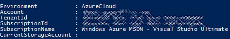
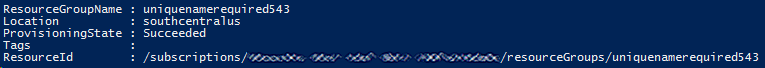

# Deploy Azure Machine Learning Studio Workspace Using Azure Resource Manager

Using an Azure Resource Manager deployment template saves you time by giving you a scalable way to deploy interconnected components with a validation and retry mechanism. To set up Azure Machine Learning Studio Workspaces, for example, you need to first configure an Azure storage account and then deploy your workspace. Imagine doing this manually for hundreds of workspaces. An easier alternative is to use an Azure Resource Manager template to deploy an Studio Workspace and all its dependencies. This article takes you through this process step-by-step. For a great overview of Azure Resource Manager, see [Azure Resource Manager overview](../../azure-resource-manager/resource-group-overview.md).

[!INCLUDE [updated-for-az](../../../includes/updated-for-az.md)]

## Step-by-step: create a Machine Learning Workspace
We will create an Azure resource group, then deploy a new Azure storage account and a new Azure Machine Learning Studio Workspace using a Resource Manager template. Once the deployment is complete, we will print out important information about the workspaces that were created (the primary key, the workspaceID, and the URL to the workspace).

### Create an Azure Resource Manager template

A Machine Learning Workspace requires an Azure storage account to store the dataset linked to it.
The following template uses the name of the resource group to generate the storage account name and the workspace name.  It also uses the storage account name as a property when creating the workspace.

```json
{
    "contentVersion": "1.0.0.0",
    "$schema": "https://schema.management.azure.com/schemas/2015-01-01/deploymentTemplate.json#",
    "variables": {
        "namePrefix": "[resourceGroup().name]",
        "location": "[resourceGroup().location]",
        "mlVersion": "2016-04-01",
        "stgVersion": "2015-06-15",
        "storageAccountName": "[concat(variables('namePrefix'),'stg')]",
        "mlWorkspaceName": "[concat(variables('namePrefix'),'mlwk')]",
        "mlResourceId": "[resourceId('Microsoft.MachineLearning/workspaces', variables('mlWorkspaceName'))]",
        "stgResourceId": "[resourceId('Microsoft.Storage/storageAccounts', variables('storageAccountName'))]",
        "storageAccountType": "Standard_LRS"
    },
    "resources": [
        {
            "apiVersion": "[variables('stgVersion')]",
            "name": "[variables('storageAccountName')]",
            "type": "Microsoft.Storage/storageAccounts",
            "location": "[variables('location')]",
            "properties": {
                "accountType": "[variables('storageAccountType')]"
            }
        },
        {
            "apiVersion": "[variables('mlVersion')]",
            "type": "Microsoft.MachineLearning/workspaces",
            "name": "[variables('mlWorkspaceName')]",
            "location": "[variables('location')]",
            "dependsOn": ["[variables('stgResourceId')]"],
            "properties": {
                "UserStorageAccountId": "[variables('stgResourceId')]"
            }
        }
    ],
    "outputs": {
        "mlWorkspaceObject": {"type": "object", "value": "[reference(variables('mlResourceId'), variables('mlVersion'))]"},
        "mlWorkspaceToken": {"type": "string", "value": "[listWorkspaceKeys(variables('mlResourceId'), variables('mlVersion')).primaryToken]"},
        "mlWorkspaceWorkspaceID": {"type": "string", "value": "[reference(variables('mlResourceId'), variables('mlVersion')).WorkspaceId]"},
        "mlWorkspaceWorkspaceLink": {"type": "string", "value": "[concat('https://studio.azureml.net/Home/ViewWorkspace/', reference(variables('mlResourceId'), variables('mlVersion')).WorkspaceId)]"}
    }
}

```
Save this template as mlworkspace.json file under c:\temp\.

### Deploy the resource group, based on the template

* Open PowerShell
* Install modules for Azure Resource Manager and Azure Service Management

```powershell
# Install the Azure Resource Manager modules from the PowerShell Gallery (press “A”)
Install-Module Az -Scope CurrentUser

# Install the Azure Service Management modules from the PowerShell Gallery (press “A”)
Install-Module Azure -Scope CurrentUser
```

   These steps download and install the modules necessary to complete the remaining steps. This only needs to be done once in the environment where you are executing the PowerShell commands.

* Authenticate to Azure

```powershell
# Authenticate (enter your credentials in the pop-up window)
Connect-AzAccount
```
This step needs to be repeated for each session. Once authenticated, your subscription information should be displayed.



Now that we have access to Azure, we can create the resource group.

* Create a resource group

```powershell
$rg = New-AzResourceGroup -Name "uniquenamerequired523" -Location "South Central US"
$rg
```

Verify that the resource group is correctly provisioned. **ProvisioningState** should be “Succeeded.”
The resource group name is used by the template to generate the storage account name. The storage account name must be between 3 and 24 characters in length and use numbers and lower-case letters only.



* Using the resource group deployment, deploy a new Machine Learning Workspace.

```powershell
# Create a Resource Group, TemplateFile is the location of the JSON template.
$rgd = New-AzResourceGroupDeployment -Name "demo" -TemplateFile "C:\temp\mlworkspace.json" -ResourceGroupName $rg.ResourceGroupName
```

Once the deployment is completed, it is straightforward to access properties of the workspace you deployed. For example, you can access the Primary Key Token.

```powershell
# Access Azure Machine Learning studio Workspace Token after its deployment.
$rgd.Outputs.mlWorkspaceToken.Value
```

Another way to retrieve tokens of existing workspace is to use the Invoke-AzResourceAction command. For example, you can list the primary and secondary tokens of all workspaces.

```powershell
# List the primary and secondary tokens of all workspaces
Get-AzResource |? { $_.ResourceType -Like "*MachineLearning/workspaces*"} |ForEach-Object { Invoke-AzResourceAction -ResourceId $_.ResourceId -Action listworkspacekeys -Force}
```
After the workspace is provisioned, you can also automate many Azure Machine Learning Studio tasks using the [PowerShell Module for Azure Machine Learning Studio](https://aka.ms/amlps).

## Next steps

* Learn more about [authoring Azure Resource Manager Templates](../../azure-resource-manager/resource-group-authoring-templates.md).
* Have a look at the [Azure Quickstart Templates Repository](https://github.com/Azure/azure-quickstart-templates).
* Watch this video about [Azure Resource Manager](https://channel9.msdn.com/Events/Ignite/2015/C9-39).
* See the [Resource Manager template reference help](https://docs.microsoft.com/azure/templates/microsoft.machinelearning/allversions)

<!--Link references-->
