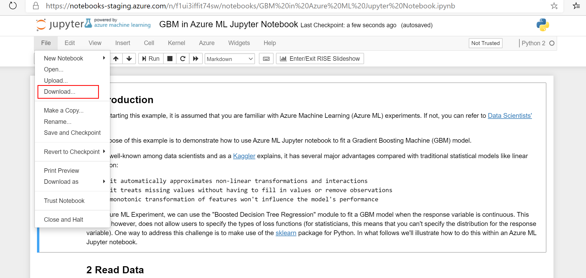
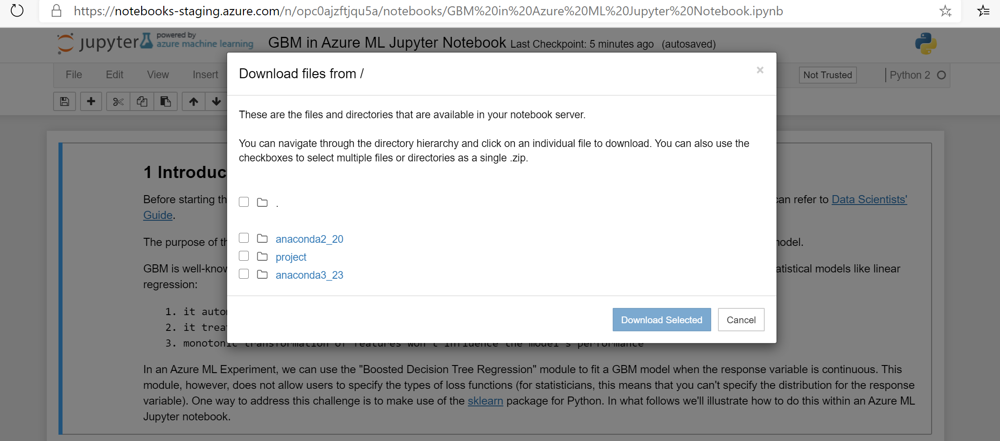

---
title: How to download notebooks(preview) data
titleSuffix: ML Studio (classic) - Azure
description: How to download notebooks(preview) data in ML Studio(classic). 
ms.service: machine-learning
ms.subservice: studio
ms.topic: how-to

author: xiaoharper
ms.author: amlstudiodocs
ms.date: 03/04/2020

# Download notebooks(preview) data

The notebooks(preview) feature will be shut down on April 13 2020. After shut down, the notebooks(preview) tab will disappear and the notebooks data cannot be restored. Please download your notebooks data before April 13 2020.

This article provides a step by step guidance on how to download Notebooks(preview) data.

1. Go to Notebooks(preview) tab in Azure Machine Learning Studio(classic)

2. Click a notebook you want to download. It will open in Jupyter. 

3. Go to *Files* -> *Download...*. It may take about 1-2 minutes to retrieve the file list in the download pop-up at first time.

4. The pop-up dialog shows all files associated to current notebook. Select the files you want to download in the popup.

You can also go to *Files* -> *Download as* to download the notebook file. 
