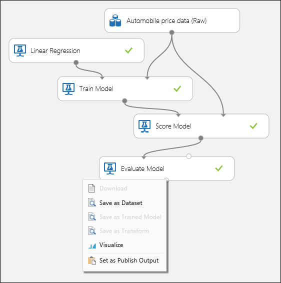
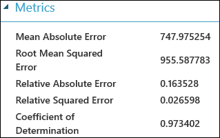
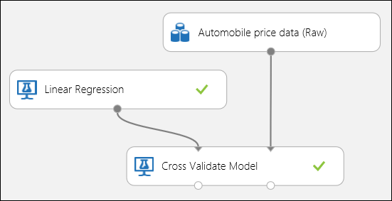
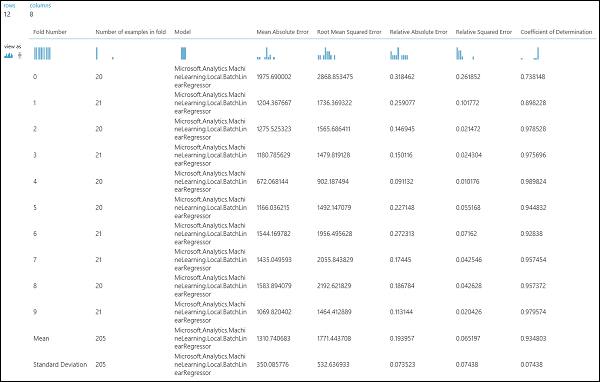
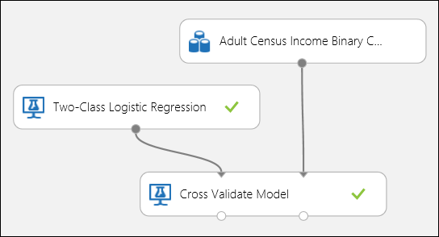
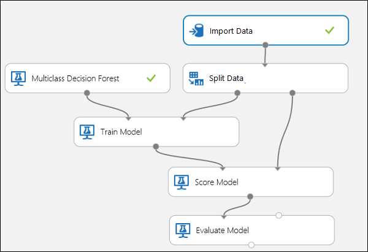
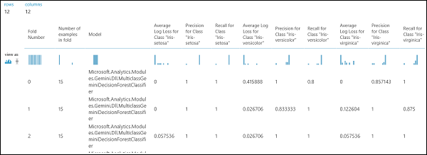

# How to evaluate model performance in Azure Machine Learning Studio

This article demonstrates how to evaluate the performance of a model in Azure Machine Learning Studio and provides a brief explanation of the metrics available for this task. Three common supervised learning scenarios are presented: 

* regression
* binary classification 
* multiclass classification

Evaluating the performance of a model is one of the core stages in the data science process. It indicates how successful the scoring (predictions) of a dataset has been by a trained model. 

Azure Machine Learning Studio supports model evaluation through two of its main machine learning modules: [Evaluate Model][evaluate-model] and [Cross-Validate Model][cross-validate-model]. These modules allow you to see how your model performs in terms of a number of metrics that are commonly used in machine learning and statistics.

## Evaluation vs. Cross Validation
Evaluation and cross validation are standard ways to measure the performance of your model. They both generate evaluation metrics that you can inspect or compare against those of other models.

[Evaluate Model][evaluate-model] expects a scored dataset as input (or 2 in case you would like to compare the performance of two different models). This means that you need to train your model using the [Train Model][train-model] module and make predictions on some dataset using the [Score Model][score-model] module, before you can evaluate the results. The evaluation is based on the scored labels/probabilities along with the true labels, all of which are output by the [Score Model][score-model] module.

Alternatively, you can use cross validation to perform a number of train-score-evaluate operations (10 folds) automatically on different subsets of the input data. The input data is split into 10 parts, where one is reserved for testing, and the other 9 for training. This process is repeated 10 times and the evaluation metrics are averaged. This helps in determining how well a model would generalize to new datasets. The [Cross-Validate Model][cross-validate-model] module takes in an untrained model and some labeled dataset and outputs the evaluation results of each of the 10 folds, in addition to the averaged results.

In the following sections, we will build simple regression and classification models and evaluate their performance, using both the [Evaluate Model][evaluate-model] and the [Cross-Validate Model][cross-validate-model] modules.

## Evaluating a Regression Model
Assume we want to predict a car’s price using some features such as dimensions, horsepower, engine specs, and so on. This is a typical regression problem, where the target variable (*price*) is a continuous numeric value. We can fit a simple linear regression model that, given the feature values of a certain car, can predict the price of that car. This regression model can be used to score the same dataset we trained on. Once we have the predicted prices for all of the cars, we can evaluate the performance of the model by looking at how much the predictions deviate from the actual prices on average. To illustrate this, we use the *Automobile price data (Raw) dataset* available in the **Saved Datasets** section in Azure Machine Learning Studio.

### Creating the Experiment
Add the following modules to your workspace in Azure Machine Learning Studio:

* Automobile price data (Raw)
* [Linear Regression][linear-regression]
* [Train Model][train-model]
* [Score Model][score-model]
* [Evaluate Model][evaluate-model]

Connect the ports as shown below in Figure 1 and set the Label column of the [Train Model][train-model] module to *price*.

Figure 1. Evaluating a Regression Model.

### Inspecting the Evaluation Results
After running the experiment, you can click on the output port of the [Evaluate Model][evaluate-model] module and select *Visualize* to see the evaluation results. The evaluation metrics available for regression models are: *Mean Absolute Error*, *Root Mean Absolute Error*, *Relative Absolute Error*, *Relative Squared Error*, and the *Coefficient of Determination*.

The term "error" here represents the difference between the predicted value and the true value. The absolute value or the square of this difference is usually computed to capture the total magnitude of error across all instances, as the difference between the predicted and true value could be negative in some cases. The error metrics measure the predictive performance of a regression model in terms of the mean deviation of its predictions from the true values. Lower error values mean the model is more accurate in making predictions. An overall error metric of zero means that the model fits the data perfectly.

The coefficient of determination, which is also known as R squared, is also a standard way of measuring how well the model fits the data. It can be interpreted as the proportion of variation explained by the model. A higher proportion is better in this case, where 1 indicates a perfect fit.

Figure 2. Linear Regression Evaluation Metrics.

### Using Cross Validation
As mentioned earlier, you can perform repeated training, scoring, and evaluations automatically using the [Cross-Validate Model][cross-validate-model] module. All you need in this case is a dataset, an untrained model, and a [Cross-Validate Model][cross-validate-model] module (see figure below). You need to set the label column to *price* in the [Cross-Validate Model][cross-validate-model] module’s properties.

Figure 3. Cross-Validating a Regression Model.

After running the experiment, you can inspect the evaluation results by clicking on the right output port of the [Cross-Validate Model][cross-validate-model] module. This will provide a detailed view of the metrics for each iteration (fold), and the averaged results of each of the metrics (Figure 4).

Figure 4. Cross-Validation Results of a Regression Model.

## Evaluating a Binary Classification Model
In a binary classification scenario, the target variable has only two possible outcomes, for example: {0, 1} or {false, true}, {negative, positive}. Assume you are given a dataset of adult employees with some demographic and employment variables, and that you are asked to predict the income level, a binary variable with the values {“<=50 K”, “>50 K”}. In other words, the negative class represents the employees who make less than or equal to 50 K per year, and the positive class represents all other employees. As in the regression scenario, we would train a model, score some data, and evaluate the results. The main difference here is the choice of metrics Azure Machine Learning Studio computes and outputs. To illustrate the income level prediction scenario, we will use the [Adult](https://archive.ics.uci.edu/ml/datasets/Adult) dataset to create a Studio experiment and evaluate the performance of a two-class logistic regression model, a commonly used binary classifier.

### Creating the Experiment
Add the following modules to your workspace in Azure Machine Learning Studio:

* Adult Census Income Binary Classification dataset
* [Two-Class Logistic Regression][two-class-logistic-regression]
* [Train Model][train-model]
* [Score Model][score-model]
* [Evaluate Model][evaluate-model]

Connect the ports as shown below in Figure 5 and set the Label column of the [Train Model][train-model] module to *income*.

Figure 5. Evaluating a Binary Classification Model.

### Inspecting the Evaluation Results
After running the experiment, you can click on the output port of the [Evaluate Model][evaluate-model] module and select *Visualize* to see the evaluation results (Figure 7). The evaluation metrics available for binary classification models are: *Accuracy*, *Precision*, *Recall*, *F1 Score*, and *AUC*. In addition, the module outputs a confusion matrix showing the number of true positives, false negatives, false positives, and true negatives, as well as *ROC*, *Precision/Recall*, and *Lift* curves.

Accuracy is simply the proportion of correctly classified instances. It is usually the first metric you look at when evaluating a classifier. However, when the test data is unbalanced (where most of the instances belong to one of the classes), or you are more interested in the performance on either one of the classes, accuracy doesn’t really capture the effectiveness of a classifier. In the income level classification scenario, assume you are testing on some data where 99% of the instances represent people who earn less than or equal to 50K per year. It is possible to achieve a 0.99 accuracy by predicting the class “<=50K” for all instances. The classifier in this case appears to be doing a good job overall, but in reality, it fails to classify any of the high-income individuals (the 1%) correctly.

For that reason, it is helpful to compute additional metrics that capture more specific aspects of the evaluation. Before going into the details of such metrics, it is important to understand the confusion matrix of a binary classification evaluation. The class labels in the training set can take on only 2 possible values, which we usually refer to as positive or negative. The positive and negative instances that a classifier predicts correctly are called true positives (TP) and true negatives (TN), respectively. Similarly, the incorrectly classified instances are called false positives (FP) and false negatives (FN). The confusion matrix is simply a table showing the number of instances that fall under each of these 4 categories. Azure Machine Learning Studio automatically decides which of the two classes in the dataset is the positive class. If the class labels are Boolean or integers, then the ‘true’ or ‘1’ labeled instances are assigned the positive class. If the labels are strings, as in the case of the income dataset, the labels are sorted alphabetically and the first level is chosen to be the negative class while the second level is the positive class.

Figure 6. Binary Classification Confusion Matrix.

Going back to the income classification problem, we would want to ask several evaluation questions that help us understand the performance of the classifier used. A very natural question is: ‘Out of the individuals whom the model predicted to be earning >50K (TP+FP), how many were classified correctly (TP)?’ This question can be answered by looking at the **Precision** of the model, which is the proportion of positives that are classified correctly: TP/(TP+FP). Another common question is “Out of all the high earning employees with income >50k (TP+FN), how many did the classifier classify correctly (TP)”. This is actually the **Recall**, or the true positive rate: TP/(TP+FN) of the classifier. You might notice that there is an obvious trade-off between precision and recall. For example, given a relatively balanced dataset, a classifier that predicts mostly positive instances, would have a high recall, but a rather low precision as many of the negative instances would be misclassified resulting in a large number of false positives. To see a plot of how these two metrics vary, you can click on the **PRECISION/RECALL** curve in the evaluation result output page (top-left part of Figure 7).

Figure 7. Binary Classification Evaluation Results.

Another related metric that is often used is the **F1 Score**, which takes both precision and recall into consideration. It is the harmonic mean of these 2 metrics and is computed as such: F1 = 2 (precision x recall) / (precision + recall). The F1 score is a good way to summarize the evaluation in a single number, but it’s always a good practice to look at both precision and recall together to better understand how a classifier behaves.

In addition, one can inspect the true positive rate vs. the false positive rate in the **Receiver Operating Characteristic (ROC)** curve and the corresponding **Area Under the Curve (AUC)** value. The closer this curve is to the upper left corner, the better the classifier’s performance is (that is maximizing the true positive rate while minimizing the false positive rate). Curves that are close to the diagonal of the plot, result from classifiers that tend to make predictions that are close to random guessing.

### Using Cross Validation
As in the regression example, we can perform cross validation to repeatedly train, score and evaluate different subsets of the data automatically. Similarly, we can use the [Cross-Validate Model][cross-validate-model] module, an untrained logistic regression model, and a dataset. The label column must be set to *income* in the [Cross-Validate Model][cross-validate-model] module’s properties. After running the experiment and clicking on the right output port of the [Cross-Validate Model][cross-validate-model] module, we can see the binary classification metric values for each fold, in addition to the mean and standard deviation of each. 

Figure 8. Cross-Validating a Binary Classification Model.

Figure 9. Cross-Validation Results of a Binary Classifier.

## Evaluating a Multiclass Classification Model
In this experiment we will use the popular [Iris](https://archive.ics.uci.edu/ml/datasets/Iris "Iris") dataset which contains instances of 3 different types (classes) of the iris plant. There are 4 feature values (sepal length/width and petal length/width) for each instance. In the previous experiments we trained and tested the models using the same datasets. Here, we will use the [Split Data][split] module to create 2 subsets of the data, train on the first, and score and evaluate on the second. 
The Iris dataset is publicly available on the [UCI Machine Learning Repository](https://archive.ics.uci.edu/ml/index.html), and can be downloaded using an [Import Data][import-data] module.

### Creating the Experiment
Add the following modules to your workspace in Azure Machine Learning Studio:

* [Import Data][import-data]
* [Multiclass Decision Forest][multiclass-decision-forest]
* [Split Data][split]
* [Train Model][train-model]
* [Score Model][score-model]
* [Evaluate Model][evaluate-model]

Connect the ports as shown below in Figure 10.

Set the Label column index of the [Train Model][train-model] module to 5. The dataset has no header row but we know that the class labels are in the fifth column.

Click on the [Import Data][import-data] module and set the *Data source* property to *Web URL via HTTP*, and the *URL* to http://archive.ics.uci.edu/ml/machine-learning-databases/iris/iris.data.

Set the fraction of instances to be used for training in the [Split Data][split] module (0.7 for example).

Figure 10. Evaluating a Multiclass Classifier

### Inspecting the Evaluation Results
Run the experiment and click on the output port of [Evaluate Model][evaluate-model]. The evaluation results are presented in the form of a confusion matrix, in this case. The matrix shows the actual vs. predicted instances for all 3 classes.

Figure 11. Multiclass Classification Evaluation Results.

### Using Cross Validation
As mentioned earlier, you can perform repeated training, scoring and evaluations automatically using the [Cross-Validate Model][cross-validate-model] module. You would need a dataset, an untrained model, and a [Cross-Validate Model][cross-validate-model] module (see figure below). Again you need to set the label column of the [Cross-Validate Model][cross-validate-model] module (column index 5 in this case). After running the experiment and clicking the right output port of the [Cross-Validate Model][cross-validate-model], you can inspect the metric values for each fold as well as the mean and standard deviation. The metrics displayed here are the similar to the ones discussed in the binary classification case. However, note that in multiclass classification, computing the true positives/negatives and false positives/negatives is done by counting on a per-class basis, as there is no overall positive or negative class. For example, when computing the precision or recall of the ‘Iris-setosa’ class, it is assumed that this is the positive class and all others as negative.

Figure 12. Cross-Validating a Multiclass Classification Model.

Figure 13. Cross-Validation Results of a Multiclass Classification Model.

<!-- Module References -->
[cross-validate-model]: https://msdn.microsoft.com/library/azure/75fb875d-6b86-4d46-8bcc-74261ade5826/
[evaluate-model]: https://msdn.microsoft.com/library/azure/927d65ac-3b50-4694-9903-20f6c1672089/
[linear-regression]: https://msdn.microsoft.com/library/azure/31960a6f-789b-4cf7-88d6-2e1152c0bd1a/
[multiclass-decision-forest]: https://msdn.microsoft.com/library/azure/5e70108d-2e44-45d9-86e8-94f37c68fe86/
[import-data]: https://msdn.microsoft.com/library/azure/4e1b0fe6-aded-4b3f-a36f-39b8862b9004/
[score-model]: https://msdn.microsoft.com/library/azure/401b4f92-e724-4d5a-be81-d5b0ff9bdb33/
[split]: https://msdn.microsoft.com/library/azure/70530644-c97a-4ab6-85f7-88bf30a8be5f/
[train-model]: https://msdn.microsoft.com/library/azure/5cc7053e-aa30-450d-96c0-dae4be720977/
[two-class-logistic-regression]: https://msdn.microsoft.com/library/azure/b0fd7660-eeed-43c5-9487-20d9cc79ed5d/

