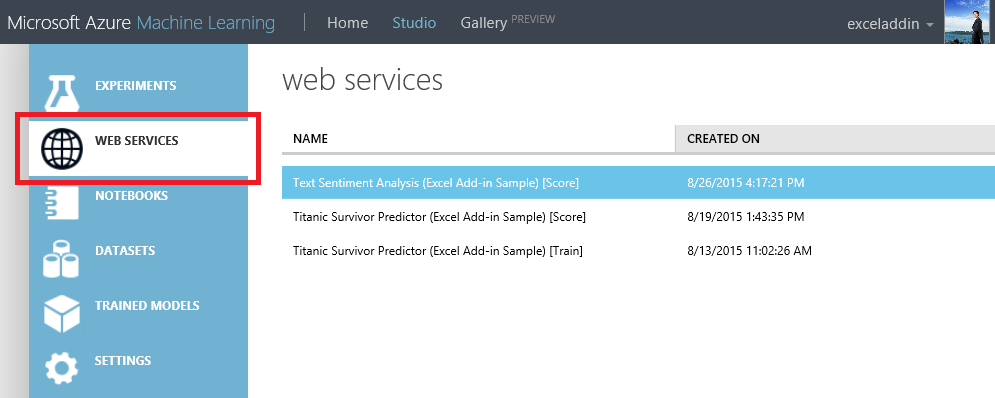
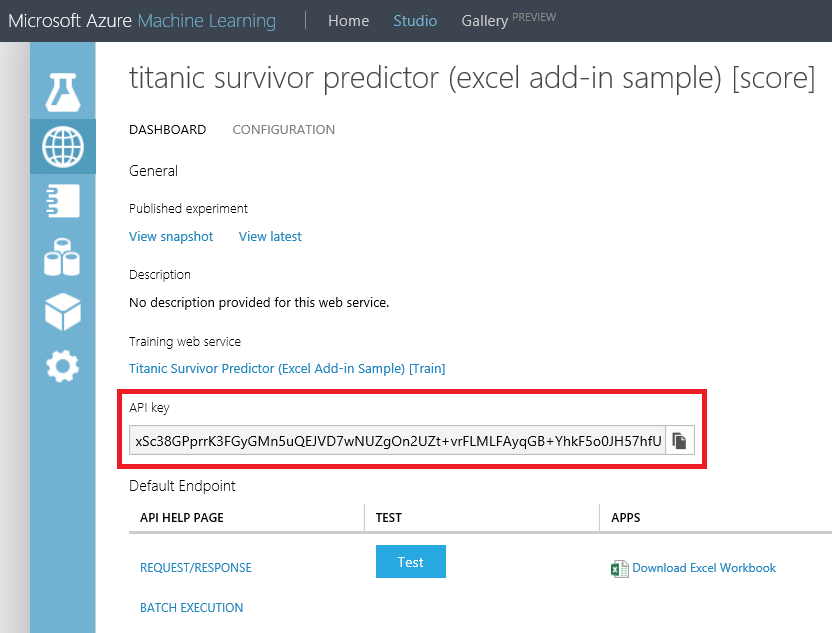
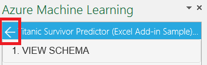
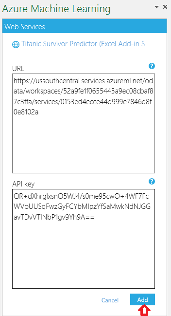

# Excel Add-in for Azure Machine Learning Studio web services
Excel makes it easy to call web services directly without the need to write any code.

## Steps to Use an Existing web service in the Workbook

1. Open the [sample Excel file](https://aka.ms/amlexcel-sample-2), which contains the Excel add-in and data about passengers on the Titanic. 
 
    > [!NOTE]
    > You will see the list of the Web Services related to the file and at the bottom a checkbox for "Auto-predict". If you enable auto-predict the predictions of **all** your services will be updated every time there is a change on the inputs. If unchecked you will have to click on "Predict All" for refresh. For enabling auto-predict at a service level go to step 6.

2. Choose the web service by clicking it - "Titanic Survivor Predictor (Excel Add-in Sample) [Score]" in this example.
   
    
3. This takes you to the **Predict** section.  This workbook already contains sample data, but for a blank workbook you can select a cell in Excel and click **Use sample data**.
4. Select the data with headers and click the input data range icon.  Make sure the "My data has headers" box is checked.
5. Under **Output**, enter the cell number where you want the output to be, for example "H1" here.
6. Click **Predict**. If you select the "auto-predict" checkbox any change on the selected areas (the ones specified as input) will trigger a request and an update of the output cells without the need for you to press the predict button.
   
    

Deploy a web service or use an existing Web service. For more information on deploying a web service, see [Tutorial 3: Deploy credit risk model](tutorial-part3-credit-risk-deploy.md).

Get the API key for your web service. Where you perform this action depends on whether you published a Classic Machine Learning web service of a New Machine Learning web service.

**Use a Classic web service** 

1. In Machine Learning Studio, click the **WEB SERVICES** section in the left pane, and then select the web service.
   
    
2. Copy the API key for the web service.
   
    
3. On the **DASHBOARD** tab for the web service, click the **REQUEST/RESPONSE** link.
4. Look for the **Request URI** section.  Copy and save the URL.

> [!NOTE]
> It is now possible to sign into the [Azure Machine Learning Web Services](https://services.azureml.net) portal to obtain the API key for a Classic Machine Learning web service.
> 
> 

**Use a New web service**

1. In the [Azure Machine Learning Web Services](https://services.azureml.net) portal, click **Web Services**, then select your web service. 
2. Click **Consume**.
3. Look for the **Basic consumption info** section. Copy and save the **Primary Key** and the **Request-Response** URL.

## Steps to Add a New web service

1. Deploy a web service or use an existing Web service. For more information on deploying a web service, see [Tutorial 3: Deploy credit risk model](tutorial-part3-credit-risk-deploy.md).
2. Click **Consume**.
3. Look for the **Basic consumption info** section. Copy and save the **Primary Key** and the **Request-Response** URL.
4. In Excel, go to the **Web Services** section (if you are in the **Predict** section, click the back arrow to go to the list of web services).
   
    
5. Click **Add Web Service**.
6. Paste the URL into the Excel add-in text box labeled **URL**.
7. Paste the API/Primary key into the text box labeled **API key**.
8. Click **Add**.
   
    
9. To use the web service, follow the preceding directions, "Steps to Use an Existing web Service."

## Sharing Your Workbook
If you save your workbook, then the API/Primary key for the web services you have added is also saved. That means you should only share the workbook with individuals you trust.

Ask any questions in the following comment section or on our [forum](https://go.microsoft.com/fwlink/?LinkID=403669&clcid=0x409).
