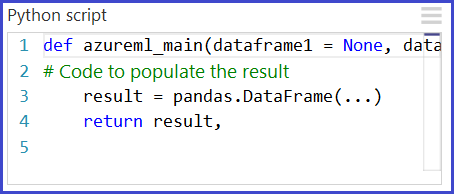
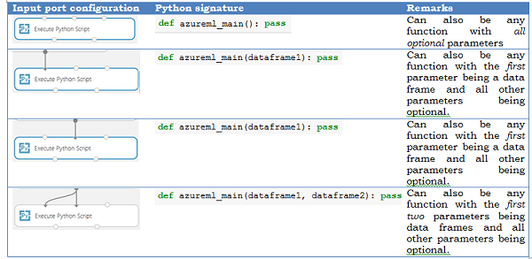
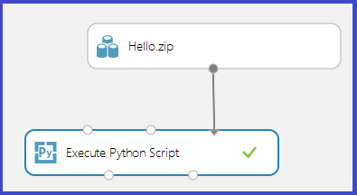
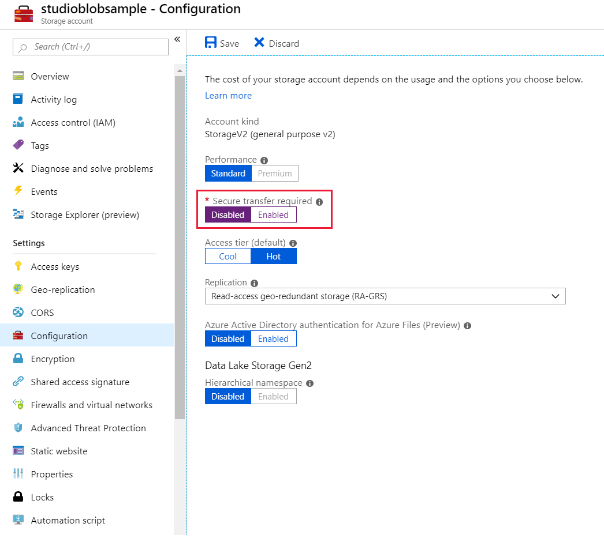
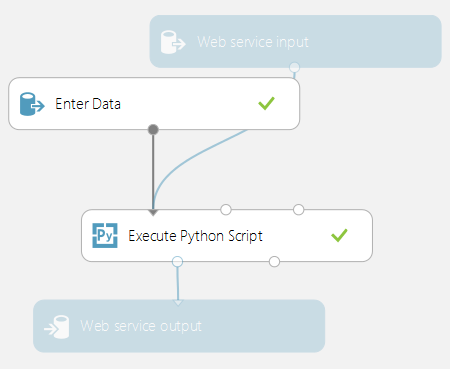
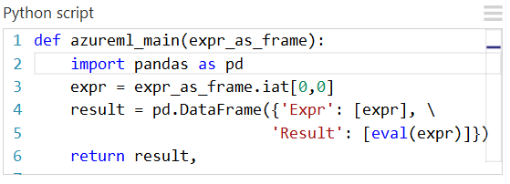
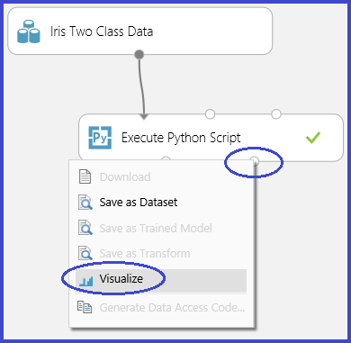
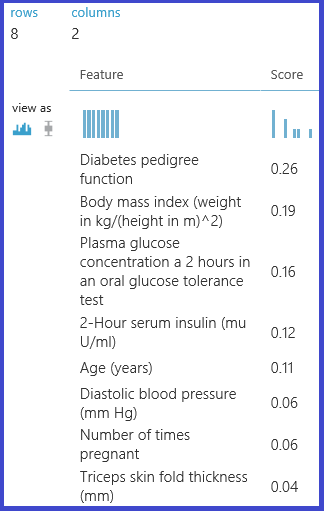

# Execute Python machine learning scripts in Azure Machine Learning Studio (classic)

Python is a valuable tool in the tool chest of many data scientists. It's used in every stage of typical machine learning workflows including data exploration, feature extraction, model training and validation, and deployment.

This article describes how you can use the Execute Python Script module to use Python code in your Azure Machine Learning Studio (classic) experiments and web services.

## Using the Execute Python Script module

The primary interface to Python in Studio (classic) is through the [Execute Python Script][execute-python-script] module. It accepts up to three inputs and produces up to two outputs, similar to the [Execute R Script][execute-r-script] module. Python code is entered into the parameter box through a specially named entry-point function called `azureml_main`.




### Input parameters

Inputs to the Python module are exposed as Pandas DataFrames. The `azureml_main` function accepts up to two optional Pandas DataFrames as parameters.

The mapping between input ports and function parameters is positional:

- The first connected input port is mapped to the first parameter of the function.
- The second input (if connected) is mapped to the second parameter of the function.
- The third input is used to [import additional Python modules](#import-modules).

More detailed semantics of how the input ports get mapped to parameters of the `azureml_main` function are shown below.



### Output return values

The `azureml_main` function must return a single Pandas DataFrame packaged in a Python [sequence](https://docs.python.org/2/c-api/sequence.html) such as a tuple, list, or NumPy array. The first element of this sequence is returned to the first output port of the module. The second output port of the module is used for [visualizations](#visualizations) and does not require a return value. This scheme is shown below.


## Translation of input and output data types

Studio datasets are not the same as Panda DataFrames. As a result, input datasets in Studio (classic) are converted to Pandas DataFrame, and output DataFrames are converted back to Studio (classic) datasets. During this conversion process, the following translations are also performed:

 **Python data type** | **Studio translation procedure** |
| --- | --- |
| Strings and numerics| Translated as is |
| Pandas 'NA' | Translated as 'Missing value' |
| Index vectors | Unsupported* |
| Non-string column names | Call `str` on column names |
| Duplicate column names | Add numeric suffix: (1), (2), (3), and so on.

**All input data frames in the Python function always have a 64-bit numerical index from 0 to the number of rows minus 1*

## <a id="import-modules"></a>Importing existing Python script modules

The backend used to execute Python is based on [Anaconda](https://www.anaconda.com/distribution/), a widely used scientific Python distribution. It comes with close to 200 of the most common Python packages used in data-centric workloads. Studio (classic) does not currently support the use of package management systems like Pip or Conda to install and manage external libraries.  If you find the need to incorporate additional libraries, use the following scenario as a guide.

A common use-case is to incorporate existing Python scripts into Studio (classic) experiments. The [Execute Python Script][execute-python-script] module accepts a zip file containing Python modules at the third input port. The file is unzipped by the execution framework at runtime and the contents are added to the library path of the Python interpreter. The `azureml_main` entry point function can then import these modules directly. 

As an example, consider the file Hello.py containing a simple "Hello, World" function.


Next, we create a file Hello.zip that contains Hello.py:


Upload the zip file as a dataset into Studio (classic). Then create and run an experiment that uses the Python code in the Hello.zip file by attaching it to the third input port of the **Execute Python Script** module as shown in the following image.




The module output shows that the zip file has been unpackaged and that the function `print_hello` has been run.


## Accessing Azure Storage Blobs

You can access data stored in an Azure Blob Storage account using these steps:

1. Download the [Azure Blob Storage package for Python](https://azuremlpackagesupport.blob.core.windows.net/python/azure.zip) locally.
1. Upload the zip file to your Studio (classic) workspace as a dataset.
1. Create your BlobService object with `protocol='http'`

```
from azure.storage.blob import BlockBlobService

# Create the BlockBlockService that is used to call the Blob service for the storage account
block_blob_service = BlockBlobService(account_name='account_name', account_key='account_key', protocol='http')
```

1. Disable **Secure transfer required** in your Storage **Configuration** setting tab



## Operationalizing Python scripts

Any [Execute Python Script][execute-python-script] modules used in a scoring experiment are called when published as a web service. For example, the image below shows a scoring experiment that contains the code to evaluate a single Python expression.





A web service created from this experiment would take the following actions:

1. Take a Python expression as input (as a string)
1. Send the Python expression to the Python interpreter
1. Returns a table containing both the expression and the evaluated result.

## <a id="visualizations"></a>Working with visualizations

Plots created using MatplotLib can be returned by the [Execute Python Script][execute-python-script]. However, plots aren't automatically redirected to images as they are when using R. So the user must explicitly save any plots to PNG files.

To generate images from MatplotLib, you must take the following steps:

1. Switch the backend to "AGG" from the default Qt-based renderer.
1. Create a new figure object.
1. Get the axis and generate all plots into it.
1. Save the figure to a PNG file.

This process is illustrated in the following images that create a scatter plot matrix using the scatter_matrix function in Pandas.





It's possible to return multiple figures by saving them into different images. Studio (classic) runtime picks up all images and concatenates them for visualization.

## Advanced examples

The Anaconda environment installed in Studio (classic) contains common packages such as NumPy, SciPy, and Scikits-Learn. These packages can be effectively used for data processing in a machine learning pipeline.

For example, the following experiment and script illustrate the use of ensemble learners in Scikits-Learn to compute feature importance scores for a dataset. The scores can be used to perform supervised feature selection before being fed into another model.

Here is the Python function used to compute the importance scores and order the features based on the scores:


The following experiment then computes and returns the importance scores of features in the "Pima Indian Diabetes" dataset in Azure Machine Learning Studio (classic):




## Limitations

The [Execute Python Script][execute-python-script] module currently has the following limitations:

### Sandboxed execution

The Python runtime is currently sandboxed and doesn't allow access to the network or the local file system in a persistent manner. All files saved locally are isolated and deleted once the module finishes. The Python code cannot access most directories on the machine it runs on, the exception being the current directory and its subdirectories.

### Lack of sophisticated development and debugging support

The Python module currently does not support IDE features such as intellisense and debugging. Also, if the module fails at runtime, the full Python stack trace is available. But it must be viewed in the output log for the module. We currently recommend that you develop and debug Python scripts in an environment such as IPython and then import the code into the module.

### Single data frame output

The Python entry point is only permitted to return a single data frame as output. It is not currently possible to return arbitrary Python objects such as trained models directly back to the Studio (classic) runtime. Like [Execute R Script][execute-r-script], which has the same limitation, it is possible in many cases to pickle objects into a byte array and then return that inside of a data frame.

### Inability to customize Python installation

Currently, the only way to add custom Python modules is via the zip file mechanism described earlier. While this is feasible for small modules, it's cumbersome for large modules (especially modules with native DLLs) or a large number of modules.

## Next steps

For more information, see the [Python Developer Center](https://azure.microsoft.com/develop/python/).

<!-- Module References -->
[execute-python-script]: https://docs.microsoft.com/azure/machine-learning/studio-module-reference/execute-python-script
[execute-r-script]: https://docs.microsoft.com/azure/machine-learning/studio-module-reference/execute-r-script
