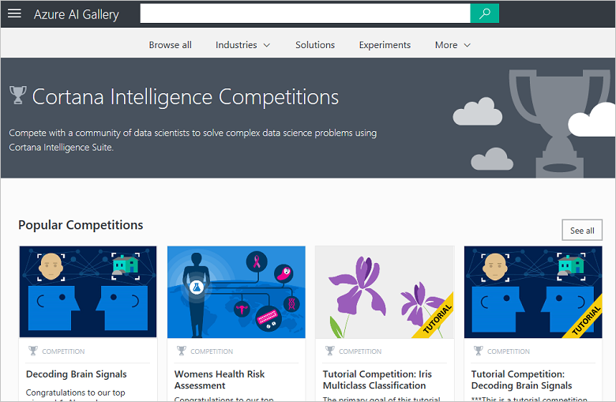
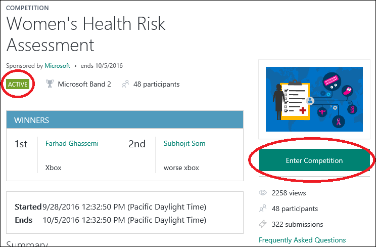

# Discover competitions in the Azure AI Gallery
[!INCLUDE [machine-learning-gallery-item-selector](../../../includes/machine-learning-gallery-item-selector.md)]

## Cortana Intelligence Competitions
**[Competitions](https://gallery.cortanaintelligence.com/competitions)**
provide an exciting opportunity to compete with the community of data scientists to solve complex problems using Cortana Intelligence Suite.

For answers to frequently-asked questions about Competitions, see [Microsoft Cortana Intelligence Competitions FAQ](competition-faq.md).

## Discover
The
**[Competitions](https://gallery.cortanaintelligence.com/competitions)**
 page ([aka.ms/CIComp](http://aka.ms/CIComp)) displays a list of the most popular
competitions.

 
 Click **See all** to view all
competitions.
 From this page, you can browse all the
competitions
 in the Gallery. You also can search by selecting filter criteria on the left of the page and entering search terms at the top.

 Click any
competition
 to open the
competition's
 details page and read more information. On this page you can comment, provide feedback, or ask questions through the comments section. You can even share it with friends or colleagues using the share capabilities of LinkedIn or Twitter. You can also email a link to the
competition
 to invite other users to view the page.

## Enter a competition
If the competition is open, the status on the details page is **Active**. To enter the competition, click **Enter Competition** and you will be given instructions on the resources you need and the steps you need to take.

If the competition has been completed, then a list of winners is shown.

**[TAKE ME TO THE GALLERY >>](http://gallery.cortanaintelligence.com)**

[!INCLUDE [machine-learning-free-trial](../../../includes/machine-learning-free-trial.md)]

