# Interpret model results in Azure Machine Learning Studio
This topic explains how to visualize and interpret prediction results in Azure Machine Learning Studio. After you have trained a model and done predictions on top of it ("scored the model"), you need to understand and interpret the prediction result.

There are four major kinds of machine learning models in Azure Machine Learning Studio:

* Classification
* Clustering
* Regression
* Recommender systems

The modules used for prediction on top of these models are:

* [Score Model][score-model] module for classification and regression
* [Assign to Clusters][assign-to-clusters] module for clustering
* [Score Matchbox Recommender][score-matchbox-recommender] for recommendation systems

This document explains how to interpret prediction results for each of these modules. For an overview of these modules, see [How to choose parameters to optimize your algorithms in Azure Machine Learning Studio](algorithm-parameters-optimize.md).

This topic addresses prediction interpretation but not model evaluation. For more information about how to evaluate your model, see [How to evaluate model performance in Azure Machine Learning Studio](evaluate-model-performance.md).

If you are new to Azure Machine Learning Studio and need help creating a simple experiment to get started, see [Create a simple experiment in Azure Machine Learning Studio](create-experiment.md) in Azure Machine Learning Studio.

## Classification
There are two subcategories of classification problems:

* Problems with only two classes (two-class or binary classification)
* Problems with more than two classes (multi-class classification)

Azure Machine Learning Studio has different modules to deal with each of these types of classification, but the methods for interpreting their prediction results are similar.

### Two-class classification
**Example experiment**

An example of a two-class classification problem is the classification of iris flowers. The task is to classify iris flowers based on their features. The Iris data set provided in Azure Machine Learning Studio is a subset of the popular [Iris data set](https://en.wikipedia.org/wiki/Iris_flower_data_set) containing instances of only two flower species (classes 0 and 1). There are four features for each flower (sepal length, sepal width, petal length, and petal width).

Figure 1. Iris two-class classification problem experiment

An experiment has been performed to solve this problem, as shown in Figure 1. A two-class boosted decision tree model has been trained and scored. Now you can visualize the prediction results from the [Score Model][score-model] module by clicking the output port of the [Score Model][score-model] module and then clicking **Visualize**.

This brings up the scoring results as shown in Figure 2.

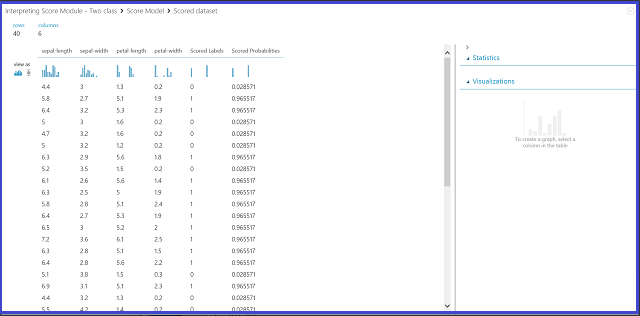

Figure 2. Visualize a score model result in two-class classification

**Result interpretation**

There are six columns in the results table. The left four columns are the four features. The right two columns, Scored Labels and Scored Probabilities, are the prediction results. The Scored Probabilities column shows the probability that a flower belongs to the positive class (Class 1). For example, the first number in the column (0.028571) means there is 0.028571 probability that the first flower belongs to Class 1. The Scored Labels column shows the predicted class for each flower. This is based on the Scored Probabilities column. If the scored probability of a flower is larger than 0.5, it is predicted as Class 1. Otherwise, it is predicted as Class 0.

**Web service publication**

After the prediction results have been understood and judged sound, the experiment can be published as a web service so that you can deploy it in various applications and call it to obtain class predictions on any new iris flower. To learn how to change a training experiment into a scoring experiment and publish it as a web service, see [Tutorial 3: Deploy credit risk model](tutorial-part3-credit-risk-deploy.md). This procedure provides you with a scoring experiment as shown in Figure 3.

Figure 3. Scoring the iris two-class classification problem experiment

Now you need to set the input and output for the web service. The input is the right input port of [Score Model][score-model], which is the Iris flower features input. The choice of the output depends on whether you are interested in the predicted class (scored label), the scored probability, or both. In this example, it is assumed that you are interested in both. To select the desired output columns, use a [Select Columns in Data set][select-columns] module. Click [Select Columns in Data set][select-columns], click **Launch column selector**, and select **Scored Labels** and **Scored Probabilities**. After setting the output port of [Select Columns in Data set][select-columns] and running it again, you should be ready to publish the scoring experiment as a web service by clicking **PUBLISH WEB SERVICE**. The final experiment looks like Figure 4.

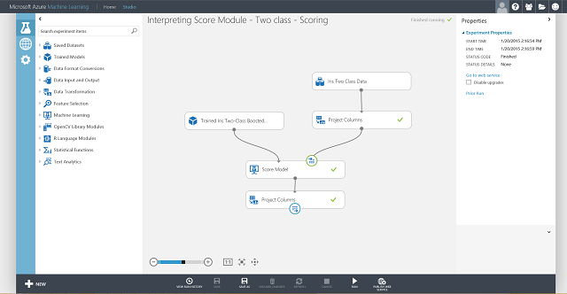

Figure 4. Final scoring experiment of an iris two-class classification problem

After you run the web service and enter some feature values of a test instance, the result returns two numbers. The first number is the scored label, and the second is the scored probability. This flower is predicted as Class 1 with 0.9655 probability.

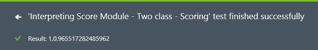

Figure 5. Web service result of iris two-class classification

### Multi-class classification
**Example experiment**

In this experiment, you perform a letter-recognition task as an example of multiclass classification. The classifier attempts to predict a certain letter (class) based on some hand-written attribute values extracted from the hand-written images.

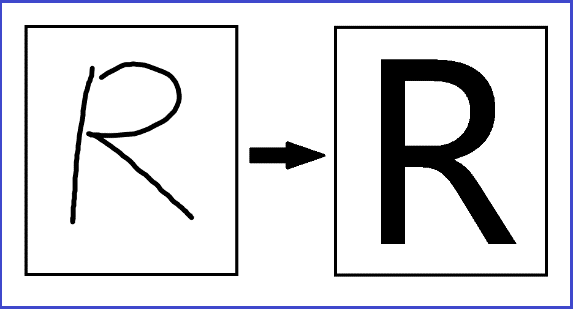

In the training data, there are 16 features extracted from hand-written letter images. The 26 letters form our 26 classes. Figure 6 shows an experiment that will train a multiclass classification model for letter recognition and predict on the same feature set on a test data set.

Figure 6. Letter recognition multiclass classification problem experiment

Visualizing the results from the [Score Model][score-model] module by clicking the output port of [Score Model][score-model] module and then clicking **Visualize**, you should see content as shown in Figure 7.

Figure 7. Visualize score model results in a multi-class classification

**Result interpretation**

The left 16 columns represent the feature values of the test set. The columns with names like Scored Probabilities for Class "XX" are just like the Scored Probabilities column in the two-class case. They show the probability that the corresponding entry falls into a certain class. For example, for the first entry, there is 0.003571 probability that it is an “A,” 0.000451 probability that it is a “B,” and so forth. The last column (Scored Labels) is the same as Scored Labels in the two-class case. It selects the class with the largest scored probability as the predicted class of the corresponding entry. For example, for the first entry, the scored label is “F” since it has the largest probability to be an “F” (0.916995).

**Web service publication**

You can also get the scored label for each entry and the probability of the scored label. The basic logic is to find the largest probability among all the scored probabilities. To do this, you need to use the [Execute R Script][execute-r-script] module. The R code is shown in Figure 8, and the result of the experiment is shown in Figure 9.

Figure 8. R code for extracting Scored Labels and the associated probabilities of the labels

Figure 9. Final scoring experiment of the letter-recognition multiclass classification problem

After you publish and run the web service and enter some input feature values, the returned result looks like Figure 10. This hand-written letter, with its extracted 16 features, is predicted to be a “T” with 0.9715 probability.

Figure 10. Web service result of multiclass classification

## Regression
Regression problems are different from classification problems. In a classification problem, you're trying to predict discrete classes, such as which class an iris flower belongs to. But as you can see in the following example of a regression problem, you're trying to predict a continuous variable, such as the price of a car.

**Example experiment**

Use automobile price prediction as your example for regression. You are trying to predict the price of a car based on its features, including make, fuel type, body type, and drive wheel. The experiment is shown in Figure 11.

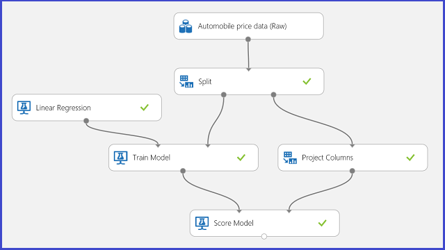

Figure 11. Automobile price regression problem experiment

Visualizing the [Score Model][score-model] module, the result looks like Figure 12.

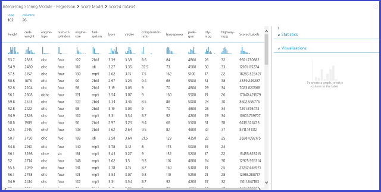

Figure 12. Scoring result for the automobile price prediction problem

**Result interpretation**

Scored Labels is the result column in this scoring result. The numbers are the predicted price for each car.

**Web service publication**

You can publish the regression experiment into a web service and call it for automobile price prediction in the same way as in the two-class classification use case.

Figure 13. Scoring experiment of an automobile price regression problem

Running the web service, the returned result looks like Figure 14. The predicted price for this car is $15,085.52.

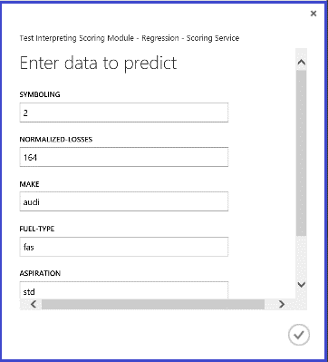

Figure 14. Web service result of an automobile price regression problem

## Clustering
**Example experiment**

Let’s use the Iris data set again to build a clustering experiment. Here you can filter out the class labels in the data set so that it only has features and can be used for clustering. In this iris use case, specify the number of clusters to be two during the training process, which means you would cluster the flowers into two classes. The experiment is shown in Figure 15.

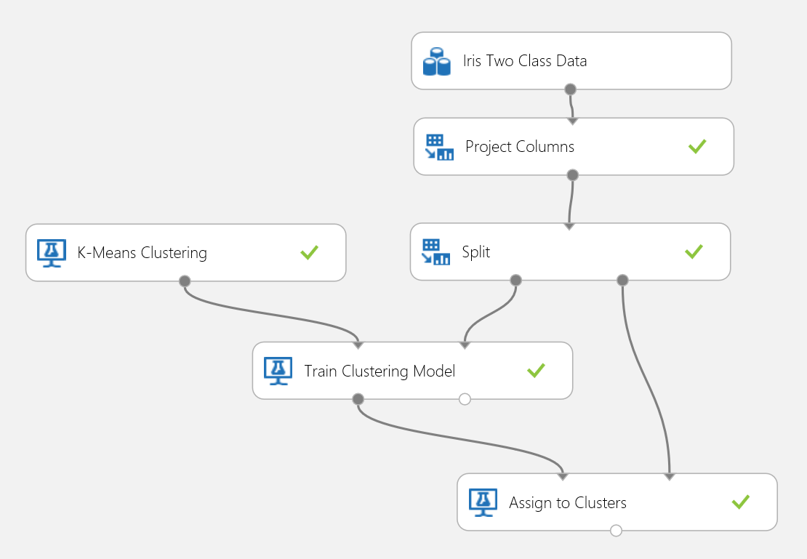

Figure 15. Iris clustering problem experiment

Clustering differs from classification in that the training data set doesn’t have ground-truth labels by itself. Clustering groups the training data set instances into distinct clusters. During the training process, the model labels the entries by learning the differences between their features. After that, the trained model can be used to further classify future entries. There are two parts of the result we are interested in within a clustering problem. The first part is labeling the training data set, and the second is classifying a new data set with the trained model.

The first part of the result can be visualized by clicking the left output port of [Train Clustering Model][train-clustering-model] and then clicking **Visualize**. The visualization is shown in Figure 16.

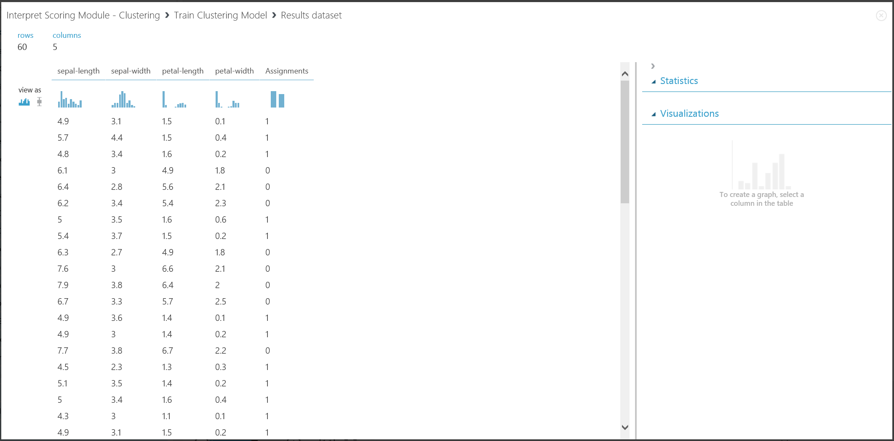

Figure 16. Visualize clustering result for the training data set

The result of the second part, clustering new entries with the trained clustering model, is shown in Figure 17.

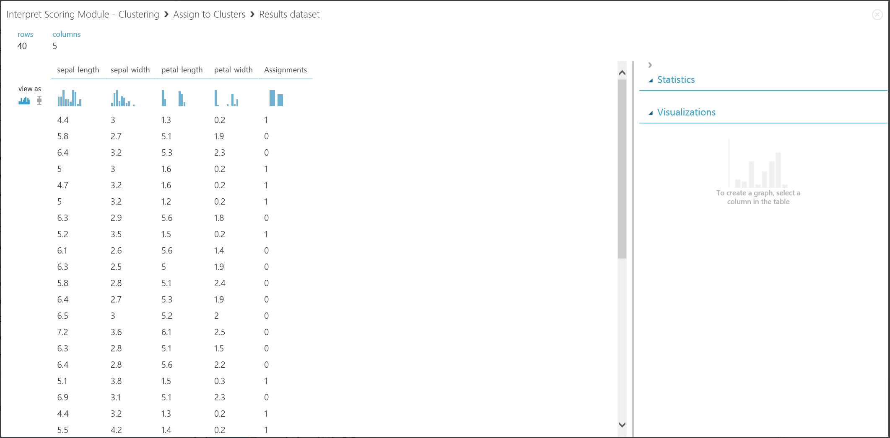

Figure 17. Visualize clustering result on a new data set

**Result interpretation**

Although the results of the two parts stem from different experiment stages, they look the same and are interpreted in the same way. The first four columns are features. The last column, Assignments, is the prediction result. The entries assigned the same number are predicted to be in the same cluster, that is, they share similarities in some way (this experiment uses the default Euclidean distance metric). Because you specified the number of clusters to be 2, the entries in Assignments are labeled either 0 or 1.

**Web service publication**

You can publish the clustering experiment into a web service and call it for clustering predictions the same way as in the two-class classification use case.

Figure 18. Scoring experiment of an iris clustering problem

After you run the web service, the returned result looks like Figure 19. This flower is predicted to be in cluster 0.

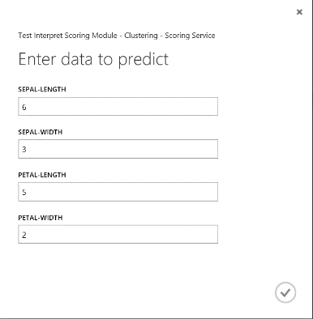

Figure 19. Web service result of iris two-class classification

## Recommender system
**Example experiment**

For recommender systems, you can use the restaurant recommendation problem as an example: you can recommend restaurants for customers based on their rating history. The input data consists of three parts:

* Restaurant ratings from customers
* Customer feature data
* Restaurant feature data

There are several things we can do with the [Train Matchbox Recommender][train-matchbox-recommender] module in Azure Machine Learning Studio:

* Predict ratings for a given user and item
* Recommend items to a given user
* Find users related to a given user
* Find items related to a given item

You can choose what you want to do by selecting from the four options in the **Recommender prediction kind** menu. Here you can walk through all four scenarios.

A typical Azure Machine Learning Studio experiment for a recommender system looks like Figure 20. For information about how to use those recommender system modules, see [Train matchbox recommender][train-matchbox-recommender] and [Score matchbox recommender][score-matchbox-recommender].

Figure 20. Recommender system experiment

**Result interpretation**

**Predict ratings for a given user and item**

By selecting **Rating Prediction** under **Recommender prediction kind**, you are asking the recommender system to predict the rating for a given user and item. The visualization of the [Score Matchbox Recommender][score-matchbox-recommender] output looks like Figure 21.

Figure 21. Visualize the score result of the recommender system--rating prediction

The first two columns are the user-item pairs provided by the input data. The third column is the predicted rating of a user for a certain item. For example, in the first row, customer U1048 is predicted to rate restaurant 135026 as 2.

**Recommend items to a given user**

By selecting **Item Recommendation** under **Recommender prediction kind**, you're asking the recommender system to recommend items to a given user. The last parameter to choose in this scenario is *Recommended item selection*. The option **From Rated Items (for model evaluation)** is primarily for model evaluation during the training process. For this prediction stage, we choose **From All Items**. The visualization of the [Score Matchbox Recommender][score-matchbox-recommender] output looks like Figure 22.

Figure 22. Visualize score result of the recommender system--item recommendation

The first of the six columns represents the given user IDs to recommend items for, as provided by the input data. The other five columns represent the items recommended to the user in descending order of relevance. For example, in the first row, the most recommended restaurant for customer U1048 is 134986, followed by 135018, 134975, 135021, and 132862.

**Find users related to a given user**

By selecting **Related Users** under **Recommender prediction kind**, you're asking the recommender system to find related users to a given user. Related users are the users who have similar preferences. The last parameter to choose in this scenario is *Related user selection*. The option **From Users That Rated Items (for model evaluation)** is primarily for model evaluation during the training process. Choose **From All Users** for this prediction stage. The visualization of the [Score Matchbox Recommender][score-matchbox-recommender] output looks like Figure 23.

Figure 23. Visualize score results of the recommender system--related users

The first of the six columns shows the given user IDs needed to find related users, as provided by input data. The other five columns store the predicted related users of the user in descending order of relevance. For example, in the first row, the most relevant customer for customer U1048 is U1051, followed by U1066, U1044, U1017, and U1072.

**Find items related to a given item**

By selecting **Related Items** under **Recommender prediction kind**, you are asking the recommender system to find related items to a given item. Related items are the items most likely to be liked by the same user. The last parameter to choose in this scenario is *Related item selection*. The option **From Rated Items (for model evaluation)** is primarily for model evaluation during the training process. We choose **From All Items** for this prediction stage. The visualization of the [Score Matchbox Recommender][score-matchbox-recommender] output looks like Figure 24.

Figure 24. Visualize score results of the recommender system--related items

The first of the six columns represents the given item IDs needed to find related items, as provided by the input data. The other five columns store the predicted related items of the item in descending order in terms of relevance. For example, in the first row, the most relevant item for item 135026 is 135074, followed by 135035, 132875, 135055, and 134992.

**Web service publication**

The process of publishing these experiments as web services to get predictions is similar for each of the four scenarios. Here we take the second scenario (recommend items to a given user) as an example. You can follow the same procedure with the other three.

Saving the trained recommender system as a trained model and filtering the input data to a single user ID column as requested, you can hook up the experiment as in Figure 25 and publish it as a web service.

Figure 25. Scoring experiment of the restaurant recommendation problem

Running the web service, the returned result looks like Figure 26. The five recommended restaurants for user U1048 are 134986, 135018, 134975, 135021, and 132862.

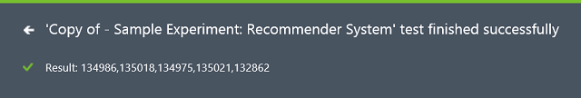

Figure 26. Web service result of restaurant recommendation problem

<!-- Module References -->
[assign-to-clusters]: https://msdn.microsoft.com/library/azure/eed3ee76-e8aa-46e6-907c-9ca767f5c114/
[execute-r-script]: https://msdn.microsoft.com/library/azure/30806023-392b-42e0-94d6-6b775a6e0fd5/
[select-columns]: https://msdn.microsoft.com/library/azure/1ec722fa-b623-4e26-a44e-a50c6d726223/
[score-matchbox-recommender]: https://msdn.microsoft.com/library/azure/55544522-9a10-44bd-884f-9a91a9cec2cd/
[score-model]: https://msdn.microsoft.com/library/azure/401b4f92-e724-4d5a-be81-d5b0ff9bdb33/
[train-clustering-model]: https://msdn.microsoft.com/library/azure/bb43c744-f7fa-41d0-ae67-74ae75da3ffd/
[train-matchbox-recommender]: https://msdn.microsoft.com/library/azure/fa4aa69d-2f1c-4ba4-ad5f-90ea3a515b4c/
