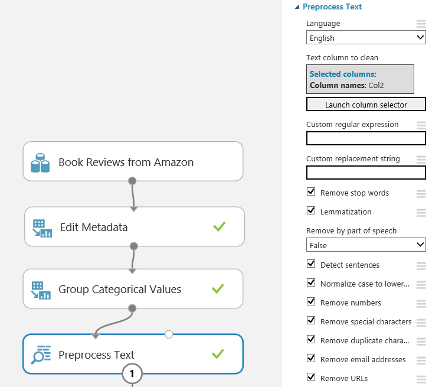
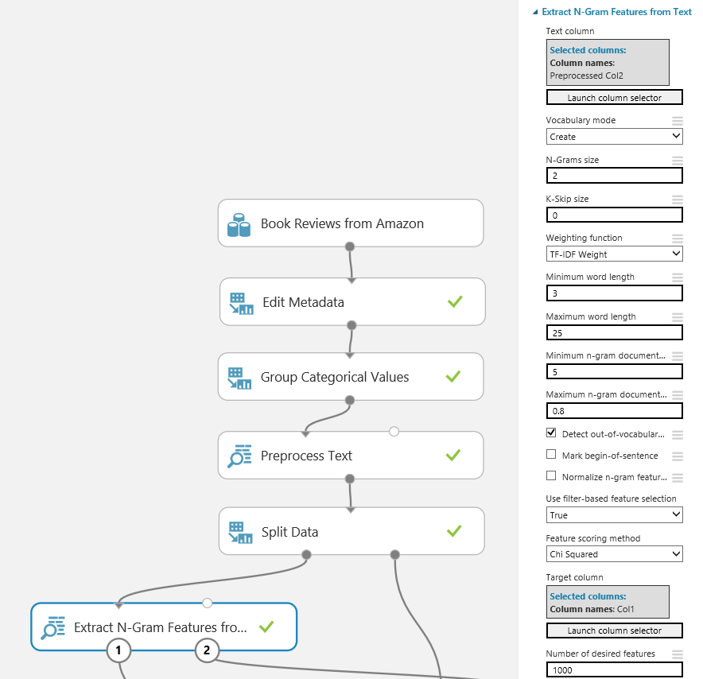

# Create a sentiment analysis model in Azure Machine Learning Studio

You can use Azure Machine Learning Studio to build and operationalize text analytics models. These models can help you solve, for example, document classification or sentiment analysis problems.

In a text analytics experiment, you would typically:

1. Clean and preprocess text dataset
2. Extract numeric feature vectors from pre-processed text
3. Train classification or regression model
4. Score and validate the model
5. Deploy the model to production

In this tutorial, you learn these steps as we walk through a sentiment analysis model using Amazon Book Reviews dataset (see this research paper “Biographies, Bollywood, Boom-boxes and Blenders: Domain Adaptation for Sentiment Classification” by John Blitzer, Mark Dredze, and Fernando Pereira; Association of Computational Linguistics (ACL), 2007.) This dataset consists of review scores (1-2 or 4-5) and a free-form text. The goal is to predict the review score: low (1-2) or high (4-5).

You can find experiments covered in this tutorial at Azure AI Gallery:

[Predict Book Reviews](https://gallery.azure.ai/Experiment/Predict-Book-Reviews-1)

[Predict Book Reviews - Predictive Experiment](https://gallery.azure.ai/Experiment/Predict-Book-Reviews-Predictive-Experiment-1)

## Step 1: Clean and preprocess text dataset
We begin the experiment by dividing the review scores into categorical low and high buckets to formulate the problem as two-class classification. We use [Edit Metadata](https://msdn.microsoft.com/library/azure/dn905986.aspx) and [Group Categorical Values](https://msdn.microsoft.com/library/azure/dn906014.aspx) modules.

Then, we clean the text using [Preprocess Text](https://msdn.microsoft.com/library/azure/mt762915.aspx) module. The cleaning reduces the noise in the dataset, help you find the most important features, and improve the accuracy of the final model. We remove stopwords - common words such as "the" or "a" - and numbers, special characters, duplicated characters, email addresses, and URLs. We also convert the text to lowercase, lemmatize the words, and detect sentence boundaries that are then indicated by "|||" symbol in pre-processed text.

What if you want to use a custom list of stopwords? You can pass it in as optional input. You can also use custom C# syntax regular expression to replace substrings, and remove words by part of speech: nouns, verbs, or adjectives.

After the preprocessing is complete, we split the data into train and test sets.

## Step 2: Extract numeric feature vectors from pre-processed text
To build a model for text data, you typically have to convert free-form text into numeric feature vectors. In this example, we use [Extract N-Gram Features from Text](https://msdn.microsoft.com/library/azure/mt762916.aspx) module to transform the text data to such format. This module takes a column of whitespace-separated words and computes a dictionary of words, or N-grams of words, that appear in your dataset. Then, it counts how many times each word, or N-gram, appears in each record, and creates feature vectors from those counts. In this tutorial, we set N-gram size to 2, so our feature vectors include single words and combinations of two subsequent words.

We apply TF*IDF (Term Frequency Inverse Document Frequency) weighting to N-gram counts. This approach adds weight of words that appear frequently in a single record but are rare across the entire dataset. Other options include binary, TF, and graph weighing.

Such text features often have high dimensionality. For example, if your corpus has 100,000 unique words, your feature space would have 100,000 dimensions, or more if N-grams are used. The Extract N-Gram Features module gives you a set of options to reduce the dimensionality. You can choose to exclude words that are short or long, or too uncommon or too frequent to have significant predictive value. In this tutorial, we exclude N-grams that appear in fewer than 5 records or in more than 80% of records.

Also, you can use feature selection to select only those features that are the most correlated with your prediction target. We use Chi-Squared feature selection to select 1000 features. You can view the vocabulary of selected words or N-grams by clicking the right output of Extract N-grams module.

As an alternative approach to using Extract N-Gram Features, you can use Feature Hashing module. Note though that [Feature Hashing](https://msdn.microsoft.com/library/azure/dn906018.aspx) does not have build-in feature selection capabilities, or TF*IDF weighing.

## Step 3: Train classification or regression model
Now the text has been transformed to numeric feature columns. The dataset still contains string columns from previous stages, so we use Select Columns in Dataset to exclude them.

We then use [Two-Class Logistic Regression](https://msdn.microsoft.com/library/azure/dn905994.aspx) to predict our target: high or low review score. At this point, the text analytics problem has been transformed into a regular classification problem. You can use the tools available in Azure Machine Learning Studio to improve the model. For example, you can experiment with different classifiers to find out how accurate results they give, or use hyperparameter tuning to improve the accuracy.

## Step 4: Score and validate the model
How would you validate the trained model? We score it against the test dataset and evaluate the accuracy. However, the model learned the vocabulary of N-grams and their weights from the training dataset. Therefore, we should use that vocabulary and those weights when extracting features from test data, as opposed to creating the vocabulary anew. Therefore, we add Extract N-Gram Features module to the scoring branch of the experiment, connect the output vocabulary from training branch, and set the vocabulary mode to read-only. We also disable the filtering of N-grams by frequency by setting the minimum to 1 instance and maximum to 100%, and turn off the feature selection.

After the text column in test data has been transformed to numeric feature columns, we exclude the string columns from previous stages like in training branch. We then use Score Model module to make predictions and Evaluate Model module to evaluate the accuracy.

## Step 5: Deploy the model to production
The model is almost ready to be deployed to production. When deployed as web service, it takes free-form text string as input, and return a prediction "high" or "low." It uses the learned N-gram vocabulary to transform the text to features, and trained logistic regression model to make a prediction from those features. 

To set up the predictive experiment, we first save the N-gram vocabulary as dataset, and the trained logistic regression model from the training branch of the experiment. Then, we save the experiment using "Save As" to create an experiment graph for predictive experiment. We remove the Split Data module and the training branch from the experiment. We then connect the previously saved N-gram vocabulary and model to Extract N-Gram Features and Score Model modules, respectively. We also remove the Evaluate Model module.

We insert Select Columns in Dataset module before Preprocess Text module to remove the label column, and unselect "Append score column to dataset" option in Score Module. That way, the web service does not request the label it is trying to predict, and does not echo the input features in response.

Now we have an experiment that can be published as a web service and called using request-response or batch execution APIs.

## Next Steps
Learn about text analytics modules from [MSDN documentation](https://msdn.microsoft.com/library/azure/dn905886.aspx).

