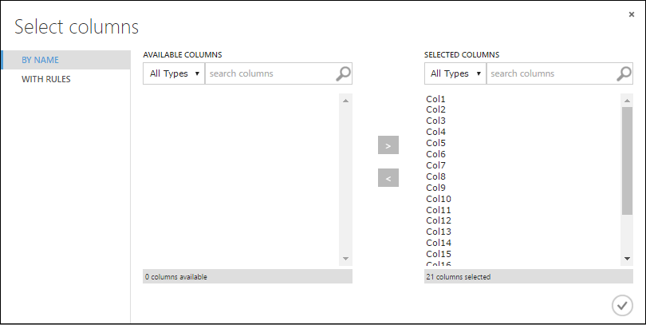
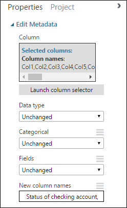

# Tutorial 1: Predict credit risk - Azure Machine Learning Studio (classic)

[!INCLUDE [Designer notice](../../../includes/designer-notice.md)]

In this tutorial, you take an extended look at the process of developing a predictive analytics solution. You develop a simple model in Machine Learning Studio (classic).  You then deploy the model as an Azure Machine Learning web service.  This deployed model can make predictions using new data. This tutorial is **part one of a three-part tutorial series**.

Suppose you need to predict an individual's credit risk based on the information they gave on a credit application.  

Credit risk assessment is a complex problem, but this tutorial will simplify it a bit. You'll use it as an example of how you can create a predictive analytics solution using Microsoft Azure Machine Learning Studio (classic). You'll use Azure Machine Learning Studio (classic) and a Machine Learning web service for this solution.  

In this three-part tutorial, you start with publicly available credit risk data.  You then develop and train a predictive model.  Finally you deploy the model as a web service.

In this part of the tutorial you: 
 
> [!div class="checklist"]
> * Create a Machine Learning Studio (classic) workspace
> * Upload existing data
> * Create an experiment

You can then use this experiment to [train models in part 2](tutorial-part2-credit-risk-train.md) and then [deploy them in part 3](tutorial-part3-credit-risk-deploy.md).

## Prerequisites

This tutorial assumes that you've used Machine Learning Studio (classic) at least once before, and that you have some understanding of machine learning concepts. But it doesn't assume you're an expert in either.

If you've never used **Azure Machine Learning Studio (classic)** before, you might want to start with the quickstart, [Create your first data science experiment in Azure Machine Learning Studio (classic)](create-experiment.md). The quickstart takes you through Machine Learning Studio (classic) for the first time. It shows you the basics of how to drag-and-drop modules onto your experiment, connect them together, run the experiment, and look at the results.


> [!TIP] 
> You can find a working copy of the experiment that you develop in this tutorial in the [Azure AI Gallery](https://gallery.azure.ai). Go to **[Tutorial - Predict credit risk](https://gallery.azure.ai/Experiment/Walkthrough-Credit-risk-prediction-1)** and click **Open in Studio** to download a copy of the experiment into your Machine Learning Studio (classic) workspace.
> 


## Create a Machine Learning Studio (classic) workspace

To use Machine Learning Studio (classic), you need to have a Microsoft Azure Machine Learning Studio (classic) workspace. This workspace contains the tools you need to create, manage, and publish experiments.  

To create a workspace, see [Create and share an Azure Machine Learning Studio (classic) workspace](create-workspace.md).

After your workspace is created, open Machine Learning Studio (classic) ([https://studio.azureml.net/Home](https://studio.azureml.net/Home)). If you have more than one workspace, you can select the workspace in the toolbar in the upper-right corner of the window.


> [!TIP]
> If you are owner of the workspace, you can share the experiments you're working on by inviting others to the workspace. You can do this in Machine Learning Studio (classic) on the **SETTINGS** page. You just need the Microsoft account or organizational account for each user.
> 
> On the **SETTINGS** page, click **USERS**, then click **INVITE MORE USERS** at the bottom of the window.
> 

## <a name="upload"></a>Upload existing data

To develop a predictive model for credit risk, you need data that you can use to train and then test the model. For this tutorial, You'll use the "UCI Statlog (German Credit Data) Data Set" from the UC Irvine Machine Learning repository. You can find it here:  
<a href="https://archive.ics.uci.edu/ml/datasets/Statlog+(German+Credit+Data)">https://archive.ics.uci.edu/ml/datasets/Statlog+(German+Credit+Data)</a>

You'll use the file named **german.data**. Download this file to your local hard drive.  

The **german.data** dataset contains rows of 20 variables for 1000 past applicants for credit. These 20 variables represent the dataset's set of features (the *feature vector*), which provides identifying characteristics for each credit applicant. An additional column in each row represents the applicant's calculated credit risk, with 700 applicants identified as a low credit risk and 300 as a high risk.

The UCI website provides a description of the attributes of the feature vector for this data. This data includes financial information, credit history, employment status, and personal information. For each applicant, a binary rating has been given indicating whether they are a low or high credit risk. 

You'll use this data to train a predictive analytics model. When you're done, your model should be able to accept a feature vector for a new individual and predict whether they are a low or high credit risk.  

Here's an interesting twist.

The description of the dataset on the UCI website mentions what it costs if you misclassify a person's credit risk.
If the model predicts a high credit risk for someone who is actually a low credit risk, the model has made a misclassification.

But the reverse misclassification is five times more costly to the financial institution: if the model predicts a low credit risk for someone who is actually a high credit risk.

So, you want to train your model so that the cost of this latter type of misclassification is five times higher than misclassifying the other way.

One simple way to do this when training the model in your experiment is by duplicating (five times) those entries that represent someone with a high credit risk. 

Then, if the model misclassifies someone as a low credit risk when they're actually a high risk, the model does that same misclassification five times, once for each duplicate. 
This will increase the cost of this error in the training results.


### Convert the dataset format

The original dataset uses a blank-separated format. Machine Learning Studio (classic) works better with a comma-separated value (CSV) file, so you'll convert the dataset by replacing spaces with commas.  

There are many ways to convert this data. One way is by using the following Windows PowerShell command:   

    cat german.data | %{$_ -replace " ",","} | sc german.csv  

Another way is by using the Unix sed command:  

    sed 's/ /,/g' german.data > german.csv  

In either case, you have created a comma-separated version of the data in a file named **german.csv** that you can use in your experiment.

### Upload the dataset to Machine Learning Studio (classic)

Once the data has been converted to CSV format, you need to upload it into Machine Learning Studio (classic). 

1. Open the Machine Learning Studio (classic) home page ([https://studio.azureml.net](https://studio.azureml.net)). 

2. Click the menu  in the upper-left corner of the window, click **Azure Machine Learning**, select **Studio**, and sign in.

3. Click **+NEW** at the bottom of the window.

4. Select **DATASET**.

5. Select **FROM LOCAL FILE**.

    

6. In the **Upload a new dataset** dialog, click Browse, and find the **german.csv** file you created.

7. Enter a name for the dataset. For this tutorial, call it "UCI German Credit Card Data".

8. For data type, select **Generic CSV File With no header (.nh.csv)**.

9. Add a description if you'd like.

10. Click the **OK** check mark.  

    

This uploads the data into a dataset module that you can use in an experiment.

You can manage datasets that you've uploaded to Studio (classic) by clicking the **DATASETS** tab to the left of the Studio (classic) window.


For more information about importing other types of data into an experiment, see [Import your training data into Azure Machine Learning Studio (classic)](import-data.md).

## Create an experiment

The next step in this tutorial is to create an experiment in  Machine Learning Studio (classic) that uses the dataset you uploaded.  

1. In Studio (classic), click **+NEW** at the bottom of the window.
1. Select **EXPERIMENT**, and then select "Blank Experiment". 

    


1. Select the default experiment name at the top of the canvas and rename it to something meaningful.

    

   > [!TIP]
   > It's a good practice to fill in **Summary** and **Description** for the experiment in the **Properties** pane. These properties give you the chance to document the experiment so that anyone who looks at it later will understand your goals and methodology.
   > 
   > 
   > 

1. In the module palette to the left of the experiment canvas, expand **Saved Datasets**.
1. Find the dataset you created under **My Datasets** and drag it onto the canvas. You can also find the dataset by entering the name in the **Search** box above the palette.  

    


### Prepare the data

You can view the first 100 rows of the data and some statistical information for the whole dataset: Click the output port of the dataset (the small circle at the bottom) and select **Visualize**.  

Because the data file didn't come with column headings, Studio (classic) has provided generic headings (Col1, Col2, *etc.*). Good headings aren't essential to creating a model, but they make it easier to work with the data in the experiment. Also, when you eventually publish this model in a web service, the headings help identify the columns to the user of the service.  

You can add column headings using the [Edit Metadata][edit-metadata] module.

You use the [Edit Metadata][edit-metadata] module to change metadata associated with a dataset. In this case, you use it to provide more friendly names for column headings. 

To use [Edit Metadata][edit-metadata], you first specify which columns to modify (in this case, all of them.) Next, you specify the action to be performed on those columns (in this case, changing column headings.)

1. In the module palette, type "metadata" in the **Search** box. The [Edit Metadata][edit-metadata] appears in the module list.

1. Click and drag the [Edit Metadata][edit-metadata] module onto the canvas and drop it below the dataset you added earlier.

1. Connect the dataset to the [Edit Metadata][edit-metadata]: click the output port of the dataset (the small circle at the bottom of the dataset), drag to the input port of [Edit Metadata][edit-metadata] (the small circle at the top of the module), then release the mouse button. The dataset and module remain connected even if you move either around on the canvas.
 
    The experiment should now look something like this:  

    

    The red exclamation mark indicates that you haven't set the properties for this module yet. You'll do that next.

    > [!TIP]
    > You can add a comment to a module by double-clicking the module and entering text. This can help you see at a glance what the module is doing in your experiment. In this case, double-click the [Edit Metadata][edit-metadata] module and type the comment "Add column headings". Click anywhere else on the canvas to close the text box. To display the comment, click the down-arrow on the module.
    > 
    > 
    > 

1. Select [Edit Metadata][edit-metadata], and in the **Properties** pane to the right of the canvas, click **Launch column selector**.

1. In the **Select columns** dialog, select all the rows in **Available Columns** and click > to move them to **Selected Columns**.
   The dialog should look like this:

   


1. Click the **OK** check mark.

1. Back in the **Properties** pane, look for the **New column names** parameter. In this field, enter a list of names for the 21 columns in the dataset, separated by commas and in column order. You can obtain the columns names from the dataset documentation on the UCI website, or for convenience you can copy and paste the following list:  

   ```   
   Status of checking account, Duration in months, Credit history, Purpose, Credit amount, Savings account/bond, Present employment since, Installment rate in percentage of disposable income, Personal status and sex, Other debtors, Present residence since, Property, Age in years, Other installment plans, Housing, Number of existing credits, Job, Number of people providing maintenance for, Telephone, Foreign worker, Credit risk  
   ```

   The Properties pane looks like this:

   

   > [!TIP]
   > If you want to verify the column headings, run the experiment (click **RUN** below the experiment canvas). When it finishes running (a green check mark appears on [Edit Metadata][edit-metadata]), click the output port of the [Edit Metadata][edit-metadata] module, and select **Visualize**. You can view the output of any module in the same way to view the progress of the data through the experiment.
   > 
   > 

### Create training and test datasets

You need some data to train the model and some to test it.
So in the next step of the experiment, you split the dataset into two separate datasets: one for training our model and one for testing it.

To do this, you use the [Split Data][split] module.  

1. Find the [Split Data][split] module, drag it onto the canvas, and connect it to the [Edit Metadata][edit-metadata] module.

1. By default, the split ratio is 0.5 and the **Randomized split** parameter is set. This means that a random half of the data is output through one port of the [Split Data][split] module, and half through the other. You can adjust these parameters, as well as the **Random seed** parameter, to change the split between training and testing data. For this example, you leave them as-is.
   
   > [!TIP]
   > The property **Fraction of rows in the first output dataset** determines how much of the data is output through the *left* output port. For instance, if you set the ratio to 0.7, then 70% of the data is output through the left port and 30% through the right port.  
   > 
   > 

1. Double-click the [Split Data][split] module and enter the comment, "Training/testing data split 50%". 

You can use the outputs of the [Split Data][split] module however you like, but let's choose to use the left output as training data and the right output as testing data.  

As mentioned in the [previous step](tutorial-part1-credit-risk.md#upload), the cost of misclassifying a high credit risk as low is five times higher than the cost of misclassifying a low credit risk as high. To account for this, you generate a new dataset that reflects this cost function. In the new dataset, each high risk example is replicated five times, while each low risk example is not replicated.   

You can do this replication using R code:  

1. Find and drag the [Execute R Script][execute-r-script] module onto the experiment canvas. 

1. Connect the left output port of the [Split Data][split] module to the first input port ("Dataset1") of the [Execute R Script][execute-r-script] module.

1. Double-click the [Execute R Script][execute-r-script] module and enter the comment, "Set cost adjustment".

1. In the **Properties** pane, delete the default text in the **R Script** parameter and enter this script:
   
       dataset1 <- maml.mapInputPort(1)
       data.set<-dataset1[dataset1[,21]==1,]
       pos<-dataset1[dataset1[,21]==2,]
       for (i in 1:5) data.set<-rbind(data.set,pos)
       maml.mapOutputPort("data.set")

    

You need to do this same replication operation for each output of the [Split Data][split] module so that the training and testing data have the same cost adjustment. The easiest way to do this is by duplicating the [Execute R Script][execute-r-script] module you just made and connecting it to the other output port of the [Split Data][split] module.

1. Right-click the [Execute R Script][execute-r-script] module and select **Copy**.

1. Right-click the experiment canvas and select **Paste**.

1. Drag the new module into position, and then connect the right output port of the [Split Data][split] module to the first input port of this new [Execute R Script][execute-r-script] module. 

1. At the bottom of the canvas, click **Run**. 

> [!TIP]
> The copy of the Execute R Script module contains the same script as the original module. When you copy and paste a module on the canvas, the copy retains all the properties of the original.  
> 
>

Our experiment now looks something like this:


For more information on using R scripts in your experiments, see [Extend your experiment with R](extend-your-experiment-with-r.md).


## Clean up resources

[!INCLUDE [machine-learning-studio-clean-up](../../../includes/machine-learning-studio-clean-up.md)]

## Next steps

In this tutorial you completed these steps: 
 
> [!div class="checklist"]
> * Create a Machine Learning Studio (classic) workspace
> * Upload existing data into the workspace
> * Create an experiment

You are now ready to train and evaluate models for this data.

> [!div class="nextstepaction"]
> [Tutorial 2 - Train and evaluate models](tutorial-part2-credit-risk-train.md)

<!-- Module References -->
[execute-r-script]: https://msdn.microsoft.com/library/azure/30806023-392b-42e0-94d6-6b775a6e0fd5/
[edit-metadata]: https://msdn.microsoft.com/library/azure/370b6676-c11c-486f-bf73-35349f842a66/
[split]: https://msdn.microsoft.com/library/azure/70530644-c97a-4ab6-85f7-88bf30a8be5f/
