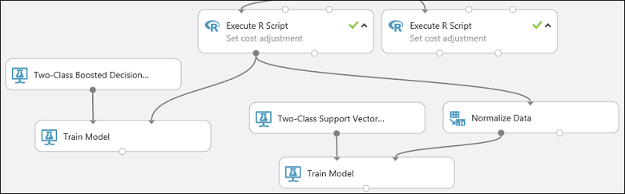
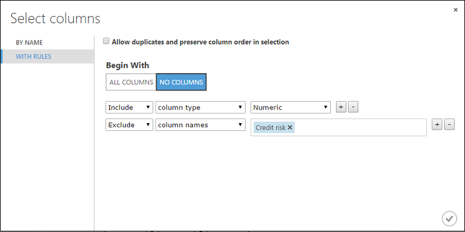
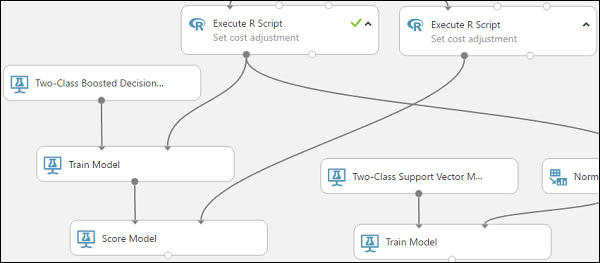
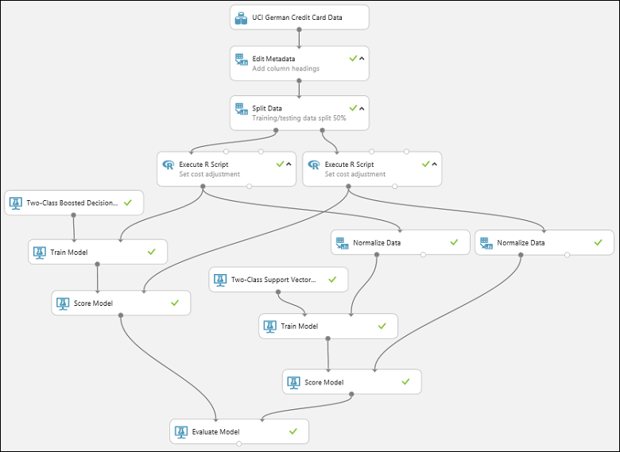
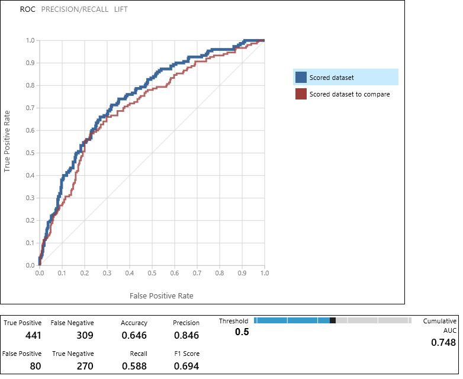

# Tutorial 2: Train credit risk models - Azure Machine Learning Studio (classic)

In this tutorial, you take an extended look at the process of developing a predictive analytics solution. You develop a simple model in Machine Learning Studio (classic).  You then deploy the model as an Azure Machine Learning web service.  This deployed model can make predictions using new data. This tutorial is **part two of a three-part tutorial series**.

Suppose you need to predict an individual's credit risk based on the information they gave on a credit application.  

Credit risk assessment is a complex problem, but this tutorial will simplify it a bit. You'll use it as an example of how you can create a predictive analytics solution using Microsoft Azure Machine Learning Studio (classic). You'll use Azure Machine Learning Studio (classic) and a Machine Learning web service for this solution.  

In this three-part tutorial, you start with publicly available credit risk data.  You then develop and train a predictive model.  Finally you deploy the model as a web service.

In [part one of the tutorial](tutorial-part1-credit-risk.md), you created a Machine Learning Studio (classic) workspace, uploaded data, and created an experiment.

In this part of the tutorial you:
 
> [!div class="checklist"]
> * Train multiple models
> * Score and evaluate the models

In [part three of the tutorial](tutorial-part3-credit-risk-deploy.md), you'll deploy the model as a web service.

## Prerequisites

Complete [part one of the tutorial](tutorial-part1-credit-risk.md).

## Train multiple models

One of the benefits of using Azure Machine Learning Studio (classic) for creating machine learning models is the ability to try more than one type of model at a time in a single experiment and compare the results. This type of experimentation helps you find the best solution for your problem.

In the experiment we're developing in this tutorial, you'll create two different types of models and then compare their scoring results to decide which algorithm you want to use in our final experiment.  

There are various models you could choose from. To see the models available, expand the **Machine Learning** node in the module palette, and then expand **Initialize Model** and the nodes beneath it. For the purposes of this experiment, you'll select the [Two-Class Support Vector Machine][two-class-support-vector-machine] (SVM) and the [Two-Class Boosted Decision Tree][two-class-boosted-decision-tree] modules.

> [!TIP]
> To get help deciding which Machine Learning algorithm best suits the particular problem you're trying to solve, see [How to choose algorithms for Microsoft Azure Machine Learning Studio (classic)](algorithm-choice.md).
> 
> 

You'll add both the [Two-Class Boosted Decision Tree][two-class-boosted-decision-tree] module and [Two-Class Support Vector Machine][two-class-support-vector-machine] module in this experiment.

### Two-Class Boosted Decision Tree

First, set up the boosted decision tree model.

1. Find the [Two-Class Boosted Decision Tree][two-class-boosted-decision-tree] module in the module palette and drag it onto the canvas.

1. Find the [Train Model][train-model] module, drag it onto the canvas, and then connect the output of the [Two-Class Boosted Decision Tree][two-class-boosted-decision-tree] module to the left input port of the [Train Model][train-model] module.
   
   The [Two-Class Boosted Decision Tree][two-class-boosted-decision-tree] module initializes the generic model, and [Train Model][train-model] uses training data to train the model. 

1. Connect the left output of the left [Execute R Script][execute-r-script] module to the right input port of the [Train Model][train-model] module
(in this tutorial you [used the data coming from the left side](#train) of the Split Data module for training).
   
   > [!TIP]
   > you don't need two of the inputs and one of the outputs of the [Execute R Script][execute-r-script] module for this experiment, so you can leave them unattached. 
   > 
   > 

This portion of the experiment now looks something like this:  

Now you need to tell the [Train Model][train-model] module that you want the model to predict the Credit Risk value.

1. Select the [Train Model][train-model] module. In the **Properties** pane, click **Launch column selector**.

1. In the **Select a single column** dialog, type "credit risk" in the search field under **Available Columns**, select "Credit risk" below, and click the right arrow button (**>**) to move "Credit risk" to **Selected Columns**. 

    

1. Click the **OK** check mark.

### Two-Class Support Vector Machine

Next, you set up the SVM model.  

First, a little explanation about SVM. Boosted decision trees work well with features of any type. However, since the SVM module generates a linear classifier, the model that it generates has the best test error when all numeric features have the same scale. To convert all numeric features to the same scale, you use a "Tanh" transformation (with the [Normalize Data][normalize-data] module). This transforms our numbers into the [0,1] range. The SVM module converts string features to categorical features and then to binary 0/1 features, so you don't need to manually transform string features. Also, you don't want to transform the Credit Risk column (column 21) - it's numeric, but it's the value we're training the model to predict, so you need to leave it alone.  

To set up the SVM model, do the following:

1. Find the [Two-Class Support Vector Machine][two-class-support-vector-machine] module in the module palette and drag it onto the canvas.

1. Right-click the [Train Model][train-model] module, select **Copy**, and then right-click the canvas and select **Paste**. The copy of the [Train Model][train-model] module has the same column selection as the original.

1. Connect the output of the [Two-Class Support Vector Machine][two-class-support-vector-machine] module to the left input port of the second [Train Model][train-model] module.

1. Find the [Normalize Data][normalize-data] module and drag it onto the canvas.

1. Connect the left output of the left [Execute R Script][execute-r-script] module to the input of this module (notice that the output port of a module may be connected to more than one other module).

1. Connect the left output port of the [Normalize Data][normalize-data] module to the right input port of the second [Train Model][train-model] module.

This portion of our experiment should now look something like this:  

Now configure the [Normalize Data][normalize-data] module:

1. Click to select the [Normalize Data][normalize-data] module. In the **Properties** pane, select **Tanh** for the **Transformation method** parameter.

1. Click **Launch column selector**, select "No columns" for **Begin With**, select **Include** in the first dropdown, select **column type** in the second dropdown, and select **Numeric** in the third dropdown. This specifies that all the numeric columns (and only numeric) are transformed.

1. Click the plus sign (+) to the right of this row - this creates a row of dropdowns. Select **Exclude** in the first dropdown, select **column names** in the second dropdown, and enter "Credit risk" in the text field. This specifies that the Credit Risk column should be ignored (you need to do this because this column is numeric and so would be transformed if you didn't exclude it).

1. Click the **OK** check mark.  

    

The [Normalize Data][normalize-data] module is now set to perform a Tanh transformation on all numeric columns except for the Credit Risk column.  

## Score and evaluate the models

you use the testing data that was separated out by the [Split Data][split] module to score our trained models. you can then compare the results of the two models to see which generated better results.  

### Add the Score Model modules

1. Find the [Score Model][score-model] module and drag it onto the canvas.

1. Connect the [Train Model][train-model] module that's connected to the [Two-Class Boosted Decision Tree][two-class-boosted-decision-tree] module to the left input port of the [Score Model][score-model] module.

1. Connect the right [Execute R Script][execute-r-script] module (our testing data) to the right input port of the [Score Model][score-model] module.

    

   
   The [Score Model][score-model] module can now take the credit information from the testing data, run it through the model, and compare the predictions the model generates with the actual credit risk column in the testing data.

1. Copy and paste the [Score Model][score-model] module to create a second copy.

1. Connect the output of the SVM model (that is, the output port of the [Train Model][train-model] module that's connected to the [Two-Class Support Vector Machine][two-class-support-vector-machine] module) to the input port of the second [Score Model][score-model] module.

1. For the SVM model, you have to do the same transformation to the test data as you did to the training data. So copy and paste the [Normalize Data][normalize-data] module to create a second copy and connect it to the right [Execute R Script][execute-r-script] module.

1. Connect the left output of the second [Normalize Data][normalize-data] module to the right input port of the second [Score Model][score-model] module.

    

### Add the Evaluate Model module

To evaluate the two scoring results and compare them, you use an [Evaluate Model][evaluate-model] module.  

1. Find the [Evaluate Model][evaluate-model] module and drag it onto the canvas.

1. Connect the output port of the [Score Model][score-model] module associated with the boosted decision tree model to the left input port of the [Evaluate Model][evaluate-model] module.

1. Connect the other [Score Model][score-model] module to the right input port.  

    

### Run the experiment and check the results

To run the experiment, click the **RUN** button below the canvas. It may take a few minutes. A spinning indicator on each module shows that it's running, and then a green check mark shows when the module is finished. When all the modules have a check mark, the experiment has finished running.

The experiment should now look something like this:  

To check the results, click the output port of the [Evaluate Model][evaluate-model] module and select **Visualize**.  

The [Evaluate Model][evaluate-model] module produces a pair of curves and metrics that allow you to compare the results of the two scored models. You can view the results as Receiver Operator Characteristic (ROC) curves, Precision/Recall curves, or Lift curves. Additional data displayed includes a confusion matrix, cumulative values for the area under the curve (AUC), and other metrics. You can change the threshold value by moving the slider left or right and see how it affects the set of metrics.  

To the right of the graph, click **Scored dataset** or **Scored dataset to compare** to highlight the associated curve and to display the associated metrics below. In the legend for the curves, "Scored dataset" corresponds to the left input port of the [Evaluate Model][evaluate-model] module - in our case, this is the boosted decision tree model. "Scored dataset to compare" corresponds to the right input port - the SVM model in our case. When you click one of these labels, the curve for that model is highlighted and the corresponding metrics are displayed, as shown in the following graphic.  

By examining these values, you can decide which model is closest to giving you the results you're looking for. You can go back and iterate on your experiment by changing parameter values in the different models. 

The science and art of interpreting these results and tuning the model performance is outside the scope of this tutorial. For additional help, you might read the following articles:
- [How to evaluate model performance in Azure Machine Learning Studio (classic)](evaluate-model-performance.md)
- [Choose parameters to optimize your algorithms in Azure Machine Learning Studio (classic)](algorithm-parameters-optimize.md)
- [Interpret model results in Azure Machine Learning Studio (classic)](interpret-model-results.md)

> [!TIP]
> Each time you run the experiment a record of that iteration is kept in the Run History. You can view these iterations, and return to any of them, by clicking **VIEW RUN HISTORY** below the canvas. You can also click **Prior Run** in the **Properties** pane to return to the iteration immediately preceding the one you have open.
> 
> You can make a copy of any iteration of your experiment by clicking **SAVE AS** below the canvas. 
> Use the experiment's **Summary** and **Description** properties to keep a record of what you've tried in your experiment iterations.
> 
> For more information, see [Manage experiment iterations in Azure Machine Learning Studio (classic)](manage-experiment-iterations.md).  
> 
> 

## Clean up resources

[!INCLUDE [machine-learning-studio-clean-up](../../../includes/machine-learning-studio-clean-up.md)]

## Next steps

In this tutorial, you completed these steps: 
 
> [!div class="checklist"]
> * Create an experiment
> * Train multiple models
> * Score and evaluate the models

You're now ready to deploy models for this data.

> [!div class="nextstepaction"]
> [Tutorial 3 - Deploy models](tutorial-part3-credit-risk-deploy.md)

<!-- Module References -->
[execute-r-script]: https://msdn.microsoft.com/library/azure/30806023-392b-42e0-94d6-6b775a6e0fd5/
[edit-metadata]: https://msdn.microsoft.com/library/azure/370b6676-c11c-486f-bf73-35349f842a66/
[split]: https://msdn.microsoft.com/library/azure/70530644-c97a-4ab6-85f7-88bf30a8be5f/
[evaluate-model]: https://msdn.microsoft.com/library/azure/927d65ac-3b50-4694-9903-20f6c1672089/
[execute-r-script]: https://msdn.microsoft.com/library/azure/30806023-392b-42e0-94d6-6b775a6e0fd5/
[normalize-data]: https://msdn.microsoft.com/library/azure/986df333-6748-4b85-923d-871df70d6aaf/
[score-model]: https://msdn.microsoft.com/library/azure/401b4f92-e724-4d5a-be81-d5b0ff9bdb33/
[train-model]: https://msdn.microsoft.com/library/azure/5cc7053e-aa30-450d-96c0-dae4be720977/
[two-class-boosted-decision-tree]: https://msdn.microsoft.com/library/azure/e3c522f8-53d9-4829-8ea4-5c6a6b75330c/
[two-class-support-vector-machine]: https://msdn.microsoft.com/library/azure/12d8479b-74b4-4e67-b8de-d32867380e20/
[split]: https://msdn.microsoft.com/library/azure/70530644-c97a-4ab6-85f7-88bf30a8be5f/