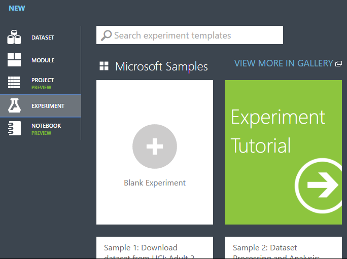

# Tutorial: Develop predictive solution for credit risk assessment in Azure Machine Learning Studio

In this tutorial, you take an extended look at the process of developing a predictive analytics solution. You develop a simple model in Machine Learning Studio.  You then deploy the model as an Azure Machine Learning web service.  This deployed model can make predictions using new data. This tutorial is **part two of a three-part tutorial series**.

Suppose you need to predict an individual's credit risk based on the information they gave on a credit application.  

Credit risk assessment is a complex problem, but this tutorial will simplify it a bit. You'll use it as an example of how you can create a predictive analytics solution using Microsoft Azure Machine Learning. You'll use Azure Machine Learning Studio and a Machine Learning web service for this solution.  

In this three-part tutorial, you start with publicly available credit risk data.  You then develop and train a predictive model.  Finally you deploy the model as a web service.

In [part one of the tutorial](tutorial-part2-credit-risk.md), you created a Machine Learning Studio workspace and uploaded data.

In this tutorial you will:
 
> [!div class="checklist"]
> * Create an experiment
> * Train multiple models
> * Score and evaluate the models

In [part three of the tutorial](tutorial-part3-credit-risk-deploy.md), you'll deploy the model as a web service.

[!INCLUDE [machine-learning-free-trial](../../../includes/machine-learning-free-trial.md)]

## Prerequisites

Complete [part one of the tutorial](tutorial-part1-credit-risk.md).

## Create an experiment

The next step in this tutorial is to create an experiment in Machine Learning Studio that uses the dataset you uploaded.  

1. In Studio, click **+NEW** at the bottom of the window.
1. Select **EXPERIMENT**, and then select "Blank Experiment". 

    

1. Select the default experiment name at the top of the canvas and rename it to something meaningful.

    

   
   > [!TIP]
   > It's a good practice to fill in **Summary** and **Description** for the experiment in the **Properties** pane. These properties give you the chance to document the experiment so that anyone who looks at it later will understand your goals and methodology.
   > 
   > 
   > 

1. In the module palette to the left of the experiment canvas, expand **Saved Datasets**.
1. Find the dataset you created under **My Datasets** and drag it onto the canvas. You can also find the dataset by entering the name in the **Search** box above the palette.  

    

### Prepare the data

You can view the first 100 rows of the data and some statistical information for the whole dataset: Click the output port of the dataset (the small circle at the bottom) and select **Visualize**.  

Because the data file didn't come with column headings, Studio has provided generic headings (Col1, Col2, *etc.*). Good headings aren't essential to creating a model, but they make it easier to work with the data in the experiment. Also, when you eventually publish this model in a web service, the headings help identify the columns to the user of the service.  

You can add column headings using the [Edit Metadata][edit-metadata] module.

You use the [Edit Metadata][edit-metadata] module to change metadata associated with a dataset. In this case, you use it to provide more friendly names for column headings. 

To use [Edit Metadata][edit-metadata], you first specify which columns to modify (in this case, all of them.) Next, you specify the action to be performed on those columns (in this case, changing column headings.)

1. In the module palette, type "metadata" in the **Search** box. The [Edit Metadata][edit-metadata] appears in the module list.

1. Click and drag the [Edit Metadata][edit-metadata] module onto the canvas and drop it below the dataset you added earlier.

1. Connect the dataset to the [Edit Metadata][edit-metadata]: click the output port of the dataset (the small circle at the bottom of the dataset), drag to the input port of [Edit Metadata][edit-metadata] (the small circle at the top of the module), then release the mouse button. The dataset and module remain connected even if you move either around on the canvas.
   
   The experiment should now look something like this:  
   
   

   
   The red exclamation mark indicates that you haven't set the properties for this module yet.  You'll do that next.
   
   > [!TIP]
   > You can add a comment to a module by double-clicking the module and entering text. This can help you see at a glance what the module is doing in your experiment. In this case, double-click the [Edit Metadata][edit-metadata] module and type the comment "Add column headings". Click anywhere else on the canvas to close the text box. To display the comment, click the down-arrow on the module.
   > 
   > 

   > 
1. Select [Edit Metadata][edit-metadata], and in the **Properties** pane to the right of the canvas, click **Launch column selector**.

1. In the **Select columns** dialog, select all the rows in **Available Columns** and click > to move them to **Selected Columns**.
   The dialog should look like this:

   

1. Click the **OK** check mark.

1. Back in the **Properties** pane, look for the **New column names** parameter. In this field, enter a list of names for the 21 columns in the dataset, separated by commas and in column order. You can obtain the columns names from the dataset documentation on the UCI website, or for convenience you can copy and paste the following list:  
   
       Status of checking account, Duration in months, Credit history, Purpose, Credit amount, Savings account/bond, Present employment since, Installment rate in percentage of disposable income, Personal status and sex, Other debtors, Present residence since, Property, Age in years, Other installment plans, Housing, Number of existing credits, Job, Number of people providing maintenance for, Telephone, Foreign worker, Credit risk  
   
   The Properties pane looks like this:
   
   

> [!TIP]
> If you want to verify the column headings, run the experiment (click **RUN** below the experiment canvas). When it finishes running (a green check mark appears on [Edit Metadata][edit-metadata]), click the output port of the [Edit Metadata][edit-metadata] module, and select **Visualize**. You can view the output of any module in the same way to view the progress of the data through the experiment.
> 
> 

### Create training and test datasets

You need some data to train the model and some to test it.
So in the next step of the experiment, you split the dataset into two separate datasets: one for training our model and one for testing it.

To do this, you use the [Split Data][split] module.  

1. Find the [Split Data][split] module, drag it onto the canvas, and connect it to the [Edit Metadata][edit-metadata] module.

1. By default, the split ratio is 0.5 and the **Randomized split** parameter is set. This means that a random half of the data is output through one port of the [Split Data][split] module, and half through the other. You can adjust these parameters, as well as the **Random seed** parameter, to change the split between training and testing data. For this example, you leave them as-is.
   
   > [!TIP]
   > The property **Fraction of rows in the first output dataset** determines how much of the data is output through the *left* output port. For instance, if you set the ratio to 0.7, then 70% of the data is output through the left port and 30% through the right port.  
   > 
   > 

1. Double-click the [Split Data][split] module and enter the comment, "Training/testing data split 50%". 

you can use the outputs of the [Split Data][split] module however you like, but let's choose to use the left output as training data and the right output as testing data.  

As mentioned in the [previous step](tutorial-2-upload-data.md), the cost of misclassifying a high credit risk as low is five times higher than the cost of misclassifying a low credit risk as high. To account for this, you generate a new dataset that reflects this cost function. In the new dataset, each high risk example is replicated five times, while each low risk example is not replicated.   

you can do this replication using R code:  

1. Find and drag the [Execute R Script][execute-r-script] module onto the experiment canvas. 

1. Connect the left output port of the [Split Data][split] module to the first input port ("Dataset1") of the [Execute R Script][execute-r-script] module.

1. Double-click the [Execute R Script][execute-r-script] module and enter the comment, "Set cost adjustment".

1. In the **Properties** pane, delete the default text in the **R Script** parameter and enter this script:
   
       dataset1 <- maml.mapInputPort(1)
       data.set<-dataset1[dataset1[,21]==1,]
       pos<-dataset1[dataset1[,21]==2,]
       for (i in 1:5) data.set<-rbind(data.set,pos)
       maml.mapOutputPort("data.set")

    

You need to do this same replication operation for each output of the [Split Data][split] module so that the training and testing data have the same cost adjustment. The easiest way to do this is by duplicating the [Execute R Script][execute-r-script] module you just made and connecting it to the other output port of the [Split Data][split] module.

1. Right-click the [Execute R Script][execute-r-script] module and select **Copy**.

1. Right-click the experiment canvas and select **Paste**.

1. Drag the new module into position, and then connect the right output port of the [Split Data][split] module to the first input port of this new [Execute R Script][execute-r-script] module. 

1. At the bottom of the canvas, click **Run**. 

> [!TIP]
> The copy of the Execute R Script module contains the same script as the original module. When you copy and paste a module on the canvas, the copy retains all the properties of the original.  
> 
>

Our experiment now looks something like this:

For more information on using R scripts in your experiments, see [Extend your experiment with R](extend-your-experiment-with-r.md).

## Train multiple models

One of the benefits of using Azure Machine Learning Studio for creating machine learning models is the ability to try more than one type of model at a time in a single experiment and compare the results. This type of experimentation helps you find the best solution for your problem.

In the experiment we're developing in this tutorial, you'll create two different types of models and then compare their scoring results to decide which algorithm you want to use in our final experiment.  

There are various models you could choose from. To see the models available, expand the **Machine Learning** node in the module palette, and then expand **Initialize Model** and the nodes beneath it. For the purposes of this experiment, you'll select the [Two-Class Support Vector Machine][two-class-support-vector-machine] (SVM) and the [Two-Class Boosted Decision Tree][two-class-boosted-decision-tree] modules.

> [!TIP]
> To get help deciding which Machine Learning algorithm best suits the particular problem you're trying to solve, see [How to choose algorithms for Microsoft Azure Machine Learning Studio](algorithm-choice.md).
> 
> 

You'll add both the [Two-Class Boosted Decision Tree][two-class-boosted-decision-tree] module and [Two-Class Support Vector Machine][two-class-support-vector-machine] module in this experiment.

### Two-Class Boosted Decision Tree

First, set up the boosted decision tree model.

1. Find the [Two-Class Boosted Decision Tree][two-class-boosted-decision-tree] module in the module palette and drag it onto the canvas.

1. Find the [Train Model][train-model] module, drag it onto the canvas, and then connect the output of the [Two-Class Boosted Decision Tree][two-class-boosted-decision-tree] module to the left input port of the [Train Model][train-model] module.
   
   The [Two-Class Boosted Decision Tree][two-class-boosted-decision-tree] module initializes the generic model, and [Train Model][train-model] uses training data to train the model. 

1. Connect the left output of the left [Execute R Script][execute-r-script] module to the right input port of the [Train Model][train-model] module
(you decided in [Step 3](tutorial-3-create-new-experiment.md) of this tutorial to use the data coming from the left side of the Split Data module for training).
   
   > [!TIP]
   > you don't need two of the inputs and one of the outputs of the [Execute R Script][execute-r-script] module for this experiment, so you can leave them unattached. 
   > 
   > 

This portion of the experiment now looks something like this:  

Now you need to tell the [Train Model][train-model] module that you want the model to predict the Credit Risk value.

1. Select the [Train Model][train-model] module. In the **Properties** pane, click **Launch column selector**.

1. In the **Select a single column** dialog, type "credit risk" in the search field under **Available Columns**, select "Credit risk" below, and click the right arrow button (**>**) to move "Credit risk" to **Selected Columns**. 

    

1. Click the **OK** check mark.

### Two-Class Support Vector Machine

Next, you set up the SVM model.  

First, a little explanation about SVM. Boosted decision trees work well with features of any type. However, since the SVM module generates a linear classifier, the model that it generates has the best test error when all numeric features have the same scale. To convert all numeric features to the same scale, you use a "Tanh" transformation (with the [Normalize Data][normalize-data] module). This transforms our numbers into the [0,1] range. The SVM module converts string features to categorical features and then to binary 0/1 features, so you don't need to manually transform string features. Also, you don't want to transform the Credit Risk column (column 21) - it's numeric, but it's the value we're training the model to predict, so you need to leave it alone.  

To set up the SVM model, do the following:

1. Find the [Two-Class Support Vector Machine][two-class-support-vector-machine] module in the module palette and drag it onto the canvas.

1. Right-click the [Train Model][train-model] module, select **Copy**, and then right-click the canvas and select **Paste**. The copy of the [Train Model][train-model] module has the same column selection as the original.

1. Connect the output of the [Two-Class Support Vector Machine][two-class-support-vector-machine] module to the left input port of the second [Train Model][train-model] module.

1. Find the [Normalize Data][normalize-data] module and drag it onto the canvas.

1. Connect the left output of the left [Execute R Script][execute-r-script] module to the input of this module (notice that the output port of a module may be connected to more than one other module).

1. Connect the left output port of the [Normalize Data][normalize-data] module to the right input port of the second [Train Model][train-model] module.

This portion of our experiment should now look something like this:  

Now configure the [Normalize Data][normalize-data] module:

1. Click to select the [Normalize Data][normalize-data] module. In the **Properties** pane, select **Tanh** for the **Transformation method** parameter.

1. Click **Launch column selector**, select "No columns" for **Begin With**, select **Include** in the first dropdown, select **column type** in the second dropdown, and select **Numeric** in the third dropdown. This specifies that all the numeric columns (and only numeric) are transformed.

1. Click the plus sign (+) to the right of this row - this creates a row of dropdowns. Select **Exclude** in the first dropdown, select **column names** in the second dropdown, and enter "Credit risk" in the text field. This specifies that the Credit Risk column should be ignored (you need to do this because this column is numeric and so would be transformed if you didn't exclude it).

1. Click the **OK** check mark.  

    

The [Normalize Data][normalize-data] module is now set to perform a Tanh transformation on all numeric columns except for the Credit Risk column.  

## Score and evaluate the models

you use the testing data that was separated out by the [Split Data][split] module to score our trained models. you can then compare the results of the two models to see which generated better results.  

### Add the Score Model modules

1. Find the [Score Model][score-model] module and drag it onto the canvas.

1. Connect the [Train Model][train-model] module that's connected to the [Two-Class Boosted Decision Tree][two-class-boosted-decision-tree] module to the left input port of the [Score Model][score-model] module.

1. Connect the right [Execute R Script][execute-r-script] module (our testing data) to the right input port of the [Score Model][score-model] module.

    

   
   The [Score Model][score-model] module can now take the credit information from the testing data, run it through the model, and compare the predictions the model generates with the actual credit risk column in the testing data.

1. Copy and paste the [Score Model][score-model] module to create a second copy.

1. Connect the output of the SVM model (that is, the output port of the [Train Model][train-model] module that's connected to the [Two-Class Support Vector Machine][two-class-support-vector-machine] module) to the input port of the second [Score Model][score-model] module.

1. For the SVM model, you have to do the same transformation to the test data as you did to the training data. So copy and paste the [Normalize Data][normalize-data] module to create a second copy and connect it to the right [Execute R Script][execute-r-script] module.

1. Connect the left output of the second [Normalize Data][normalize-data] module to the right input port of the second [Score Model][score-model] module.

    

### Add the Evaluate Model module

To evaluate the two scoring results and compare them, you use an [Evaluate Model][evaluate-model] module.  

1. Find the [Evaluate Model][evaluate-model] module and drag it onto the canvas.

1. Connect the output port of the [Score Model][score-model] module associated with the boosted decision tree model to the left input port of the [Evaluate Model][evaluate-model] module.

1. Connect the other [Score Model][score-model] module to the right input port.  

    

### Run the experiment and check the results

To run the experiment, click the **RUN** button below the canvas. It may take a few minutes. A spinning indicator on each module shows that it's running, and then a green check mark shows when the module is finished. When all the modules have a check mark, the experiment has finished running.

The experiment should now look something like this:  

To check the results, click the output port of the [Evaluate Model][evaluate-model] module and select **Visualize**.  

The [Evaluate Model][evaluate-model] module produces a pair of curves and metrics that allow you to compare the results of the two scored models. You can view the results as Receiver Operator Characteristic (ROC) curves, Precision/Recall curves, or Lift curves. Additional data displayed includes a confusion matrix, cumulative values for the area under the curve (AUC), and other metrics. You can change the threshold value by moving the slider left or right and see how it affects the set of metrics.  

To the right of the graph, click **Scored dataset** or **Scored dataset to compare** to highlight the associated curve and to display the associated metrics below. In the legend for the curves, "Scored dataset" corresponds to the left input port of the [Evaluate Model][evaluate-model] module - in our case, this is the boosted decision tree model. "Scored dataset to compare" corresponds to the right input port - the SVM model in our case. When you click one of these labels, the curve for that model is highlighted and the corresponding metrics are displayed, as shown in the following graphic.  

By examining these values, you can decide which model is closest to giving you the results you're looking for. You can go back and iterate on your experiment by changing parameter values in the different models. 

The science and art of interpreting these results and tuning the model performance is outside the scope of this tutorial. For additional help, you might read the following articles:
- [How to evaluate model performance in Azure Machine Learning](evaluate-model-performance.md)
- [Choose parameters to optimize your algorithms in Azure Machine Learning](algorithm-parameters-optimize.md)
- [Interpret model results in Azure Machine Learning](interpret-model-results.md)

> [!TIP]
> Each time you run the experiment a record of that iteration is kept in the Run History. You can view these iterations, and return to any of them, by clicking **VIEW RUN HISTORY** below the canvas. You can also click **Prior Run** in the **Properties** pane to return to the iteration immediately preceding the one you have open.
> 
> You can make a copy of any iteration of your experiment by clicking **SAVE AS** below the canvas. 
> Use the experiment's **Summary** and **Description** properties to keep a record of what you've tried in your experiment iterations.
> 
> For more information, see [Manage experiment iterations in Azure Machine Learning Studio](manage-experiment-iterations.md).  
> 
> 

## Clean up resources

[!INCLUDE [machine-learning-studio-clean-up](../../../includes/machine-learning-studio-clean-up.md)]

## Next steps

In this tutorial, you completed these steps: 
 
> [!div class="checklist"]
> * Create an experiment
> * Train multiple models
> * Score and evaluate the models

You're now ready to deploy models for this data.

> [!div class="nextstepaction"]
> [Tutorial 2 - Train and evaluate models](tutorial-part2-credit-risk-train.md)

<!-- Module References -->
[execute-r-script]: https://msdn.microsoft.com/library/azure/30806023-392b-42e0-94d6-6b775a6e0fd5/
[edit-metadata]: https://msdn.microsoft.com/library/azure/370b6676-c11c-486f-bf73-35349f842a66/
[split]: https://msdn.microsoft.com/library/azure/70530644-c97a-4ab6-85f7-88bf30a8be5f/
[evaluate-model]: https://msdn.microsoft.com/library/azure/927d65ac-3b50-4694-9903-20f6c1672089/
[execute-r-script]: https://msdn.microsoft.com/library/azure/30806023-392b-42e0-94d6-6b775a6e0fd5/
[normalize-data]: https://msdn.microsoft.com/library/azure/986df333-6748-4b85-923d-871df70d6aaf/
[score-model]: https://msdn.microsoft.com/library/azure/401b4f92-e724-4d5a-be81-d5b0ff9bdb33/
[train-model]: https://msdn.microsoft.com/library/azure/5cc7053e-aa30-450d-96c0-dae4be720977/
[two-class-boosted-decision-tree]: https://msdn.microsoft.com/library/azure/e3c522f8-53d9-4829-8ea4-5c6a6b75330c/
[two-class-support-vector-machine]: https://msdn.microsoft.com/library/azure/12d8479b-74b4-4e67-b8de-d32867380e20/
[split]: https://msdn.microsoft.com/library/azure/70530644-c97a-4ab6-85f7-88bf30a8be5f/