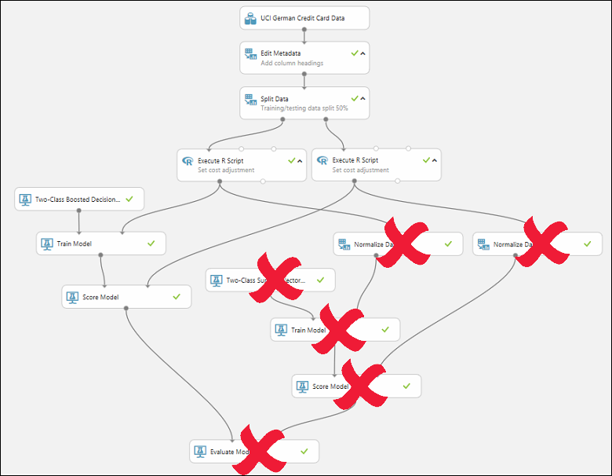
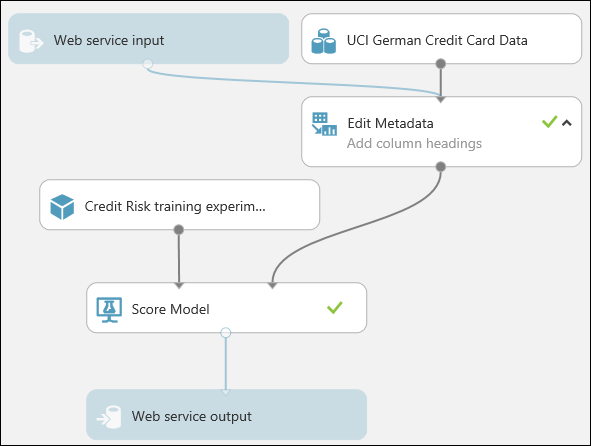

# Tutorial 3: Deploy credit risk model - Azure Machine Learning Studio (classic)

In this tutorial, you take an extended look at the process of developing a predictive analytics solution. You develop a simple model in Machine Learning Studio (classic).  You then deploy the model as an Azure Machine Learning web service.  This deployed model can make predictions using new data. This tutorial is **part three of a three-part tutorial series**.

Suppose you need to predict an individual's credit risk based on the information they gave on a credit application.  

Credit risk assessment is a complex problem, but this tutorial will simplify it a bit. You'll use it as an example of how you can create a predictive analytics solution using Microsoft Azure Machine Learning Studio (classic). You'll use Azure Machine Learning Studio (classic) and a Machine Learning web service for this solution. 

In this three-part tutorial, you start with publicly available credit risk data.  You then develop and train a predictive model.  Finally you deploy the model as a web service.

In [part one of the tutorial](tutorial-part1-credit-risk.md), you created a Machine Learning Studio (classic) workspace, uploaded data, and created an experiment.

In [part two of the tutorial](tutorial-part2-credit-risk-train.md), you  trained and evaluated models.

In this part of the tutorial you:

> [!div class="checklist"]
> * Prepare for deployment
> * Deploy the web service
> * Test the web service
> * Manage the web service
> * Access the web service

## Prerequisites

Complete [part two of the tutorial](tutorial-part2-credit-risk-train.md).

## Prepare for deployment
To give others a chance to use the predictive model you've developed in this tutorial, you can deploy it as a web service on Azure.

Up to this point you've been experimenting with training our model. But the deployed service is no longer going to do training - it's going to generate new predictions by scoring the user's input based on our model. So we're going to do some preparation to convert this experiment from a ***training*** experiment to a ***predictive*** experiment. 

Preparation for deployment is a three-step process:  

1. Remove one of the models
1. Convert the *training experiment* you've created into a *predictive experiment*
1. Deploy the predictive experiment as a web service

### Remove one of the models

First, you need to trim this experiment down a little. you currently have two different models in the experiment, but you only want to use one model when you deploy this as a web service.  

Let's say you've decided that the boosted tree model performed better than the SVM model. So the first thing to do is remove the [Two-Class Support Vector Machine][two-class-support-vector-machine] module and the modules that were used for training it. You may want to make a copy of the experiment first by clicking **Save As** at the bottom of the experiment canvas.

you need to delete the following modules:  

* [Two-Class Support Vector Machine][two-class-support-vector-machine]
* [Train Model][train-model] and [Score Model][score-model] modules that were connected to it
* [Normalize Data][normalize-data] (both of them)
* [Evaluate Model][evaluate-model] (because we're finished evaluating the models)

Select each module and press the Delete key, or right-click the module and select **Delete**. 

Our model should now look something like this:

Now we're ready to deploy this model using the [Two-Class Boosted Decision Tree][two-class-boosted-decision-tree].

### Convert the training experiment to a predictive experiment

To get this model ready for deployment, you need to convert this training experiment to a predictive experiment. This involves three steps:

1. Save the model you've trained and then replace our training modules
1. Trim the experiment to remove modules that were only needed for training
1. Define where the web service will accept input and where it generates the output

you could do this manually, but fortunately all three steps can be accomplished by clicking **Set Up Web Service** at the bottom of the experiment canvas (and selecting the **Predictive Web Service** option).

> [!TIP]
> If you want more details on what happens when you convert a training experiment to a predictive experiment, see [How to prepare your model for deployment in Azure Machine Learning Studio (classic)](convert-training-experiment-to-scoring-experiment.md).

When you click **Set Up Web Service**, several things happen:

* The trained model is converted to a single **Trained Model** module and stored in the module palette to the left of the experiment canvas (you can find it under **Trained Models**)
* Modules that were used for training are removed; specifically:
  * [Two-Class Boosted Decision Tree][two-class-boosted-decision-tree]
  * [Train Model][train-model]
  * [Split Data][split]
  * the second [Execute R Script][execute-r-script] module that was used for test data
* The saved trained model is added back into the experiment
* **Web service input** and **Web service output** modules are added (these identify where the user's data will enter the model, and what data is returned, when the web service is accessed)

> [!NOTE]
> You can see that the experiment is saved in two parts under tabs that have been added at the top of the experiment canvas. The original training experiment is under the tab **Training experiment**, and the newly created predictive experiment is under **Predictive experiment**. The predictive experiment is the one you'll deploy as a web service.

you need to take one additional step with this particular experiment.
you added two [Execute R Script][execute-r-script] modules to provide a weighting function to the data. That was just a trick you needed for training and testing, so you can take out those modules in the final model.
Machine Learning Studio (classic) removed one [Execute R Script][execute-r-script] module when it removed the [Split][split] module. Now you can remove the other and connect [Metadata Editor][metadata-editor] directly to [Score Model][score-model].    

Our experiment should now look like this:  

> [!NOTE]
> You may be wondering why you left the UCI German Credit Card Data dataset in the predictive experiment. The service is going to score the user's data, not the original dataset, so why leave the original dataset in the model?
> 
> It's true that the service doesn't need the original credit card data. But it does need the schema for that data, which includes information such as how many columns there are and which columns are numeric. This schema information is necessary to interpret the user's data. you leave these components connected so that the scoring module has the dataset schema when the service is running. The data isn't used, just the schema.  
> 
>One important thing to note is that if your original dataset contained the label, then the expected schema from the web input will also expect a column with the label! A way around this is to remove the label, and any other data that was in the training dataset, but will not be in the web inputs, before connecting the web input and training dataset into a common module. 
> 

Run the experiment one last time (click **Run**.) If you want to verify that the model is still working, click the output of the [Score Model][score-model] module and select **View Results**. You can see that the original data is displayed, along with the credit risk value ("Scored Labels") and the scoring probability value ("Scored Probabilities".) 

## Deploy the web service
You can deploy the experiment as either a Classic web service, or as a New web service that's based on Azure Resource Manager.

### Deploy as a Classic web service
To deploy a Classic web service derived from our experiment, click **Deploy Web Service** below the canvas and select **Deploy Web Service [Classic]**. Machine Learning Studio (classic) deploys the experiment as a web service and takes you to the dashboard for that web service. From this page, you can return to the experiment (**View snapshot** or **View latest**) and run a simple test of the web service (see **Test the web service** below). There is also information here for creating applications that can access the web service (more on that in the next step of this tutorial).

You can configure the service by clicking the **CONFIGURATION** tab. Here you can modify the service name (it's given the experiment name by default) and give it a description. You can also give more friendly labels for the input and output data.  

### Deploy as a New web service

> [!NOTE] 
> To deploy a New web service you must have sufficient permissions in the subscription to which you are deploying the web service. For more information, see [Manage a web service using the Azure Machine Learning Web Services portal](manage-new-webservice.md). 

To deploy a New web service derived from our experiment:

1. Click **Deploy Web Service** below the canvas and select **Deploy Web Service [New]**. Machine Learning Studio (classic) transfers you to the Azure Machine Learning web services **Deploy Experiment** page.

1. Enter a name for the web service. 

1. For **Price Plan**, you can select an existing pricing plan, or select "Create new" and give the new plan a name and select the monthly plan option. The plan tiers default to the plans for your default region and your web service is deployed to that region.

1. Click **Deploy**.

After a few minutes, the **Quickstart** page for your web service opens.

You can configure the service by clicking the **Configure** tab. Here you can modify the service title and give it a description. 

To test the web service, click the **Test** tab (see **Test the web service** below). For information on creating applications that can access the web service, click the **Consume** tab (the next step in this tutorial will go into more detail).

> [!TIP]
> You can update the web service after you've deployed it. For example, if you want to change your model, then you can edit the training experiment, tweak the model parameters, and click **Deploy Web Service**, selecting **Deploy Web Service [Classic]** or **Deploy Web Service [New]**. When you deploy the experiment again, it replaces the web service, now using your updated model.  
> 
> 

## Test the web service

When the web service is accessed, the user's data enters through the **Web service input** module where it's passed to the [Score Model][score-model] module and scored. The way you've set up the predictive experiment, the model expects data in the same format as the original credit risk dataset.
The results are returned to the user from the web service through the **Web service output** module.

> [!TIP]
> The way you have the predictive experiment configured, the entire results from the [Score Model][score-model] module are returned. This includes all the input data plus the credit risk value and the scoring probability. But you can return something different if you want - for example, you could return just the credit risk value. To do this, insert a [Select Columns][select-columns] module between [Score Model][score-model] and the **Web service output** to eliminate columns you don't want the web service to return. 
> 
> 

You can test a Classic web service either in **Machine Learning Studio (classic)** or in the **Azure Machine Learning Web Services** portal.
You can test a New web service only in the **Machine Learning Web Services** portal.

> [!TIP]
> When testing in the Azure Machine Learning Web Services portal, you can have the portal create sample data that you can use to test the Request-Response service. On the **Configure** page, select "Yes" for **Sample Data Enabled?**. When you open the Request-Response tab on the **Test** page, the portal fills in sample data taken from the original credit risk dataset.

### Test a Classic web service

You can test a Classic web service in Machine Learning Studio (classic) or in the Machine Learning Web Services portal. 

#### Test in Machine Learning Studio (classic)

1. On the **DASHBOARD** page for the web service, click the **Test** button under **Default Endpoint**. A dialog pops up and asks you for the input data for the service. These are the same columns that appeared in the original credit risk dataset.  

1. Enter a set of data and then click **OK**. 

#### Test in the Machine Learning Web Services portal

1. On the **DASHBOARD** page for the web service, click the **Test preview** link under **Default Endpoint**. The test page in the Azure Machine Learning Web Services portal for the web service endpoint opens and asks you for the input data for the service. These are the same columns that appeared in the original credit risk dataset.

2. Click **Test Request-Response**. 

### Test a New web service

You can test a New web service only in the Machine Learning Web Services portal.

1. In the [Azure Machine Learning Web Services](https://services.azureml.net/quickstart) portal, click **Test** at the top of the page. The **Test** page opens and you can input data for the service. The input fields displayed correspond to the columns that appeared in the original credit risk dataset. 

1. Enter a set of data and then click **Test Request-Response**.

The results of the test are displayed on the right-hand side of the page in the output column. 

## Manage the web service

Once you've deployed your web service, whether Classic or New, you can manage it from the [Microsoft Azure Machine Learning Web Services](https://services.azureml.net/quickstart) portal.

To monitor the performance of your web service:

1. Sign in to the [Microsoft Azure Machine Learning Web Services](https://services.azureml.net/quickstart) portal
1. Click **Web services**
1. Click your web service
1. Click the **Dashboard**

## Access the web service

In the previous step in this tutorial, you deployed a web service that uses your credit risk prediction model. 
Now users are able to send data to it and receive results. 

The Web service is an Azure web service that can receive and return data using REST APIs in one of two ways:  

* **Request/Response** - The user sends one or more rows of credit data to the service by using an HTTP protocol, and the service responds with one or more sets of results.
* **Batch Execution** - The user stores one or more rows of credit data in an Azure blob and then sends the blob location to the service. The service scores all the rows of data in the input blob, stores the results in another blob, and returns the URL of that container.  

For more information on accessing and consuming the web service, see [Consume an Azure Machine Learning Web service with a web app template](/azure/machine-learning/studio/consume-web-services).

## Clean up resources

[!INCLUDE [machine-learning-studio-clean-up](../../../includes/machine-learning-studio-clean-up.md)]

## Next steps

In this tutorial, you completed these steps:

> [!div class="checklist"]
> * Prepare for deployment
> * Deploy the web service
> * Test the web service
> * Manage the web service
> * Access the web service

You can also develop a custom application to access the web service using starter code provided for you in R, C#, and Python programming languages.

> [!div class="nextstepaction"]
> [Consume an Azure Machine Learning Web service](consume-web-services.md)

<!-- Module References -->
[evaluate-model]: https://msdn.microsoft.com/library/azure/927d65ac-3b50-4694-9903-20f6c1672089/
[execute-r-script]: https://msdn.microsoft.com/library/azure/30806023-392b-42e0-94d6-6b775a6e0fd5/
[metadata-editor]: https://msdn.microsoft.com/library/azure/370b6676-c11c-486f-bf73-35349f842a66/
[normalize-data]: https://msdn.microsoft.com/library/azure/986df333-6748-4b85-923d-871df70d6aaf/
[score-model]: https://msdn.microsoft.com/library/azure/401b4f92-e724-4d5a-be81-d5b0ff9bdb33/
[split]: https://msdn.microsoft.com/library/azure/70530644-c97a-4ab6-85f7-88bf30a8be5f/
[train-model]: https://msdn.microsoft.com/library/azure/5cc7053e-aa30-450d-96c0-dae4be720977/
[two-class-boosted-decision-tree]: https://msdn.microsoft.com/library/azure/e3c522f8-53d9-4829-8ea4-5c6a6b75330c/
[two-class-support-vector-machine]: https://msdn.microsoft.com/library/azure/12d8479b-74b4-4e67-b8de-d32867380e20/
[select-columns]: https://msdn.microsoft.com/library/azure/1ec722fa-b623-4e26-a44e-a50c6d726223/
