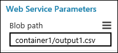

# Use Azure Machine Learning Studio web service parameters
An Azure Machine Learning web service is created by publishing an experiment that contains modules with configurable parameters. In some cases, you may want to change the module behavior while the web service is running. *Web Service Parameters* allow you to do this task. 

A common example is setting up the [Import Data][reader] module so that the user of the published web service can specify a different data source when the web service is accessed. Or configuring the [Export Data][writer] module so that a different destination can be specified. Some other examples include changing the number of bits for the [Feature Hashing][feature-hashing] module or the number of desired features for the [Filter-Based Feature Selection][filter-based-feature-selection] module. 

You can set Web Service Parameters and associate them with one or more module parameters in your experiment, and you can specify whether they are required or optional. The user of the web service can then provide values for these parameters when they call the web service. 

## How to set and use Web Service Parameters
You define a Web Service Parameter by clicking the icon next to the parameter for a module and selecting "Set as web service parameter". This creates a new Web Service Parameter and connects it to that module parameter. Then, when the web service is accessed, the user can specify a value for the Web Service Parameter and it is applied to the module parameter.

Once you define a Web Service Parameter, it's available to any other module parameter in the experiment. If you define a Web Service Parameter associated with a parameter for one module, you can use that same Web Service Parameter for any other module, as long as the parameter expects the same type of value. For example, if the Web Service Parameter is a numeric value, then it can only be used for module parameters that expect a numeric value. When the user sets a value for the Web Service Parameter, it will be applied to all associated module parameters.

You can decide whether to provide a default value for the Web Service Parameter. If you do, then the parameter is optional for the user of the web service. If you don't provide a default value, then the user is required to enter a value when the web service is accessed.

The API documentation for the web service includes information for the web service user on how to specify the Web Service Parameter programmatically when accessing the web service.

> [!NOTE]
> The API documentation for a classic web service is provided through the **API help page** link in the web service **DASHBOARD** in Machine Learning Studio. The API documentation for a new web service is provided through the [Azure Machine Learning Web Services](https://services.azureml.net/Quickstart) portal on the **Consume** and **Swagger API** pages for your web service.
> 
> 

## Example
As an example, let's assume we have an experiment with an [Export Data][writer] module that sends information to Azure blob storage. We'll define a Web Service Parameter named "Blob path" that allows the web service user to change the path to the blob storage when the service is accessed.

1. In Machine Learning Studio, click the [Export Data][writer] module to select it. Its properties are shown in the Properties pane to the right of the experiment canvas.
2. Specify the storage type:
   
   * Under **Please specify data destination**, select "Azure Blob Storage".
   * Under **Please specify authentication type**, select "Account".
   * Enter the account information for the Azure blob storage. 

3. Click the icon to the right of the **Path to blob beginning with container parameter**. It looks like this:
   
   
   
   Select "Set as web service parameter".
   
   An entry is added under **Web Service Parameters** at the bottom of the Properties pane with the name "Path to blob beginning with container". This is the Web Service Parameter that is now associated with this [Export Data][writer] module parameter.
4. To rename the Web Service Parameter, click the name, enter "Blob path", and press the **Enter** key. 
5. To provide a default value for the Web Service Parameter, click the icon to the right of the name, select "Provide default value", enter a value (for example, "container1/output1.csv"), and press the **Enter** key.
   
   
6. Click **Run**. 
7. Click **Deploy Web Service** and select **Deploy Web Service [Classic]** or **Deploy Web Service [New]** to deploy the web service.

> [!NOTE] 
> To deploy a New web service you must have sufficient permissions in the subscription to which you deploying the web service. For more information see, [Manage a Web service using the Azure Machine Learning Web Services portal](manage-new-webservice.md). 

The user of the web service can now specify a new destination for the [Export Data][writer] module when accessing the web service.

## More information
For a more detailed example, see the [Web Service Parameters](https://blogs.technet.com/b/machinelearning/archive/2014/11/25/azureml-web-service-parameters.aspx) entry in the [Machine Learning Blog](https://blogs.technet.com/b/machinelearning/archive/2014/11/25/azureml-web-service-parameters.aspx).

For more information on accessing a Machine Learning web service, see [How to consume an Azure Machine Learning Web service](consume-web-services.md).

<!-- Module References -->
[feature-hashing]: https://msdn.microsoft.com/library/azure/c9a82660-2d9c-411d-8122-4d9e0b3ce92a/
[filter-based-feature-selection]: https://msdn.microsoft.com/library/azure/918b356b-045c-412b-aa12-94a1d2dad90f/
[reader]: https://msdn.microsoft.com/library/azure/4e1b0fe6-aded-4b3f-a36f-39b8862b9004/
[writer]: https://msdn.microsoft.com/library/azure/7a391181-b6a7-4ad4-b82d-e419c0d6522c/

