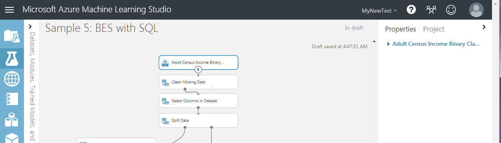

# Deploy Azure Machine Learning Studio (classic) web services that use Data Import and Data Export modules

When you create a predictive experiment, you typically add a web service input and output. When you deploy the experiment, consumers can send and receive data from the web service through the inputs and outputs. For some applications, a consumer's data may be available from a data feed or already reside in an external data source such as Azure Blob storage. In these cases, they do not need read and write data using web service inputs and outputs. They can, instead, use the Batch Execution Service (BES) to read data from the data source using an Import Data module and write the scoring results to a different data location using an Export Data module.

The Import Data and Export data modules, can read from and write to various data locations such as a Web URL via HTTP, a Hive Query, a database in Azure SQL Database, Azure Table storage, Azure Blob storage, a Data Feed provide, or a SQL Server database.

This topic uses the "Sample 5: Train, Test, Evaluate for Binary Classification: Adult Dataset" sample and assumes the dataset has already been loaded into an Azure SQL table named censusdata.

## Create the training experiment
When you open the "Sample 5: Train, Test, Evaluate for Binary Classification: Adult Dataset" sample it uses the sample Adult Census Income Binary Classification dataset. And the experiment in the canvas will look similar to the following image:

To read the data from the Azure SQL table:

1. Delete the dataset module.
2. In the components search box, type import.
3. From the results list, add an *Import Data* module to the experiment canvas.
4. Connect output of the *Import Data* module the input of the *Clean Missing Data* module.
5. In properties pane, select **Azure SQL Database** in the **Data Source** dropdown.
6. In the **Database server name**, **Database name**, **User name**, and **Password** fields, enter the appropriate information for your database.
7. In the Database query field, enter the following query.

     select [age],

        [workclass],
        [fnlwgt],
        [education],
        [education-num],
        [marital-status],
        [occupation],
        [relationship],
        [race],
        [sex],
        [capital-gain],
        [capital-loss],
        [hours-per-week],
        [native-country],
        [income]
     from dbo.censusdata;
8. At the bottom of the experiment canvas, click **Run**.

## Create the predictive experiment
Next you set up the predictive experiment from which you deploy your web service.

1. At the bottom of the experiment canvas, click **Set Up Web Service** and select **Predictive Web Service [Recommended]**.
2. Remove the *Web Service Input* and *Web Service Output modules* from the predictive experiment.
3. In the components search box, type export.
4. From the results list, add an *Export Data* module to the experiment canvas.
5. Connect output of the *Score Model* module the input of the *Export Data* module.
6. In properties pane, select **Azure SQL Database** in the data destination dropdown.
7. In the **Database server name**, **Database name**, **Server user account name**, and **Server user account password** fields, enter the appropriate information for your database.
8. In the **Comma separated list of columns to be saved** field, type Scored Labels.
9. In the **Data table name field**, type dbo.ScoredLabels. If the table does not exist, it is created when the experiment is run or the web service is called.
10. In the **Comma separated list of datatable columns** field, type ScoredLabels.

When you write an application that calls the final web service, you may want to specify a different input query or destination table at run time. To configure these inputs and outputs, use the Web Service Parameters feature to set the *Import Data* module *Data source* property and the *Export Data* mode data destination property.  For more information on Web Service Parameters, see the [Azure Machine Learning Studio Web Service Parameters entry](https://blogs.technet.microsoft.com/machinelearning/2014/11/25/azureml-web-service-parameters/) on the Cortana Intelligence and Machine Learning Blog.

To configure the Web Service Parameters for the import query and the destination table:

1. In the properties pane for the *Import Data* module, click the icon at the top right of the **Database query** field and select **Set as web service parameter**.
2. In the properties pane for the *Export Data* module, click the icon at the top right of the **Data table name** field and select **Set as web service parameter**.
3. At the bottom of the *Export Data* module properties pane, in the **Web Service Parameters** section, click Database query and rename it Query.
4. Click **Data table name** and rename it **Table**.

When you are done, your experiment should look similar to the following image:

Now you can deploy the experiment as a web service.

## Deploy the web service
You can deploy to either a Classic or New web service.

### Deploy a Classic Web Service
To deploy as a Classic Web Service and create an application to consume it:

1. At the bottom of the experiment canvas, click Run.
2. When the run has completed, click **Deploy Web Service** and select **Deploy Web Service [Classic]**.
3. On the web service dashboard, locate your API key. Copy and save it to use later.
4. In the **Default Endpoint** table, click the **Batch Execution** link to open the API Help Page.
5. In Visual Studio, create a C# console application: **New** > **Project** > **Visual C#** > **Windows Classic Desktop** > **Console App (.NET Framework)**.
6. On the API Help Page, find the **Sample Code** section at the bottom of the page.
7. Copy and paste the C# sample code into your Program.cs file, and remove all references to the blob storage.
8. Update the value of the *apiKey* variable with the API key saved earlier.
9. Locate the request declaration and update the values of Web Service Parameters that are passed to the *Import Data* and *Export Data* modules. In this case, you use the original query, but define a new table name.

        var request = new BatchExecutionRequest()
        {
            GlobalParameters = new Dictionary<string, string>() {
                { "Query", @"select [age], [workclass], [fnlwgt], [education], [education-num], [marital-status], [occupation], [relationship], [race], [sex], [capital-gain], [capital-loss], [hours-per-week], [native-country], [income] from dbo.censusdata" },
                { "Table", "dbo.ScoredTable2" },
            }
        };
10. Run the application.

On completion of the run, a new table is added to the database containing the scoring results.

### Deploy a New Web Service

> [!NOTE]
> To deploy a New web service you must have sufficient permissions in the subscription to which you deploying the web service. For more information, see [Manage a Web service using the Azure Machine Learning Web Services portal](manage-new-webservice.md).

To deploy as a New Web Service and create an application to consume it:

1. At the bottom of the experiment canvas, click **Run**.
2. When the run has completed, click **Deploy Web Service** and select **Deploy Web Service [New]**.
3. On the Deploy Experiment page, enter a name for your web service, and select a pricing plan, then click **Deploy**.
4. On the **Quickstart** page, click **Consume**.
5. In the **Sample Code** section, click **Batch**.
6. In Visual Studio, create a C# console application: **New** > **Project** > **Visual C#** > **Windows Classic Desktop** > **Console App (.NET Framework)**.
7. Copy and paste the C# sample code into your Program.cs file.
8. Update the value of the *apiKey* variable with the **Primary Key** located in the **Basic consumption info** section.
9. Locate the *scoreRequest* declaration and update the values of Web Service Parameters that are passed to the *Import Data* and *Export Data* modules. In this case, you use the original query, but define a new table name.

        var scoreRequest = new
        {
            Inputs = new Dictionary<string, StringTable>()
            {
            },
            GlobalParameters = new Dictionary<string, string>() {
                { "Query", @"select [age], [workclass], [fnlwgt], [education], [education-num], [marital-status], [occupation], [relationship], [race], [sex], [capital-gain], [capital-loss], [hours-per-week], [native-country], [income] from dbo.censusdata" },
                { "Table", "dbo.ScoredTable3" },
            }
        };
10. Run the application.

