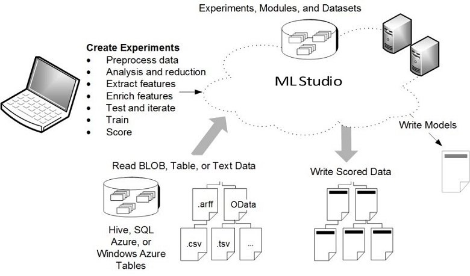

# What is Machine Learning Studio (classic)?

[!INCLUDE [Designer notice](../../../includes/designer-notice.md)]

Microsoft Azure Machine Learning Studio (classic) is a collaborative, drag-and-drop tool you can use to build, test, and deploy predictive analytics solutions on your data. Azure Machine Learning Studio (classic) publishes models as web services that can easily be consumed by custom apps or BI tools such as Excel.

Machine Learning Studio (classic) is where data science, predictive analytics, cloud resources, and your data meet.

## The Machine Learning Studio (classic)  interactive workspace
To develop a predictive analysis model, you typically use data from one or more sources, transform, and analyze that data through various data manipulation and statistical functions, and generate a set of results. Developing a model like this is an iterative process. As you modify the various functions and their parameters, your results converge until you are satisfied that you have a trained, effective model.

Azure Machine Learning Studio (classic) gives you an interactive, visual workspace to easily build, test, and iterate on a predictive analysis model. You drag-and-drop ***datasets*** and analysis ***modules*** onto an interactive canvas, connecting them together to form an ***experiment***, which you run in Machine Learning Studio (classic). To iterate on your model design, you edit the experiment, save a copy if desired, and run it again. When you're ready, you can convert your ***training experiment*** to a ***predictive experiment***, and then publish it as a ***web service*** so that your model can be accessed by others.

There is no programming required, visually connect datasets and modules to construct your predictive analysis model.

## How does Machine Learning Studio (classic) differ from Azure Machine Learning?

[Azure Machine Learning](../overview-what-is-azure-ml.md) provides both SDKs **-and-** the Azure Machine Learning designer, to quickly prep data, train and deploy machine learning models. The designer provides a similar drag-and-drop experience to Studio (classic). However, unlike the proprietary compute platform of Studio (classic), the designer uses your own compute resources and is fully integrated into Azure Machine Learning.

Here is a quick comparison:

|| Machine Learning Studio (classic) | Azure Machine Learning |
|---| --- | --- |
| Drag and drop interface | Yes | Yes - [Azure Machine Learning designer](../concept-designer.md) |
| Experiment | Scalable (10-GB training data limit) | Scale with compute target |
| Modules for drag-and-drop interface | Many | Initial set of popular [modules](../algorithm-module-reference/module-reference.md)|
|Training compute targets| Proprietary compute target, CPU support only| Supports Azure Machine Learning compute (GPU or CPU) and Notebook VMs. ([Other computes supported in SDK](../concept-compute-target.md#train))|
|Inferencing compute targets| Proprietary web service format, not customizable |  Azure Kubernetes Service and AML Compute  ([Other computes supported in SDK](../how-to-deploy-and-where.md)) |
| ML Pipeline | Not supported | [Pipelines](../concept-ml-pipelines.md) supported |
| MLOps | Basic model management and deployment | Configurable deployment - model and pipeline versioning and tracking |
| Model format | Proprietary format, Studio (classic) only | Standard format depending on training job type |
|Automated model training and hyperparameter tuning | No | Not yet in the designer   ([Supported in the SDK and workspace landing page](../concept-automated-ml.md)) | 

Try out the designer with [Tutorial: Predict automobile price with the designer](../tutorial-designer-automobile-price-train-score.md)

> [!NOTE]
> Models created in Studio (classic) can't be deployed or managed by Azure Machine Learning. However, models created and deployed in the designer can be managed through the Azure Machine Learning workspace.

## Download the Machine Learning Studio (classic) overview diagram
Download the **Microsoft Azure Machine Learning Studio (classic) Capabilities Overview** diagram and get a high-level view of the capabilities of Machine Learning Studio (classic). To keep it nearby, you can print the diagram in tabloid size (11 x 17 in.).

**Download the diagram here: [Microsoft Azure Machine Learning Studio (classic) Capabilities Overview](https://download.microsoft.com/download/C/4/6/C4606116-522F-428A-BE04-B6D3213E9E52/ml_studio_overview_v1.1.pdf)**

## Components of a Studio (classic)  experiment
An experiment consists of datasets that provide data to analytical modules, which you connect together to construct a predictive analysis model. Specifically, a valid experiment has these characteristics:

* The experiment has at least one dataset and one module
* Datasets may be connected only to modules
* Modules may be connected to either datasets or other modules
* All input ports for modules must have some connection to the data flow
* All required parameters for each module must be set

You can create an experiment from scratch, or you can use an existing sample experiment as a template. For more information, see [Copy example experiments to create new machine learning experiments](sample-experiments.md).

For an example of creating an experiment, see [Create a simple experiment in Azure Machine Learning Studio (classic)](create-experiment.md).

For a more complete walkthrough of creating a predictive analytics solution, see [Develop a predictive solution with Azure Machine Learning Studio (classic)](tutorial-part1-credit-risk.md).

### Datasets
A dataset is data that has been uploaded to Machine Learning Studio (classic) so that it can be used in the modeling process. A number of sample datasets are included with Machine Learning Studio (classic) for you to experiment with, and you can upload more datasets as you need them. Here are some examples of included datasets:

* **MPG data for various automobiles** - Miles per gallon (MPG) values for automobiles identified by number of cylinders, horsepower, etc.
* **Breast cancer data** - Breast cancer diagnosis data.
* **Forest fires data** - Forest fire sizes in northeast Portugal.

As you build an experiment, you can choose from the list of datasets available to the left of the canvas.

For a list of sample datasets included in Machine Learning Studio (classic), see [Use the sample data sets in Azure Machine Learning Studio (classic)](use-sample-datasets.md).

### Modules
A module is an algorithm that you can perform on your data. Azure Machine Learning Studio (classic) has a number of modules ranging from data ingress functions to training, scoring, and validation processes. Here are some examples of included modules:

* [Convert to ARFF][convert-to-arff] - Converts a .NET serialized dataset to Attribute-Relation File Format (ARFF).
* [Compute Elementary Statistics][elementary-statistics] - Calculates elementary statistics such as mean, standard deviation, etc.
* [Linear Regression][linear-regression] - Creates an online gradient descent-based linear regression model.
* [Score Model][score-model] - Scores a trained classification or regression model.

As you build an experiment, you can choose from the list of modules available to the left of the canvas.

A module may have a set of parameters that you can use to configure the module's internal algorithms. When you select a module on the canvas, the module's parameters are displayed in the **Properties** pane to the right of the canvas. You can modify the parameters in that pane to tune your model.

For some help navigating through the large library of machine learning algorithms available, see [How to choose algorithms for Microsoft Azure Machine Learning Studio (classic)](algorithm-choice.md).

## Deploying a predictive analytics web service
Once your predictive analytics model is ready, you can deploy it as a web service right from Machine Learning Studio (classic). For more information on this process, see [Deploy an Azure Machine Learning web service](deploy-a-machine-learning-web-service.md).

## Next steps
You can learn the basics of predictive analytics and machine learning using a [step-by-step quickstart](create-experiment.md) and by [building on samples](sample-experiments.md).

<!-- Module References -->
[convert-to-arff]: https://msdn.microsoft.com/library/azure/62d2cece-d832-4a7a-a0bd-f01f03af0960/
[elementary-statistics]: https://msdn.microsoft.com/library/azure/3086b8d4-c895-45ba-8aa9-34f0c944d4d3/
[linear-regression]: https://msdn.microsoft.com/library/azure/31960a6f-789b-4cf7-88d6-2e1152c0bd1a/
[score-model]: https://msdn.microsoft.com/library/azure/401b4f92-e724-4d5a-be81-d5b0ff9bdb33/
