# Agile development of data science projects

This document describes how developers can execute a data science project in a systematic, version controlled, and collaborative way within a project team by using the [Team Data Science Process](overview.md) (TDSP). The TDSP is a framework developed by Microsoft that provides a structured sequence of activities to execute cloud-based, predictive analytics solutions efficiently. For an outline of the personnel roles, and their associated tasks that are handled by a data science team standardizing on this process, see [Team Data Science Process roles and tasks](roles-tasks.md). 

This article includes instructions on how to: 

1. do **sprint planning** for work items involved in a project.  If you are unfamiliar with sprint planning, you can find details and general information [here](https://en.wikipedia.org/wiki/Sprint_(software_development) "here"). 
2. **add work items** to sprints. 

> [!NOTE]
> The steps needed to set up a TDSP team environment using Azure DevOps Services are outlined in the following set of instructions. They specify how to accomplish these tasks with Azure DevOps Services because that is how to implement TDSP at Microsoft.  If you choose to use Azure DevOps Services, items (3) and (4) in the previous list are benefits that you get naturally. If another code hosting platform is used for your group, the tasks that need to be completed by the team lead generally do not change. But the way to complete these tasks is going to be different. For example, the item in section six, **Link a work item with a Git branch**, might not be as easy as it is on Azure DevOps Services.
>
>

The following figure illustrates a typical sprint planning, coding, and source-control workflow involved in implementing a data science project:

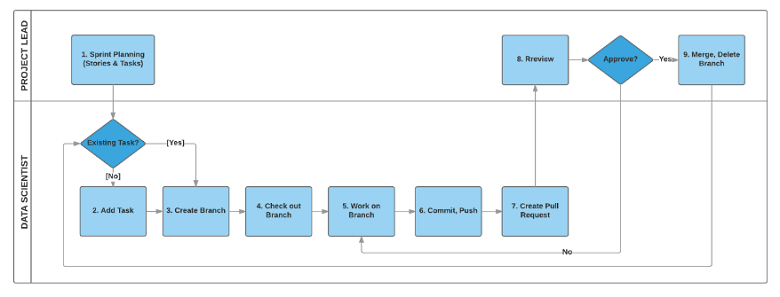

##  1. Terminology 

In the TDSP sprint planning framework, there are four frequently used types of **work items**: **Feature**, **User Story**, **Task**, and **Bug**. Each project maintains a single backlog for all work items. There is no backlog at the Git repository level under a project. Here are their definitions:

- **Feature**: A feature corresponds to a project engagement. Different engagements with a client are considered different features. Similarly, it is best to consider different phases of a project with a client as different features. If you choose a schema such as ***ClientName-EngagementName*** to name your features, then you can easily recognize the context of the project/engagement from the names themselves.
- **Story**: Stories are different work items that are needed to complete a feature (project) end-to-end. Examples of stories include:
	- Getting Data 
	- Exploring Data 
	- Generating Features
	- Building Models
	- Operationalizing Models 
	- Retraining Models
- **Task**: Tasks are assignable code or document work items or other activities that need to be done to complete a specific story. For example, tasks in the story *Getting Data* could be:
	-  Getting Credentials of SQL Server 
	-  Uploading Data to SQL Data Warehouse. 
- **Bug**: Bugs usually refer to fixes that are needed for an existing code or document that are done when completing a task. If the bug is caused by missing stages or tasks respectively, it can escalate to being a story or a task. 

> [!NOTE]
> Concepts are borrowed of features, stories, tasks, and bugs from software code management (SCM) to be used in data science. They might differ slightly from their conventional SCM definitions.
>
>

> [!NOTE]
> Data scientists may feel more comfortable using an agile template that specifically aligns with the TDSP lifecycle stages. With that in mind, an Agile-derived sprint planning template has been created, where Epics, Stories etc. are replaced by TDSP lifecycle stages or substages. For instructions on how to create an agile template, see [Set up agile data science process in Visual Studio Online](agile-development.md#set-up-agile-dsp-6).
>
>

## 2. Sprint planning 

Sprint planning is useful for project prioritization, and resource planning and allocation. Many data scientists are engaged with multiple projects, each of which can take months to complete. Projects often proceed at different paces. On the Azure DevOps Services, you can easily create, manage, and track work items in your project and conduct sprint planning to ensure that your projects are moving forward as expected. 

Follow [this link](https://www.visualstudio.com/en-us/docs/work/scrum/sprint-planning) for the step-by-step instructions on sprint planning in Azure DevOps Services. 

## 3. Add a feature  

After your project repository is created under a project, go to the team **Overview** page and click **Manage work**.

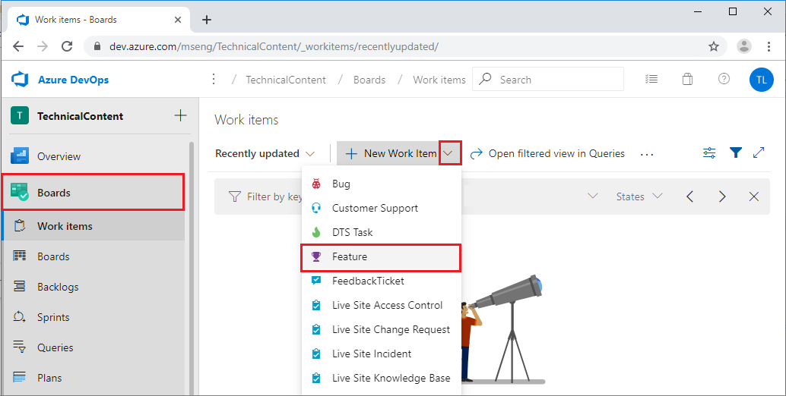

To include a feature in the backlog, click **Backlogs** --> **Features** --> **New**, type in the feature **Title** (usually your project name), and then click **Add** .

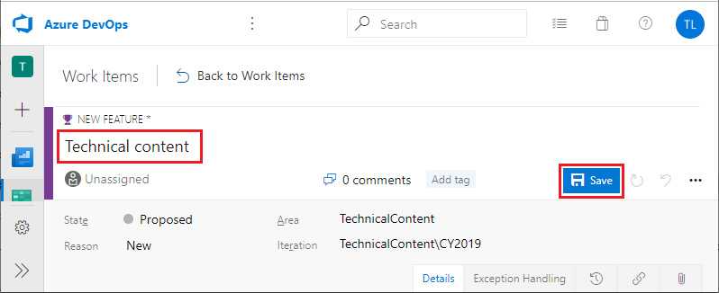

Double-click the feature you created. Fill in the descriptions, assign team members for this feature, and set planning parameters for this feature. 

You can also link this feature to the project repository. Click **Add link** under the **Development** section. After you have finished editing the feature, click **Save & Close** to exit.

## 4. Add Story under feature 

Under the feature, stories can be added to describe major steps needed to finish the (feature) project. To add a new story, click the **+** sign to the left of the feature in backlog view.  

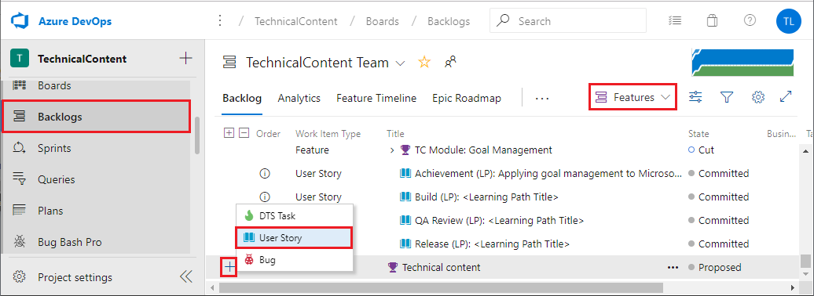

You can edit the details of the story, such as the status, description, comments, planning, and priority In the pop-up window.

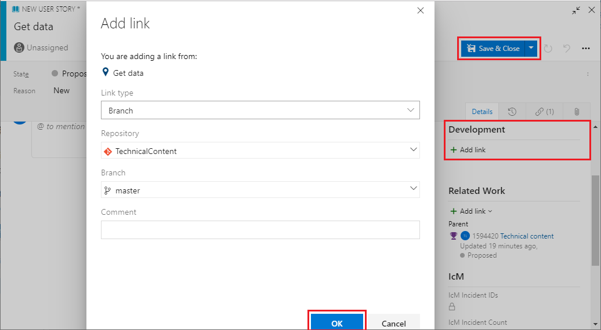

You can link this story to an existing repository by clicking **+ Add link** under **Development**. 

## 5. Add a task to a story 

Tasks are specific detailed steps that are needed to complete each story. After all tasks of a story are completed, the story should be completed too. 

To add a task to a story, click the **+** sign next to the story item, select **Task**, and then fill in the detailed information of this task in the pop-up window.

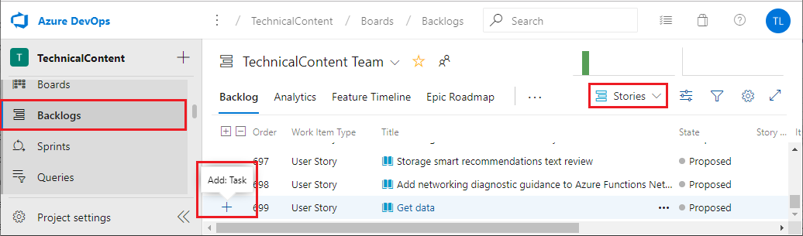

After the features, stories, and tasks are created, you can view them in the **Backlog** or **Board** views to track their status.

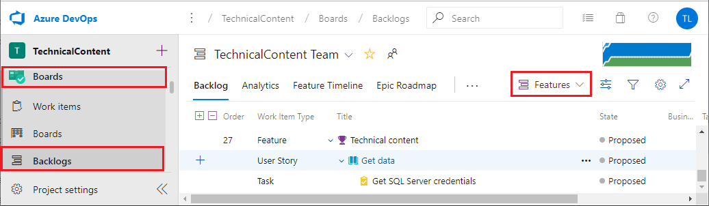

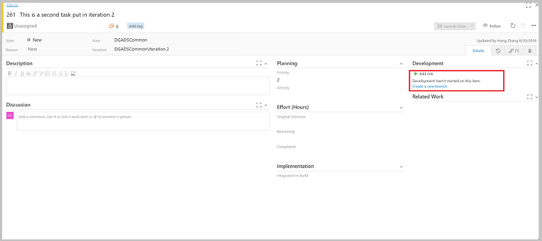

## 6.  Set up an Agile TDSP work template in Visual Studio Online

This article explains how to set up an agile data science process template that uses the TDSP data science lifecycle stages and tracks work items with Visual Studio Online (vso). The steps below walk through an example of setting up the data science-specific agile process template *AgileDataScienceProcess* and show how to create data science work items based on the template.

### Agile Data Science Process Template Setup

1. Navigate to server homepage,  **Configure** -> **Process**.

	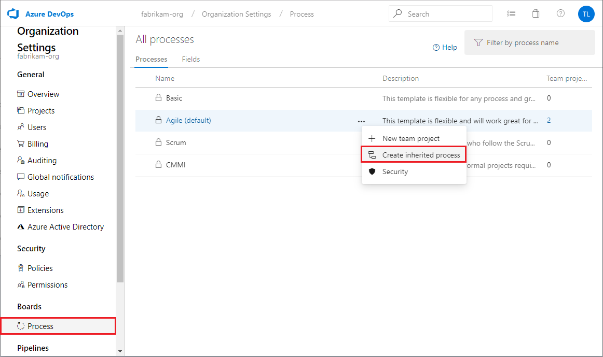 

2. Navigate to **All processes** -> **Processes**, under **Agile** and click on **Create inherited process**. Then put the process name "AgileDataScienceProcess" and click **Create process**.

	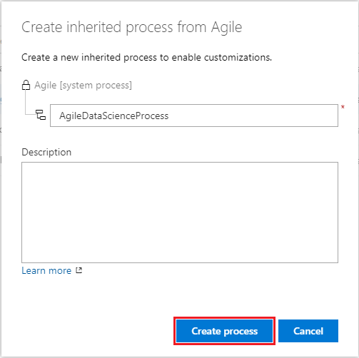

3. Under the **AgileDataScienceProcess** -> **Work item types** tab, disable **Epic**, **Feature**, **User Story**, and **Task** work item types by **Configure -> Disable**

	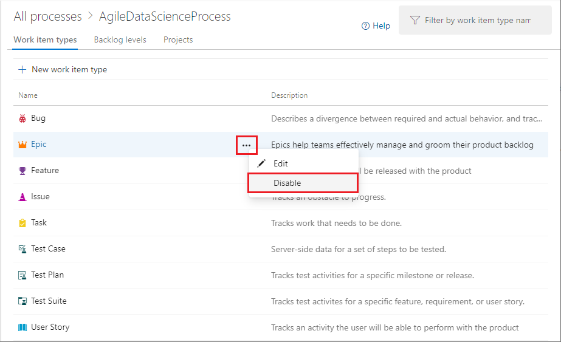

4. Navigate to **AgileDataScienceProcess** -> **Backlog levels** tab. Rename "Epics" to "TDSP Projects" by  clicking on the **Configure** -> **Edit/Rename**. In the same dialog box, click **+New work item type** in "Data Science Project" and set the value of **Default work item type** to "TDSP Project" 

	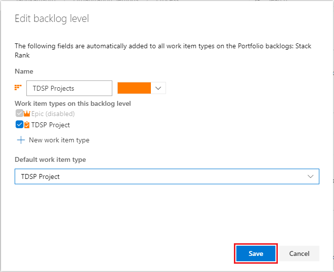  

5. Similarly, change Backlog name "Features" to "TDSP Stages" and add the following to the **New work item type**:

	- Business Understanding
	- Data Acquisition
	- Modeling
	- Deployment

6. Rename "User Story" to "TDSP Substages" with default work item type set to newly created "TDSP Substage" type.

7. Set the "Tasks" to newly created Work item type "TDSP Task" 

8. After these steps, the Backlog levels should look like this:

	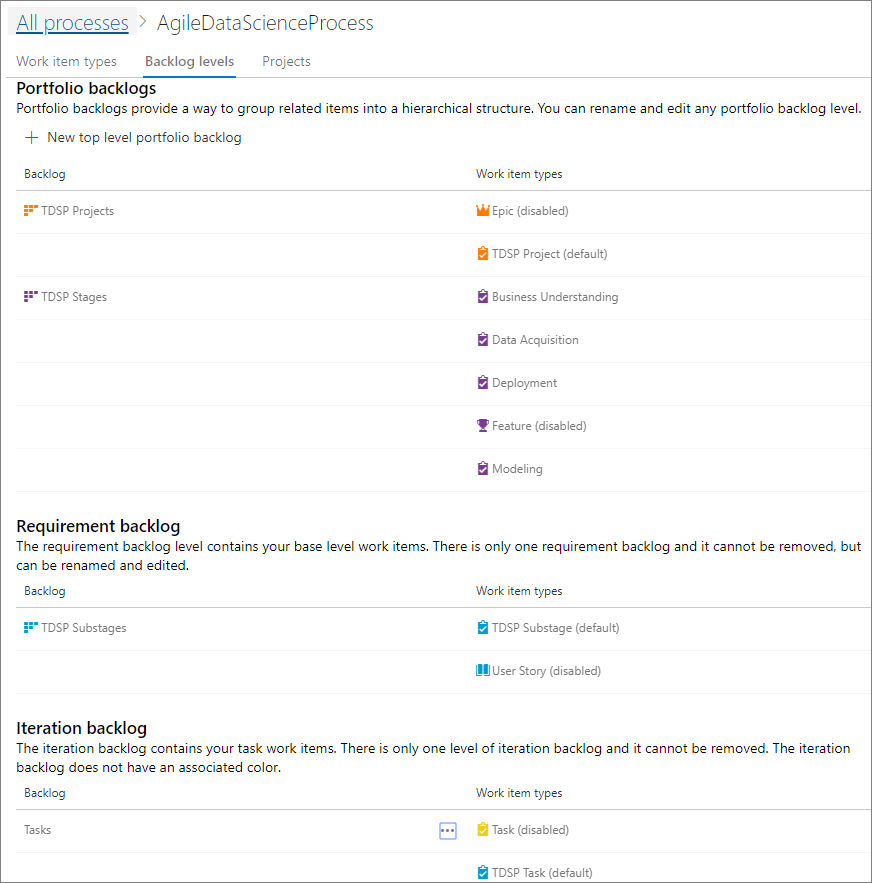  

 
### Create Data Science Work Items

After the data science process template is created, you can create and track your data science work items that correspond to the TDSP lifecycle.

1. When you create a new project, select "Agile\AgileDataScienceProcess" as the **Work item process**:

	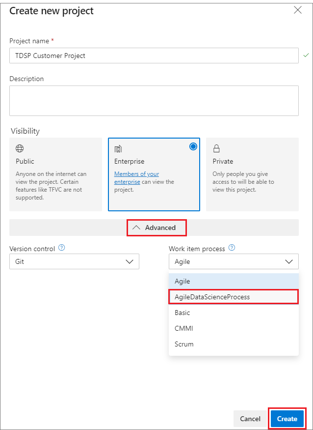

2. Navigate to the newly created project, and click on **Work** -> **Backlogs**.

3. Make "TDSP Projects" visible by clicking on **Configure team settings** and check "TDSP Projects"; then save.

	

4. Now you can start creating the data science-specific work items.

	

5. Here is an example of how the data science project work items should appear:

	

## Next steps

[Collaborative coding with Git](collaborative-coding-with-git.md) describes how to do collaborative code development for data science projects using Git as the shared code development framework and how to link these coding activities to the work planned with the agile process.

Here are additional links to resources on agile processes.

- Agile process
	[https://www.visualstudio.com/en-us/docs/work/guidance/agile-process](https://www.visualstudio.com/en-us/docs/work/guidance/agile-process)
- Agile process work item types and workflow
	[https://www.visualstudio.com/en-us/docs/work/guidance/agile-process-workflow](https://www.visualstudio.com/en-us/docs/work/guidance/agile-process-workflow)

Walkthroughs that demonstrate all the steps in the process for **specific scenarios** are also provided. They are listed and linked with thumbnail descriptions in the [Example walkthroughs](walkthroughs.md) article. They illustrate how to combine cloud, on-premises tools, and services into a workflow or pipeline to create an intelligent application. 
