# Data science code testing with the UCI adult income prediction dataset
This article gives preliminary guidelines for testing code in a data science workflow. Such testing gives data scientists a systematic and efficient way to check the quality and expected outcome of their code. We use a Team Data Science Process (TDSP) [project that uses the UCI Adult Income dataset](https://github.com/Azure/MachineLearningSamples-TDSPUCIAdultIncome) that we published earlier to show how code testing can be done. 

## Introduction on code testing
"Unit testing" is a longstanding practice for software development. But for data science, it's often not clear what that means and how you should test code for different stages of a data science lifecycle, such as:

* Data preparation
* Data quality examination
* Modeling
* Model deployment 

This article replaces the term "unit testing" with "code testing." It refers to testing as the functions that help to assess if code for a certain step of a data science lifecycle is producing results "as expected." The person who's writing the test defines what's "as expected," depending on the outcome of the function--for example, data quality check or modeling.

This article provides references as useful resources.

## Azure DevOps for the testing framework
This article describes how to perform and automate testing by using Azure DevOps. You might decide to use alternative tools. We also show how to set up an automatic build by using Azure DevOps and build agents. For build agents, we use Azure Data Science Virtual Machines (DSVMs).

## Flow of code testing
The overall workflow of testing code in a data science project looks like this: 

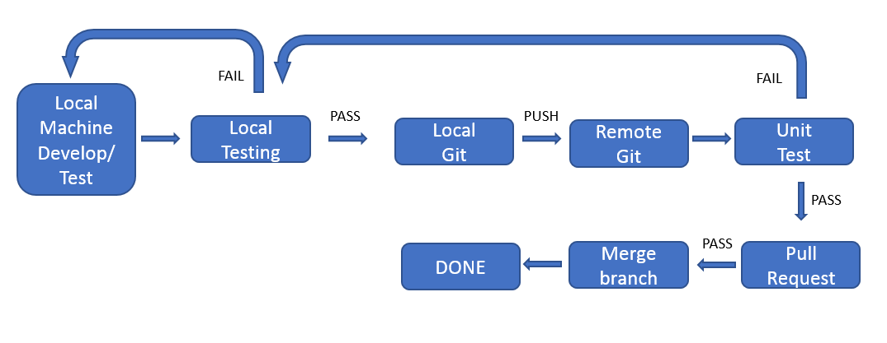

    
## Detailed steps

Use the following steps to set up and run code testing and an automated build by using a build agent and Azure DevOps:

1. Create a project in the Visual Studio desktop application:

    

   After you create your project, you'll find it in Solution Explorer in the right pane:
	
    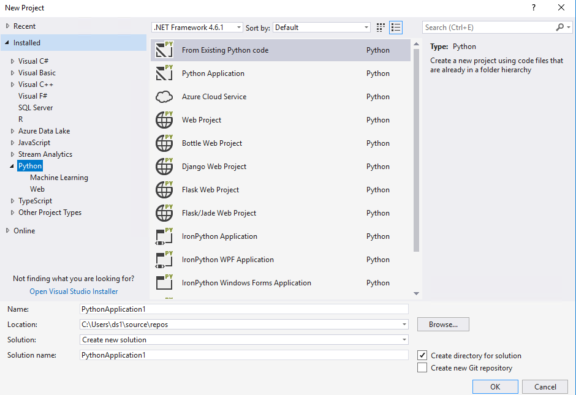

    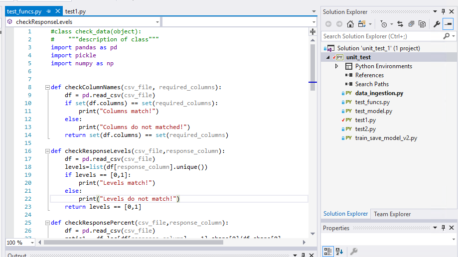

1. Feed your project code into the Azure DevOps project code repository: 

    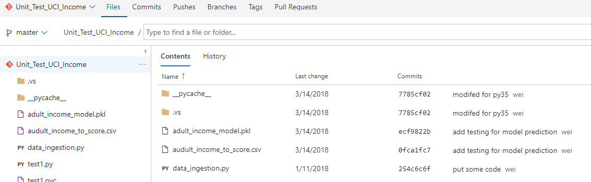

1. Suppose you've done some data preparation work, such as data ingestion, feature engineering, and creating label columns. You want to make sure your code is generating the results that you expect. Here's some code that you can use to test whether the data-processing code is working properly:

	* Check that column names are right:
	
      

	* Check that response levels are right:

      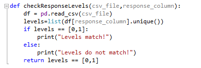

	* Check that response percentage is reasonable:

      

	* Check the missing rate of each column in the data:
	
      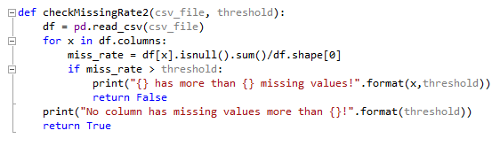

1. After you've done the data processing and feature engineering work, and you've trained a good model, make sure that the model you trained can score new datasets correctly. You can use the following two tests to check the prediction levels and distribution of label values:

	* Check prediction levels:
	
	  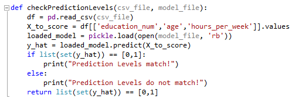

	* Check the distribution of prediction values:

      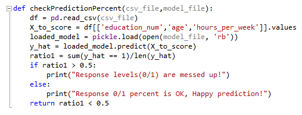

1. Put all test functions together into a Python script called **test_funcs.py**:

    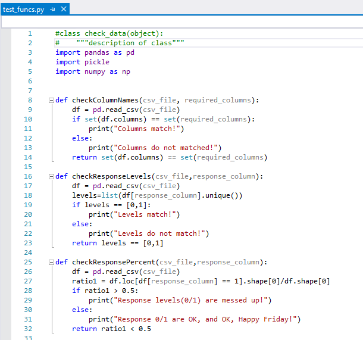

1. After the test codes are prepared, you can set up the testing environment in Visual Studio.

   Create a Python file called **test1.py**. In this file, create a class that includes all the tests you want to do. The following example shows six tests prepared:
	
	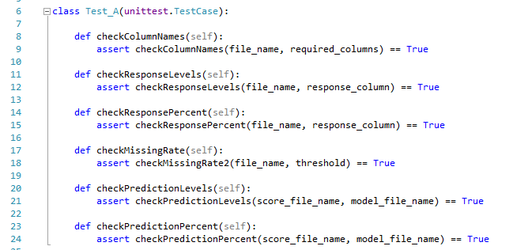

1. Those tests can be automatically discovered if you put **codetest.testCase** after your class name. Open Test Explorer in the right pane, and select **Run All**. All the tests will run sequentially and will tell you if the test is successful or not.

    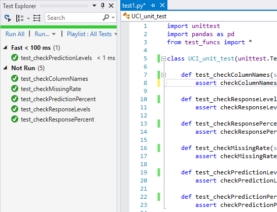

1. Check in your code to the project repository by using Git commands. Your most recent work will be reflected shortly in Azure DevOps.

    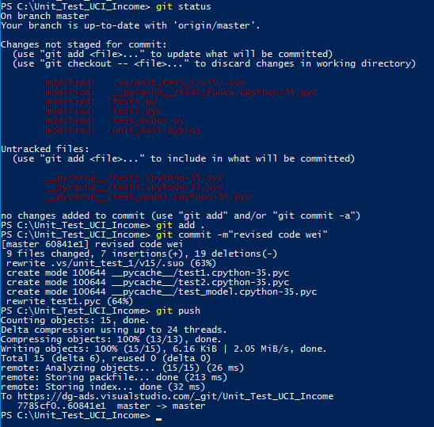

    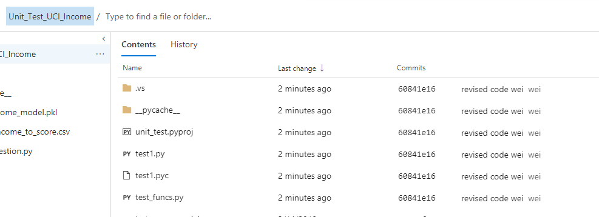

1. Set up automatic build and test in Azure DevOps:

	a. In the project repository, select **Build and Release**, and then select **+New** to create a new build process.

       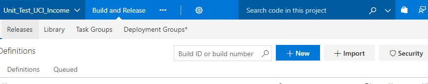

	b. Follow the prompts to select your source code location, project name, repository, and branch information.
	
       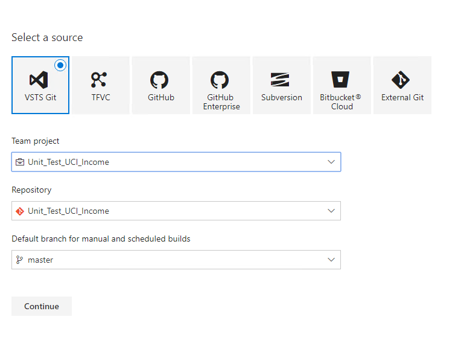

	c. Select a template. Because there's no Python project template, start by selecting **Empty process**. 

       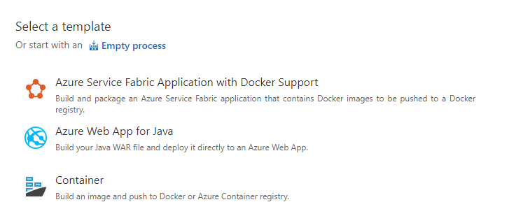

	d. Name the build and select the agent. You can choose the default here if you want to use a DSVM to finish the build process. For more information about setting agents, see [Build and release agents](https://docs.microsoft.com/azure/devops/pipelines/agents/agents?view=vsts).
	
       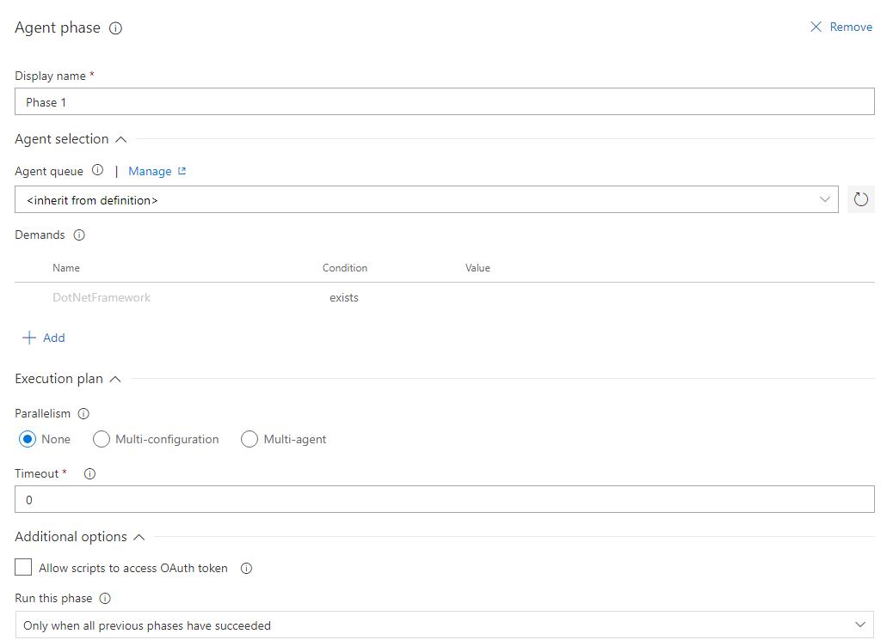

	e. Select **+** in the left pane, to add a task for this build phase. Because we're going to run the Python script **test1.py** to finish all the checks, this task is using a PowerShell command to run Python code.
	
       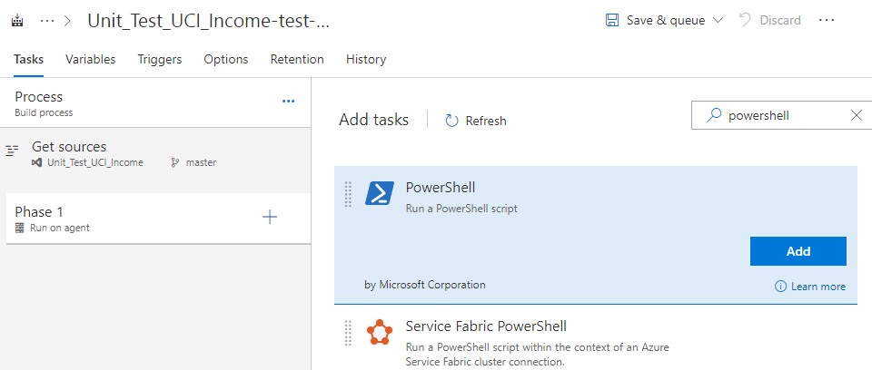

	f. In the PowerShell details, fill in the required information, such as the name and version of PowerShell. Choose **Inline Script** as the type. 
    
       In the box under **Inline Script**, you can type **python test1.py**. Make sure the environment variable is set up correctly for Python. If you need a different version or kernel of Python, you can explicitly specify the path as shown in the figure: 
	
       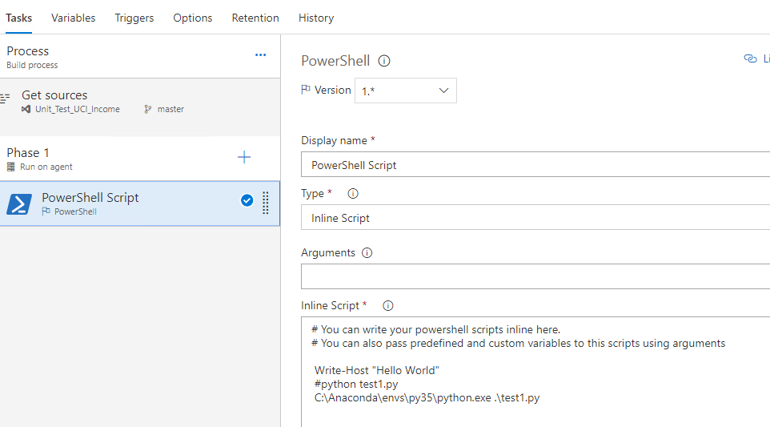

	g. Select **Save & queue** to finish the build pipeline process.

       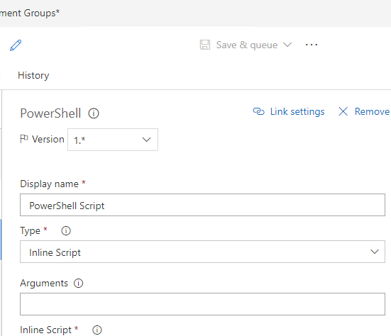

Now every time a new commit is pushed to the code repository, the build process will start automatically. (Here we use master as the repository, but you can define any branch.) The process runs the **test1.py** file in the agent machine to make sure that everything defined in the code runs correctly. 

If alerts are set up correctly, you'll be notified in email when the build is finished. You can also check the build status in Azure DevOps. If it fails, you can check the details of the build and find out which piece is broken.

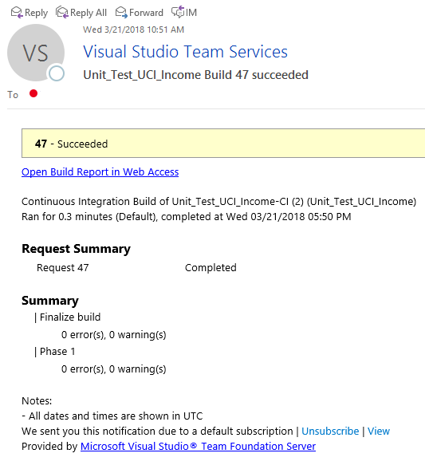

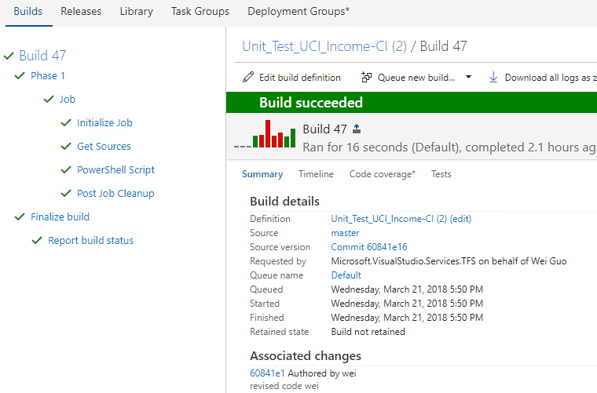

## Next steps
* See the [UCI income prediction repository](https://github.com/Azure/MachineLearningSamples-TDSPUCIAdultIncome) for concrete examples of unit tests for data science scenarios.
* Follow the preceding outline and examples from the UCI income prediction scenario in your own data science projects.

## References
* [Team Data Science Process](https://aka.ms/tdsp)
* [Visual Studio Testing Tools](https://www.visualstudio.com/vs/features/testing-tools/)
* [Azure DevOps Testing Resources](https://www.visualstudio.com/team-services/)
* [Data Science Virtual Machines](https://azure.microsoft.com/services/virtual-machines/data-science-virtual-machines/)