# Collaborative coding with Git

In this article we describe how to do collaborative code development for data science projects using Git as the shared code development framework. It covers how to link these coding activities to the work planned in [Agile development](agile-development.md) and how to do code reviews.

## 1. Link a work item with a Git branch 

Azure DevOps Services provides a convenient way to connect a work item (a story or task) with a Git branch. This enables you to link your story or task directly to the code associated with it. 

To connect a work item to a new branch, double-click a work item, and in the pop-up window, click **Create a new branch** under **+ Add link**.  

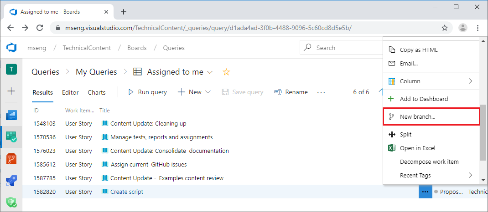

Provide the information for this new branch, such as the branch name, base Git repository, and the branch. The Git repository  chosen must be the repository under the same project that the work item belongs to. The base branch can be the master branch or some other existing branch.

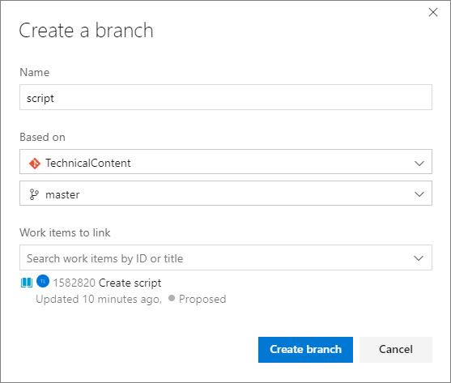

A good practice is to create a Git branch for each story work item. Then, for each task work item, you create a branch based on the story branch. Organizing the branches in this hierarchical way that corresponds to the story-task relationships is helpful when you have multiple people working on different stories of the same project, or you have multiple people working on different tasks of the same story. Conflicts can be minimized when each team member works on a different branch and when each member works on different codes or other artifacts when sharing a branch. 

The following picture depicts the recommended branching strategy for TDSP. You might not need as many branches as are shown here, especially when you only have one or two people working on the same project, or only one person works on all tasks of a story. But separating the development branch from the master branch is always a good practice. This can help prevent the release branch from being interrupted by the development activities. More complete description of Git branch model can be found in [A Successful Git Branching Model](https://nvie.com/posts/a-successful-git-branching-model/).

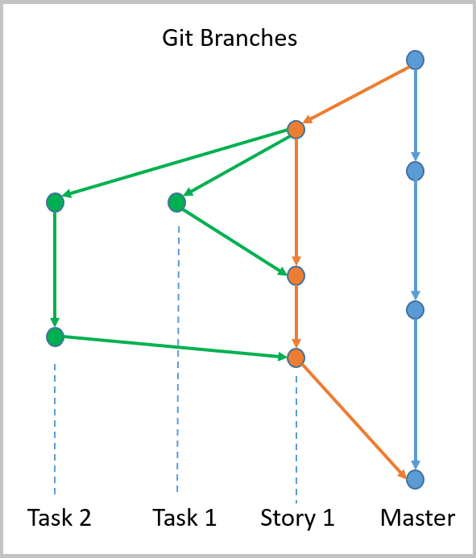

To switch to the branch that you want to work on, run the following command in a shell command (Windows or Linux). 

	git checkout <branch name>

Changing the *<branch name\>* to **master** switches you back to the **master** branch. After you switch to the working branch, you can start working on that work item, developing the code or documentation artifacts needed to complete the item. 

You can also link a work item to an existing branch. In the **Detail** page of a work item, instead of clicking **Create a new branch**, you click **+ Add link**. Then, select the branch you want to link the work item to. 

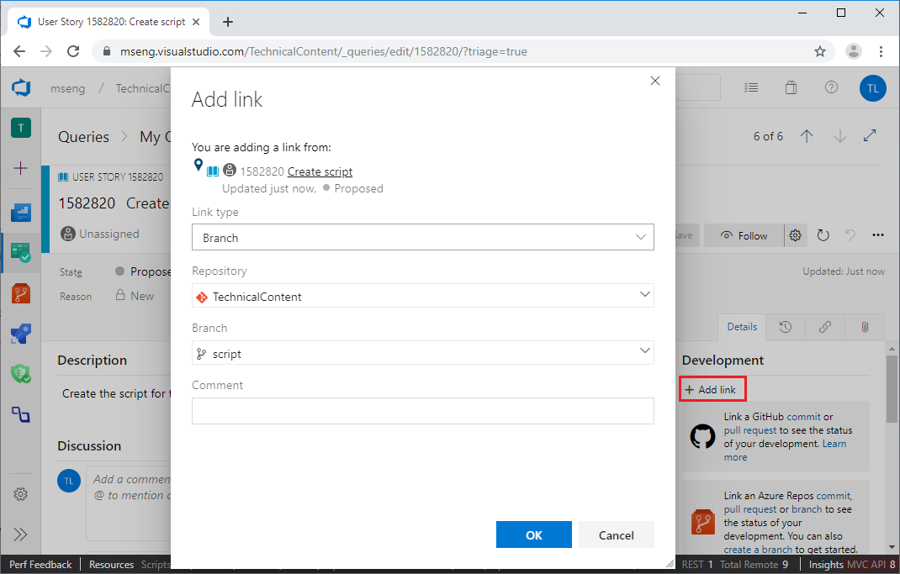

You can also create a new branch in Git Bash commands. If <base branch name\> is missing, the <new branch name\> is based on _master_ branch. 
	
	git checkout -b <new branch name> <base branch name>

## 2. Work on a branch and commit the changes 

Now suppose you make some change to the *data\_ingestion* branch for the work item, such as adding an R file on the branch in your local machine. You can commit the R file added to the branch for this work item, provided you are in that branch in your Git shell, using the following Git commands:

	git status
	git add .
	git commit -m"added a R scripts"
	git push origin data_ingestion

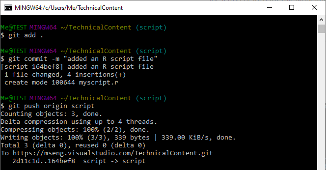

## 3. Create a pull request on Azure DevOps Services 

When you are ready after a few commits and pushes, to merge the current branch into its base branch, you can submit a **pull request** on Azure DevOps Services. 

Go to the main page of your project and click **CODE**. Select the branch to be merged and the Git repository name that you want to merge the branch into. Then click **Pull Requests**, click **New pull request** to create a pull request review before the work on the branch is merged to its base branch.

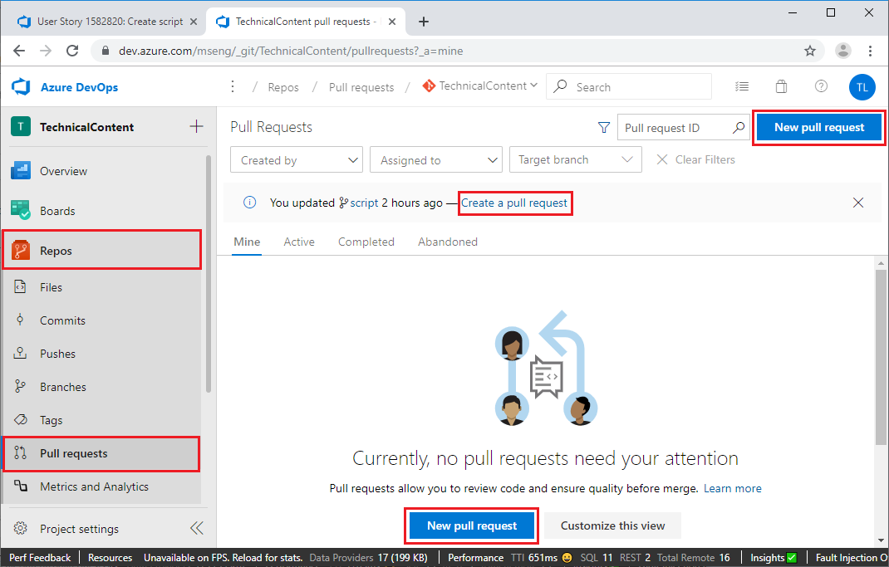

Fill in some description about this pull request, add reviewers, and send it out.

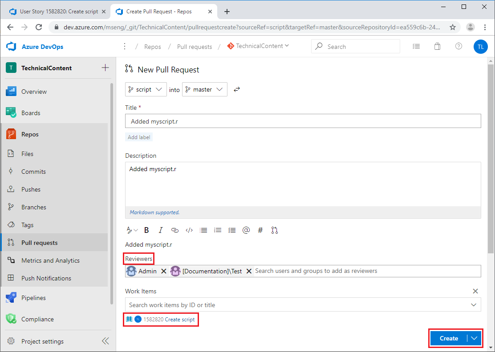

## 4. Review and merge 

When the pull request is created, your reviewers get an email notification to review the pull requests. The reviewers need to check whether the changes are working or not and test the changes with the requester if possible. Based on their assessment, the reviewers can approve or reject the pull request. 

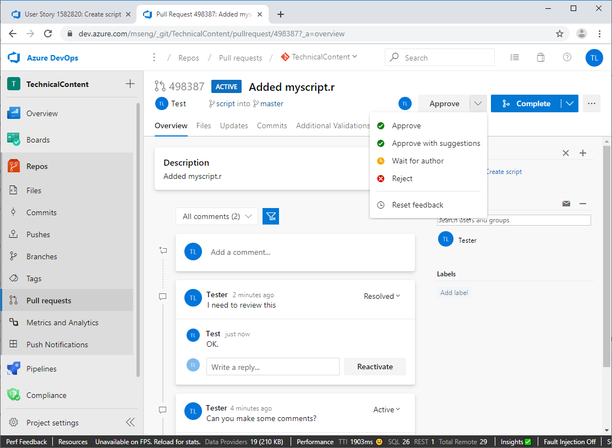

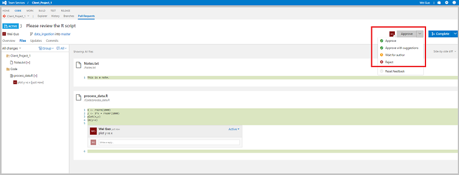

After the review is done, the working branch is merged to its base branch by clicking the **Complete** button. You may choose to delete the working branch after it has merged. 

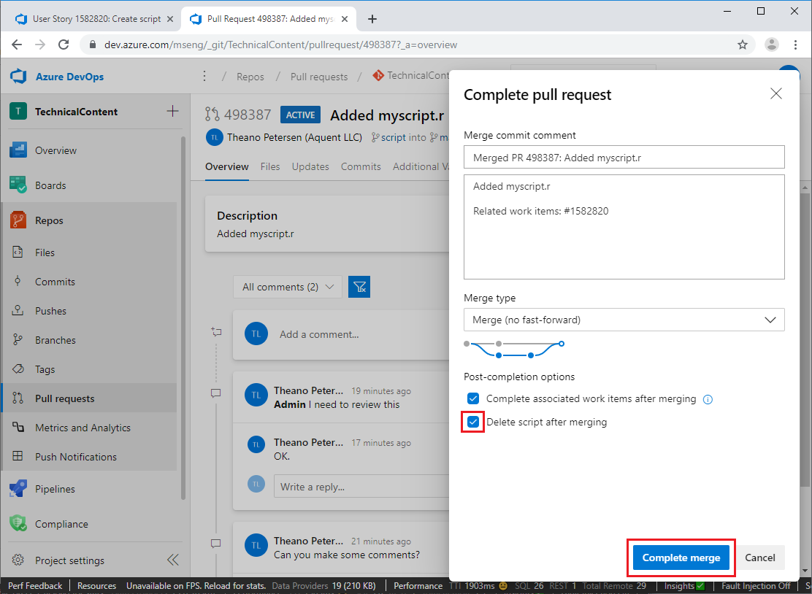

Confirm on the top left corner that the request is marked as **COMPLETED**. 

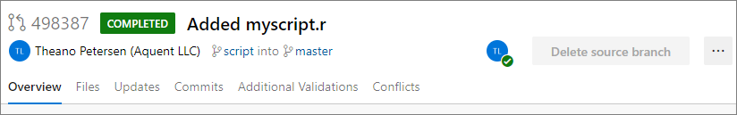

When you go back to the repository under **CODE**, you are told that you have been switched to the master branch.

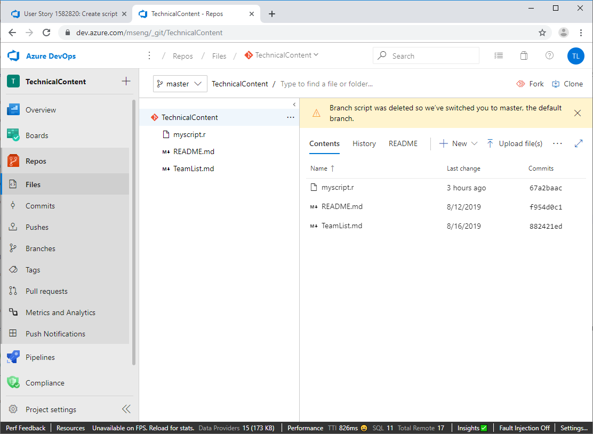

You can also use the following Git commands to merge your working branch to its base branch and delete the working branch after merging:

	git checkout master
	git merge data_ingestion
	git branch -d data_ingestion

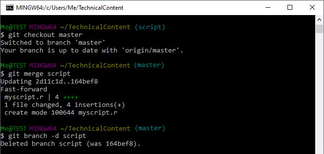

 
## Next steps

[Execute of data science tasks](execute-data-science-tasks.md) shows how to use utilities to complete several common data science tasks such as interactive data exploration, data analysis, reporting, and model creation.

Walkthroughs that demonstrate all the steps in the process for **specific scenarios** are also provided. They are listed and linked with thumbnail descriptions in the [Example walkthroughs](walkthroughs.md) article. They illustrate how to combine cloud, on-premises tools, and services into a workflow or pipeline to create an intelligent application. 

