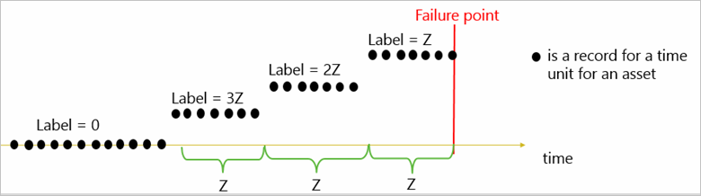

# Azure AI guide for predictive maintenance solutions

## Summary

Predictive maintenance (**PdM**) is a popular application of predictive analytics that can help businesses in several industries achieve high asset utilization and savings in operational costs. This guide brings together the business and analytical guidelines and best practices to successfully develop and deploy PdM solutions using the [Microsoft Azure AI platform](https://azure.microsoft.com/overview/ai-platform) technology.

For starters, this guide introduces industry-specific business scenarios and the process of qualifying these scenarios for PdM. The data requirements and modeling techniques to build PdM solutions are also provided. The main content of the guide is on the data science process - including the steps of data preparation, feature engineering, model creation, and model operationalization. To complement these key concepts, this guide lists a set of solution templates to help accelerate PdM application development. The guide also points to useful training resources for the practitioner to learn more about the AI behind the data science. 

### Data Science guide overview and target audience
The first half of this guide describes typical business problems, the benefits of implementing PdM to address these problems, and lists some common use cases. Business decision makers (BDMs) will benefit from this content. The second half explains the data science behind PdM, and provides a list of PdM solutions built using the principles outlined in this guide. It also provides learning paths and pointers to training material. Technical decision makers (TDMs) will find this content useful.

| Start with ... | If you are ... |
|:---------------|:---------------|
| [Business case for predictive maintenance](#business-case-for-predictive-maintenance) |a business decision maker (BDM) looking to reduce downtime and operational costs, and improve utilization of  equipment |
| [Data Science for predictive maintenance](#data-science-for-predictive-maintenance) |a technical decision maker (TDM) evaluating PdM technologies to understand the unique data processing and AI requirements for predictive maintenance |
| [Solution templates for predictive maintenance](#solution-templates-for-predictive-maintenance)|a software architect or AI Developer looking to quickly stand up a demo or a proof-of-concept |
| [Training resources for predictive maintenance](#training-resources-for-predictive-maintenance) | any or all of the above, and want to learn the foundational concepts behind the data science, tools, and techniques.

### Prerequisite knowledge
The BDM content does not expect the reader to have any prior data science knowledge. For the TDM content, basic knowledge of statistics and data science is helpful. Knowledge of Azure Data and AI services, Python, R, XML, and JSON is recommended. AI techniques are implemented in Python and R packages. Solution templates are implemented using Azure services, development tools, and SDKs.

## Business case for predictive maintenance

Businesses require critical equipment to be running at peak efficiency and utilization to realize their return on capital investments. These assets could range from aircraft engines, turbines, elevators, or industrial chillers - that cost millions - down to everyday appliances like photocopiers, coffee machines, or water coolers.
- By default, most businesses rely on _corrective maintenance_, where parts are replaced as and when they fail. Corrective maintenance ensures parts are used completely (therefore not wasting component life), but costs the business in downtime, labor, and unscheduled maintenance requirements (off hours, or inconvenient locations).
- At the next level, businesses practice  _preventive maintenance_, where they determine the useful lifespan for a part, and maintain or replace it before a failure. Preventive maintenance avoids unscheduled and catastrophic failures. But the high costs of scheduled downtime, under-utilization of the component before its full lifetime of use, and labor still remain.
- The goal of _predictive maintenance_ is to optimize the balance between corrective and preventative maintenance, by enabling _just in time_ replacement of components. This approach only replaces those components when they are close to a failure. By extending component lifespans (compared to preventive maintenance) and reducing unscheduled maintenance and labor costs (over corrective maintenance), businesses can gain cost savings and competitive advantages.

## Business problems in PdM
Businesses face high operational risk due to unexpected failures and have limited insight into the root cause of problems in complex systems. Some of the key business questions are:

- Detect anomalies in equipment or system performance or functionality.
- Predict whether an asset may fail in the near future.
- Estimate the remaining useful life of an asset.
- Identify the main causes of failure of an asset.
- Identify what maintenance actions need to be done, by when, on an asset.

Typical goal statements from PdM are:

- Reduce operational risk of mission critical equipment.
- Increase rate of return on assets by predicting  failures before they occur.
- Control cost of maintenance by enabling just-in-time maintenance operations.
- Lower customer attrition, improve brand image, and lost sales.
- Lower inventory costs by reducing inventory levels by predicting the reorder point.
- Discover patterns connected to various maintenance problems.
- Provide KPIs (key performance indicators) such as health scores for asset conditions.
- Estimate remaining lifespan of assets.
- Recommend timely maintenance activities.
- Enable just in time inventory by estimating order dates for replacement of parts.

These goal statements are the starting points for:

- _data scientists_ to analyze and solve specific predictive problems.
- _cloud architects and developers_ to put together an end to end solution.

## Qualifying problems for predictive maintenance
It is important to emphasize that not all use cases or business problems can be effectively solved by PdM. There are three important qualifying criteria that need to be considered during problem selection:

- The problem has to be predictive in nature; that is, there should be a target or an outcome to predict. The problem should also have a clear path of action to prevent failures when they are detected.
- The problem should have a record of the operational history of the equipment that contains _both good and bad outcomes_. The set of actions taken to mitigate bad outcomes should also be available as part of these records. Error reports, maintenance logs of performance degradation, repair, and replace logs are also important. In addition, repairs undertaken to improve them, and replacement records are also useful.
- The recorded history should be reflected in _relevant_ data that is of _sufficient_ enough quality to support the use case. For more information about data relevance and sufficiency, see [Data requirements for predictive maintenance](#data-requirements-for-predictive-maintenance).
- Finally, the business should have domain experts who have a clear understanding of the problem. They should be aware of the internal processes and practices to be able to help the analyst understand and interpret the data. They should also be able to make the necessary changes to existing business processes to help collect the right data for the problems, if needed.

## Sample PdM use cases
This section focuses on a collection of PdM use cases from several industries such as Aerospace, Utilities, and Transportation. Each section starts with a business problem, and discusses the benefits of PdM, the relevant data surrounding the business problem, and finally the benefits of a PdM solution.

| Business Problem | Benefits from PdM |
|:-----------------|-------------------|
|**Aviation**      |                   |
|_Flight delay and cancellations_ due to mechanical problems. Failures that cannot be repaired in time may cause flights to be canceled, and disrupt scheduling and operations. |PdM solutions can predict the probability of an aircraft being delayed or canceled due to mechanical failures.|
|_Aircraft engine parts failure_: Aircraft engine part replacements are among the most common maintenance tasks within the airline industry. Maintenance solutions require careful management of component stock availability, delivery, and planning|Being able to gather intelligence on component reliability leads to substantial reduction on investment costs.|
|**Finance** |                         |
|_ATM failure_ is a common problem within the banking industry. The problem here is to report the probability that an ATM cash withdrawal transaction gets interrupted due to a paper jam or part failure in the cash dispenser. Based on predictions of transaction failures, ATMs can be serviced proactively to prevent failures from occurring.| Rather than allow the machine to fail midway through a transaction, the desirable alternative is to program the machine to deny service based on the prediction.|
|**Energy** |                          |
|_Wind turbine failures_: Wind turbines are the main energy source in environmentally responsible countries/regions, and involve high capital costs. A key component in wind turbines is the generator motor. its failure renders the turbine ineffective. It is also highly expensive to fix.|Predicting KPIs such as MTTF (mean time to failure) can help the energy companies prevent turbine failures, and ensure minimal downtime. Failure probabilities will inform technicians to monitor turbines that are likely to fail soon, and schedule time-based maintenance regimes. Predictive models provide insights into different factors that contribute to the failure, which helps technicians better understand the root causes of problems.|
|_Circuit breaker failures_: Distribution of electricity to homes and businesses requires power lines to be operational at all times to guarantee energy delivery. Circuit breakers help limit or avoid damage to power lines during overloading or adverse weather conditions. The business problem here is to predict circuit breaker failures.| PdM solutions help reduce repair costs and increase the lifespan of equipment such as circuit breakers. They help improve the quality of the power network by reducing unexpected failures and service interruptions.|
|**Transportation and logistics** |    |
|_Elevator door failures_: Large elevator companies provide a full stack service for millions of functional elevators around the world. Elevator safety, reliability, and uptime are the main concerns for their customers. These companies track these and various other attributes via sensors, to help them with corrective and preventive maintenance. In an elevator, the most prominent customer problem is malfunctioning elevator doors. The business problem in this case is to provide a knowledge base predictive application that predicts the potential causes of door failures.| Elevators are capital investments for potentially a 20-30 year lifespan. So each potential sale can be highly competitive; hence expectations for service and support are high. Predictive maintenance can provide these companies with an advantage over their competitors in their product and service offerings.|
|_Wheel failures_: Wheel failures account for half of all train derailments and cost billions to the global rail industry. Wheel failures also cause rails to deteriorate, sometimes causing the rail to break prematurely. Rail breaks lead to catastrophic events such as derailments. To avoid such instances, railways monitor the performance of wheels and replace them in a preventive manner. The business problem here is the prediction of wheel failures.| Predictive maintenance of wheels will help with just-in-time replacement of wheels |
|_Subway train door failures_: A major reason for delays in subway operations is door failures of train cars. The business problem here is to predict train door failures.|Early awareness of a door failure, or the number of days until a door failure, will help the business optimize train door servicing schedules.|

The next section gets into the details of how to realize the PdM benefits discussed above.

## Data Science for predictive maintenance

This section provides general guidelines of data science principles and practice for PdM. It is intended to help a TDM, solution architect, or a developer understand the prerequisites and process for building end-to-end AI applications for PdM. You can read this section along with a review of the demos and proof-of-concept templates listed in [Solution Templates for predictive maintenance](#solution-templates-for-predictive-maintenance). You can then use these principles and best practices to implement your PdM solution in Azure.

> [!NOTE]
> This guide is NOT intended to teach the reader Data Science. Several
> helpful sources are provided for further reading in the section for
> [training resources for predictive maintenance](#training-resources-for-predictive-maintenance). The 
> [solution templates](#solution-templates-for-predictive-maintenance) listed in the guide 
> demonstrate some of these AI techniques for specific PdM problems.

## Data requirements for predictive maintenance

The success of any learning depends on (a) the quality of what is being taught, and (b) the ability of the learner. Predictive models learn patterns from historical data, and predict future outcomes with certain probability based on these observed patterns. A model's predictive accuracy depends on the relevancy, sufficiency, and quality of the training and test data. The new data that is 'scored' using this model should have the same features and schema as the training/test data. The feature characteristics (type, density, distribution, and so on) of new data should match that of the training and test data sets. The focus of this section is on such data requirements.

### Relevant data

First, the data has to be _relevant to the problem_. Consider the _wheel failure_ use case discussed above - the training data should contain features related to the wheel operations. If the problem was to predict the failure of the  _traction system_, the training data has to encompass all the different components for the traction system. The first case targets a specific component whereas the second case targets the failure of a larger subsystem. The general recommendation is to design prediction systems about specific components rather than larger subsystems, since the latter will have more dispersed data. The domain expert (see [Qualifying problems for predictive maintenance](#qualifying-problems-for-predictive-maintenance)) should help in selecting the most relevant subsets of data for the analysis. The relevant data sources are discussed in greater detail in [Data preparation for predictive maintenance](#data-preparation-for-predictive-maintenance).

### Sufficient data
Two questions are commonly asked with regard to failure history data: (1) "How many failure events are required to train a model?" (2) "How many records is considered as "enough"?" There are no definitive answers, but only rules of thumb. For (1), more the number of failure events, better the model. For (2),  and the exact number of failure events depends on the data and the context of the problem being solved. But on the flip side, if a machine fails too often then the business will replace it, which will reduce failure instances. Here again, the guidance from the domain expert is important. However, there are methods to cope with the issue of _rare events_. They are discussed in the section [Handling imbalanced data](#handling-imbalanced-data).

### Quality data
The quality of the data is critical - each predictor attribute value must be _accurate_ in conjunction with the value of the target variable. Data quality is a well-studied area in statistics and data management, and hence out of scope for this guide.

> [!NOTE]
> There are several resources and enterprise products to deliver quality 
> data. A sample of references is provided below:
> - Dasu, T, Johnson, T., Exploratory Data Mining and Data Cleaning, 
> Wiley, 2003.
> - [Exploratory Data Analysis, Wikipedia](https://en.wikipedia.org/wiki/Exploratory_data_analysis)
> - [Hellerstein, J, Quantitative Data Cleaning for Large Databases](http://db.cs.berkeley.edu/jmh/papers/cleaning-unece.pdf)
> - [de Jonge, E, van der loo, M, Introduction to Data Cleaning with R](https://cran.r-project.org/doc/contrib/de_Jonge+van_der_Loo-Introduction_to_data_cleaning_with_R.pdf)

## Data preparation for predictive maintenance

### Data sources

The relevant data sources for predictive maintenance include, but are not limited to:
- Failure history
- Maintenance/repair history
- Machine operating conditions
- Equipment metadata

#### Failure history
Failure events are rare in PdM applications. However, when building prediction models, the algorithm needs to learn about a component's normal operational pattern, as well as its failure  patterns. So the training data should contain sufficient number of examples from both categories. Maintenance records and parts replacement history are good sources to find failure events. With the help of some domain knowledge, anomalies in the training data can also be defined as failures.

#### Maintenance/repair history
Maintenance history of an asset contains details about components replaced, repair activities performed etc. These events record degradation patterns. Absence of this crucial information in the training data can lead to misleading model results. Failure history can also be found within maintenance history as special error codes, or order dates for parts. Additional data sources that influence failure patterns should be investigated and provided by domain experts.

#### Machine operating conditions
Sensor based (or other) streaming data of the equipment in operation is an important data source. A key assumption in PdM is that a machine’s health status degrades over time during its routine operation. The data is expected to contain time-varying features that capture this aging pattern, and any anomalies that leads to degradation. The temporal aspect of the data is required for the algorithm to learn the failure and non-failure patterns over time. Based on these data points, the algorithm learns to predict how many more units of time a machine can continue to work before it fails.

#### Static feature data
Static features are metadata about the equipment. Examples are the equipment make, model, manufactured date, start date of service, location of the system, and other technical specifications.

Examples of relevant data for the [sample PdM use cases](#sample-pdm-use-cases) are tabulated below:

| Use Case | Examples of relevant data |
|:---------|---------------------------|
|_Flight delay and cancellations_ | Flight route information in the form of flight legs and page logs. Flight leg data includes routing details such as departure/arrival date, time, airport, layovers etc. Page log includes a series of error and maintenance codes recorded by the ground maintenance personnel.|
|_Aircraft engine parts failure_ | Data collected from sensors in the aircraft that provide information on the condition of the various parts. Maintenance records help identify when component failures occurred and when they were replaced.|
|_ATM Failure_ | Sensor readings for each transaction (depositing cash/check) and dispensing of cash. Information on gap measurement between notes, note thickness, note arrival distance, check attributes etc. Maintenance records that provide error codes, repair information, last time the cash dispenser was refilled.|
|_Wind turbine failure_ | Sensors monitor turbine conditions such as temperature, wind direction, power generated, generator speed etc. Data is gathered from multiple wind turbines from wind farms located in various regions. Typically, each turbine will have multiple sensor readings relaying measurements at a fixed time interval.|
|_Circuit breaker failures_ | Maintenance logs that include corrective, preventive, and systematic actions. Operational data that includes automatic and manual commands sent to circuit breakers such as for open and close actions. Device metadata such as date of manufacture, location, model, etc. Circuit breaker specifications such as voltage levels, geolocation, ambient conditions.|
|_Elevator door failures_| Elevator metadata such as type of elevator, manufactured date,  maintenance frequency, building type, and so on. Operational information such as number of door cycles, average door close time. Failure history with causes.|
|_Wheel failures_ | Sensor data that measures wheel acceleration, braking instances, driving distance, velocity etc. Static information on wheels like manufacturer, manufactured date. Failure data inferred from part order database that track order dates and quantities.|
|_Subway train door failures_ | Door opening and closing times, other operational data such as current condition of train doors. Static data would include asset identifier, time, and condition value columns.|

### Data types
Given the above data sources, the two main data types observed in PdM domain are:

- _Temporal data_: Operational telemetry, machine conditions, work order types, priority codes that will have timestamps at the time of recording. Failure,  maintenance/repair, and usage history will also have timestamps associated with each event.
- _Static data_: Machine features and operator features in general are static since they describe the technical specifications of machines or operator attributes. If these features could change over time, they should also have timestamps associated with them.

Predictor and target variables should be preprocessed/transformed into [numerical, categorical, and other data types](https://www.statsdirect.com/help/basics/measurement_scales.htm) depending on the algorithm being used.

### Data preprocessing
As a prerequisite to _feature engineering_, prepare the data from various streams to compose a schema from which it is easy to build features. Visualize the data first as a table of records. Each row in the table represents a training instance, and the columns represent _predictor_ features (also called independent attributes or variables). Organize the data such that the last column(s) is the _target_ (dependent variable). For each training instance, assign a _label_ as the value of this column.

For temporal data, divide the duration of sensor data into time units. Each record should belong to a time unit for an asset, _and should offer distinct information_. Time units are defined based on business needs in multiples of seconds, minutes, hours, days, months, and so on. The time unit _does not have to be the same as the frequency of data collection_. If the frequency is high, the data may not show any significant difference from one unit to the other. For example, assume that ambient temperature was collected every 10 seconds. Using that same interval for training data only inflates the number of examples without providing any additional information. For this case, a better strategy would be to use average the data over 10 minutes, or an hour based on the business justification.

For static data,
- _Maintenance records_: Raw maintenance data has an asset identifier and timestamp with information on maintenance activities that have been performed at a given point in time. Transform maintenance activities into _categorical_ columns, where each category descriptor uniquely maps to a specific maintenance action. The schema for maintenance records would include asset identifier, time, and maintenance action.

- _Failure records_: Failures or failure reasons can be recorded as specific error codes or failure events defined by specific business conditions. In cases where the equipment has multiple error codes, the domain expert should help identify the ones that are pertinent to the target variable. Use the remaining error codes or conditions to construct _predictor_ features that correlate with these failures. The schema for failure records would include asset identifier, time, failure, or failure reason - if available.

- _Machine and operator metadata_: Merge the machine and operator data into one schema to associate an asset with its operator, along with their respective attributes. The schema for machine conditions would include asset identifier, asset features, operator identifier, and operator features.

Other data preprocessing steps include _handling missing values_ and _normalization_ of attribute values. A detailed discussion is beyond the scope of this guide - see the next section for some useful references.

With the above preprocessed data sources in place, the final transformation before feature engineering is to join the above tables based on the asset identifier and timestamp. The resulting table would have null values for the failure column when machine is in normal operation. These null values can be imputed by an indicator for normal operation. Use this failure column to create _labels for the predictive model_. For more information, see the section on [modeling techniques for predictive maintenance](#modeling-techniques-for-predictive-maintenance).

## Feature engineering
Feature engineering is the first step prior to modeling the data. Its role in the data science process [is described here](https://docs.microsoft.com/azure/machine-learning/team-data-science-process/create-features). A _feature_ is a predictive attribute for the model - such as temperature, pressure, vibration, and so on. For PdM, feature engineering involves abstracting a machine’s health over historical data collected over a sizable duration. In that sense, it is different from its peers such as remote monitoring, anomaly detection, and failure detection. 

### Time windows
Remote monitoring entails reporting the events that happen as of _points in time_. Anomaly detection models evaluate (score) incoming streams of data to flag anomalies as of points in time. Failure detection classifies failures to be of specific types as they occur points in time. In contrast, PdM involves predicting failures over a _future time period_, based on features that represent machine behavior over _historical time period_. For PdM, feature data from individual points of time are too noisy to be predictive. So the data for each feature needs to be _smoothened_ by aggregating data points over time windows.

### Lag features
The business requirements define how far the model has to predict into the future. In turn, this duration helps define 'how far back the model has to look' to make these predictions. This 'looking back' period is called the _lag_, and features engineered over this lag period are called _lag features_. This section discusses lag features that can be constructed from data sources with timestamps, and feature creation from static data sources. Lag features are typically _numerical_ in nature.

> [!IMPORTANT]
> The window size is determined via experimentation, and should be 
> finalized with the help of a domain expert. The same caveat holds for 
> the selection and definition of lag features, their aggregations, and 
> the type of windows.

#### Rolling aggregates
For each record of an asset, a rolling window of size "W" is chosen as the number of units of time to compute the aggregates. Lag features are then computed using the W periods _before the date_ of that record. In Figure 1, the blue lines show sensor values recorded for an asset for each unit of time. They denote a rolling average of feature values over a window of size W=3. The rolling average is computed over all records with timestamps in the range t1 (in orange) to t2 (in green). The value for W is typically in minutes or hours depending on the nature of the data. But for certain problems, picking a large W (say 12 months) can provide the whole history of an asset until the time of the record.

Figure 1. Rolling aggregate features

Examples of rolling aggregates over a time window are count, average, CUMESUM (cumulative sum) measures, min/max values. In addition, variance, standard deviation, and count of outliers beyond N standard deviations are often used. Examples of aggregates that may be applied for the [use cases](#sample-pdm-use-cases) in this guide are listed below. 
- _Flight delay_: count of error codes over the last day/week.
- _Aircraft engine part failure_: rolling means, standard deviation, and sum over the past day, week etc. This metric should be determined along with the business domain expert.
- _ATM failures_: rolling means, median, range, standard deviations, count of outliers beyond three standard deviations, upper and lower CUMESUM.
- _Subway train door failures_: Count of events over past day, week, two weeks etc.
- _Circuit breaker failures_: Failure counts over past week, year, three years etc.

Another useful technique in PdM is to capture trend changes, spikes, and level changes using algorithms that detect anomalies in data.

#### Tumbling aggregates
For each labeled record of an asset, a window of size _W-k_ is defined, where _k_ is the number of windows of size _W_. Aggregates are then created over _k_ _tumbling windows_ _W-k, W-(k-1), …, W-2, W-1_ for the periods before a record's timestamp. _k_ can be a small number to capture short-term effects, or a large number to capture long-term degradation patterns. (see Figure 2).

Figure 2. Tumbling aggregate features

For example, lag features for the wind turbines use case may be created with W=1 and k=3. They imply the lag for each of the past three months using top and bottom outliers.

### Static features

Technical specifications of the equipment such as date of manufacture, model number, location, are some examples of static features. They are treated as _categorical_ variables for modeling. Some examples for the circuit breaker use case are voltage, current, power capacity, transformer type, and power source. For wheel failures, the type of tire wheels (alloy vs steel) is an example.

The data preparation efforts discussed so far should lead to the data being organized as shown below. Training, test, and validation data should have this logical schema (this example shows time in units of days).

| Asset ID | Time | \<Feature Columns> | Label |
| ---- | ---- | --- | --- |
| A123 |Day 1 | . . . | . |
| A123 |Day 2 | . . . | . |
| ...  |...   | . . . | . |
| B234 |Day 1 | . . . | . |
| B234 |Day 2 | . . . | . |
| ...  |...   | . . . | . |

The last step in feature engineering is the **labeling** of the target variable. This process is dependent on the modeling technique. In turn, the modeling technique depends on the business problem and nature of the available data. Labeling is discussed in the next section.

> [!IMPORTANT]
> Data preparation and feature engineering are as
> important as modeling techniques to arrive at successful
> PdM solutions. The domain expert and the practitioner should
> invest significant time in arriving at the right features
> and data for the model. A small sample from many books on 
> feature engineering are listed below:
> - Pyle, D. Data Preparation for Data Mining (The Morgan Kaufmann Series 
> in Data Management Systems), 1999
> - Zheng, A., Casari, A. Feature Engineering for Machine Learning: 
> Principles and Techniques for Data Scientists, O'Reilly, 2018.
> - Dong, G. Liu, H. (Editors), Feature Engineering for Machine
> Learning and Data Analytics (Chapman & Hall/CRC Data Mining and 
> Knowledge Discovery Series), CRC Press, 2018.

## Modeling techniques for predictive maintenance

This section discusses the main modeling techniques for PdM problems, along with their specific label construction methods. Notice that a single modeling technique can be used across different industries. The modeling technique is paired to the data science problem, rather than the context of the data at hand.

> [!IMPORTANT]
> The choice of labels for the failure cases and the labeling strategy  
> should be determined in consultation with the domain expert.

### Binary classification
Binary classification is used to _predict the probability that a piece of equipment fails within a future time period_ - called the _future horizon period X_. X is determined by the business problem and the data at hand, in consultation with the domain expert. Examples are:
- _minimum lead time_ required to replace components, deploy maintenance resources, perform maintenance to avoid a problem that is likely to occur in that period.
- _minimum count of events_ that can happen before a problem occurs.

In this technique, two types of training examples are identified. A positive example, _which indicates a failure_, with label = 1. A negative example, which indicates normal operations, with  label = 0. The target variable, and hence the label values, are _categorical_. The model should identify each new example as likely to fail or work normally over the next X time units.

#### Label construction for binary classification
The question here is: "What is the probability that the asset will fail in the next X units of time?" To answer this question, label X records prior to the failure of an asset as "about to fail" (label = 1), and label all other records as being "normal" (label =0). (see Figure 3).

Figure 3. Labeling for binary classification

Examples of labeling strategy for some of the use cases are listed below.
- _Flight delays_: X may be chosen as 1 day, to predict delays in the next 24 hours. Then all flights that are within 24 hours before failures are labeled as 1.
- _ATM cash dispense failures_: A goal may be to determine failure probability of a transaction in the next one hour. In that case, all transactions that happened within the past hour of the failure are labeled as 1. To predict failure probability over the next N currency notes dispensed, all notes dispensed within the last N notes of a failure are labeled as 1.
- _Circuit breaker failures_: The goal may be to predict the next circuit breaker command failure. In that case, X is chosen to be one future command.
- _Train door failures_: X may be chosen as two days.
- _Wind turbine failures_: X may be chosen as two months.

### Regression for predictive maintenance
Regression models are used to _compute the remaining useful life (RUL) of an asset_. RUL is defined as the amount of time that an asset is operational before the next failure occurs. Each training example is a record that belongs to a time unit _nY_ for an asset, where _n_ is the multiple. The model should calculate the RUL of each new example as a _continuous number_. This number denotes the period of time remaining before the failure.

#### Label construction for regression
The question here is: "What is the remaining useful life (RUL) of the equipment?" For each record prior to the failure, calculate the label to be the number of units of time remaining before the next failure. In this method, labels are continuous variables. (See Figure 4)

Figure 4. Labeling for regression

For regression, labeling is done with reference to a failure point. Its calculation is not possible without knowing how long the asset has survived before a failure. So in contrast to binary classification, assets without any failures in the data cannot be used for modeling. This issue is best addressed by another statistical technique called [Survival Analysis](https://en.wikipedia.org/wiki/Survival_analysis). But potential complications may arise when applying this technique to PdM use cases that involve time-varying data with frequent intervals. For more information on Survival Analysis, see [this one-pager](https://www.cscu.cornell.edu/news/statnews/stnews78.pdf).

### Multi-class classification for predictive maintenance
Multi-class classification techniques can be used in PdM solutions for two scenarios:
- Predict _two future outcomes_: The first outcome is _a range of time to failure_ for an asset. The asset is assigned to one of multiple possible periods of time. The second outcome is the likelihood of failure in a future period due to _one of the multiple root causes_. This prediction enables the maintenance crew to watch for symptoms and plan maintenance schedules.
- Predict _the most likely root cause_ of a given failure. This outcome recommends the right set of maintenance actions to fix a failure. A ranked list of root causes and recommended repairs can help technicians prioritize their repair actions after a failure.

#### Label construction for multi-class classification
The question here is: "What is the probability that an asset will fail in the next _nZ_ units of time where _n_ is the number of periods?" To answer this question, label nZ records prior to the failure of an asset using buckets of time (3Z, 2Z, Z). Label all other records as "normal" (label = 0). In this method, the target variable holds _categorical_ values. (See Figure 5).

Figure 5. Labeling for multi-class classification for failure time prediction

The question here is: "What is the probability that the asset will fail in the next X units of time due to root cause/problem _Pi_?" where _i_ is the number of possible root causes. To answer this question, label X records prior to the failure of an asset as "about to fail due to root cause _Pi_" (label = _Pi_). Label all other records as being "normal" (label = 0). In this method also, labels are categorical (See Figure 6).

Figure 6. Labeling for multi-class classification for root cause prediction

The model assigns a failure probability due to each _Pi_ as well as the probability of no failure. These probabilities can be ordered by magnitude to allow prediction of the problems that are most likely to occur in the future.

The question here is: "What maintenance actions do you recommend after a failure?" To answer this question, labeling _does not require a future horizon to be picked_, because the model is not predicting failure in the future. It is just predicting the most likely root cause _once the failure has already happened_.

## Training, validation, and testing methods for predictive maintenance
The [Team Data Science Process](https://docs.microsoft.com/azure/machine-learning/team-data-science-process/overview) provides a full coverage of the model train-test-validate cycle. This section discusses aspects unique to PdM.

### Cross validation
The goal of [cross validation](https://en.wikipedia.org/wiki/Cross-validation_(statistics)) is to define a data set to "test" the model in the training phase. This data set is called the _validation set_. This technique helps limit problems like _overfitting_ and gives an insight on how the model will generalize to an independent data set. That is, an unknown data set, which could be from a real problem. The training and testing routine for PdM needs to take into account the time varying aspects to better generalize on unseen future data.

Many machine learning algorithms depend on a number of hyperparameters that can change the model performance significantly. The optimal values of these hyperparameters are not computed automatically when training the model. They should be specified by the data scientist. There are several ways of finding good values of hyperparameters.

The most common one is _k-fold cross-validation_ that splits the examples randomly into _k_ folds. For each set of hyperparameters values, run the learning algorithm _k_ times. At each iteration, use the examples in the current fold as a validation set, and the rest of the examples as a training set. Train the algorithm over training examples and compute the performance metrics over validation examples. At the end of this loop, compute the average of _k_ performance metrics. For each set of hyperparameter values, choose the ones that have the best average performance. The task of choosing hyperparameters is often experimental in nature.

In PdM problems, data is recorded as a time series of events that come from several data sources. These records may be ordered according to the time of labeling. Hence, if the dataset is split _randomly_ into training and validation set, _some of the training examples may be later in time than some of validation examples_. Future performance of hyperparameter values will be estimated based on some data that arrived _before_ model was trained. These estimations might be overly optimistic, especially if the time-series is not stationary and evolves over time. As a result, the chosen hyperparameter values might be suboptimal.

The recommended way is to split the examples into training and validation set in a _time-dependent_ manner, where all validation examples are later in time than all training examples. For each set of hyperparameter values, train the algorithm over the training data set. Measure the model’s performance over the same validation set. Choose hyperparameter values that show the best performance. Hyperparameter values chosen by train/validation split result in better future model performance than with the values chosen randomly by cross-validation.

The final model can be generated by training a learning algorithm over entire training data using the best hyperparameter values.

### Testing for model performance
Once a model is built, an estimate of its future performance on new data is required. A good estimate is the performance metric of hyperparameter values computed over the validation set, or an average performance metric computed from cross-validation. These estimations are often overly optimistic. The business might often have some additional guidelines on how they would like to test the model.

The recommended way for PdM is to split the examples into training, validation, and test data sets in a _time-dependent_ manner. All test examples should be later in time than all the training and validation examples. After the split, generate the model and measure its performance as described earlier.

When time-series are stationary and easy to predict, both random and time-dependent approaches generate similar estimations of future performance. But when time-series are non-stationary, and/or hard to predict, the time-dependent approach will generate more realistic estimates of future performance.

### Time-dependent split
This section describes best practices to implement time-dependent split. A time-dependent two-way split between training and test sets is described below.

Assume a stream of timestamped events such as measurements from various sensors. Define features and labels of training and test examples over time frames that contain multiple events. For example, for binary classification, create features based on past events, and create labels  based on future events within "X" units of time in the future (see the sections on [feature engineering](#feature-engineering) and modeling techniques). Thus, the labeling time frame of an example comes later than the time frame of its features.

For time-dependent split, pick a _training cutoff time Tc_ at which to train a model, with hyperparameters tuned using historical data up to Tc. To prevent leakage of future labels that are beyond Tc into the training data, choose the latest time to label training examples to be X units before Tc. In the example shown in Figure 7, each square represents a record in the data set where features and labels are computed as described above. The figure shows the records that should go into training and testing sets for X=2 and W=3:

Figure 7. Time-dependent split for binary classification

The green squares represent records belonging to the time units that can be used for training. Each training example is generated by considering the past three periods for feature generation, and two future periods for labeling before Tc. When any part of the two future periods is beyond Tc, exclude that example from the training data set because no visibility is assumed beyond Tc.

The black squares represent the records of the final labeled data set that should not be used in the training data set, given the above constraint. These records will also not be used in testing data, since they are before Tc. In addition, their labeling time frames partially depend on the training time frame, which is not ideal. Training and test data should have separate labeling time frames to prevent label information leakage.

The technique discussed so far allows for overlap between training and testing examples that have timestamps near Tc. A solution to achieve greater separation is to exclude examples that are within W time units of Tc from the test set. But such an aggressive split depends on ample data availability.

Regression models used for predicting RUL are more severely affected by the leakage problem. Using the random split method leads to extreme over-fitting. For regression problems, the split should be such that the records belonging to assets with failures before Tc go into the training set. Records of assets that have failures after the cutoff go into the test set.

Another best practice for splitting data for training and testing is to use a split by asset ID. The split should be such that none of the assets used in the training set are used in testing the model performance. Using this approach, a model has a better chance of providing more realistic results with new assets.

### Handling imbalanced data
In classification problems, if there are more examples of one class than of the others, the data set is said to be _imbalanced_. Ideally, enough representatives of each class in the training data are preferred to enable differentiation between different classes. If one class is less than 10% of the data, the data is deemed to be imbalanced. The underrepresented class is called a _minority class_.

Many PdM problems face such imbalanced datasets, where one class is severely underrepresented compared to the other class, or classes. In some situations, the minority class may constitute only 0.001% of the total data points. Class imbalance is not unique to PdM. Other domains where failures and anomalies are rare occurrences face a similar problem, for examples, fraud detection and network intrusion. These failures make up the minority class examples.

With class imbalance in data, performance of most standard learning algorithms is compromised, since they aim to minimize the overall error rate. For a data set with 99% negative and 1% positive examples, a model can be shown to have 99% accuracy by labeling all instances as negative. But the model will mis-classify all positive examples; so even if its accuracy is high, the algorithm is not a useful one. Consequently, conventional evaluation metrics such as _overall accuracy on error rate_ are insufficient for imbalanced learning. When faced with imbalanced datasets, other metrics are used for model evaluation:
- Precision
- Recall
- F1 scores
- Cost adjusted ROC (receiver operating characteristics)

For more information about these metrics, see [model evaluation](#model-evaluation).

However, there are some methods that help remedy class imbalance problem. The two major ones are _sampling techniques_ and _cost sensitive learning_.

#### Sampling methods
Imbalanced learning involves the use of sampling methods to modify the training data set to a balanced data set. Sampling methods are not to be applied to the test set. Although there are several sampling techniques, most straight forward ones are _random oversampling_ and _under sampling_.

_Random oversampling_ involves selecting a random sample from minority class, replicating these examples, and adding them to training data set. Consequently, the number of examples in minority class is increased, and eventually balance the number of examples of different classes. A drawback of oversampling is that multiple instances of certain examples can cause the classifier to become too specific, leading to over-fitting. The model may show high training accuracy, but its performance on unseen test data may be suboptimal.

Conversely, _random under sampling_ is selecting a random sample from a majority class and removing those examples from training data set. However, removing examples from majority class may cause the classifier to miss important concepts pertaining to the majority class. _Hybrid sampling_ where minority class is over-sampled and majority class is under-sampled at the same time is another viable approach.

There are many sophisticated sampling techniques. The technique chosen depends on the data properties and results of iterative experiments by the data scientist.

#### Cost sensitive learning
In PdM, failures that constitute the minority class are of more interest than normal examples. So the focus is mainly on the algorithm's performance on failures. Incorrectly predicting a positive class as a negative class can cost more than vice-versa. This situation is commonly referred as unequal loss or asymmetric cost of mis-classifying elements to different classes. The ideal classifier should deliver high prediction accuracy over the minority class, without compromising on the accuracy for the majority class.

There are multiple ways to achieve this balance. To mitigate the problem of unequal loss, assign a high cost to mis-classification of the minority class, and try to minimize the overall cost. Algorithms like _SVMs (Support Vector Machines)_ adopt this method inherently, by allowing cost of positive and negative examples to be specified during training. Similarly, boosting methods such as _boosted decision trees_ usually show good performance with imbalanced data.

## Model evaluation
Mis-classification is a significant problem for PdM scenarios where the cost of false alarms to the business is high. For instance, a decision to ground an aircraft based on an incorrect prediction of engine failure can disrupt schedules and travel plans. Taking a machine offline from an assembly line can lead to loss of revenue. So model evaluation with the right performance metrics against new test data is critical.

Typical performance metrics used to evaluate PdM models are discussed below:

- [Accuracy](https://en.wikipedia.org/wiki/Accuracy_and_precision) is the most popular metric used for describing a classifier’s performance. But accuracy is sensitive to data distributions, and is an ineffective measure for scenarios with imbalanced data sets. Other metrics are used instead. Tools like [confusion matrix](https://en.wikipedia.org/wiki/Confusion_matrix) are used to compute and reason about accuracy of the model.
- [Precision](https://en.wikipedia.org/wiki/Precision_and_recall) of PdM models relate to the rate of false alarms. Lower precision of the model generally corresponds to a higher rate of false alarms.
- [Recall](https://en.wikipedia.org/wiki/Precision_and_recall) rate denotes how many of the failures in the test set were correctly identified by the model. Higher recall rates mean the model is successful in identifying the true failures.
- [F1 score](https://en.wikipedia.org/wiki/F1_score) is the harmonic average of precision and recall, with its value ranging between 0 (worst) to 1 (best).

For binary classification,
- [Receiver operating curves (ROC)](https://en.wikipedia.org/wiki/Receiver_operating_characteristic) is also a popular metric. In ROC curves, model performance is interpreted based on one fixed operating point on the ROC.
- But for PdM problems, _decile tables_ and _lift charts_ are more informative. They focus only on the positive class (failures), and provide a more complex picture of the algorithm performance than ROC curves.
  - _Decile tables_ are created using test examples in a descending order of  failure probabilities. The ordered samples are then grouped into deciles (10% of the samples with highest probability, then 20%, 30%, and so on). The ratio (true positive rate)/(random baseline) for each decile helps estimate the algorithm performance at each decile. The random baseline takes on values 0.1, 0.2, and so on.
  - [Lift charts](http://www2.cs.uregina.ca/~dbd/cs831/notes/lift_chart/lift_chart.html) plot the decile true positive rate versus random true positive rate for all deciles. The first deciles are usually the focus of results, since they show the largest gains. First deciles can also be seen as representative for "at risk", when used for PdM.

## Model operationalization for predictive maintenance

The benefit the data science exercise is realized only when the trained model is made operational. That is, the model must be deployed into the business systems to make predictions based on new, previously unseen, data.  The new data must exactly conform to the _model signature_ of the trained model in two ways:
- all the features must be present in every logical instance (say a row in a table) of the new data.
- the new data must be pre-processed, and each of the features engineered, in exactly the same way as the training data.

The above process is stated in many ways in academic and industry literature. But all the following statements mean the same thing:
- _Score new data_ using the model
- _Apply the model_ to new data
- _Operationalize_ the model
- _Deploy_ the model
- _Run the model_ against new data

As stated earlier, model operationalization for PdM is different from its peers. Scenarios involving anomaly detection and failure detection typically implement _online scoring_ (also called _real time scoring_). Here, the model _scores_ each incoming record, and returns a prediction. For anomaly detection, the prediction is an indication that an anomaly occurred (Example: One-class SVM). For failure detection, it would be the type or class of failure.

In contrast, PdM involves _batch scoring_. To conform to the model signature, the features in the new data must be engineered in the same manner as the training data. For the large datasets that is typical for new data, features are aggregated over time windows and scored in batch. Batch scoring is typically done in distributed systems like [Spark](https://spark.apache.org/) or [Azure Batch](https://docs.microsoft.com/azure/batch/batch-api-basics). There are a couple of alternatives - both suboptimal:
- Streaming data engines support aggregation over windows in memory. So it could be argued that they support online scoring. But these systems are suitable for dense data in narrow windows of time, or sparse elements over wider windows. They may not scale well for the dense data over wider time windows, as seen in PdM scenarios.
- If batch scoring is not available, the solution is to adapt online scoring to handle new data in small batches at a time.

## Solution templates for predictive maintenance

The final section of this guide provides a list of PdM solution templates, tutorials, and experiments implemented in Azure. These PdM applications can be deployed into an Azure subscription within minutes in some cases. They can be used as proof-of-concept demos, sandboxes to experiment with alternatives, or accelerators for actual production implementations. These templates are located in the [Azure AI Gallery](https://gallery.azure.ai) or [Azure GitHub](https://github.com/Azure). These different samples will be rolled into this solution template over time.

| # | Title | Description |
|--:|:------|-------------|
| 2 | [Azure Predictive Maintenance Solution Template](https://github.com/Azure/AI-PredictiveMaintenance) | An open-source solution template which demonstrates ML modeling and a complete Azure infrastructure capable of supporting Predictive Maintenance scenarios in the context of IoT remote monitoring. |
| 3 | [Deep Learning for Predictive Maintenance](https://github.com/Azure/MachineLearningSamples-DeepLearningforPredictiveMaintenance) | Azure Notebook with a demo solution of using LSTM (Long Short-Term Memory) networks (a class of Recurrent Neural Networks) for Predictive Maintenance, with a [blog post on this sample](https://azure.microsoft.com/blog/deep-learning-for-predictive-maintenance).|
| 4 | [Predictive Maintenance Modeling Guide in R](https://gallery.azure.ai/Notebook/Predictive-Maintenance-Modelling-Guide-R-Notebook-1) | PdM modeling guide with scripts in R.|
| 5 | [Azure Predictive Maintenance for Aerospace](https://gallery.azure.ai/Solution/Predictive-Maintenance-for-Aerospace-1) | One of the first PdM solution templates based on Azure ML v1.0 for aircraft maintenance. This guide originated from this project. |
| 6 | [Azure AI Toolkit for IoT Edge](https://github.com/Azure/ai-toolkit-iot-edge) | AI in the IoT edge using TensorFlow; toolkit packages deep learning models in Azure IoT Edge-compatible Docker containers and expose those models as REST APIs.
| 7 | [Azure IoT Predictive Maintenance](https://github.com/Azure/azure-iot-predictive-maintenance) | Azure IoT Suite PCS - Preconfigured Solution. Aircraft maintenance PdM template with IoT Suite. [Another document](https://docs.microsoft.com/azure/iot-suite/iot-suite-predictive-overview) and [walkthrough](https://docs.microsoft.com/azure/iot-suite/iot-suite-predictive-walkthrough) related to the same project. |
| 8 | [Predictive Maintenance template using SQL Server R Services](https://gallery.azure.ai/Tutorial/Predictive-Maintenance-Template-with-SQL-Server-R-Services-1) | Demo of remaining useful life scenario based on R services. |
| 9 | [Predictive Maintenance Modeling Guide](https://gallery.azure.ai/Collection/Predictive-Maintenance-Modelling-Guide-1) | Aircraft maintenance dataset feature engineered using R with [experiments](https://gallery.azure.ai/Experiment/Predictive-Maintenance-Modelling-Guide-Experiment-1) and [datasets](https://gallery.azure.ai/Experiment/Predictive-Maintenance-Modelling-Guide-Data-Sets-1) and [Azure notebook](https://gallery.azure.ai/Notebook/Predictive-Maintenance-Modelling-Guide-R-Notebook-1) and [experiments](https://gallery.azure.ai/Experiment/Predictive-Maintenance-Step-1-of-3-data-preparation-and-feature-engineering-2) in AzureML v1.0|

## Training resources for predictive maintenance

Microsoft Azure offers learning paths for the foundational concepts behind PdM techniques, besides  content and training on general AI concepts and practice.

| Training resource  | Availability |
|:-------------------|--------------|
| [Learning Path for PdM using Trees and Random Forest](https://aischool.microsoft.com/learning-paths/1H5vH5wAYcAy88CoQWQcA8) | Public | 
| [Learning Path for PdM using Deep Learning](https://aischool.microsoft.com/learning-paths/FSIXxYkOGcauo0eUO8qAS) | Public |
| [AI Developer on Azure](https://azure.microsoft.com/training/learning-paths/azure-ai-developer) | Public |
| [Microsoft AI School](https://aischool.microsoft.com/learning-paths) | Public |
| [Azure AI Learning from GitHub](https://github.com/Azure/connectthedots/blob/master/readme.md) | Public |
| [LinkedIn Learning](https://www.linkedin.com/learning) | Public |
| [Microsoft AI YouTube Webinars](https://www.youtube.com/watch?v=NvrH7_KKzoM&t=4s) | Public |
| [Microsoft AI Show](https://channel9.msdn.com/Shows/AI-Show) | Public |
| [LearnAI@MS](https://learnanalytics.microsoft.com) | Partners |
| [Microsoft Partner Network](https://learningportal.microsoft.com) | Partners |

In addition, free MOOCS (massive open online courses) on AI are offered online by academic  institutions like Stanford and MIT, and other educational companies.
