# Vehicle telemetry analytics solution playbook: Deep dive into the solution
This **menu** links to the sections of this playbook: 

[!INCLUDE [cap-vehicle-telemetry-playbook-selector](../../../includes/cap-vehicle-telemetry-playbook-selector.md)]

This section drills down into each of the stages depicted in the solution architecture with instructions and pointers for customization. 

## Data sources
The solution uses two different data sources:

* Simulated vehicle signals and diagnostic data set
* Vehicle catalog

A vehicle telematics simulator is included as part of this solution, as shown in the following screenshot. It emits diagnostic information and signals that correspond to the state of the vehicle and to the driving pattern at a given point in time. To download the Vehicle Telematics Simulator Visual Studio Solution for customizations based on your requirements, go to the [Vehicle telematics simulator](http://go.microsoft.com/fwlink/?LinkId=717075) webpage. The vehicle catalog contains a reference data set that maps VINs to models.

This JSON-formatted data set contains the following schema.

| Column | Description | Values |
| --- | --- | --- |
| VIN |Randomly generated vehicle identification number (VIN) |Obtained from a master list of 10,000 randomly generated VINs |
| Outside temperature |The outside temperature where the vehicle is driving |Randomly generated number from 0 to 100 |
| Engine temperature |The engine temperature of the vehicle |Randomly generated number from 0 to 500 |
| Speed |The engine speed at which the vehicle is driving |Randomly generated number from 0 to 100 |
| Fuel |The fuel level of the vehicle |Randomly generated number from 0 to 100 (indicates fuel level percentage) |
| EngineOil |The engine oil level of the vehicle |Randomly generated number from 0 to 100 (indicates engine oil level percentage) |
| Tire pressure |The tire pressure of the vehicle |Randomly generated number from 0 to 50 (indicates tire pressure level percentage) |
| Odometer |The odometer reading of the vehicle |Randomly generated number from 0 to 200,000 |
| Accelerator_pedal_position |The accelerator pedal position of the vehicle |Randomly generated number from 0 to 100 (indicates accelerator level percentage) |
| Parking_brake_status |Indicates whether the vehicle is parked or not |True or False |
| Headlamp_status |Indicates whether the headlamp is on or not |True or False |
| Brake_pedal_status |Indicates whether the brake pedal is pressed or not |True or False |
| Transmission_gear_position |The transmission gear position of the vehicle |States: first, second, third, fourth, fifth, sixth, seventh, eighth |
| Ignition_status |Indicates whether the vehicle is running or stopped |True or False |
| Windshield_wiper_status |Indicates whether the windshield wiper is turned on or not |True or False |
| ABS |Indicates whether ABS is engaged or not |True or False |
| Timestamp |The time stamp when the data point is created |Date |
| City |The location of the vehicle |Four cities in this solution: Bellevue, Redmond, Sammamish, Seattle |

The vehicle model reference data set maps VINs to models. 

| VIN | Model |
| --- | --- |
| FHL3O1SA4IEHB4WU1 |Sedan |
| 8J0U8XCPRGW4Z3NQE |Hybrid |
| WORG68Z2PLTNZDBI7 |Family saloon |
| JTHMYHQTEPP4WBMRN |Sedan |
| W9FTHG27LZN1YWO0Y |Hybrid |
| MHTP9N792PHK08WJM |Family saloon |
| EI4QXI2AXVQQING4I |Sedan |
| 5KKR2VB4WHQH97PF8 |Hybrid |
| W9NSZ423XZHAONYXB |Family saloon |
| 26WJSGHX4MA5ROHNL |Convertible |
| GHLUB6ONKMOSI7E77 |Station wagon |
| 9C2RHVRVLMEJDBXLP |Compact car |
| BRNHVMZOUJ6EOCP32 |Small SUV |
| VCYVW0WUZNBTM594J |Sports car |
| HNVCE6YFZSA5M82NY |Medium SUV |
| 4R30FOR7NUOBL05GJ |Station wagon |
| WYNIIY42VKV6OQS1J |Large SUV |
| 8Y5QKG27QET1RBK7I |Large SUV |
| DF6OX2WSRA6511BVG |Coupe |
| Z2EOZWZBXAEW3E60T |Sedan |
| M4TV6IEALD5QDS3IR |Hybrid |
| VHRA1Y2TGTA84F00H |Family saloon |
| R0JAUHT1L1R3BIKI0 |Sedan |
| 9230C202Z60XX84AU |Hybrid |
| T8DNDN5UDCWL7M72H |Family saloon |
| 4WPYRUZII5YV7YA42 |Sedan |
| D1ZVY26UV2BFGHZNO |Hybrid |
| XUF99EW9OIQOMV7Q7 |Family saloon |
| 8OMCL3LGI7XNCC21U |Convertible |
| ……. | |

### References
[Vehicle Telematics Simulator Visual Studio Solution](http://go.microsoft.com/fwlink/?LinkId=717075) 

[Azure Event Hubs](https://azure.microsoft.com/services/event-hubs/)

[Azure Data Factory](https://azure.microsoft.com/documentation/learning-paths/data-factory/)

## Ingestion
Combinations of Azure Event Hubs, Azure Stream Analytics, and Azure Data Factory are used to ingest the vehicle signals, the diagnostic events, and real-time and batch analytics. All these components are created and configured as part of the solution deployment. 

### Real-time analysis
The events generated by the vehicle telematics simulator are published to the event hub by using the event hub SDK.  

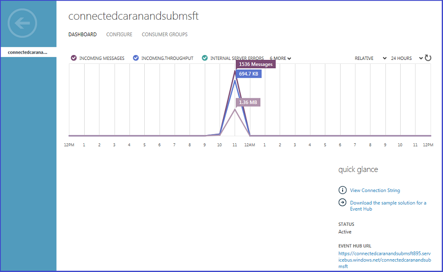 

The Stream Analytics job ingests these events from the event hub and processes the data in real time to analyze the vehicle health.

 

The Stream Analytics job:

* Ingests data from the event hub.
* Performs a join with the reference data to map the vehicle VIN to the corresponding model. 
* Persists them into Azure blob storage for rich batch analytics. 

The following Stream Analytics query is used to persist the data into Azure blob storage: 

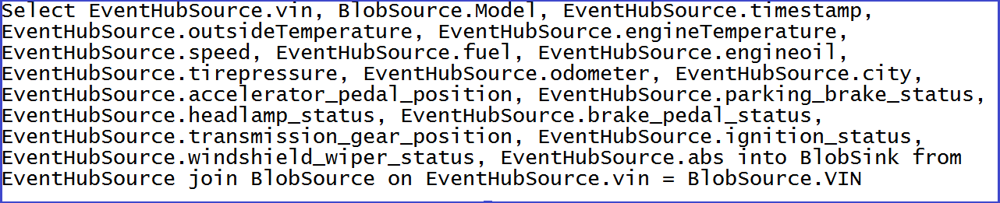 

### Batch analysis
We also generate an additional volume of simulated vehicle signals and diagnostic data set for richer batch analytics. This additional volume is required to ensure a good representative data volume for batch processing. For this purpose, we use a pipeline named "PrepareSampleDataPipeline" in the Data Factory workflow to generate one year's worth of simulated vehicle signals and diagnostic data set. To download the Data Factory custom .NET activity Visual Studio solution for customizations based on your requirements, go to the [Data Factory custom activity](http://go.microsoft.com/fwlink/?LinkId=717077) webpage. 

The following workflow shows sample data prepared for batch processing:

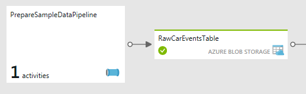 

The pipeline consists of a custom Data Factory .NET activity, as shown here:

 

After the pipeline executes successfully and "RawCarEventsTable" data set is marked "Ready," one year's worth of simulated vehicle signals and diagnostic data are produced. You see the following folder and file created in your storage account under the "connectedcar" container:

 

### References
[Azure Event Hub SDK for stream ingestion](../../event-hubs/event-hubs-csharp-ephcs-getstarted.md)

[Azure Data Factory data movement capabilities](../../data-factory/v1/data-factory-data-movement-activities.md)
[Azure Data Factory DotNet Activity](../../data-factory/v1/data-factory-use-custom-activities.md)

[Azure Data Factory DotNet activity visual studio solution for preparing sample data](http://go.microsoft.com/fwlink/?LinkId=717077) 

## Partition the data set
The raw semi-structured vehicle signals and diagnostic data set are partitioned in the data preparation step into a YEAR/MONTH format. This partitioning promotes more efficient querying and scalable long-term storage by enabling fault-over. For example, as the first blob account fills up, it faults over to the next account. 

>[!NOTE] 
>This step in the solution applies only to batch processing.

Input and output data management:

* **Output data** (labeled *PartitionedCarEventsTable*) is to be kept for a long period of time as the foundational/"rawest" form of data in the customer's data lake. 
* **Input data** to this pipeline is typically discarded because the output data has full fidelity to the input. It's just stored (partitioned) better for subsequent use.

The following illustration shows the Partition Car Events workflow:

The raw data is partitioned by using a Hive Azure HDInsight activity in "PartitionCarEventsPipeline", as shown in the following screenshot. The sample data generated for a year in step 1 is partitioned by YEAR/MONTH. The partitions are used to generate vehicle signals and diagnostic data for each month (total of 12 partitions) of a year. 

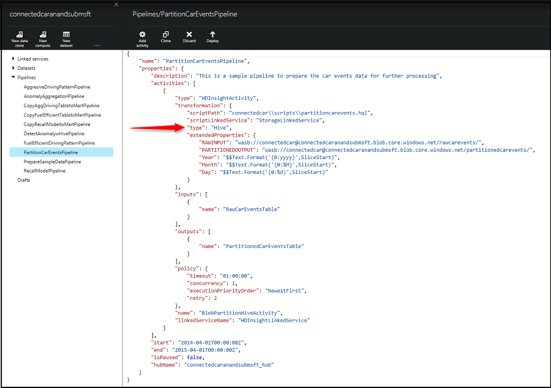

**PartitionConnectedCarEvents Hive script**

The following Hive script, named "partitioncarevents.hql", is used for partitioning. It's located in the "\demo\src\connectedcar\scripts" folder of the downloaded zip file. 
	
    SET hive.exec.dynamic.partition=true;
    SET hive.exec.dynamic.partition.mode = nonstrict;
    set hive.cli.print.header=true;

    DROP TABLE IF EXISTS RawCarEvents; 
    CREATE EXTERNAL TABLE RawCarEvents 
    (
                vin                                string,
                model                            string,
                timestamp                        string,
                outsidetemperature                string,
                enginetemperature                string,
                speed                            string,
                fuel                            string,
                engineoil                        string,
                tirepressure                    string,
                odometer                        string,
                city                            string,
                accelerator_pedal_position        string,
                parking_brake_status            string,
                headlamp_status                    string,
                brake_pedal_status                string,
                transmission_gear_position        string,
                ignition_status                    string,
                windshield_wiper_status            string,
                abs                              string,
                gendate                            string

    ) ROW FORMAT DELIMITED FIELDS TERMINATED BY ',' LINES TERMINATED BY '10' STORED AS TEXTFILE LOCATION '${hiveconf:RAWINPUT}'; 

    DROP TABLE IF EXISTS PartitionedCarEvents; 
    CREATE EXTERNAL TABLE PartitionedCarEvents 
    (
                vin                                string,
                model                            string,
                timestamp                        string,
                outsidetemperature                string,
                enginetemperature                string,
                speed                            string,
                fuel                            string,
                engineoil                        string,
                tirepressure                    string,
                odometer                        string,
                city                            string,
                accelerator_pedal_position        string,
                parking_brake_status            string,
                headlamp_status                    string,
                brake_pedal_status                string,
                transmission_gear_position        string,
                ignition_status                    string,
                windshield_wiper_status            string,
                abs                              string,
                gendate                            string
    ) partitioned by (YearNo int, MonthNo int) ROW FORMAT DELIMITED FIELDS TERMINATED BY ',' LINES TERMINATED BY '10' STORED AS TEXTFILE LOCATION '${hiveconf:PARTITIONEDOUTPUT}';

    DROP TABLE IF EXISTS Stage_RawCarEvents; 
    CREATE TABLE IF NOT EXISTS Stage_RawCarEvents 
    (
                vin                                string,
                model                            string,
                timestamp                        string,
                outsidetemperature                string,
                enginetemperature                string,
                speed                            string,
                fuel                            string,
                engineoil                        string,
                tirepressure                    string,
                odometer                        string,
                city                            string,
                accelerator_pedal_position        string,
                parking_brake_status            string,
                headlamp_status                    string,
                brake_pedal_status                string,
                transmission_gear_position        string,
                ignition_status                    string,
                windshield_wiper_status            string,
                abs                              string,
                gendate                            string,
                YearNo                             int,
                MonthNo                         int) 
    ROW FORMAT delimited fields terminated by ',' LINES TERMINATED BY '10';

    INSERT OVERWRITE TABLE Stage_RawCarEvents
    SELECT
        vin,            
        model,
        timestamp,
        outsidetemperature,
        enginetemperature,
        speed,
        fuel,
        engineoil,
        tirepressure,
        odometer,
        city,
        accelerator_pedal_position,
        parking_brake_status,
        headlamp_status,
        brake_pedal_status,
        transmission_gear_position,
        ignition_status,
        windshield_wiper_status,
        abs,
        gendate,
        Year(gendate),
        Month(gendate)

    FROM RawCarEvents WHERE Year(gendate) = ${hiveconf:Year} AND Month(gendate) = ${hiveconf:Month}; 

    INSERT OVERWRITE TABLE PartitionedCarEvents PARTITION(YearNo, MonthNo) 
    SELECT
        vin,            
        model,
        timestamp,
        outsidetemperature,
        enginetemperature,
        speed,
        fuel,
        engineoil,
        tirepressure,
        odometer,
        city,
        accelerator_pedal_position,
        parking_brake_status,
        headlamp_status,
        brake_pedal_status,
        transmission_gear_position,
        ignition_status,
        windshield_wiper_status,
        abs,
        gendate,
        YearNo,
        MonthNo
    FROM Stage_RawCarEvents WHERE YearNo = ${hiveconf:Year} AND MonthNo = ${hiveconf:Month};

After the pipeline executes successfully, you see the following partitions generated in your storage account under the "connectedcar" container:

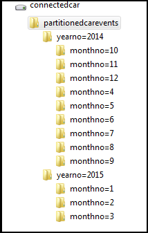

The data is now optimized, is more manageable, and ready for further processing to gain rich batch insights. 

## Data Analysis
In this section, you see how to combine Stream Analytics, Azure Machine Learning, Data Factory, and HDInsight for rich advanced analytics on vehicle health and driving habits.

### Machine Learning
The goal here is to predict the vehicles that require maintenance or recall based on certain heath statistics. We make the following assumptions:

* If one of the following three conditions is true, the vehicles require servicing maintenance:
  
  * The tire pressure is low.
  * The engine oil level is low.
  * The engine temperature is high.

* If one of the following conditions is true, the vehicles might have a safety issue and require recall:
  
  * The engine temperature is high, but the outside temperature is low.
  * The engine temperature is low, but the outside temperature is high.

Based on the previous requirements, we created two separate models to detect anomalies. One model is for vehicle maintenance detection, and one model is for vehicle recall detection. In both of these models, the built-in principal component analysis (PCA) algorithm is used for anomaly detection. 

**Maintenance detection model**

If one of three indicators - tire pressure, engine oil, or engine temperature - satisfies its respective condition, the maintenance detection model reports an anomaly. As a result, we only need to consider these three variables in building the model. In the experiment in Machine Learning, we first use a **Select Columns in Dataset** module to extract these three variables. Next we use the PCA-based anomaly detection module to build the anomaly detection model. 

PCA is an established technique in machine learning that can be applied to feature selection, classification, and anomaly detection. PCA converts a set of cases that contain possibly correlated variables into a set of values called principal components. The key idea of PCA-based modeling is to project data onto a lower-dimensional space so that features and anomalies can be more easily identified.

For each new input to the detection model, the anomaly detector first computes its projection on the eigenvectors. It then computes the normalized reconstruction error. This normalized error is the anomaly score. The higher the error, the more anomalous is the instance. 

In the maintenance detection problem, each record can be considered as a point in a 3-dimensional space defined by tire pressure, engine oil, and engine temperature coordinates. To capture these anomalies, we can project the original data in the 3-dimensional space onto a 2-dimensional space using PCA. Thus, we set the parameter Number of components to use in PCA to be 2. This parameter plays an important role in applying PCA-based anomaly detection. After projecting data using PCA, we can identify these anomalies more easily.

**Recall anomaly detection model**
In the recall anomaly detection model, we use the Select Columns in Dataset and PCA-based anomaly detection modules in a similar way. Specifically, we first extract three variables - engine temperature, outside temperature, and speed - by using the **Select Columns in Dataset** module. We also include the speed variable since the engine temperature typically is correlated to the speed. Next, we use PCA-based anomaly detection module to project the data from the 3-dimensional space onto a 2-dimensional space. The recall criteria are satisfied and so the vehicle requires recall when engine temperature and outside temperature are highly negatively correlated. Using PCA-based anomaly detection algorithm, we can capture the anomalies after performing PCA. 

When training either model, we need to use normal data, which does not require maintenance or recall as the input data to train the PCA-based anomaly detection model. In the scoring experiment, we use the trained anomaly detection model to detect whether or not the vehicle requires maintenance or recall. 

### Real-time analysis
The following Stream Analytics SQL Query is used to get the average of all the important vehicle parameters like vehicle speed, fuel level, engine temperature, odometer reading, tire pressure, engine oil level, and others. The averages are used to detect anomalies, issue alerts, and determine the overall health conditions of vehicles operated in specific region and then correlate it to demographics. 

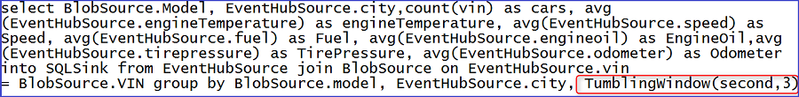

*Figure 13 – Stream Analytics query for real-time processing*

All the averages are calculated over a 3-second TumblingWindow. We are using TubmlingWindow in this case since we require non-overlapping and contiguous time intervals. 

To learn more about all the "Windowing" capabilities in Azure Stream Analytics, click [Windowing (Azure Stream Analytics)](https://msdn.microsoft.com/library/azure/dn835019.aspx).

**Real-time prediction**

An application is included as part of the solution to operationalize the machine learning model in real time. This application called “RealTimeDashboardApp” is created and configured as part of the solution deployment. The application performs the following:

1. Listens to an Event Hub instance where Stream Analytics is publishing the events in a pattern continuously.  *Figure 14 – Stream Analytics query for publishing the data to an output Event Hub instance* 
2. For every event that this application receives: 
   
   * Processes the data using Machine Learning Request-Response Scoring (RRS) endpoint. The RRS endpoint is automatically published as part of the deployment.
   * The RRS output is published to a Power BI data set using the push APIs.

This pattern is also applicable to scenarios in which you want to integrate a Line of Business (LoB) application with the real-time analytics flow, for scenarios such as alerts, notifications, and messaging.

Click [RealtimeDashboardApp download](http://go.microsoft.com/fwlink/?LinkId=717078) to download the RealtimeDashboardApp Visual Studio solution for customizations. 

**To execute the Real-time Dashboard Application**
1. Extract and save locally  *Figure 16 – RealtimeDashboardApp folder*  
2. Execute the application RealtimeDashboardApp.exe
3. Provide valid Power BI credentials, sign in and click Accept 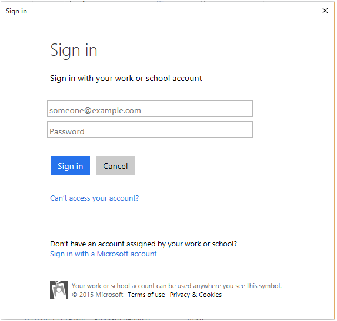 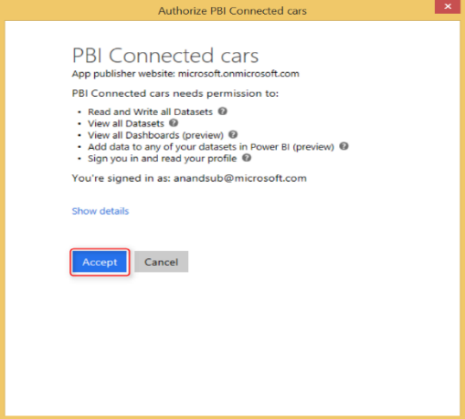 

*Figure 17 – RealtimeDashboardApp: Sign-in to Power BI*

>[!NOTE] 
>If you want to flush the Power BI data set, execute the RealtimeDashboardApp with the "flushdata" parameter: 

    RealtimeDashboardApp.exe -flushdata

### Batch analysis
The goal here is to show how Contoso Motors utilizes the Azure compute capabilities to harness big data to gain rich insights on driving pattern, usage behavior, and vehicle health. This makes it possible to:

* Improve the customer experience and make it cheaper by providing insights on driving habits and fuel efficient driving behaviors
* Learn proactively about customers and their driving patters to govern business decisions and provide the best in class products & services

In this solution, we are targeting the following metrics:

1. **Aggressive driving behavior**: Identifies the trend of the models, locations, driving conditions, and time of the year to gain insights on aggressive driving patterns. Contoso Motors can use these insights for marketing campaigns, driving new personalized features and usage-based insurance.
2. **Fuel efficient driving behavior**: Identifies the trend of the models, locations, driving conditions, and time of the year to gain insights on fuel efficient driving patterns. Contoso Motors can use these insights for marketing campaigns, driving new features and proactive reporting to the drivers for cost effective and environment friendly driving habits. 
3. **Recall models**: Identifies models requiring recalls by operationalizing the anomaly detection machine learning experiment

Let's look into the details of each of these metrics,

**Aggressive driving pattern**

The partitioned vehicle signals and diagnostic data are processed in the pipeline named "AggresiveDrivingPatternPipeline" using Hive to determine the models, location, vehicle, driving conditions, and other parameters that exhibits aggressive driving pattern.

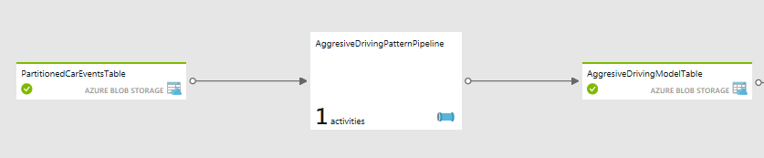 
*Figure 18 – Aggressive driving pattern workflow*

***Aggressive driving pattern Hive query***

The Hive script named "aggresivedriving.hql" used for analyzing aggressive driving condition pattern is located at "\demo\src\connectedcar\scripts" folder of the downloaded zip. 

    DROP TABLE IF EXISTS PartitionedCarEvents; 
    CREATE EXTERNAL TABLE PartitionedCarEvents
    (
                vin                                string,
                model                            string,
                timestamp                        string,
                outsidetemperature                string,
                enginetemperature                string,
                speed                            string,
                fuel                            string,
                engineoil                        string,
                tirepressure                    string,
                odometer                        string,
                city                            string,
                accelerator_pedal_position        string,
                parking_brake_status            string,
                headlamp_status                    string,
                brake_pedal_status                string,
                transmission_gear_position        string,
                ignition_status                    string,
                windshield_wiper_status            string,
                abs                              string,
                gendate                            string

    ) ROW FORMAT DELIMITED FIELDS TERMINATED BY ',' LINES TERMINATED BY '10' STORED AS TEXTFILE LOCATION '${hiveconf:PARTITIONEDINPUT}';

    DROP TABLE IF EXISTS CarEventsAggresive; 
    CREATE EXTERNAL TABLE CarEventsAggresive
    (
                   vin                         string, 
                model                        string,
                timestamp                    string,
                city                        string,
                speed                          string,
                transmission_gear_position    string,
                brake_pedal_status            string,
                Year                        string,
                Month                        string

    ) ROW FORMAT DELIMITED FIELDS TERMINATED BY ',' LINES TERMINATED BY '10' STORED AS TEXTFILE LOCATION '${hiveconf:AGGRESIVEOUTPUT}';

    INSERT OVERWRITE TABLE CarEventsAggresive
    select
    vin,
    model,
    timestamp,
    city,
    speed,
    transmission_gear_position,
    brake_pedal_status,
    "${hiveconf:Year}" as Year,
    "${hiveconf:Month}" as Month
    from PartitionedCarEvents
    where transmission_gear_position IN ('fourth', 'fifth', 'sixth', 'seventh', 'eight') AND brake_pedal_status = '1' AND speed >= '50'

It uses the combination of vehicle's transmission gear position, brake pedal status, and speed to detect reckless/aggressive driving behavior based on braking pattern at high speed. 

Once the pipeline is executed successfully, you see the following partitions generated in your storage account under the "connectedcar" container.

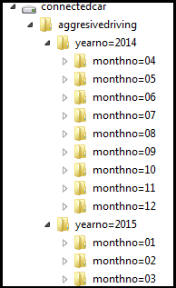 

*Figure 19 – AggressiveDrivingPatternPipeline output*

**Fuel efficient driving pattern**

The partitioned vehicle signals and diagnostic data are processed in the pipeline named "FuelEfficientDrivingPatternPipeline". Hive is used to determine the models, location, vehicle, driving conditions, and other properties that exhibit fuel efficient driving pattern.

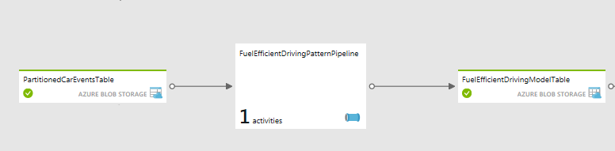 

*Figure 20 – Fuel-efficient driving pattern workflow*

***Fuel efficient driving pattern Hive query***

The Hive script named "fuelefficientdriving.hql" used for analyzing aggressive driving condition pattern is located at "\demo\src\connectedcar\scripts" folder of the downloaded zip. 

    DROP TABLE IF EXISTS PartitionedCarEvents; 
    CREATE EXTERNAL TABLE PartitionedCarEvents
    (
                vin                                string,
                model                            string,
                timestamp                        string,
                outsidetemperature                string,
                enginetemperature                string,
                speed                            string,
                fuel                            string,
                engineoil                        string,
                tirepressure                    string,
                odometer                        string,
                city                            string,
                accelerator_pedal_position        string,
                parking_brake_status            string,
                headlamp_status                    string,
                brake_pedal_status                string,
                transmission_gear_position        string,
                ignition_status                    string,
                windshield_wiper_status            string,
                abs                              string,
                gendate                            string

    ) ROW FORMAT DELIMITED FIELDS TERMINATED BY ',' LINES TERMINATED BY '10' STORED AS TEXTFILE LOCATION '${hiveconf:PARTITIONEDINPUT}';

    DROP TABLE IF EXISTS FuelEfficientDriving; 
    CREATE EXTERNAL TABLE FuelEfficientDriving
    (
                   vin                         string, 
                model                        string,
                   city                        string,
                speed                          string,
                transmission_gear_position    string,                
                brake_pedal_status            string,            
                accelerator_pedal_position    string,                             
                Year                        string,
                Month                        string

    ) ROW FORMAT DELIMITED FIELDS TERMINATED BY ',' LINES TERMINATED BY '10' STORED AS TEXTFILE LOCATION '${hiveconf:FUELEFFICIENTOUTPUT}';

    INSERT OVERWRITE TABLE FuelEfficientDriving
    select
    vin,
    model,
    city,
    speed,
    transmission_gear_position,
    brake_pedal_status,
    accelerator_pedal_position,
    "${hiveconf:Year}" as Year,
    "${hiveconf:Month}" as Month
    from PartitionedCarEvents
    where transmission_gear_position IN ('fourth', 'fifth', 'sixth', 'seventh', 'eight') AND parking_brake_status = '0' AND brake_pedal_status = '0' AND speed <= '60' AND accelerator_pedal_position >= '50'

It uses the combination of vehicle's transmission gear position, brake pedal status, speed, and accelerator pedal position to detect fuel efficient driving behavior based on acceleration, braking, and speed patterns. 

Once the pipeline is executed successfully, you see the following partitions generated in your storage account under the "connectedcar" container.

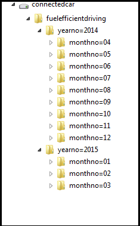 

*Figure 21 – FuelEfficientDrivingPatternPipeline output*

**Recall Predictions**

The machine learning experiment is provisioned and published as a web service as part of the solution deployment. The batch scoring end point is leveraged in this workflow, registered as a data factory linked service and operationalized using data factory batch scoring activity.

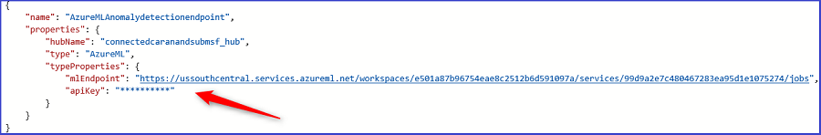 

*Figure 22 – Machine learning endpoint registered as a linked service in data factory*

The registered linked service is used in the DetectAnomalyPipeline to score the data using the anomaly detection model. 

 

*Figure 23 – Azure Machine Learning Batch Scoring activity in data factory* 

There are few steps performed in this pipeline for data preparation so that it can be operationalized with the batch scoring web service. 

 

*Figure 24 – DetectAnomalyPipeline for predicting vehicles requiring recalls* 

***Anomaly detection Hive query***

Once the scoring is completed, an HDInsight activity is used to process and aggregate the data that are categorized as anomalies by the model with a probability score of 0.60 or higher.

    DROP TABLE IF EXISTS CarEventsAnomaly; 
    CREATE EXTERNAL TABLE CarEventsAnomaly 
    (
                vin                            string,
                model                        string,
                gendate                        string,
                outsidetemperature            string,
                enginetemperature            string,
                speed                        string,
                fuel                        string,
                engineoil                    string,
                tirepressure                string,
                odometer                    string,
                city                        string,
                accelerator_pedal_position    string,
                parking_brake_status        string,
                headlamp_status                string,
                brake_pedal_status            string,
                transmission_gear_position    string,
                ignition_status                string,
                windshield_wiper_status        string,
                abs                          string,
                maintenanceLabel            string,
                maintenanceProbability        string,
                RecallLabel                    string,
                RecallProbability            string

    ) ROW FORMAT DELIMITED FIELDS TERMINATED BY ',' LINES TERMINATED BY '10' STORED AS TEXTFILE LOCATION '${hiveconf:ANOMALYOUTPUT}';

    DROP TABLE IF EXISTS RecallModel; 
    CREATE EXTERNAL TABLE RecallModel 
    (

                vin                            string,
                model                        string,
                city                        string,
                outsidetemperature            string,
                enginetemperature            string,
                speed                        string,
                Year                        string,
                Month                        string                

    ) ROW FORMAT DELIMITED FIELDS TERMINATED BY ',' LINES TERMINATED BY '10' STORED AS TEXTFILE LOCATION '${hiveconf:RECALLMODELOUTPUT}';

    INSERT OVERWRITE TABLE RecallModel
    select
    vin,
    model,
    city,
    outsidetemperature,
    enginetemperature,
    speed,
    "${hiveconf:Year}" as Year,
    "${hiveconf:Month}" as Month
    from CarEventsAnomaly
    where RecallLabel = '1' AND RecallProbability >= '0.60'

Once the pipeline is executed successfully, you see the following partitions generated in your storage account under the "connectedcar" container.

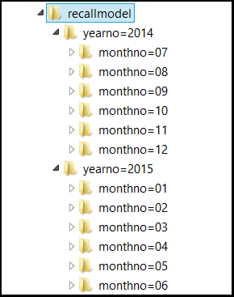 

*Figure 25 – DetectAnomalyPipeline output*

## Publish

### Real-time analysis
One of the queries in the Stream Analytics job publishes the events to an output Event Hub instance. 

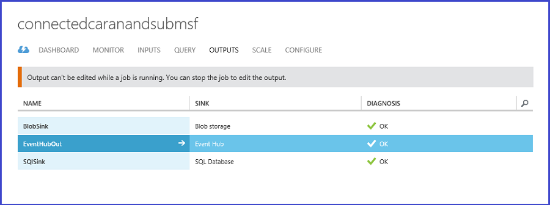

*Figure 26 – Stream Analytics job publishes to an output Event Hub instance*

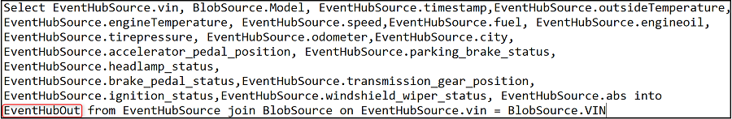

*Figure 27 – Stream Analytics query to publish to the output Event Hub instance*

This stream of events is consumed by the RealTimeDashboardApp included in the solution. This application leverages the Machine Learning Request-Response web service for real-time scoring and publishes the resultant data to a Power BI data set for consumption. 

### Batch analysis
The results of the batch and real-time processing are published to the Azure SQL Database tables for consumption. The Azure SQL Server, Database, and the tables are created automatically as part of the setup script. 

*Figure 28 – Batch processing results copy to data mart workflow*

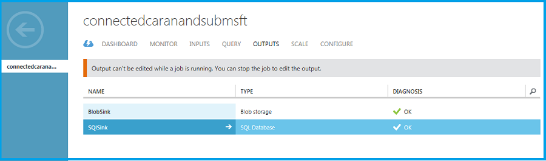

*Figure 29 – Stream Analytics job publishes to data mart*

*Figure 30 – Data mart setting in Stream Analytics job*

## Consume
Power BI gives this solution a rich dashboard for real-time data and predictive analytics visualizations. 

Click here for detailed instructions on setting up the Power BI reports and the dashboard. The final dashboard looks like this:

*Figure 31 - Power BI Dashboard*

## Summary
This document contains a detailed drill-down of the Vehicle Telemetry Analytics Solution. This showcases a lambda architecture pattern for real-time and batch analytics with predictions and actions. This pattern applies to a wide range of use cases that require hot path (real-time) and cold path (batch) analytics. 

