# Vehicle telemetry analytics solution template Power BI dashboard setup instructions
This **menu** links to the chapters in this playbook. 

[!INCLUDE [cap-vehicle-telemetry-playbook-selector](../../../includes/cap-vehicle-telemetry-playbook-selector.md)]

The vehicle telemetry analytics solution showcases how car dealerships, automobile manufacturers and insurance companies can use the capabilities of Cortana Intelligence. They can gain real-time and predictive insights on vehicle health and driving habits to improve the customer experience, research and development, and marketing campaigns. 
These step-by-step instructions show how you can configure the Power BI reports and dashboard after the solution is deployed in your subscription. 

## Prerequisites
* Deploy the [Telemetry Analytics](https://gallery.cortanaintelligence.com/Solution/5bdb23f3abb448268b7402ab8907cc90) solution. 
* [Install Power BI Desktop](http://www.microsoft.com/download/details.aspx?id=45331).
* Obtain an [Azure subscription](https://azure.microsoft.com/pricing/free-trial/). If you don't have an Azure subscription, get started with the Azure free subscription.
* Open a Power BI account.

## Cortana Intelligence suite components
As part of the vehicle telemetry analytics solution template, the following Cortana Intelligence services are deployed in your subscription:

* **Azure Event Hubs** ingests millions of vehicle telemetry events into Azure.
* **Azure Stream Analytics** provides real-time insights on vehicle health and persist that data into long-term storage for richer batch analytics.
* **Azure Machine Learning** detects anomalies in real time, and uses batch processing to provide predictive insights.
* **Azure HDInsight** transforms data at scale.
* **Azure Data Factory** handles orchestration, scheduling, resource management, and monitoring of the batch processing pipeline.

**Power BI** gives this solution a rich dashboard for real-time data and predictive analytics visualizations. 

The solution uses two different data sources: simulated vehicle signals and diagnostic data sets and a vehicle catalog.

A vehicle telematics simulator is included as part of this solution. It emits diagnostic information and signals that correspond to the state of the vehicle and driving patterns at a given point in time. 

The vehicle catalog is a reference data set that maps VINs to models.

## Power BI dashboard preparation
### Set up the Power BI real-time dashboard

**Start the real-time dashboard application**
After the deployment is finished, follow the manual operation instructions.

1. Download the real-time dashboard application RealtimeDashboardApp.zip, and unzip it.

2.  In the unzipped folder, open the app config file RealtimeDashboardApp.exe.config, replace appSettings for Eventhub, Azure Blob Storage, and Azure Machine Learning service connections with the values in the manual operation instructions. Save your changes.

3. Run the application RealtimeDashboardApp.exe. On the sign-in window, provide your valid Power BI credentials, and select **Accept**. The app starts to run.

   
   
   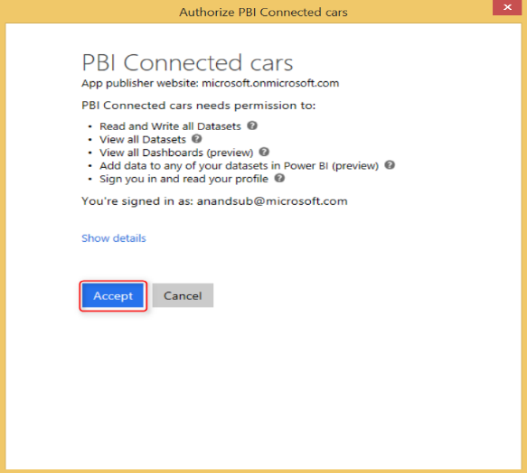

4. Sign in to the Power BI website, and create a real-time dashboard.

Now you're ready to configure the Power BI dashboard.  

### Configure Power BI reports
The real-time reports and the dashboard take about 30 to 45 minutes to finish. 

1. Browse to the [Power BI](http://powerbi.com) webpage, and sign in.

    

2. A new data set is generated in Power BI. Select the **ConnectedCarsRealtime** data set.

    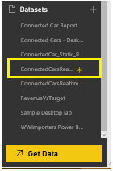

3. To save the blank report, press Ctrl+S.

    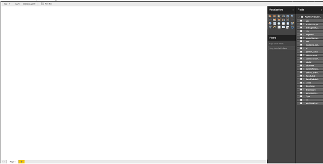

4. Enter the report name **Vehicle Telemetry Analytics Real-time - Reports**.

    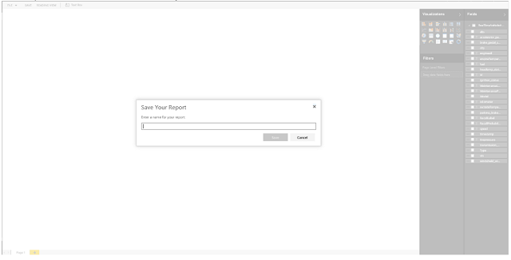

## Real-time reports
Three real-time reports are in this solution:

* Vehicles in operation
* Vehicles Requiring Maintenance
* Vehicle Health Statistics

You can choose to configure all three of the real-time reports, or you can stop after any stage. You then can proceed to the next section on how to configure batch reports. We recommend that you create all three reports to visualize the full insights of the real-time path of the solution.  

### Vehicles in operation report
1. Double-click **Page 1**, and rename it **Vehicles in operation**.

    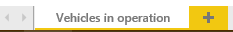  

2. On the **Fields** tab, select **vin**. Choose the visualization type as **Card**.  

    Card visualization is created as shown in the following figure:

    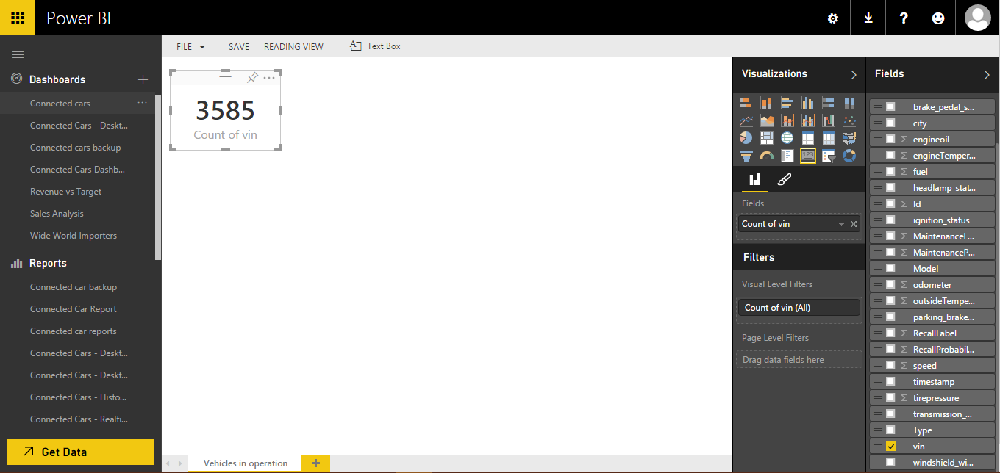

3. Select the blank area to add a new visualization.  

4. On the **Fields** tab, select **city** and **vin**. Under **Visualizations**, select the **Map** visualization. Drag **vin** to the **Values** area. Drag **city** to the **Legend** area. 

    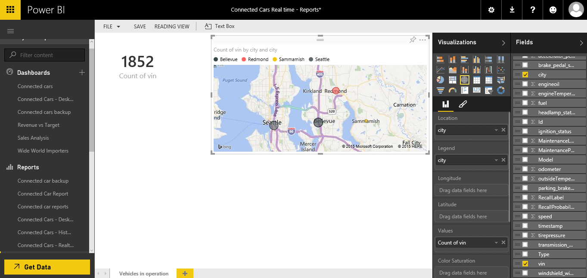

5. On the **Visualizations** tab, select the **Format** section. Select **Title**, and change **Text** to **Vehicles in operation by city**.

       

    The final visualization looks like the following image:

    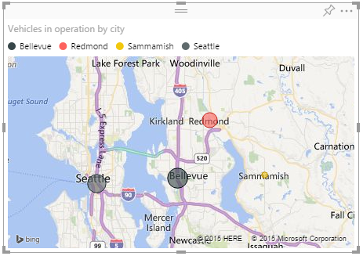

6. Select the blank area to add a new visualization.  

7. Select **city** and **vin**. On the **Visualizations** tab, select **Clustered Column Chart**. Drag **city** to the **Axis** area. Drag **vin** to the **Value** area.

8. Sort the chart by **Count of vin**.

    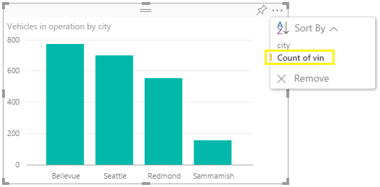  

9. Change the chart **Title** to **Vehicles in operation by city**. 

10. Select the **Format** section, and then select **Data Colors**. Change **Show All** to **On**.

    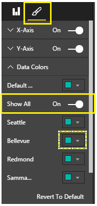  

11. Change the color of an individual city by selecting the color symbol.

    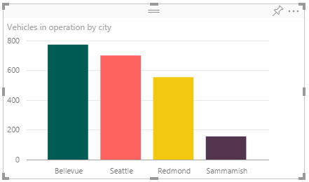  

12. Select the blank area to add a new visualization.  

13. On the **Visualizations** tab, select the **Clustered Column Chart** visualization. On the **Fields** tab, drag **city** to the **Axis** area. Drag **Model** to the **Legend** area. Drag **vin** to the **Value** area.

    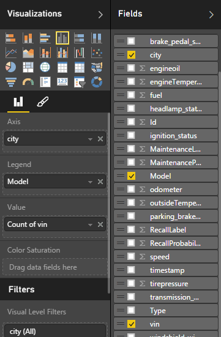

    

14. Rearrange all the visualizations on this page, as shown in the following figure:

    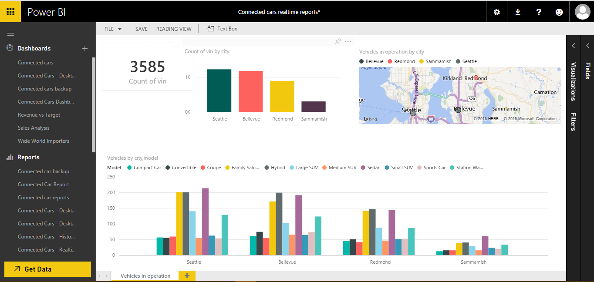

You successfully configured the "Vehicles in operation" real-time report. You can create the next real-time report, or you can stop here and configure the dashboard. 

### Vehicles Requiring Maintenance report

1. Select  to add a new report. Rename it **Vehicles Requiring Maintenance**.

      

2. On the **Fields** tab, select **vin**. On the **Visualizations** tab, select the **Card** visualization.

      

    The data set contains a field named **MaintenanceLabel**. This field can have a value of "0" or "1." It's set by the machine learning model that's provisioned as part of the solution. It's integrated with the real-time path. The value "1" indicates that a vehicle requires maintenance. 

    a. To add a **Page Level Filter** to show data for the vehicles that require maintenance: 

    * Drag the **MaintenanceLabel** field to **Page Level Filters**.
  
       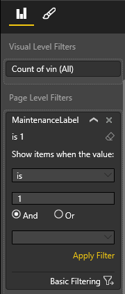

    * At the bottom of **MaintenanceLabel Page Level Filter**, select **Basic Filtering**.

      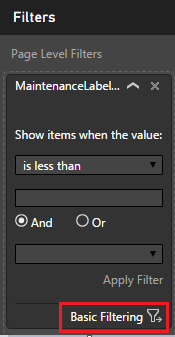 

    * Set the filter value to **1**.

      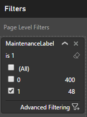  

3. Select the blank area to add a new visualization.  

4. On the **Visualizations** tab, select the **Clustered Column Chart** visualization. 

    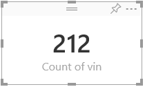

    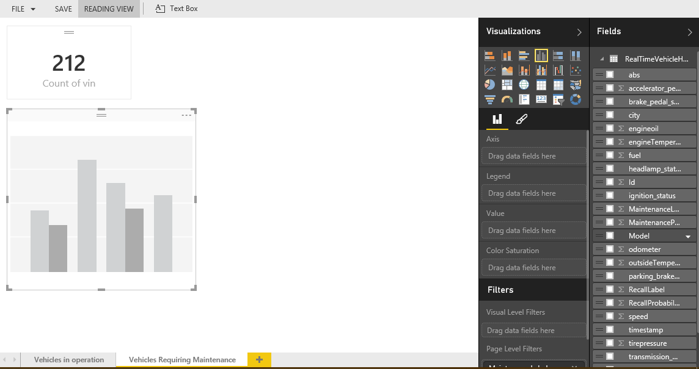

5. On the **Fields** tab, drag **Model** to the **Axis** area. Drag **vin** to the **Value** area. Then sort the visualization by **Count of vin**. Change the chart **Title** to **Vehicles requiring maintenance by model**. 

6. Drag **vin** to **Color Saturation** on the **Fields**  section of the **Visualizations** tab.

    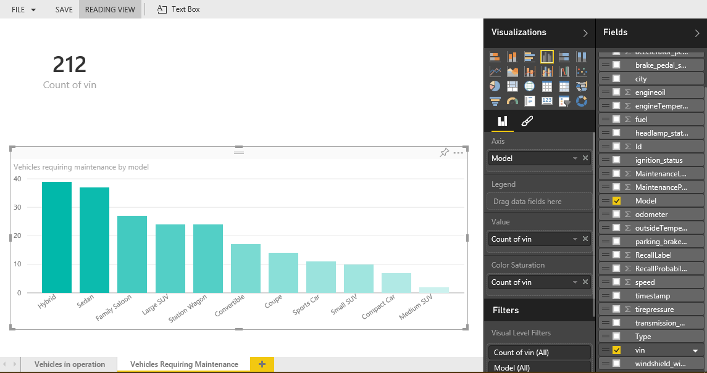  

7. On the **Format** section, change **Data Colors** in the visualization: 

    a. Change the **Minimum** color to **F2C812**.

    b. Change the **Maximum** color to **FF6300**.

    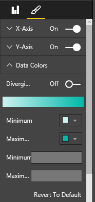

    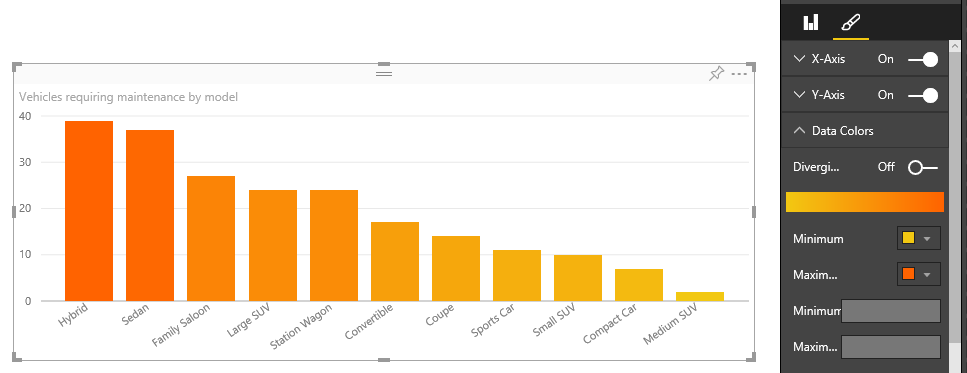  

8. Select the blank area to add a new visualization.  

9. On the **Visualizations** tab, select **Clustered Column Chart**. Drag **vin** to the **Value** area. Drag **city** to the **Axis** area. Sort the chart by **Count of vin**. Change the chart **Title** to **Vehicles requiring maintenance by city**.

    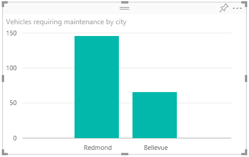  

10. Select the blank area to add a new visualization.  

11. On the **Visualizations** tab, select the **Multi-Row Card** visualization. Drag **Model** and **vin** to the **Fields** area.

        

After you rearrange all the visualizations, the final report looks like the following: 

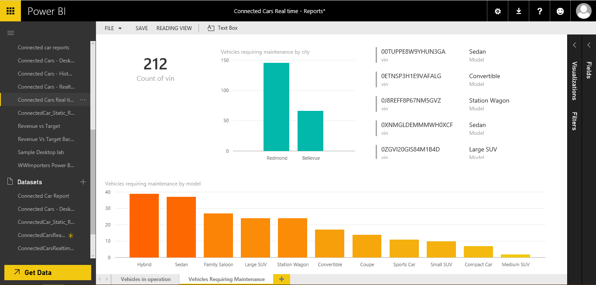  

You successfully configured the "Vehicles Requiring Maintenance" real-time report. You can create the next real-time report, or you can stop here and configure the dashboard. 

### Vehicle Health Statistics report

1. Select  to add a new report. Rename it **Vehicles Health Statistics**. 

2. On the **Visualizations** tab, select the **Gauge** visualization. Drag **speed** to the **Value**, **Minimum Value**, and **Maximum Value** areas.

   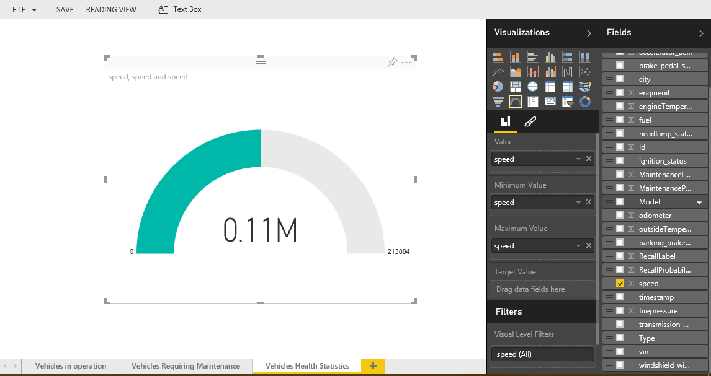  

3. In the **Value** area, change the default aggregation of **speed** to **Average**.

4. In the **Minimum Value** area, change the default aggregation of **speed** to **Minimum**.

5. In the **Maximum Value** area, change the default aggregation of **speed** to **Maximum**.

   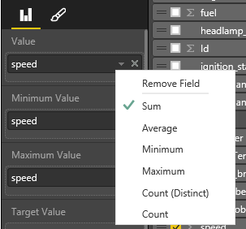  

6. Rename the **Gauge Title** to **Average speed**.

   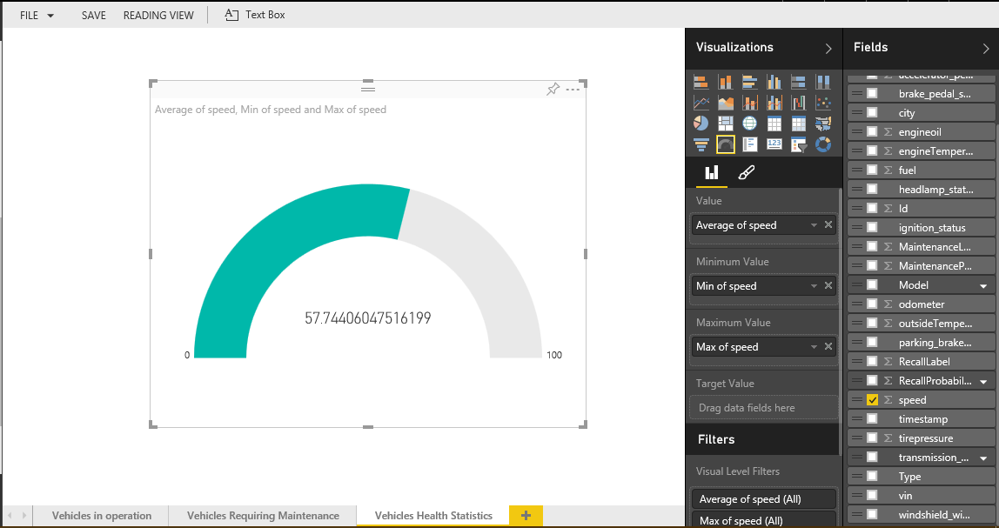  

7. Select the blank area to add a new visualization.  

    Similarly, add a **Gauge** for **Average engine oil**, **Average fuel**, and **Average engine temperature**.  

8. Change the default aggregation of fields in each gauge like you did in the previous steps in the **Average speed** gauge.

    

9. Select the blank area to add a new visualization.

10. On the **Visualizations** tab, select the **Line and Clustered Column Chart** visualization. Drag **city** to **Shared Axis**. Drag **tirepressure**, **engineoil**, and **speed** to the **Column Values** area. Change their aggregation type to **Average**. 

11. Drag **engineTemperature** to the **Line Values** area. Change the aggregation type to **Average**. 

    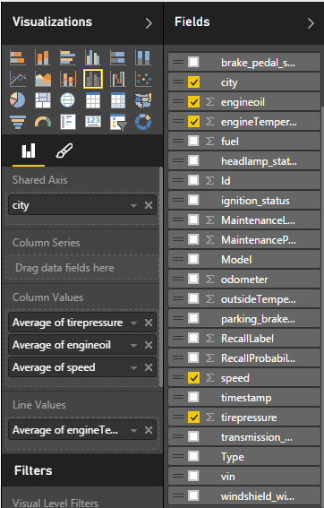

12. Change the chart **Title** to **Average speed, tire pressure, engine oil and engine temperature**.  

    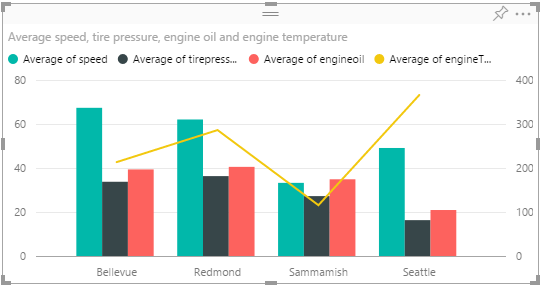

13. Select the blank area to add a new visualization.

14. On the **Visualizations** tab, select the **Treemap** visualization. Drag **Model** to the **Group** area. Drag **MaintenanceProbability** to the **Values** area.

15. Change the chart **Title** to **Vehicle models requiring maintenance**.

    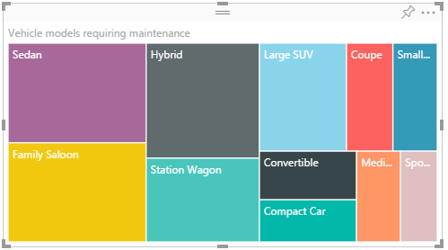

16. Select the blank area to add a new visualization.

17. On the **Visualizations** tab, select the **100% Stacked Bar Chart** visualization. Drag **city** to the **Axis** area. Drag **MaintenanceProbability** and **RecallProbability** to the **Value** area.

    

18. Select **Format**, and select **Data Colors**. Set the **MaintenanceProbability** color to the value **F2C80F**.

19. Change the chart **Title** to **Probability of Vehicle Maintenance & Recall by City**.

    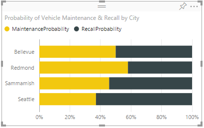

20. Select the blank area to add a new visualization.

21. On the **Visualizations** tab, select the **Area Chart** visualization. Drag **Model** to the **Axis** area. Drag **engineOil**, **tirepressure**, **speed**, and **MaintenanceProbability** to the **Values** area. Change their aggregation type to **Average**. 

    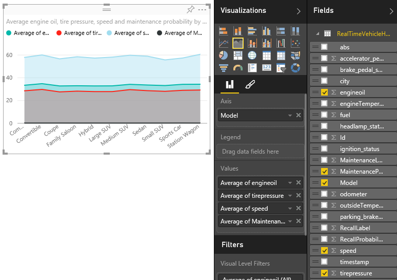

22. Change the chart **Title** to **Average engine oil, tire pressure, speed and maintenance probability by model**.

    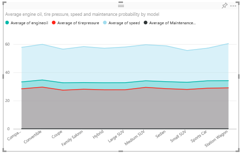

23. Select the blank area to add a new visualization.

24. On the **Visualizations** tab, select the **Scatter Chart** visualization. Drag **Model** to the **Details** and **Legend** areas. Drag **fuel** to the **X-Axis** area. Change the aggregation to **Average**. Drag **engineTemperature** to the **Y-Axis** area. Change the aggregation to **Average**. Drag **vin** to the **Size** area.

    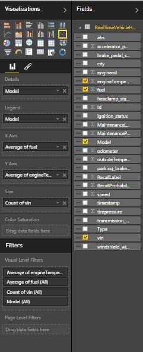

25. Change the chart **Title** to **“Averages of Fuel, Engine Temperature by Model”**.

    

The final report looks like the following image:

### Pin visualizations from the reports to the real-time dashboard
1. Create a blank dashboard by selecting the plus symbol next to **Dashboards**. Enter the name **Vehicle Telemetry Analytics Dashboard**.

    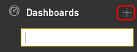

2. Pin the visualizations from the previous reports to the dashboard. 

    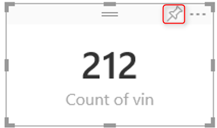

    When all three reports are pinned to the dashboard, it should look like the following image. If you didn't create all the reports, your dashboard might look different. 

    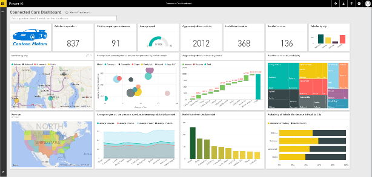

You successfully created the real-time dashboard. As you continue to execute CarEventGenerator.exe and RealtimeDashboardApp.exe, you see live updates on the dashboard. 
The following steps take about 10 to 15 minutes to complete.

## Set up the Power BI batch processing dashboard
> [!NOTE]
> It takes about two hours (from the successful completion of the deployment) for the end-to-end batch processing pipeline to finish execution and process a year's worth of generated data. Wait for the processing to finish before you proceed with the following steps. 
> 
> 

**Download the Power BI designer file**

1. A preconfigured Power BI designer file is included as part of the deployment manual operation instructions. Look for "2. Set up the PowerBI batch processing dashboard."

2. Download the Power BI template for batch processing dashboard here called **ConnectedCarsPbiReport.pbix**.

3. Save it locally.

**Configure Power BI reports**

1. Open the designer file **ConnectedCarsPbiReport.pbix** by using the Power BI Desktop. If you don't already have it, install the Power BI Desktop from the [Power BI Desktop installation](http://www.microsoft.com/download/details.aspx?id=45331) website.

2. Select **Edit Queries**.

    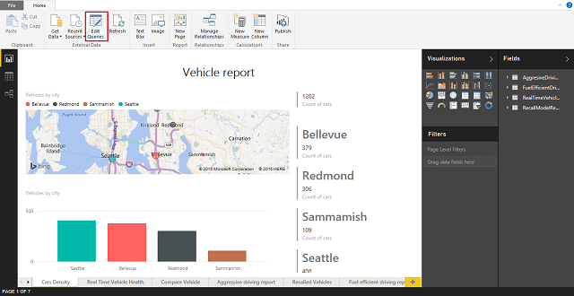

3. Double-click **Source**.

    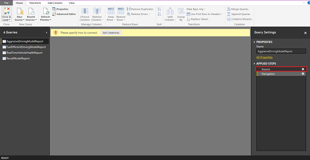

4. Update the server connection string with the Azure SQL server that got provisioned as part of the deployment. Look in the manual operation instructions under:

    a. Azure SQL database
    
    * Server: somethingsrv.database.windows.net
    * Database: connectedcar
    * Username: username
    * Password: You can manage your SQL Server password from the Azure portal.

5. Leave **Database** as **connectedcar**.

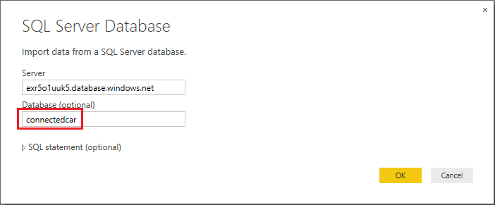

6. Select **OK**.

7. The **Windows credential** tab is selected by default. Change it to **Database credentials** by selecting the **Database** tab at the right.

8. Enter the **Username** and **Password** of your Azure SQL database that was specified during its deployment setup.

    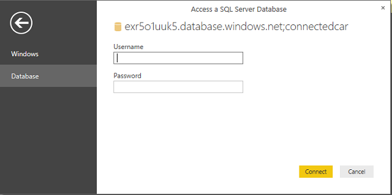

9. Select **Connect**.

10. Repeat the previous steps for each of the three remaining queries present in the right pane. Then update the data source connection details.

11. Select **Close and Load**. Power BI Desktop file data sets are connected to SQL database tables.

12. Select **Close** to close the Power BI Desktop file.

    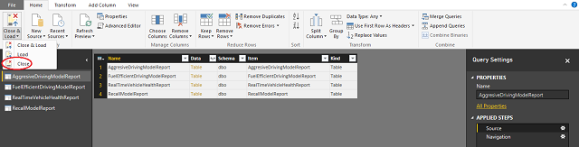

13. Select **Save** to save the changes. 

You have now configured all the reports that correspond to the batch processing path in the solution. 

## Upload to powerbi.com
1. Go to the [Power BI web portal](http://powerbi.com), and sign in.

2. Select **Get Data**.

3. Upload the Power BI Desktop file. Select **Get Data** > **Files Get** > **Local file**.

4. Go to **ConnectedCarsPbiReport.pbix**.

5. After the file is uploaded, go back to your Power BI work space.  

    A dataset, a report, and a blank dashboard are created for you.  

6. Pin charts to a new dashboard called **Vehicle Telemetry Analytics Dashboard** in **Power BI**. Select the blank dashboard that was previously created, and then go to the **Reports** section. Select the newly uploaded report.  

    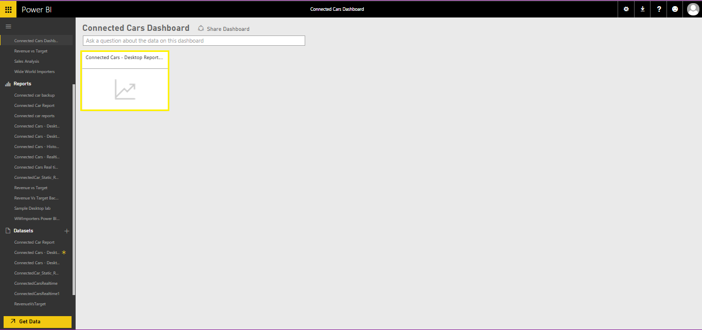 

    The report has six pages:

    Page 1: Vehicle density  
    Page 2: Real-time vehicle health  
    Page 3: Aggressively driven vehicles   
    Page 4: Recalled vehicles  
    Page 5: Fuel efficiently driven vehicles  
    Page 6: Contoso logo  

    

7. From **Page 3**, pin the following:  

    a. **Count of vin**  

   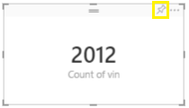

    b. **Aggressively driven vehicles by model – Waterfall chart** 

   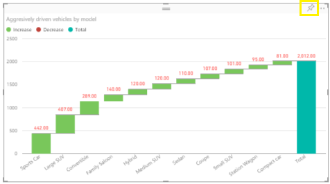

8. From **Page 5**, pin the following: 

    a. **Count of vin**

   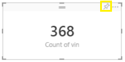

    b. **Fuel-efficient vehicles by model: Clustered column chart**

   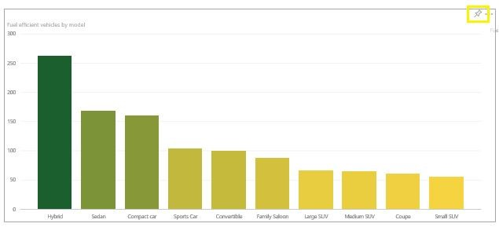

9. From **Page 4**, pin the following:  

    a. **Count of vin** 

    

    b. **Recalled vehicles by city, model: Treemap**

   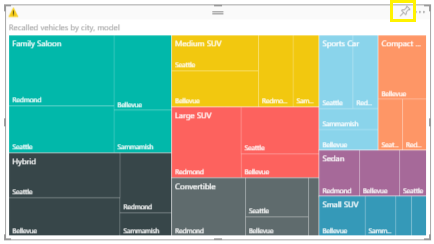  

10. From **Page 6**, pin the following:  

    a. **Contoso Motors logo**

   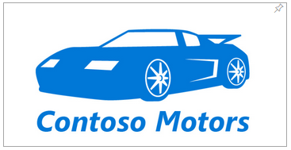

**Organize the dashboard**  

1. Go to the dashboard.

2. Hover over each chart. Rename each chart based on the naming provided in the following finished dashboard image. Move the charts around to look like the following dashboard:

    

   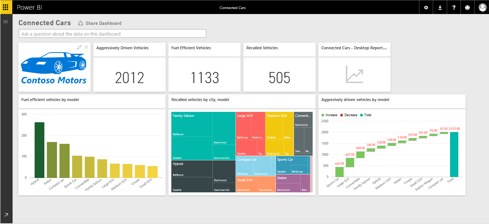

3. After you create all the reports mentioned in this document, the final finished dashboard looks like the following image: 

Congratulations! You have successfully created the reports and the dashboard to gain real-time, predictive and batch insights on vehicle health and driving habits.  
