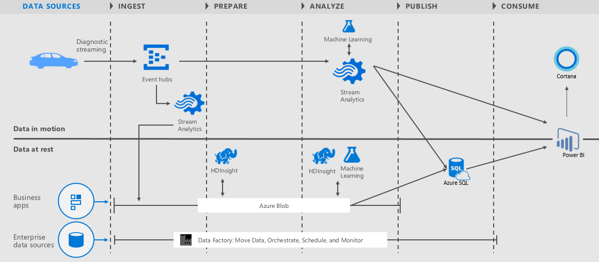

# Vehicle Telemetry Analytics Solution playbook
This menu links to the chapters in this playbook: 

[!INCLUDE [cap-vehicle-telemetry-playbook-selector](../../../includes/cap-vehicle-telemetry-playbook-selector.md)]

## Overview
Super computers have moved out of the lab and are now parked in garages. These are now being placed in cutting-edge automobiles that contain myriad sensors. These sensors give them the ability to track and monitor millions of events every second. By 2020, most of these vehicles will be connected to the Internet. Tapping into this wealth of data provides greater safety, reliability, and so a better driving experience. Microsoft makes this dream a reality with Cortana Intelligence.

Cortana Intelligence is a fully managed big data and advanced analytics suite that you can use to transform your data into intelligent action. The Cortana Intelligence Vehicle Telemetry Analytics Solution Template demonstrates how car dealerships, automobile manufacturers, and insurance companies are able to obtain real-time and predictive insights on vehicle health and driving habits.

The solution is implemented as a [lambda architecture pattern](https://en.wikipedia.org/wiki/Lambda_architecture), which shows the full potential of the Cortana Intelligence platform for real-time and batch processing.

## Architecture
The Vehicle Telemetry Analytics Solution architecture is illustrated in this diagram:

This solution includes the following Cortana Intelligence components and showcases their integration:

* **Azure Event Hubs** ingests millions of vehicle telemetry events into Azure.
* **Azure Stream Analytics** provides real-time insights on vehicle health and persists that data into long-term storage for richer batch analytics.
* **Azure Machine Learning** detects anomalies in real time and uses batch processing to provide predictive insights.
* **Azure HDInsight** transforms data at scale.
* **Azure Data Factory** handles orchestration, scheduling, resource management, and monitoring of the batch processing pipeline.
* **Power BI** gives this solution a rich dashboard for real-time data and predictive analytics visualizations.

This solution accesses two different data sources: 

* **Simulated vehicle signals and diagnostics**: A vehicle telematics simulator emits diagnostic information and signals that correspond to the state of the vehicle and the driving pattern at a given point in time. 
* **Vehicle catalog**: This reference data set maps VIN numbers to models.

