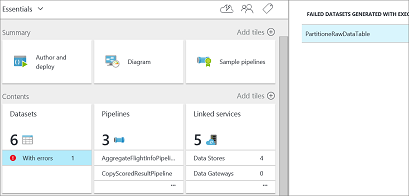
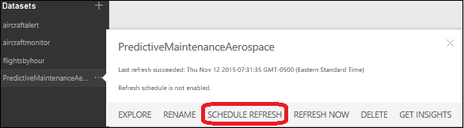

# Technical guide to the Cortana Intelligence Solution Template for predictive maintenance in aerospace

> [!Important]
> This article has been deprecated. The discussion about Predictive Maintenance in Aerospace is still relevant, but for current information, refer to [Solution Overview for Business Audiences](https://github.com/Azure/cortana-intelligence-predictive-maintenance-aerospace).

Solution templates are designed to accelerate the process of building an
E2E demo on top of Cortana Intelligence Suite. A deployed template provisions your subscription with necessary Cortana Intelligence components and then builds the relationships between them. It also seeds the data pipeline with sample data from a data generator application,  which you download and install on your local machine after you deploy the solution template. The data from the generator hydrates the data pipeline and start generating machine learning predictions, which can then be visualized on the Power BI dashboard.

The deployment process guides you through several steps to set up your solution credentials. Make sure you record the credentials such as solution name, username, and password that you provide during the deployment. 

The goals of this article are to:
- Describe the reference architecture and components provisioned in your subscription.
- Demonstrate how to replace the sample data with your own data. 
- Show how to modify the solution template.  

> [!TIP]
> You can download and print a [PDF version of this article](https://download.microsoft.com/download/F/4/D/F4D7D208-D080-42ED-8813-6030D23329E9/cortana-analytics-technical-guide-predictive-maintenance.pdf).
> 
> 

## Overview

When you deploy the solution, it activates Azure services within the Cortana Analytics Suite (including Event Hub, Stream Analytics,
HDInsight, Data Factory, and Machine Learning). The architecture
diagram shows how the Predictive Maintenance for
Aerospace Solution Template is constructed. You can investigate these services in the Azure portal by clicking  them in the solution template diagram created with the solution deployment (except for HDInsight, which is provisioned on demand when the related pipeline activities are required to run and are deleted afterwards).
Download a [full-size version of the diagram](https://download.microsoft.com/download/1/9/B/19B815F0-D1B0-4F67-AED3-A40544225FD1/ca-topologies-maintenance-prediction.png).

The following sections describe the solution parts.

## Data source and ingestion
### Synthetic data source
For this template, the data source used is generated from a desktop
application that you download and run locally after successful
deployment.

To find the instructions to download and install this application,   select the first node, Predictive Maintenance Data Generator, on the solution template diagram. The instructions are found in the Properties bar. This application feeds the [Azure Event Hub](#azure-event-hub) service with data points, or events, used in the rest of the solution flow. This data source is derived from publicly available data from the
[NASA data repository](https://c3.nasa.gov/dashlink/resources/139/)
using the [Turbofan Engine Degradation Simulation Data Set](https://ti.arc.nasa.gov/tech/dash/groups/pcoe/prognostic-data-repository/#turbofan).

The event generation application populates the Azure Event Hub only
while it's executing on your computer.  

### Azure Event Hub  
The [Azure Event
Hub](https://azure.microsoft.com/services/event-hubs/) service is
the recipient of the input provided by the Synthetic Data Source.

## Data preparation and analysis  
### Azure Stream Analytics
Use [Azure Stream
Analytics](https://azure.microsoft.com/services/stream-analytics/)
to provide near real-time analytics on the input stream
from the [Azure Event Hub](#azure-event-hub) service. You then publish results
onto a [Power BI](https://powerbi.microsoft.com) dashboard as well as
archive all raw incoming events to the [Azure
Storage](https://azure.microsoft.com/services/storage/) service
for later processing by the [Azure Data
Factory](https://azure.microsoft.com/documentation/services/data-factory/)
service.

### HDInsight custom aggregation
Run [Hive](https://blogs.msdn.com/b/bigdatasupport/archive/2013/11/11/get-started-with-hive-on-hdinsight.aspx)
scripts (orchestrated by Azure Data Factory) using HDInsight to provide aggregations on
the raw events archived using the Azure Stream Analytics
service.

### Azure Machine Learning
Make predictions on the remaining useful life (RUL) of a particular aircraft engine using the inputs received with [Azure Machine
Learning Service](https://azure.microsoft.com/services/machine-learning/)
(orchestrated by Azure Data Factory). 

## Data publishing
### Azure SQL Database
Use [Azure SQL
Database](https://azure.microsoft.com/services/sql-database/)
to store the predictions
received by the Azure Machine Learning service, which are then consumed in the [Power BI](https://powerbi.microsoft.com) dashboard.

## Data consumption
### Power BI
Use [Power BI](https://powerbi.microsoft.com) to show a
dashboard that contains aggregations and alerts provided by [Azure
Stream Analytics](https://azure.microsoft.com/services/stream-analytics/), as well as RUL
predictions stored in [Azure SQL Database](https://azure.microsoft.com/services/sql-database/) that
were produced using [Azure Machine
Learning](https://azure.microsoft.com/services/machine-learning/).

## How to bring in your own data
This section describes how to bring your own data to Azure, and what
areas require changes for the data you bring into this
architecture.

It's unlikely that your dataset matches the dataset used by
the [Turbofan Engine Degradation Simulation Data
Set](https://ti.arc.nasa.gov/tech/dash/groups/pcoe/prognostic-data-repository/#turbofan)
used for this solution template. Understanding your data and the
requirements are crucial in how you modify this template to work
with your own data. 

The following sections discuss the parts of the template that
require modifications when a new dataset is introduced.

### Azure Event Hub
Azure Event Hub is generic; data can be
posted to the hub in either CSV or JSON format. No special processing
occurs in the Azure Event Hub, but it's important that you understand
the data that's fed into it.

This document does not describe how to ingest your data, but you can
easily send events or data to an Azure Event Hub using the Event Hub
APIs.

### Azure Stream Analytics
Use the Azure Stream Analytics service to provide near real-time
analytics by reading from data streams and outputting data to any number
of sources.

For the Predictive Maintenance for Aerospace Solution Template, the
Azure Stream Analytics query consists of four sub queries, each
query consuming events from the Azure Event Hub service, with outputs to
four distinct locations. These outputs consist of three Power BI
datasets and one Azure Storage location.

The Azure Stream Analytics query can be found by:

* Connect to the Azure portal
* Locating the Stream Analytics jobs  that were
  generated when the solution was deployed (*for example*,
  **maintenancesa02asapbi** and **maintenancesa02asablob** for the
  predictive maintenance solution)
* Selecting
  
  * ***INPUTS*** to view the query input
  * ***QUERY*** to view the query itself
  * ***OUTPUTS*** to view the different outputs

Information about Azure Stream Analytics query construction can be found
in the [Stream Analytics Query
Reference](https://docs.microsoft.com/stream-analytics-query/stream-analytics-query-language-reference)
on MSDN.

In this solution, the queries output three datasets with near real-time
analytics information about the incoming data stream to a Power BI
dashboard provided as part of this solution template. Because
there's implicit knowledge about the incoming data format, these queries
must be altered based on your data format.

The query in the second Stream Analytics job **maintenancesa02asablob** simply outputs all [Event
Hub](https://azure.microsoft.com/services/event-hubs/) events to
[Azure Storage](https://azure.microsoft.com/services/storage/) and
hence requires no alteration regardless of your data format as the full
event information is streamed to storage.

### Azure Data Factory
The [Azure Data
Factory](https://azure.microsoft.com/documentation/services/data-factory/)
service orchestrates the movement and processing of data. In the
Predictive Maintenance for Aerospace Solution Template, the data factory
is made up of three
[pipelines](../../data-factory/concepts-pipelines-activities.md)
that move and process the data using various technologies.  Access your data factory by opening the Data Factory node at the bottom of the solution template diagram created with the deployment of the solution. Errors under your datasets are due to data factory being deployed before the data generator was started. Those errors can be ignored and do not prevent your data factory from functioning

This section discusses the necessary [pipelines and activities](../../data-factory/concepts-pipelines-activities.md) contained in the [Azure Data
Factory](https://azure.microsoft.com/documentation/services/data-factory/). Here is a diagram view of the solution.

Two of the pipelines of this factory contain
[Hive](https://blogs.msdn.com/b/bigdatasupport/archive/2013/11/11/get-started-with-hive-on-hdinsight.aspx)
scripts used to partition and aggregate the data. When noted,
the scripts are located in the [Azure
Storage](https://azure.microsoft.com/services/storage/) account
created during setup. Their location is:
maintenancesascript\\\\script\\\\hive\\\\ (or https://[Your solution
name].blob.core.windows.net/maintenancesascript).

Similar to [Azure Stream Analytics](#azure-stream-analytics-1)
queries, the
[Hive](https://blogs.msdn.com/b/bigdatasupport/archive/2013/11/11/get-started-with-hive-on-hdinsight.aspx)
scripts have implicit knowledge about the incoming data format and must be altered based on your data format.

#### *AggregateFlightInfoPipeline*
This
[pipeline](../../data-factory/concepts-pipelines-activities.md)
contains a single activity - an
[HDInsightHive](../../data-factory/transform-data-using-hadoop-hive.md)
activity using a
[HDInsightLinkedService](https://msdn.microsoft.com/library/azure/dn893526.aspx)
that runs a
[Hive](https://blogs.msdn.com/b/bigdatasupport/archive/2013/11/11/get-started-with-hive-on-hdinsight.aspx)
script to partition the data put in [Azure
Storage](https://azure.microsoft.com/services/storage/) during the
[Azure Stream
Analytics](https://azure.microsoft.com/services/stream-analytics/)
job.

The
[Hive](https://blogs.msdn.com/b/bigdatasupport/archive/2013/11/11/get-started-with-hive-on-hdinsight.aspx)
script for this partitioning task is ***AggregateFlightInfo.hql***

#### *MLScoringPipeline*
This
[pipeline](../../data-factory/concepts-pipelines-activities.md)
contains several activities whose end result is the scored
predictions from the [Azure Machine
Learning](https://azure.microsoft.com/services/machine-learning/)
experiment associated with this solution template.

Activities included are:

* [HDInsightHive](../../data-factory/transform-data-using-hadoop-hive.md)
  activity using an
  [HDInsightLinkedService](https://msdn.microsoft.com/library/azure/dn893526.aspx)
  that runs a
  [Hive](https://blogs.msdn.com/b/bigdatasupport/archive/2013/11/11/get-started-with-hive-on-hdinsight.aspx)
  script to perform aggregations and feature engineering necessary for
  the [Azure Machine
  Learning](https://azure.microsoft.com/services/machine-learning/) experiment.
  The
  [Hive](https://blogs.msdn.com/b/bigdatasupport/archive/2013/11/11/get-started-with-hive-on-hdinsight.aspx)
  script for this partitioning task is ***PrepareMLInput.hql***.
* [Copy](https://msdn.microsoft.com/library/azure/dn835035.aspx)
  activity that moves the results from the
  [HDInsightHive](../../data-factory/transform-data-using-hadoop-hive.md)
  activity to a single [Azure
  Storage](https://azure.microsoft.com/services/storage/) blob
  accessed by the
  [AzureMLBatchScoring](https://msdn.microsoft.com/library/azure/dn894009.aspx) activity.
* [AzureMLBatchScoring](https://msdn.microsoft.com/library/azure/dn894009.aspx)
  activity calls the [Azure Machine
  Learning](https://azure.microsoft.com/services/machine-learning/)
  experiment, with results put in a single [Azure
  Storage](https://azure.microsoft.com/services/storage/) blob.

#### *CopyScoredResultPipeline*
This
[pipeline](../../data-factory/concepts-pipelines-activities.md)
contains a single activity - a
[Copy](https://msdn.microsoft.com/library/azure/dn835035.aspx)
activity that moves the results of the [Azure Machine
Learning](#azure-machine-learning) experiment from the
***MLScoringPipeline*** to the [Azure SQL
Database](https://azure.microsoft.com/services/sql-database/) provisioned as part of the
solution template installation.

### Azure Machine Learning
The [Azure Machine
Learning](https://azure.microsoft.com/services/machine-learning/)
experiment used for this solution template provides the Remaining Useful
Life (RUL) of an aircraft engine. The experiment is specific to the data
set consumed and requires modification or replacement
specific to the data brought in.

For information about how the Azure Machine Learning experiment was
created, see [Predictive Maintenance: Step 1 of 3, data preparation and feature engineering](https://gallery.cortanaanalytics.com/Experiment/Predictive-Maintenance-Step-1-of-3-data-preparation-and-feature-engineering-2).

## Monitor Progress
Once the Data Generator is launched, the pipeline begins to dehydrate, and the different components of your solution start kicking into action following the commands issued by the data factory. There are two ways to monitor the pipeline.

1. One of the Stream Analytics jobs writes the raw incoming data to blob storage. If you click on Blob Storage component of your solution from the screen you successfully deployed the solution and then click Open in the right panel, it takes you to the [Azure portal](https://portal.azure.com/). Once there, click on Blobs. In the next panel, you see a list of Containers. Click on **maintenancesadata**. In the next panel is the **rawdata** folder. Inside the rawdata folder are folders with names such as hour=17, and hour=18. The presence of these folders indicates raw data is being generated on your computer and stored in blob storage. You should see csv files with finite sizes in MB in those folders.
2. The last step of the pipeline is to write data (for example predictions from machine learning) into SQL Database. You might have to wait a maximum of three hours for the data to appear in SQL Database. One way to monitor how much data is available in your SQL Database is through the [Azure portal](https://portal.azure.com/). On the left panel locate SQL DATABASES  and click it. Then locate your database **pmaintenancedb** and click on it. On the next page at the bottom, click on MANAGE
   
    
   
    Here, you can click on New Query and query for the number of rows (for example select count(*) from PMResult). As your database grows, the number of rows in the table should  increase.

## Power BI Dashboard

Set up a Power BI dashboard to visualize
your Azure Stream Analytics data (hot path) and batch prediction results from Azure machine learning (cold path).

### Set up the cold path dashboard
In the cold path data pipeline, the goal is to get the
predictive RUL (remaining useful life) of each aircraft engine once it
finishes a flight (cycle). The prediction result is updated every 3
hours for predicting the aircraft engines that have finished a flight
during the past 3 hours.

Power BI connects to an Azure SQL database as its data source, where the
prediction results are stored. Note: 1) On deploying your
solution, a prediction will appear in the database within 3 hours.
The pbix file that came with the Generator download contains some seed
data so that you may create the Power BI dashboard right away. 2) In
this step, the prerequisite is to download and install the free software
[Power BI
desktop](https://powerbi.microsoft.com/documentation/powerbi-desktop-get-the-desktop/).

The following steps guide you on how to connect the pbix file to
the SQL Database that was spun up at the time of solution deployment
containing data (for example, prediction results) for visualization.

1. Get the database credentials.
   
   You'll need **database server name, database name, user name and
   password** before moving to next steps. Here are the steps to guide
   you how to find them.
   
   * Once **'Azure SQL Database'** on your solution template diagram turns green, click it and then click **'Open'**.
   * You'll see a new browser tab/window which displays the Azure
     portal page. Click **'Resource groups'** on the left panel.
   * Select the subscription you're using for deploying the solution, and
     then select **'YourSolutionName\_ResourceGroup'**.
   * In the new pop out panel, click the   icon to access your
     database. Your database name is next to this icon (for example, **'pmaintenancedb'**), and  the **database server name** is listed under the Server name property and should look similar to **YourSolutionName.database.windows.net**.
   * Your database **username** and **password** are the same as
     the username and password previously recorded during deployment of the solution.
2. Update the data source of the cold path report file with Power
   BI Desktop.
   
   * In the folder where you downloaded and unzipped the
     Generator file, double-click the
     **PowerBI\\PredictiveMaintenanceAerospace.pbix** file. If you see any warning messages when you open the file, ignore them. On the top of the file, click **'Edit Queries'**.
     
     
   * You'll see two tables, **RemainingUsefulLife** and **PMResult**. Select the first table and click  next to **'Source'** under
     **'APPLIED STEPS'** on the right **'Query Settings'** panel. Ignore
     any warning messages that appear.
   * In the pop out window, replace **'Server'** and **'Database'** with
     your own server and database names, and then click **'OK'**. For server
     name, make sure you specify the port 1433
     (**YourSolutionName.database.windows.net, 1433**). Leave the Database field as **pmaintenancedb**. Ignore the warning
     messages that appear on the screen.
   * In the next pop out window, you'll see two options on the left pane
     (**Windows** and **Database**). Click **'Database'**, fill in your
     **'Username'** and **'Password'** (this is the username and password
     you entered when you first deployed the solution and created an
     Azure SQL database). In ***Select which level to apply these
     settings to***, check database level option. Then click
     **'Connect'**.
   * Click on the second table **PMResult** then click 
     next to **'Source'** under
     **'APPLIED STEPS'** on the right **'Query Settings'** panel, and update
     the server and database names as in the above steps and click OK.
   * Once you're guided back to the previous page, close the window. A message displays - click **Apply**. Lastly, click the **Save** button to save
     the changes. Your Power BI file has now established connection to the server. If your visualizations are empty, make sure you clear the selections on the visualizations to visualize all the data by clicking the eraser icon on the upper right corner of the legends. Use the refresh button to reflect new data on the visualizations. Initially, you only see the seed data on your visualizations as the data factory is scheduled to refresh every 3 hours. After 3 hours, you will see new predictions reflected in your visualizations when you refresh the data.
3. (Optional) Publish the cold path dashboard to [Power BI
   online](https://www.powerbi.com/). Note that this step needs a Power
   BI account (or Office 365 account).
   
   * Click **'Publish'** and few seconds later a window appears
     displaying "Publishing to Power BI Success!" with a green
     check mark. Click the link below "Open
     PredictiveMaintenanceAerospace.pbix in Power BI". To find detailed instructions, see [Publish from Power BI Desktop](https://support.powerbi.com/knowledgebase/articles/461278-publish-from-power-bi-desktop).
   * To create a new dashboard: click the **+** sign next to the
     **Dashboards** section on the left pane. Enter the name "Predictive
     Maintenance Demo" for this new dashboard.
   * Once you open the report, click  to pin all the
     visualizations to your dashboard. To find detailed instructions, see [Pin a tile to a Power BI dashboard from a report](https://support.powerbi.com/knowledgebase/articles/430323-pin-a-tile-to-a-power-bi-dashboard-from-a-report).
     Go to the dashboard page and
     adjust the size and location of your visualizations and edit their titles. To find detailed instructions on how to edit your tiles, see [Edit a tile -- resize, move, rename, pin, delete, add hyperlink](https://powerbi.microsoft.com/documentation/powerbi-service-edit-a-tile-in-a-dashboard/#rename). Here is an example dashboard with some cold path visualizations pinned to it.  Depending on how long you run your data generator, your numbers on the visualizations may be different.
      
     
      
   * To schedule refresh of the data, hover your mouse over the **PredictiveMaintenanceAerospace** dataset, click  and then choose **Schedule Refresh**.
      
     **Note:** If you see a warning massage, click **Edit Credentials** and make sure your database credentials are the same as those described in step 1.
      
     
      
   * Expand the **Schedule Refresh** section. Turn on "keep your
     data up-to-date".
      
   * Schedule the refresh based on your needs. To find more information, see
     [Data refresh in Power BI](https://support.powerbi.com/knowledgebase/articles/474669-data-refresh-in-power-bi).

### Setup hot path dashboard
The following steps guide you how to visualize data
output from Stream Analytics jobs that were generated at the time of
solution deployment. A [Power BI online](https://www.powerbi.com/)
account is required to perform the following steps. If you don't have an
account, you can [create one](https://powerbi.microsoft.com/pricing).

1. Add Power BI output in Azure Stream Analytics (ASA).
   
   * You must follow the instructions in
     [Azure Stream Analytics & Power BI: An analytics dashboard for real-time visibility of streaming data](../../stream-analytics/stream-analytics-power-bi-dashboard.md)
     to set up the output of your Azure Stream Analytics job as your Power BI dashboard.
   * The ASA query has three outputs which are **aircraftmonitor**, **aircraftalert**, and **flightsbyhour**. You can view the query by clicking on query tab. Corresponding to each of these tables, you need to add an output to ASA. When you add the first output (**aircraftmonitor**) make sure the **Output Alias**, **Dataset Name** and **Table Name** are the same (**aircraftmonitor**). Repeat the steps to add outputs for **aircraftalert**, and **flightsbyhour**. Once you have added all three output tables and started the ASA job, you should get a confirmation message ("Starting Stream Analytics job maintenancesa02asapbi succeeded").
2. Log in to [Power BI online](https://www.powerbi.com)
   
   * On the left panel Datasets section in My Workspace, the
     ***DATASET*** names **aircraftmonitor**, **aircraftalert**, and
     **flightsbyhour** should appear. This is the streaming data you pushed from Azure Stream Analytics in the previous step. The dataset **flightsbyhour** may not show up at the same time as the other two datasets due to the nature of the SQL query behind it. However, it should show up after an hour.
   * Make sure the ***Visualizations*** pane is open and is shown on the
     right side of the screen.
3. Once you have the data flowing into Power BI, you can start visualizing the streaming data. Below is an example dashboard with some hot path visualizations pinned to it. You can create other dashboard tiles based on appropriate datasets. Depending on how long you run your data generator, your numbers on the visualizations may be different.

    

1. Here are some steps to create one of the tiles above –  the "Fleet View of Sensor 11 vs. Threshold 48.26" tile:
   
   * Click dataset **aircraftmonitor** on the left panel
     Datasets section.
   * Click the **Line Chart** icon.
   * Click **Processed** in the **Fields** pane so that it shows under
     "Axis" in the **Visualizations** pane.
   * Click "s11" and "s11\_alert" so that they both appear
     under "Values". Click the small arrow next to **s11** and
     **s11\_alert**, change "Sum" to "Average".
   * Click **SAVE** on the top and name the report "aircraftmonitor." The
     report named "aircraftmonitor" is shown in the **Reports**
     section in the **Navigator** pane on the left.
   * Click the **Pin Visual** icon on the top right corner of this
     line chart. A "Pin to Dashboard" window may show up for you to
     choose a dashboard. Select "Predictive Maintenance Demo," then
     click "Pin."
   * Hover the mouse over this tile on the dashboard, click the "edit"
     icon on the top right corner to change its title to "Fleet View of
     Sensor 11 vs. Threshold 48.26" and subtitle to "Average across fleet
     over time."

## Delete your solution
Ensure that you stop the data generator when not actively using the solution as running the data generator will incur higher costs. Delete the solution if you are not using it. Deleting your solution deletes all the components provisioned in your subscription when you deployed the solution. To delete the solution, click  your solution name in the left panel of the solution template, and then click **Delete**.

## Cost estimation tools
The following two tools are available to help you better understand the
total costs involved in running the Predictive Maintenance for Aerospace
Solution Template in your subscription:

* [Microsoft Azure Cost Estimator
  Tool (online)](https://azure.microsoft.com/pricing/calculator/)
* [Microsoft Azure Cost Estimator
  Tool (desktop)](https://www.microsoft.com/download/details.aspx?id=43376)

