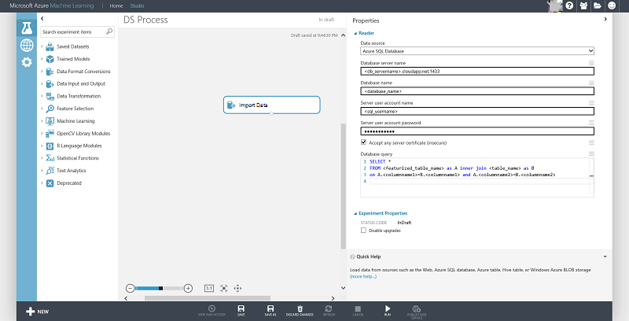

# Create features for data in SQL Server using SQL and Python
This document shows how to generate features for data stored in a SQL Server VM on Azure that help algorithms learn more efficiently from the data. You can use SQL or a programming language like Python to accomplish this task. Both approaches are demonstrated here.

This task is a step in the [Team Data Science Process (TDSP)](https://docs.microsoft.com/azure/machine-learning/team-data-science-process/).

> [!NOTE]
> For a practical example, you can consult the [NYC Taxi dataset](https://www.andresmh.com/nyctaxitrips/) and refer to the IPNB titled [NYC Data wrangling using IPython Notebook and SQL Server](https://github.com/Azure/Azure-MachineLearning-DataScience/blob/master/Misc/DataScienceProcess/iPythonNotebooks/machine-Learning-data-science-process-sql-walkthrough.ipynb) for an end-to-end walk-through.
> 
> 

## Prerequisites
This article assumes that you have:

* Created an Azure storage account. If you need instructions, see [Create an Azure Storage account](../../storage/common/storage-account-create.md)
* Stored your data in SQL Server. If you have not, see [Move data to an Azure SQL Database for Azure Machine Learning](move-sql-azure.md) for instructions on how to move the data there.

## Feature generation with SQL
In this section, we describe ways of generating features using SQL:  

1. [Count based Feature Generation](#sql-countfeature)
2. [Binning Feature Generation](#sql-binningfeature)
3. [Rolling out the features from a single column](#sql-featurerollout)

> [!NOTE]
> Once you generate additional features, you can either add them as columns to the existing table or create a new table with the additional features and primary key, that can be joined with the original table.
> 
> 

### Count based feature generation
This document demonstrates two ways of generating count features. The first method uses conditional sum and the second method uses the 'where` clause. These can then be joined with the original table (using primary key columns) to have count features alongside the original data.

    select <column_name1>,<column_name2>,<column_name3>, COUNT(*) as Count_Features from <tablename> group by <column_name1>,<column_name2>,<column_name3>

    select <column_name1>,<column_name2> , sum(1) as Count_Features from <tablename>
    where <column_name3> = '<some_value>' group by <column_name1>,<column_name2>

### Binning Feature Generation
The following example shows how to generate binned features by binning (using 5 bins) a numerical column that can be used as a feature instead:

    `SELECT <column_name>, NTILE(5) OVER (ORDER BY <column_name>) AS BinNumber from <tablename>`

### Rolling out the features from a single column
In this section, we demonstrate how to roll out a single column in a table to generate additional features. The example assumes that there is a latitude or longitude column in the table from which you are trying to generate features.

Here is a brief primer on latitude/longitude location data (resourced from stackoverflow `https://gis.stackexchange.com/questions/8650/how-to-measure-the-accuracy-of-latitude-and-longitude`). Here are some useful things to understand about location data before creating features from the field:

* The sign indicates whether we are north or south, east or west on the globe.
* A nonzero hundreds digit indicates longitude, not latitude is being used.
* The tens digit gives a position to about 1,000 kilometers. It gives useful information about what continent or ocean we are on.
* The units digit (one decimal degree) gives a position up to 111 kilometers (60 nautical miles, about 69 miles). It indicates, roughly, what large state or country/region we are in.
* The first decimal place is worth up to 11.1 km: it can distinguish the position of one large city from a neighboring large city.
* The second decimal place is worth up to 1.1 km: it can separate one village from the next.
* The third decimal place is worth up to 110 m: it can identify a large agricultural field or institutional campus.
* The fourth decimal place is worth up to 11 m: it can identify a parcel of land. It is comparable to the typical accuracy of an uncorrected GPS unit with no interference.
* The fifth decimal place is worth up to 1.1 m: it distinguishes trees from each other. Accuracy to this level with commercial GPS units can only be achieved with differential correction.
* The sixth decimal place is worth up to 0.11 m: you can use this for laying out structures in detail, for designing landscapes, building roads. It should be more than good enough for tracking movements of glaciers and rivers. This can be achieved by taking painstaking measures with GPS, such as differentially corrected GPS.

The location information can be featurized by separating out region, location, and city information. Note that once can also call a REST end point such as Bing Maps API available at `https://msdn.microsoft.com/library/ff701710.aspx` to get the region/district information.

    select
        <location_columnname>
        ,round(<location_columnname>,0) as l1        
        ,l2=case when LEN (PARSENAME(round(ABS(<location_columnname>) - FLOOR(ABS(<location_columnname>)),6),1)) >= 1 then substring(PARSENAME(round(ABS(<location_columnname>) - FLOOR(ABS(<location_columnname>)),6),1),1,1) else '0' end     
        ,l3=case when LEN (PARSENAME(round(ABS(<location_columnname>) - FLOOR(ABS(<location_columnname>)),6),1)) >= 2 then substring(PARSENAME(round(ABS(<location_columnname>) - FLOOR(ABS(<location_columnname>)),6),1),2,1) else '0' end     
        ,l4=case when LEN (PARSENAME(round(ABS(<location_columnname>) - FLOOR(ABS(<location_columnname>)),6),1)) >= 3 then substring(PARSENAME(round(ABS(<location_columnname>) - FLOOR(ABS(<location_columnname>)),6),1),3,1) else '0' end     
        ,l5=case when LEN (PARSENAME(round(ABS(<location_columnname>) - FLOOR(ABS(<location_columnname>)),6),1)) >= 4 then substring(PARSENAME(round(ABS(<location_columnname>) - FLOOR(ABS(<location_columnname>)),6),1),4,1) else '0' end     
        ,l6=case when LEN (PARSENAME(round(ABS(<location_columnname>) - FLOOR(ABS(<location_columnname>)),6),1)) >= 5 then substring(PARSENAME(round(ABS(<location_columnname>) - FLOOR(ABS(<location_columnname>)),6),1),5,1) else '0' end     
        ,l7=case when LEN (PARSENAME(round(ABS(<location_columnname>) - FLOOR(ABS(<location_columnname>)),6),1)) >= 6 then substring(PARSENAME(round(ABS(<location_columnname>) - FLOOR(ABS(<location_columnname>)),6),1),6,1) else '0' end     
    from <tablename>

These location based features can be further used to generate additional count features as described earlier.

> [!TIP]
> You can programmatically insert the records using your language of choice. You may need to insert the data in chunks to improve write efficiency. [Here is an example of how to do this using pyodbc](https://code.google.com/p/pypyodbc/wiki/A_HelloWorld_sample_to_access_mssql_with_python).
> Another alternative is to insert data in the database using [BCP utility](https://msdn.microsoft.com/library/ms162802.aspx)
> 
> 

### Connecting to Azure Machine Learning
The newly generated feature can be added as a column to an existing table or stored in a new table and joined with the original table for machine learning. Features can be generated or accessed if already created, using the [Import Data](https://msdn.microsoft.com/library/azure/4e1b0fe6-aded-4b3f-a36f-39b8862b9004/) module in Azure ML as shown below:

## Using a programming language like Python
Using Python to generate features when the data is in SQL Server is similar to processing data in Azure blob using Python. For comparison, see [Process Azure Blob data in your data science environment](data-blob.md). Load the data from the database into a pandas data frame to process it further. The process of connecting to the database and loading the data into the data frame is documented in this section.

The following connection string format can be used to connect to a SQL Server database from Python using pyodbc (replace servername, dbname, username, and password with your specific values):

    #Set up the SQL Azure connection
    import pyodbc
    conn = pyodbc.connect('DRIVER={SQL Server};SERVER=<servername>;DATABASE=<dbname>;UID=<username>;PWD=<password>')

The [Pandas library](https://pandas.pydata.org/) in Python provides a rich set of data structures and data analysis tools for data manipulation for Python programming. The following code reads the results returned from a SQL Server database into a Pandas data frame:

    # Query database and load the returned results in pandas data frame
    data_frame = pd.read_sql('''select <columnname1>, <columnname2>... from <tablename>''', conn)

Now you can work with the Pandas data frame as covered in topics [Create features for Azure blob storage data using Panda](create-features-blob.md).

