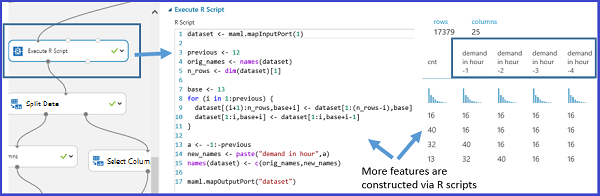
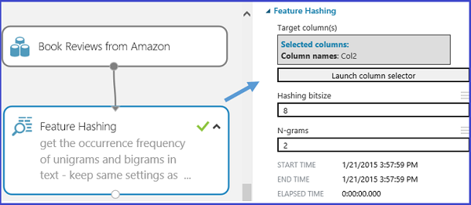

# Feature engineering in data science

In this article, you learn about feature engineering and its role in enhancing data in machine learning. Learn from illustrative examples drawn from [Azure Machine Learning Studio (classic)](../studio/what-is-ml-studio.md) experiments. 

* **Feature engineering**: The process of creating new features from raw data to increase the predictive power of the learning algorithm. Engineered features should capture additional information that is not easily apparent in the original feature set.
* **Feature selection**: The process of selecting the key subset of features to reduce the dimensionality of the training problem.

Normally **feature engineering** is applied first to generate additional features, and then **feature selection** is done to eliminate irrelevant, redundant, or highly correlated features.

Feature engineering and selection are part of the [modeling stage](lifecycle-modeling.md) of the Team Data Science Process (TDSP). To learn more about the TDSP and the data science lifecycle, see [What is the TDSP?](overview.md)

## What is feature engineering?

Training data consists of a matrix composed of rows and columns. Each row in the matrix is an observation or record. The columns of each row are the features that describe each record. The features specified in the experimental design should characterize the patterns in the data.

Although many of the raw data fields can be used directly to train a model, it's often necessary to create additional (engineered) features for an enhanced training dataset.

Engineered features that enhance training provide information that better differentiates the patterns in the data. But this process is something of an art. Sound and productive decisions often require domain expertise.

## Example 1: Add temporal features for a regression model

Let's use the experiment [Demand forecasting of bikes rentals](https://gallery.azure.ai/Experiment/Regression-Demand-estimation-4) in Azure Machine Learning Studio (classic) to demonstrate how to engineer features for a regression task. The objective of this experiment is to predict the demand for bike rentals within a specific month/day/hour.

### Bike rental dataset

The [Bike Rental UCI dataset](http://archive.ics.uci.edu/ml/datasets/Bike+Sharing+Dataset/) is based on real data from a bike share company based in the United States. It represents the number of bike rentals within a specific hour of a day for the years 2011 and 2012. It contains 17,379 rows and 17 columns.

The raw feature set contains weather conditions (temperature/humidity/wind speed) and the type of the day (holiday/weekday). The field to predict is the count, which represents the bike rentals within a specific hour. Count ranges from 1 to 977.

### Create a feature engineering experiment

With the goal of constructing effective features in the training data, four regression models are built using the same algorithm but with four different training datasets. The four datasets represent the same raw input data, but with an increasing number of features set. These features are grouped into four categories:

1. A = weather + holiday + weekday + weekend features for the predicted day
2. B = number of bikes that were rented in each of the previous 12 hours
3. C = number of bikes that were rented in each of the previous 12 days at the same hour
4. D = number of bikes that were rented in each of the previous 12 weeks at the same hour and the same day

Besides feature set A, which already exists in the original raw data, the other three sets of features are created through the feature engineering process. Feature set B captures recent demand for the bikes. Feature set C captures the demand for bikes at a particular hour. Feature set D captures demand for bikes at particular hour and particular day of the week. The four training datasets each includes feature set A, A+B, A+B+C, and A+B+C+D, respectively.

### Feature engineering using Studio (classic)

In the Studio (classic) experiment, these four training datasets are formed via four branches from the pre-processed input dataset. Except for the leftmost branch, each of these branches contains an [Execute R Script](https://msdn.microsoft.com/library/azure/30806023-392b-42e0-94d6-6b775a6e0fd5/) module, in which the derived features (feature set B, C, and D) are constructed and appended to the imported dataset.

The following figure demonstrates the R script used to create feature set B in the second left branch.

### Results

A comparison of the performance results of the four models is summarized in the following table: 

The best results are shown by features A+B+C. The error rate decreases when additional feature set are included in the training data. It verifies the presumption that the feature set B, C provide additional relevant information for the regression task. But adding the D feature does not seem to provide any additional reduction in the error rate.

##  Example 2: Create features for text mining

Feature engineering is widely applied in tasks related to text mining such as document classification and sentiment analysis. Since individual pieces of raw text usually serve as the input data, the feature engineering process is needed to create the features involving word/phrase frequencies.

### Feature hashing

To achieve this task, a technique called [feature hashing](https://docs.microsoft.com/azure/machine-learning/studio-module-reference/feature-hashing) is applied to efficiently turn arbitrary text features into indices. Instead of associating each text feature (words/phrases) to a particular index, this method applies a hash function to the features and using their hash values as indices directly.

In Studio (classic), there is a [Feature Hashing](https://docs.microsoft.com/azure/machine-learning/studio-module-reference/feature-hashing) module that creates word/phrase features conveniently. Following figure shows an example of using this module. The input dataset contains two columns: the book rating ranging from 1 to 5, and the actual review content. The goal of this module is to retrieve a bunch of new features that show the occurrence frequency of the corresponding word(s)/phrase(s) within the particular book review. To use this module, complete the following steps:

* First, select the column that contains the input text ("Col2" in this example).
* Second, set the "Hashing bitsize" to 8, which means 2^8=256 features will be created. The word/phase in all the text will be hashed to 256 indices. The parameter "Hashing bitsize" ranges from 1 to 31. The word(s)/phrase(s) are less likely to be hashed into the same index if setting it to be a larger number.
* Third, set the parameter "N-grams" to 2. This value gets the occurrence frequency of unigrams (a feature for every single word) and bigrams (a feature for every pair of adjacent words) from the input text. The parameter "N-grams" ranges from 0 to 10, which indicates the maximum number of sequential words to be included in a feature.  

The following figure shows what these new feature look like.

## Conclusion
Engineered and selected features increase the efficiency of the training process, which attempts to extract the key information contained in the data. They also improve the power of these models to classify the input data accurately and to predict outcomes of interest more robustly.

Feature engineering and selection can also combine to make the learning more computationally tractable. It does so by enhancing and then reducing the number of features needed to calibrate or train a model. Mathematically, the selected features are a minimal set of independent variables that explain the patterns in the data and predict outcomes successfully.

It's not always necessarily to perform feature engineering or feature selection. It depends on the data, the algorithm selected, and the objective of the experiment.

## Next steps

To create features for data in specific environments, see the following articles:

* [Create features for data in SQL Server](create-features-sql-server.md)
* [Create features for data in a Hadoop cluster using Hive queries](create-features-hive.md)