# Scalable Data Science with Azure Data Lake: An end-to-end Walkthrough
This walkthrough shows how to use Azure Data Lake to do data exploration and binary classification tasks on a sample of the NYC taxi trip and fare dataset to predict whether or not a tip is paid by a fare. It walks you through the steps of the [Team Data Science Process](https://docs.microsoft.com/azure/machine-learning/team-data-science-process/), end-to-end, from data acquisition to model training, and then to the deployment of a web service that publishes the model.

## Technologies

These technologies are used in this walkthrough.
* Azure Data Lake Analytics
* U-SQL and Visual Studio
* Python
* Azure Machine Learning
* Scripts

### Azure Data Lake Analytics
The [Microsoft Azure Data Lake](https://azure.microsoft.com/solutions/data-lake/) has all the capabilities required to make it easy for data scientists to store data of any size, shape and speed, and to conduct data processing, advanced analytics, and machine learning modeling with high scalability in a cost-effective way.   You pay on a per-job basis, only when data is actually being processed. Azure Data Lake Analytics includes U-SQL, a language that blends the declarative nature of SQL with the expressive power of C# to provide scalable distributed query capability. It enables you to process unstructured data by applying schema on read, insert custom logic and user-defined functions (UDFs), and includes extensibility to enable fine grained control over how to execute at scale. To learn more about the design philosophy behind U-SQL, see [Visual Studio blog post](https://blogs.msdn.microsoft.com/visualstudio/2015/09/28/introducing-u-sql-a-language-that-makes-big-data-processing-easy/).

Data Lake Analytics is also a key part of Cortana Analytics Suite and works with Azure SQL Data Warehouse, Power BI, and Data Factory. This combination gives you a complete cloud big data and advanced analytics platform.

This walkthrough begins by describing how to install the prerequisites and resources that are needed to complete data science process tasks. Then it outlines the data processing steps using U-SQL and concludes by showing how to use Python and Hive with Azure Machine Learning Studio (classic) to build and deploy the predictive models.

### U-SQL and Visual Studio
This walkthrough recommends using Visual Studio to edit U-SQL scripts to process the dataset. The U-SQL scripts are described here and provided in a separate file. The process includes ingesting, exploring, and sampling the data. It also shows how to run a U-SQL scripted job from the Azure portal. Hive tables are created for the data in an associated HDInsight cluster to facilitate the building and deployment of a binary classification model in Azure Machine Learning Studio.

### Python
This walkthrough also contains a section that shows how to build and deploy a predictive model using Python with Azure Machine Learning Studio. It provides a Jupyter notebook with the Python scripts for the steps in this process. The notebook includes code for some additional feature engineering steps and models construction such as multiclass classification and regression modeling in addition to the binary classification model outlined here. The regression task is to predict the amount of the tip based on other tip features.

### Azure Machine Learning 
Azure Machine Learning Studio (classic) is used to build and deploy the predictive models using two approaches: first with Python scripts and then with Hive tables on an HDInsight (Hadoop) cluster.

### Scripts
Only the principal steps are outlined in this walkthrough. You can download the full **U-SQL script** and **Jupyter Notebook** from [GitHub](https://github.com/Azure/Azure-MachineLearning-DataScience/tree/master/Misc/AzureDataLakeWalkthrough).

## Prerequisites
Before you begin these topics, you must have the following:

* An Azure subscription. If you do not already have one, see [Get Azure free trial](https://azure.microsoft.com/documentation/videos/get-azure-free-trial-for-testing-hadoop-in-hdinsight/).
* [Recommended] Visual Studio 2013 or later. If you do not already have one of these versions installed, you can download a free Community version from [Visual Studio Community](https://www.visualstudio.com/vs/community/).

> [!NOTE]
> Instead of Visual Studio, you can also use the Azure portal to submit Azure Data Lake queries. Instructions are provided on how to do so both with Visual Studio and on the portal in the section titled **Process data with U-SQL**.
>
>

## Prepare data science environment for Azure Data Lake
To prepare the data science environment for this walkthrough, create the following resources:

* Azure Data Lake Storage (ADLS)
* Azure Data Lake Analytics (ADLA)
* Azure Blob storage account
* Azure Machine Learning Studio (classic) account
* Azure Data Lake Tools for Visual Studio (Recommended)

This section provides instructions on how to create each of these resources. If you choose to use Hive tables with Azure Machine Learning, instead of Python, to build a model, you also need to provision an HDInsight (Hadoop) cluster. This alternative procedure in described in the Option 2 section.

> [!NOTE]
> The **Azure Data Lake Store** can be created either separately or when you create the **Azure Data Lake Analytics** as the default storage. Instructions are referenced for creating each of these resources separately, but the Data Lake storage account need not be created separately.
>
>

### Create an Azure Data Lake Storage

Create an ADLS from the [Azure portal](https://portal.azure.com). For details, see [Create an HDInsight cluster with Data Lake Store using Azure portal](../../data-lake-store/data-lake-store-hdinsight-hadoop-use-portal.md). Be sure to set up the Cluster AAD Identity in the **DataSource** blade of the **Optional Configuration** blade described there.

 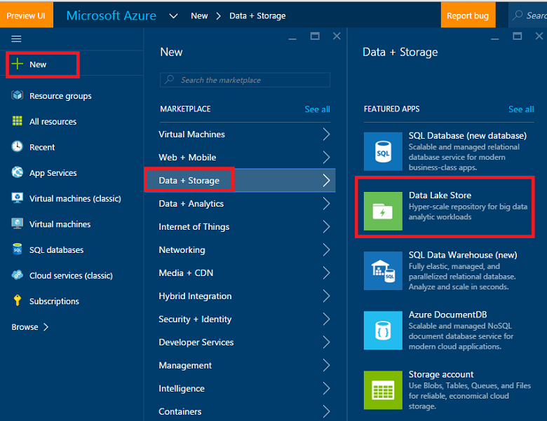

### Create an Azure Data Lake Analytics account
Create an ADLA account from the [Azure portal](https://portal.azure.com). For details, see [Tutorial: get started with Azure Data Lake Analytics using Azure portal](../../data-lake-analytics/data-lake-analytics-get-started-portal.md).

 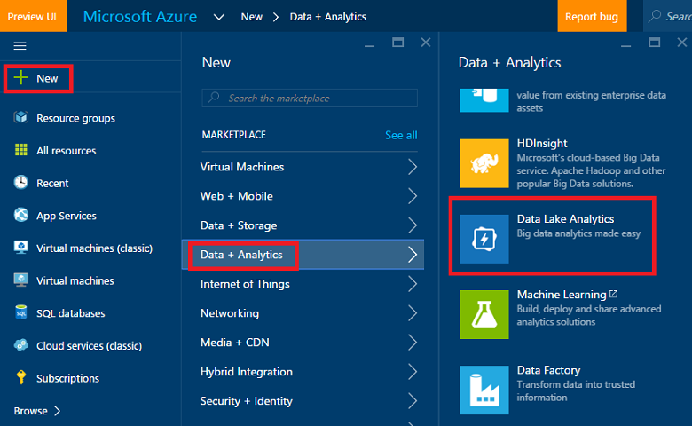

### Create an Azure Blob storage account
Create an Azure Blob storage account from the [Azure portal](https://portal.azure.com). For details, see the Create a storage account section in [About Azure Storage accounts](../../storage/common/storage-create-storage-account.md).

 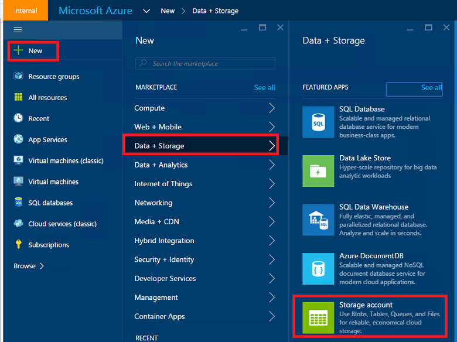

### Set up an Azure Machine Learning Studio (classic) account
Sign up/into Azure Machine Learning Studio (classic) from the [Azure Machine Learning studio](https://azure.microsoft.com/services/machine-learning/) page. Click on the **Get started now** button and then choose a "Free Workspace" or "Standard Workspace". Now your are ready to create experiments in Azure Machine Learning studio.

### Install Azure Data Lake Tools [Recommended]
Install Azure Data Lake Tools for your version of Visual Studio from [Azure Data Lake Tools for Visual Studio](https://www.microsoft.com/download/details.aspx?id=49504).

 

After the installation finishes, open up Visual Studio. You should see the Data Lake tab the menu at the top. Your Azure resources should appear in the left panel when you sign into your Azure account.

 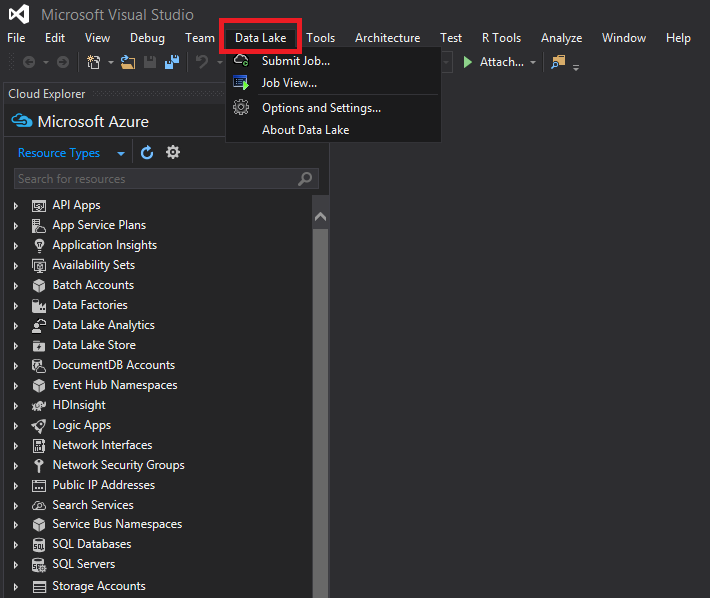

## The NYC Taxi Trips dataset
The data set used here is a publicly available dataset -- the [NYC Taxi Trips dataset](https://www.andresmh.com/nyctaxitrips/). The NYC Taxi Trip data consists of about 20 GB of compressed CSV files (~48 GB uncompressed), recording more than 173 million individual trips and the fares paid for each trip. Each trip record includes the pickup and dropoff locations and times, anonymized hack (driver's) license number, and the medallion (taxi’s unique ID) number. The data covers all trips in the year 2013 and is provided in the following two datasets for each month:

The 'trip_data' CSV contains trip details, such as number of passengers, pickup and dropoff points, trip duration, and trip length. Here are a few sample records:

       medallion,hack_license,vendor_id,rate_code,store_and_fwd_flag,pickup_datetime,dropoff_datetime,passenger_count,trip_time_in_secs,trip_distance,pickup_longitude,pickup_latitude,dropoff_longitude,dropoff_latitude
       89D227B655E5C82AECF13C3F540D4CF4,BA96DE419E711691B9445D6A6307C170,CMT,1,N,2013-01-01 15:11:48,2013-01-01 15:18:10,4,382,1.00,-73.978165,40.757977,-73.989838,40.751171
       0BD7C8F5BA12B88E0B67BED28BEA73D8,9FD8F69F0804BDB5549F40E9DA1BE472,CMT,1,N,2013-01-06 00:18:35,2013-01-06 00:22:54,1,259,1.50,-74.006683,40.731781,-73.994499,40.75066
       0BD7C8F5BA12B88E0B67BED28BEA73D8,9FD8F69F0804BDB5549F40E9DA1BE472,CMT,1,N,2013-01-05 18:49:41,2013-01-05 18:54:23,1,282,1.10,-74.004707,40.73777,-74.009834,40.726002
       DFD2202EE08F7A8DC9A57B02ACB81FE2,51EE87E3205C985EF8431D850C786310,CMT,1,N,2013-01-07 23:54:15,2013-01-07 23:58:20,2,244,.70,-73.974602,40.759945,-73.984734,40.759388
       DFD2202EE08F7A8DC9A57B02ACB81FE2,51EE87E3205C985EF8431D850C786310,CMT,1,N,2013-01-07 23:25:03,2013-01-07 23:34:24,1,560,2.10,-73.97625,40.748528,-74.002586,40.747868

The 'trip_fare' CSV contains details of the fare paid for each trip, such as payment type, fare amount, surcharge and taxes, tips and tolls, and the total amount paid. Here are a few sample records:

	   medallion, hack_license, vendor_id, pickup_datetime, payment_type, fare_amount, surcharge, mta_tax, tip_amount, tolls_amount, total_amount
       89D227B655E5C82AECF13C3F540D4CF4,BA96DE419E711691B9445D6A6307C170,CMT,2013-01-01 15:11:48,CSH,6.5,0,0.5,0,0,7
       0BD7C8F5BA12B88E0B67BED28BEA73D8,9FD8F69F0804BDB5549F40E9DA1BE472,CMT,2013-01-06 00:18:35,CSH,6,0.5,0.5,0,0,7
       0BD7C8F5BA12B88E0B67BED28BEA73D8,9FD8F69F0804BDB5549F40E9DA1BE472,CMT,2013-01-05 18:49:41,CSH,5.5,1,0.5,0,0,7
       DFD2202EE08F7A8DC9A57B02ACB81FE2,51EE87E3205C985EF8431D850C786310,CMT,2013-01-07 23:54:15,CSH,5,0.5,0.5,0,0,6
       DFD2202EE08F7A8DC9A57B02ACB81FE2,51EE87E3205C985EF8431D850C786310,CMT,2013-01-07 23:25:03,CSH,9.5,0.5,0.5,0,0,10.5

The unique key to join trip\_data and trip\_fare is composed of the following three fields: medallion, hack\_license and pickup\_datetime. The raw CSV files can be accessed from an Azure Storage blob. The U-SQL script for this join is in the [Join trip and fare tables](#join) section.

## Process data with U-SQL
The data processing tasks illustrated in this section include ingesting, checking quality, exploring, and sampling the data. How to join trip and fare tables is also shown. The final section shows run a U-SQL scripted job from the Azure portal. Here are links to each subsection:

* [Data ingestion: read in data from public blob](#ingest)
* [Data quality checks](#quality)
* [Data exploration](#explore)
* [Join trip and fare tables](#join)
* [Data sampling](#sample)
* [Run U-SQL jobs](#run)

The U-SQL scripts are described here and provided in a separate file. You can download the full **U-SQL scripts** from [GitHub](https://github.com/Azure/Azure-MachineLearning-DataScience/tree/master/Misc/AzureDataLakeWalkthrough).

To execute U-SQL, Open Visual Studio, click **File --> New --> Project**, choose **U-SQL Project**, name and save it to a folder.

> [!NOTE]
> It is possible to use the Azure Portal to execute U-SQL instead of Visual Studio. You can navigate to the Azure Data Lake Analytics resource on the portal and submit queries directly as illustrated in the following figure:
>
>

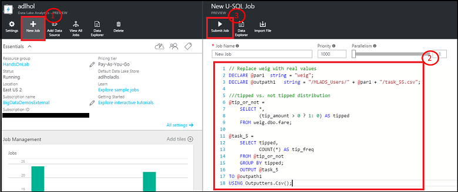

### Data Ingestion: Read in data from public blob

The location of the data in the Azure blob is referenced as **wasb://container\_name\@blob\_storage\_account\_name.blob.core.windows.net/blob_name** and can be extracted using **Extractors.Csv()**. Substitute your own container name and storage account name in following scripts for container\_name\@blob\_storage\_account\_name in the wasb address. Since the file names are in same format, it is possible to use **trip\_data\_\{\*\}.csv** to read in all 12 trip files.

    ///Read in Trip data
    @trip0 =
        EXTRACT
        medallion string,
        hack_license string,
        vendor_id string,
        rate_code string,
        store_and_fwd_flag string,
        pickup_datetime string,
        dropoff_datetime string,
        passenger_count string,
        trip_time_in_secs string,
        trip_distance string,
        pickup_longitude string,
        pickup_latitude string,
        dropoff_longitude string,
        dropoff_latitude string
    // This is reading 12 trip data from blob
    FROM "wasb://container_name@blob_storage_account_name.blob.core.windows.net/nyctaxitrip/trip_data_{*}.csv"
    USING Extractors.Csv();

Since there are headers in the first row, you need to remove the headers and change column types into appropriate ones. You can either save the processed data to Azure Data Lake Storage using **swebhdfs://data_lake_storage_name.azuredatalakestorage.net/folder_name/file_name**_ or to Azure Blob storage account using  **wasb://container_name\@blob_storage_account_name.blob.core.windows.net/blob_name**.

    // change data types
    @trip =
        SELECT
        medallion,
        hack_license,
        vendor_id,
        rate_code,
        store_and_fwd_flag,
        DateTime.Parse(pickup_datetime) AS pickup_datetime,
        DateTime.Parse(dropoff_datetime) AS dropoff_datetime,
        Int32.Parse(passenger_count) AS passenger_count,
        Double.Parse(trip_time_in_secs) AS trip_time_in_secs,
        Double.Parse(trip_distance) AS trip_distance,
        (pickup_longitude==string.Empty ? 0: float.Parse(pickup_longitude)) AS pickup_longitude,
        (pickup_latitude==string.Empty ? 0: float.Parse(pickup_latitude)) AS pickup_latitude,
        (dropoff_longitude==string.Empty ? 0: float.Parse(dropoff_longitude)) AS dropoff_longitude,
        (dropoff_latitude==string.Empty ? 0: float.Parse(dropoff_latitude)) AS dropoff_latitude
    FROM @trip0
    WHERE medallion != "medallion";

    ////output data to ADL
    OUTPUT @trip
    TO "swebhdfs://data_lake_storage_name.azuredatalakestore.net/nyctaxi_folder/demo_trip.csv"
    USING Outputters.Csv();

    ////Output data to blob
    OUTPUT @trip
    TO "wasb://container_name@blob_storage_account_name.blob.core.windows.net/demo_trip.csv"
    USING Outputters.Csv();

Similarly you can read in the fare data sets. Right-click Azure Data Lake Storage, you can choose to look at your data in **Azure portal --> Data Explorer** or **File Explorer** within Visual Studio.

 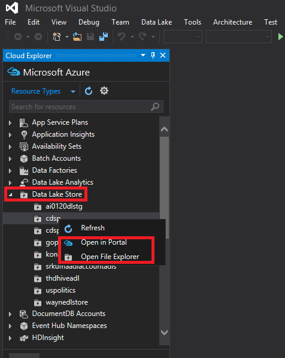

 

### Data quality checks
After trip and fare tables have been read in, data quality checks can be done in the following way. The resulting CSV files can be output to Azure Blob storage or Azure Data Lake Storage.

Find the number of medallions and unique number of medallions:

    ///check the number of medallions and unique number of medallions
    @trip2 =
        SELECT
        medallion,
        vendor_id,
        pickup_datetime.Month AS pickup_month
        FROM @trip;

    @ex_1 =
        SELECT
        pickup_month,
        COUNT(medallion) AS cnt_medallion,
        COUNT(DISTINCT(medallion)) AS unique_medallion
        FROM @trip2
        GROUP BY pickup_month;
        OUTPUT @ex_1
    TO "wasb://container_name@blob_storage_account_name.blob.core.windows.net/demo_ex_1.csv"
    USING Outputters.Csv();

Find those medallions that had more than 100 trips:

    ///find those medallions that had more than 100 trips
    @ex_2 =
        SELECT medallion,
               COUNT(medallion) AS cnt_medallion
        FROM @trip2
        //where pickup_datetime >= "2013-01-01t00:00:00.0000000" and pickup_datetime <= "2013-04-01t00:00:00.0000000"
        GROUP BY medallion
        HAVING COUNT(medallion) > 100;
        OUTPUT @ex_2
    TO "wasb://container_name@blob_storage_account_name.blob.core.windows.net/demo_ex_2.csv"
    USING Outputters.Csv();

Find those invalid records in terms of pickup_longitude:

    ///find those invalid records in terms of pickup_longitude
    @ex_3 =
        SELECT COUNT(medallion) AS cnt_invalid_pickup_longitude
        FROM @trip
        WHERE
        pickup_longitude <- 90 OR pickup_longitude > 90;
        OUTPUT @ex_3
    TO "wasb://container_name@blob_storage_account_name.blob.core.windows.net/demo_ex_3.csv"
    USING Outputters.Csv();

Find missing values for some variables:

    //check missing values
    @res =
        SELECT *,
               (medallion == null? 1 : 0) AS missing_medallion
        FROM @trip;

    @trip_summary6 =
        SELECT
            vendor_id,
        SUM(missing_medallion) AS medallion_empty,
        COUNT(medallion) AS medallion_total,
        COUNT(DISTINCT(medallion)) AS medallion_total_unique
        FROM @res
        GROUP BY vendor_id;
    OUTPUT @trip_summary6
    TO "wasb://container_name@blob_storage_account_name.blob.core.windows.net/demo_ex_16.csv"
    USING Outputters.Csv();

### Data exploration
Do some data exploration with the following scripts to get a better understanding of the data.

Find the distribution of tipped and non-tipped trips:

    ///tipped vs. not tipped distribution
    @tip_or_not =
        SELECT *,
               (tip_amount > 0 ? 1: 0) AS tipped
        FROM @fare;

    @ex_4 =
        SELECT tipped,
               COUNT(*) AS tip_freq
        FROM @tip_or_not
        GROUP BY tipped;
        OUTPUT @ex_4
    TO "wasb://container_name@blob_storage_account_name.blob.core.windows.net/demo_ex_4.csv"
    USING Outputters.Csv();

Find the distribution of tip amount with cut-off values: 0, 5, 10, and 20 dollars.

    //tip class/range distribution
    @tip_class =
        SELECT *,
               (tip_amount >20? 4: (tip_amount >10? 3:(tip_amount >5 ? 2:(tip_amount > 0 ? 1: 0)))) AS tip_class
        FROM @fare;
    @ex_5 =
        SELECT tip_class,
               COUNT(*) AS tip_freq
        FROM @tip_class
        GROUP BY tip_class;
        OUTPUT @ex_5
    TO "wasb://container_name@blob_storage_account_name.blob.core.windows.net/demo_ex_5.csv"
    USING Outputters.Csv();

Find basic statistics of trip distance:

    // find basic statistics for trip_distance
    @trip_summary4 =
        SELECT
            vendor_id,
            COUNT(*) AS cnt_row,
            MIN(trip_distance) AS min_trip_distance,
            MAX(trip_distance) AS max_trip_distance,
            AVG(trip_distance) AS avg_trip_distance
        FROM @trip
        GROUP BY vendor_id;
    OUTPUT @trip_summary4
    TO "wasb://container_name@blob_storage_account_name.blob.core.windows.net/demo_ex_14.csv"
    USING Outputters.Csv();

Find the percentiles of trip distance:

    // find percentiles of trip_distance
    @trip_summary3 =
        SELECT DISTINCT vendor_id AS vendor,
                        PERCENTILE_DISC(0.25) WITHIN GROUP(ORDER BY trip_distance) OVER(PARTITION BY vendor_id) AS median_trip_distance_disc,
                        PERCENTILE_DISC(0.5) WITHIN GROUP(ORDER BY trip_distance) OVER(PARTITION BY vendor_id) AS median_trip_distance_disc,
                        PERCENTILE_DISC(0.75) WITHIN GROUP(ORDER BY trip_distance) OVER(PARTITION BY vendor_id) AS median_trip_distance_disc
        FROM @trip;
       // group by vendor_id;
    OUTPUT @trip_summary3
    TO "wasb://container_name@blob_storage_account_name.blob.core.windows.net/demo_ex_13.csv"
    USING Outputters.Csv();

### Join trip and fare tables
Trip and fare tables can be joined by medallion, hack_license, and pickup_time.

    //join trip and fare table

    @model_data_full =
    SELECT t.*,
    f.payment_type, f.fare_amount, f.surcharge, f.mta_tax, f.tolls_amount,  f.total_amount, f.tip_amount,
    (f.tip_amount > 0 ? 1: 0) AS tipped,
    (f.tip_amount >20? 4: (f.tip_amount >10? 3:(f.tip_amount >5 ? 2:(f.tip_amount > 0 ? 1: 0)))) AS tip_class
    FROM @trip AS t JOIN  @fare AS f
    ON   (t.medallion == f.medallion AND t.hack_license == f.hack_license AND t.pickup_datetime == f.pickup_datetime)
    WHERE   (pickup_longitude != 0 AND dropoff_longitude != 0 );

    //// output to blob
    OUTPUT @model_data_full
    TO "wasb://container_name@blob_storage_account_name.blob.core.windows.net/demo_ex_7_full_data.csv"
    USING Outputters.Csv();

    ////output data to ADL
    OUTPUT @model_data_full
    TO "swebhdfs://data_lake_storage_name.azuredatalakestore.net/nyctaxi_folder/demo_ex_7_full_data.csv"
    USING Outputters.Csv();

For each level of passenger count, calculate the number of records, average tip amount, variance of tip amount, percentage of tipped trips.

    // contingency table
    @trip_summary8 =
        SELECT passenger_count,
               COUNT(*) AS cnt,
               AVG(tip_amount) AS avg_tip_amount,
               VAR(tip_amount) AS var_tip_amount,
               SUM(tipped) AS cnt_tipped,
               (float)SUM(tipped)/COUNT(*) AS pct_tipped
        FROM @model_data_full
        GROUP BY passenger_count;
        OUTPUT @trip_summary8
    TO "wasb://container_name@blob_storage_account_name.blob.core.windows.net/demo_ex_17.csv"
    USING Outputters.Csv();

### Data sampling
First, randomly select 0.1% of the data from the joined table:

    //random select 1/1000 data for modeling purpose
    @addrownumberres_randomsample =
    SELECT *,
            ROW_NUMBER() OVER() AS rownum
    FROM @model_data_full;

    @model_data_random_sample_1_1000 =
    SELECT *
    FROM @addrownumberres_randomsample
    WHERE rownum % 1000 == 0;

    OUTPUT @model_data_random_sample_1_1000
    TO "wasb://container_name@blob_storage_account_name.blob.core.windows.net/demo_ex_7_random_1_1000.csv"
    USING Outputters.Csv();

Then do stratified sampling by binary variable tip_class:

    //stratified random select 1/1000 data for modeling purpose
    @addrownumberres_stratifiedsample =
    SELECT *,
            ROW_NUMBER() OVER(PARTITION BY tip_class) AS rownum
    FROM @model_data_full;

    @model_data_stratified_sample_1_1000 =
    SELECT *
    FROM @addrownumberres_stratifiedsample
    WHERE rownum % 1000 == 0;
    //// output to blob
    OUTPUT @model_data_stratified_sample_1_1000
    TO "wasb://container_name@blob_storage_account_name.blob.core.windows.net/demo_ex_9_stratified_1_1000.csv"
    USING Outputters.Csv();
    ////output data to ADL
    OUTPUT @model_data_stratified_sample_1_1000
    TO "swebhdfs://data_lake_storage_name.azuredatalakestore.net/nyctaxi_folder/demo_ex_9_stratified_1_1000.csv"
    USING Outputters.Csv();

### Run U-SQL jobs
After editing U-SQL scripts, you can submit them to the server using your Azure Data Lake Analytics account. Click **Data Lake**, **Submit Job**, select your **Analytics Account**, choose **Parallelism**, and click **Submit** button.

 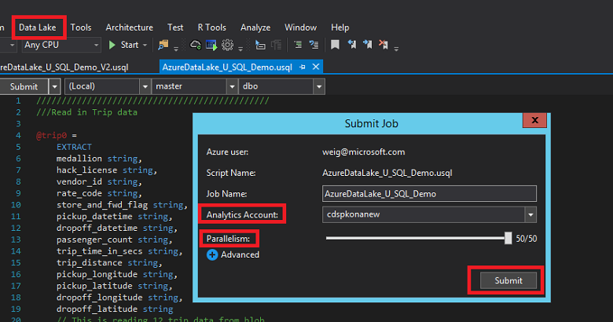

When the job is complied successfully, the status of your job is displayed in Visual Studio for monitoring. After the job completes, you can even replay the job execution process and find out the bottleneck steps to improve your job efficiency. You can also go to Azure portal to check the status of your U-SQL jobs.

 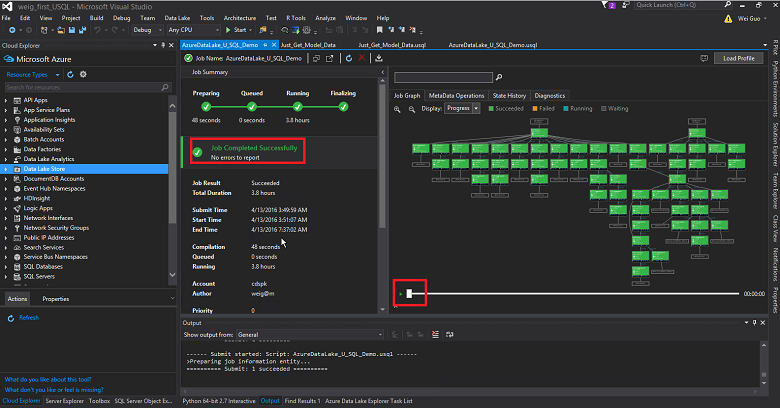

 

Now you can check the output files in either Azure Blob storage or Azure portal. Use the stratified sample data for our modeling in the next step.

 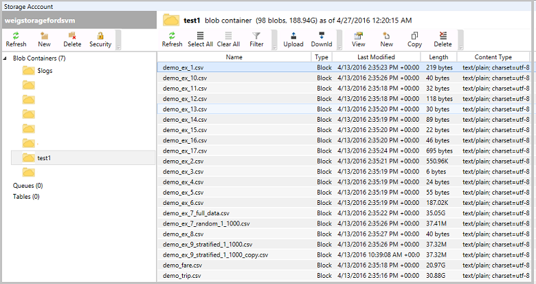

 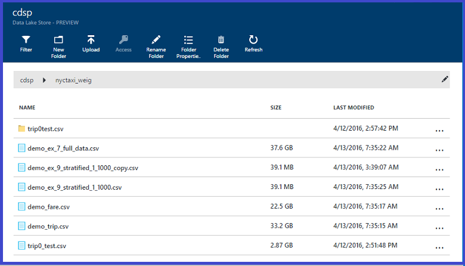

## Build and deploy models in Azure Machine Learning
Two options are available for you to pull data into Azure Machine Learning to build and

* In the first option, you use the sampled data that has been written to an Azure Blob (in the **Data sampling** step above) and use Python to build and deploy models from Azure Machine Learning.
* In the second option, you query the data in Azure Data Lake directly using a Hive query. This option requires that you create a new HDInsight cluster or use an existing HDInsight cluster where the Hive tables point to the NY Taxi data in Azure Data Lake Storage.  Both these options are discussed in the following sections.

## Option 1: Use Python to build and deploy machine learning models
To build and deploy machine learning models using Python, create a Jupyter Notebook on your local machine or in Azure Machine Learning Studio. The Jupyter Notebook  provided on [GitHub](https://github.com/Azure/Azure-MachineLearning-DataScience/tree/master/Misc/AzureDataLakeWalkthrough) contains the full code to explore, visualize data, feature engineering, modeling, and deployment. In this article, just the modeling and deployment are covered.

### Import Python libraries
In order to run the sample Jupyter Notebook or the Python script file, the following Python packages are needed. If you are using the Azure Machine Learning Notebook service, these packages have been pre-installed.

    import pandas as pd
    from pandas import Series, DataFrame
    import numpy as np
    import matplotlib.pyplot as plt
    from time import time
    import pyodbc
    import os
    from azure.storage.blob import BlobService
    import tables
    import time
    import zipfile
    import random
    import sklearn
    from sklearn.linear_model import LogisticRegression
    from sklearn.cross_validation import train_test_split
    from sklearn import metrics
    from __future__ import division
    from sklearn import linear_model
    from azureml import services

### Read in the data from blob
* Connection String

        CONTAINERNAME = 'test1'
        STORAGEACCOUNTNAME = 'XXXXXXXXX'
        STORAGEACCOUNTKEY = 'YYYYYYYYYYYYYYYYYYYYYYYYYYYY'
        BLOBNAME = 'demo_ex_9_stratified_1_1000_copy.csv'
        blob_service = BlobService(account_name=STORAGEACCOUNTNAME,account_key=STORAGEACCOUNTKEY)
* Read in as text

        t1 = time.time()
        data = blob_service.get_blob_to_text(CONTAINERNAME,BLOBNAME).split("\n")
        t2 = time.time()
        print(("It takes %s seconds to read in "+BLOBNAME) % (t2 - t1))

  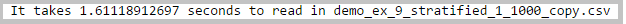
* Add column names and separate columns

        colnames = ['medallion','hack_license','vendor_id','rate_code','store_and_fwd_flag','pickup_datetime','dropoff_datetime',
        'passenger_count','trip_time_in_secs','trip_distance','pickup_longitude','pickup_latitude','dropoff_longitude','dropoff_latitude',
        'payment_type', 'fare_amount', 'surcharge', 'mta_tax', 'tolls_amount',  'total_amount', 'tip_amount', 'tipped', 'tip_class', 'rownum']
        df1 = pd.DataFrame([sub.split(",") for sub in data], columns = colnames)
* Change some columns to numeric

        cols_2_float = ['trip_time_in_secs','pickup_longitude','pickup_latitude','dropoff_longitude','dropoff_latitude',
        'fare_amount', 'surcharge','mta_tax','tolls_amount','total_amount','tip_amount', 'passenger_count','trip_distance'
        ,'tipped','tip_class','rownum']
        for col in cols_2_float:
            df1[col] = df1[col].astype(float)

### Build machine learning models
Here you build a binary classification model to predict whether a trip is tipped or not. In the Jupyter Notebook you can find other two models: multiclass classification, and regression models.

* First you need to create dummy variables that can be used in scikit-learn models

        df1_payment_type_dummy = pd.get_dummies(df1['payment_type'], prefix='payment_type_dummy')
        df1_vendor_id_dummy = pd.get_dummies(df1['vendor_id'], prefix='vendor_id_dummy')
* Create data frame for the modeling

        cols_to_keep = ['tipped', 'trip_distance', 'passenger_count']
        data = df1[cols_to_keep].join([df1_payment_type_dummy,df1_vendor_id_dummy])

        X = data.iloc[:,1:]
        Y = data.tipped
* Training and testing 60-40 split

        X_train, X_test, Y_train, Y_test = train_test_split(X, Y, test_size=0.4, random_state=0)
* Logistic Regression in training set

        model = LogisticRegression()
        logit_fit = model.fit(X_train, Y_train)
        print ('Coefficients: \n', logit_fit.coef_)
        Y_train_pred = logit_fit.predict(X_train)

       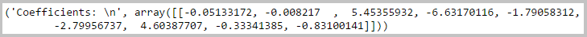
* Score testing data set

        Y_test_pred = logit_fit.predict(X_test)
* Calculate Evaluation metrics

        fpr_train, tpr_train, thresholds_train = metrics.roc_curve(Y_train, Y_train_pred)
        print fpr_train, tpr_train, thresholds_train

        fpr_test, tpr_test, thresholds_test = metrics.roc_curve(Y_test, Y_test_pred)
        print fpr_test, tpr_test, thresholds_test

        #AUC
        print metrics.auc(fpr_train,tpr_train)
        print metrics.auc(fpr_test,tpr_test)

        #Confusion Matrix
        print metrics.confusion_matrix(Y_train,Y_train_pred)
        print metrics.confusion_matrix(Y_test,Y_test_pred)

       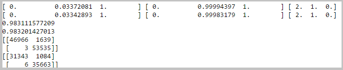

### Build Web Service API and consume it in Python
You want to operationalize the machine learning model after it has been built. The binary logistic model is used here as an example. Make sure the scikit-learn version in your local machine is 0.15.1 (Azure Machine Learning Studio is already at least at this version).

* Find your workspace credentials from Azure Machine Learning Studio (classic) settings. In Azure Machine Learning Studio, click **Settings** --> **Name** --> **Authorization Tokens**.

    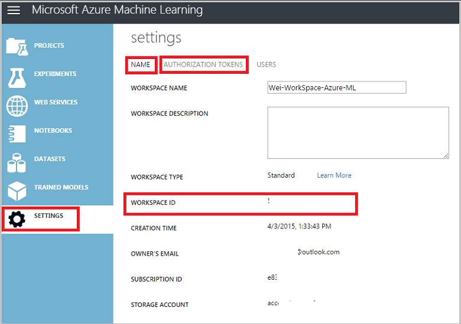

        workspaceid = 'xxxxxxxxxxxxxxxxxxxxxxxxxxx'
        auth_token = 'xxxxxxxxxxxxxxxxxxxxxxxxxxx'

* Create Web Service

        @services.publish(workspaceid, auth_token)
        @services.types(trip_distance = float, passenger_count = float, payment_type_dummy_CRD = float, payment_type_dummy_CSH=float, payment_type_dummy_DIS = float, payment_type_dummy_NOC = float, payment_type_dummy_UNK = float, vendor_id_dummy_CMT = float, vendor_id_dummy_VTS = float)
        @services.returns(int) #0, or 1
        def predictNYCTAXI(trip_distance, passenger_count, payment_type_dummy_CRD, payment_type_dummy_CSH,payment_type_dummy_DIS, payment_type_dummy_NOC, payment_type_dummy_UNK, vendor_id_dummy_CMT, vendor_id_dummy_VTS ):
            inputArray = [trip_distance, passenger_count, payment_type_dummy_CRD, payment_type_dummy_CSH, payment_type_dummy_DIS, payment_type_dummy_NOC, payment_type_dummy_UNK, vendor_id_dummy_CMT, vendor_id_dummy_VTS]
            return logit_fit.predict(inputArray)
* Get web service credentials

        url = predictNYCTAXI.service.url
        api_key =  predictNYCTAXI.service.api_key

        print url
        print api_key

        @services.service(url, api_key)
        @services.types(trip_distance = float, passenger_count = float, payment_type_dummy_CRD = float, payment_type_dummy_CSH=float,payment_type_dummy_DIS = float, payment_type_dummy_NOC = float, payment_type_dummy_UNK = float, vendor_id_dummy_CMT = float, vendor_id_dummy_VTS = float)
        @services.returns(float)
        def NYCTAXIPredictor(trip_distance, passenger_count, payment_type_dummy_CRD, payment_type_dummy_CSH,payment_type_dummy_DIS, payment_type_dummy_NOC, payment_type_dummy_UNK, vendor_id_dummy_CMT, vendor_id_dummy_VTS ):
            pass
* Call Web service API. Typically, wait 5-10 seconds after the previous step.

        NYCTAXIPredictor(1,2,1,0,0,0,0,0,1)

       

## Option 2: Create and deploy models directly in Azure Machine Learning
Azure Machine Learning Studio (classic) can read data directly from Azure Data Lake Storage and then be used to create and deploy models. This approach uses a Hive table that points at the Azure Data Lake Storage. A separate Azure HDInsight cluster needs to be provisioned for the Hive table. 

### Create an HDInsight Linux Cluster
Create an HDInsight Cluster (Linux) from the [Azure portal](https://portal.azure.com). For details, see the **Create an HDInsight cluster with access to Azure Data Lake Storage** section in [Create an HDInsight cluster with Data Lake Store using Azure portal](../../data-lake-store/data-lake-store-hdinsight-hadoop-use-portal.md).

 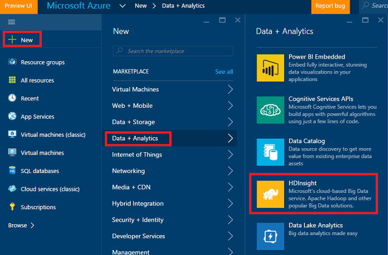

### Create Hive table in HDInsight
Now you create Hive tables to be used in Azure Machine Learning Studio (classic) in the HDInsight cluster using the data stored in Azure Data Lake Storage in the previous step. Go to the HDInsight cluster created. Click **Settings** --> **Properties** --> **Cluster AAD Identity** --> **ADLS Access**, make sure your Azure Data Lake Storage account is added in the list with read, write, and execute rights.

 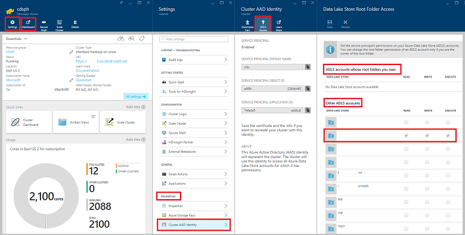

Then click **Dashboard** next to the **Settings** button and a window pops up. Click **Hive View** in the upper right corner of the page and you should see the **Query Editor**.

 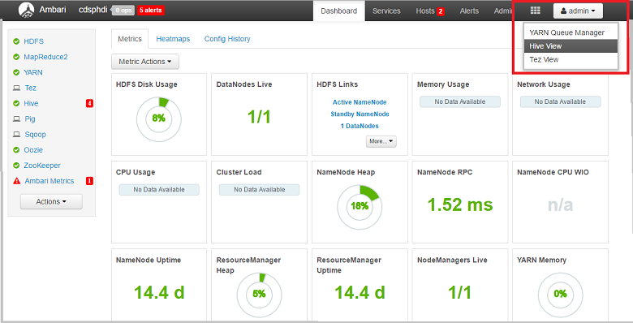

 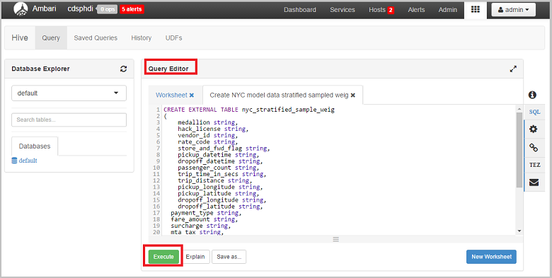

Paste in the following Hive scripts to create a table. The location of data source is in Azure Data Lake Storage reference in this way: **adl://data_lake_store_name.azuredatalakestore.net:443/folder_name/file_name**.

    CREATE EXTERNAL TABLE nyc_stratified_sample
    (
        medallion string,
        hack_license string,
        vendor_id string,
        rate_code string,
        store_and_fwd_flag string,
        pickup_datetime string,
        dropoff_datetime string,
        passenger_count string,
        trip_time_in_secs string,
        trip_distance string,
        pickup_longitude string,
        pickup_latitude string,
        dropoff_longitude string,
        dropoff_latitude string,
      payment_type string,
      fare_amount string,
      surcharge string,
      mta_tax string,
      tolls_amount string,
      total_amount string,
      tip_amount string,
      tipped string,
      tip_class string,
      rownum string
      )
    ROW FORMAT DELIMITED FIELDS TERMINATED BY ',' lines terminated by '\n'
    LOCATION 'adl://data_lake_storage_name.azuredatalakestore.net:443/nyctaxi_folder/demo_ex_9_stratified_1_1000_copy.csv';

When the query completes, you should see the results like this:

 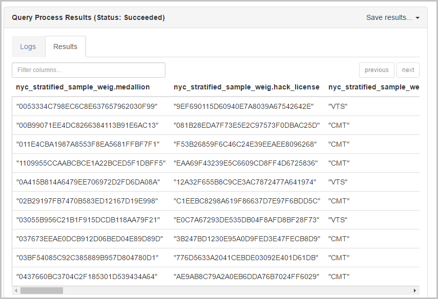

### Build and deploy models in Azure Machine Learning Studio
You are now ready to build and deploy a model that predicts whether or not a tip is paid with Azure Machine Learning. The stratified sample data is ready to be used in this binary classification (tip or not) problem. The predictive models using multiclass classification (tip_class) and regression (tip_amount) can also be built and deployed with Azure Machine Learning Studio, but here it is only shown how to handle the case using the binary classification model.

1. Get the data into Azure Machine Learning Studio (classic) using the **Import Data** module, available in the **Data Input and Output** section. For more information, see the [Import Data module](https://msdn.microsoft.com/library/azure/4e1b0fe6-aded-4b3f-a36f-39b8862b9004/) reference page.
2. Select **Hive Query** as the **Data source** in the **Properties** panel.
3. Paste the following Hive script in the **Hive database query** editor

        select * from nyc_stratified_sample;
4. Enter the URI of HDInsight cluster (this URI can be found in Azure portal), Hadoop credentials, location of output data, and Azure Storage account name/key/container name.

   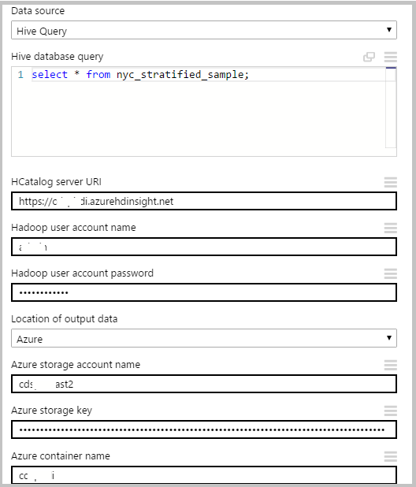

An example of a binary classification experiment reading data from Hive table is shown in the following figure:

 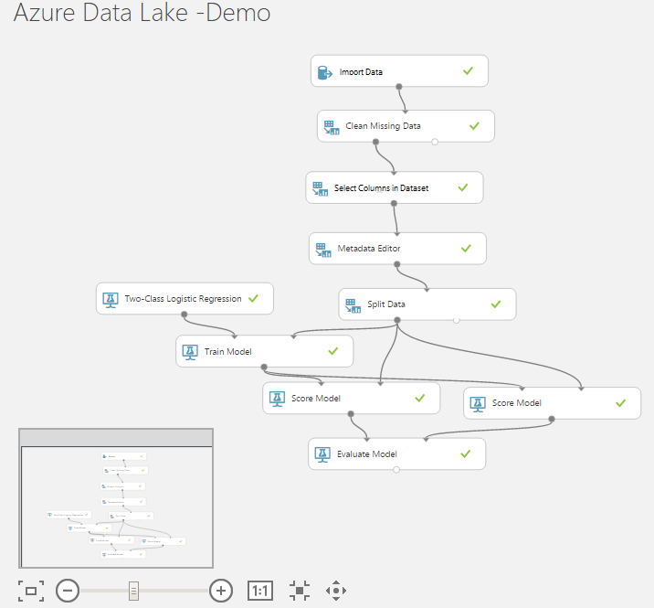

After the experiment is created, click  **Set Up Web Service** --> **Predictive Web Service**

 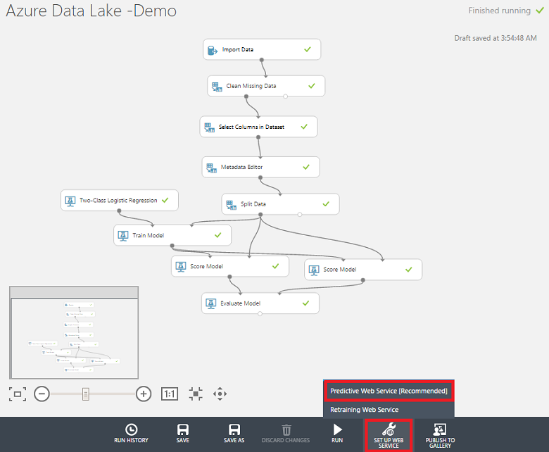

Run the automatically created scoring experiment, when it finishes, click **Deploy Web Service**

 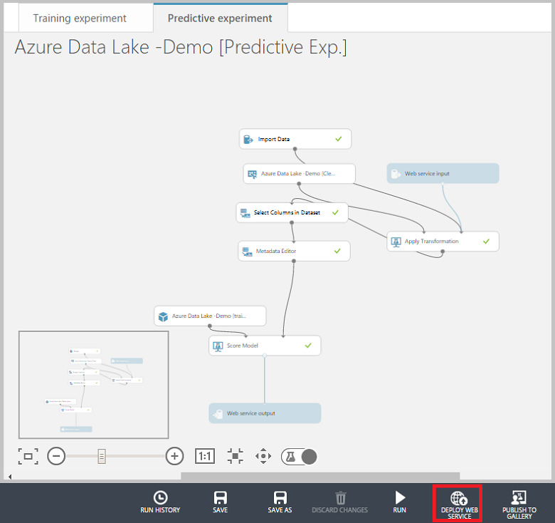

The web service dashboard displays shortly:

 

## Summary
By completing this walkthrough, you have created a data science environment for building scalable end-to-end solutions in Azure Data Lake. This environment was used to analyze a large public dataset, taking it through the canonical steps of the Data Science Process, from data acquisition through model training, and then to the deployment of the model as a web service. U-SQL was used to process, explore, and sample the data. Python and Hive were used with Azure Machine Learning Studio (classic) to build and deploy predictive models.

## What's next?
The learning path for the
[Team Data Science Process (TDSP)](https://docs.microsoft.com/azure/machine-learning/team-data-science-process/) provides links to topics describing each step in the advanced analytics process. There are a series of walkthroughs itemized on the [Team Data Science Process walkthroughs](walkthroughs.md) page that showcase how to use resources and services in various predictive analytics scenarios:

* [The Team Data Science Process in action: using SQL Data Warehouse](sqldw-walkthrough.md)
* [The Team Data Science Process in action: using HDInsight Hadoop clusters](hive-walkthrough.md)
* [The Team Data Science Process: using SQL Server](sql-walkthrough.md)
* [Overview of the Data Science Process using Spark on Azure HDInsight](spark-overview.md)
