# Group Manager tasks

This topic outlines the tasks that a Group Manager is expected to complete for hist/her data science organization. The objective is to establish collaborative group environment that standardizes on the [Team Data Science Process](overview.md) (TDSP). For an outline of the personnel roles and their associated tasks that are handled by a data science team standardizing on this process, see [Team Data Science Process roles and tasks](roles-tasks.md).

The **Group Manager** is the manager of the entire data science unit in an enterprise. A data science unit may have multiple teams, each of which is working on multiple data science projects in distinct business verticals. A Group Manager may delegate their tasks to a surrogate, but the tasks associated with the role are the same. There are six main tasks as shown in the following diagram:

>[AZURE.NOTE] We outline the steps needed to set up a TDSP group environment using Azure DevOps Services in the instructions that follow. We specify how to accomplish these tasks with Azure DevOps Services because that is how we implement TDSP at Microsoft. If another code hosting platform is used for your group, the tasks that need to be completed by the group manager generally do not change. But the way to complete these tasks is going to be different.

1. Set up **Azure DevOps Services** for the group.
2. Create a **group project** on Azure DevOps Services (for Azure DevOps Services users)
3. Create the **GroupProjectTemplate** repository
4. Create the **GroupUtilities** repository
5. Seed the **GroupProjectTemplate** and **GroupUtilities** repositories for the Azure DevOps Services with content from the TDSP repositories.
6. Set up the **security controls** for team members to access to the GroupProjectTemplate and GroupUtilities repositories.

Each of the preceding steps is described in detail. But first, we familiarize you with the abbreviations and discuss the pre-requisites for working with repositories.

### Abbreviations for repositories and directories

This tutorial uses abbreviated names for repositories and directories. These definitions make it easier to follow the operations between the repositories and directories. This notation is used in the following sections:

- **G1**: The project template repository developed and managed by TDSP team of Microsoft.
- **G2**: The utilities repository developed and managed by TDSP team of Microsoft.
- **R1**: The GroupProjectTemplate repository on Git you set up on your Azure DevOps group server.
- **R2**: The GroupUtilities repository on Git you set up on your Azure DevOps group server.
- **LG1** and **LG2**: The local directories on your machine that you clone G1 and G2 to, respectively.
- **LR1** and **LR2**: The local directories on your machine that you clone R1 and R2 to, respectively.

### Pre-requisites for cloning repositories and checking code in and out
 
- Git must be installed on your machine. If you are using a Data Science Virtual Machine (DSVM), Git has been pre-installed and you are good to go. Otherwise, see the [Platforms and tools appendix](platforms-and-tools.md#appendix).  
- If you are using a **Windows DSVM**, you need to have [Git Credential Manager (GCM)](https://github.com/Microsoft/Git-Credential-Manager-for-Windows) installed on your machine. In the README.md file, scroll down to the **Download and Install** section and click the *latest installer*. This step takes you to the latest installer page. Download the .exe installer from here and run it. 
- If you are using **Linux DSVM**, create an SSH public key on your DSVM and add it to your group Azure DevOps Services. For more information about SSH, see the **Create SSH public key** section in the [Platforms and tools appendix](platforms-and-tools.md#appendix). 

## 1. Create Account on Azure DevOps Services

The Azure DevOps Services hosts the following repositories:

- **group common repositories**: General-purpose repositories that can be adopted by multiple teams within a group for multiple data science projects. For example, the *GroupProjectTemplate* and *GroupUtilities* repositories.
- **team repositories**:  Repositories for specific teams within a group. These repositories are specific for a team's need, and can be adopted by multiple projects executed by that team, but not general enough to be useful to multiple teams within a data science group. 
- **project repositories**: Repositories available for specific projects. Such repositories may not be general enough to be useful to multiple projects performed by a team, and to multiple teams in a data science group.

### Setting up the Azure DevOps Services Sign into your Microsoft account
	
Go to [Visual Studio online](https://www.visualstudio.com/), click **Sign in** in the upper right corner and sign into your Microsoft account. 
	
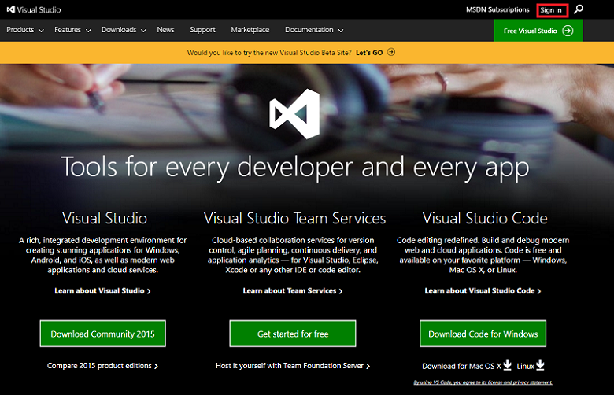

If you do not have a Microsoft account, click **Sign up now** to create a Microsoft account, and then sign in using this account. 

If your organization has a Visual Studio/MSDN subscription, click the green **Sign in with your work or school account** box and sign in with the credentials associated with this subscription. 
		
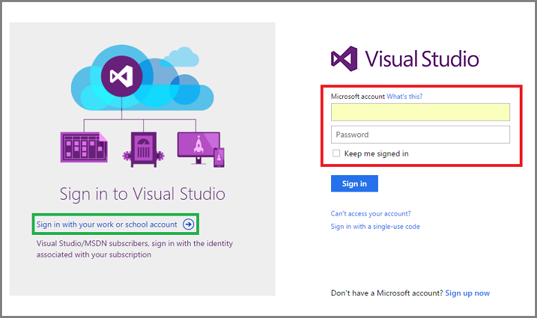

		
After you sign in, click **Create New Account** in the upper right corner as shown in the following image:
		
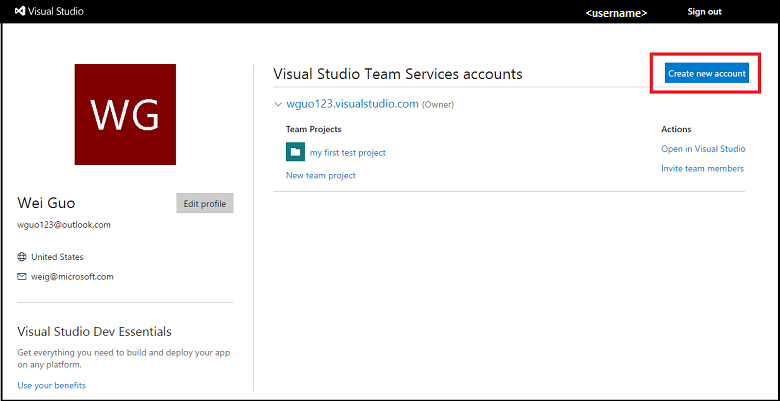
		
Fill in the information for the Azure DevOps Services that you want to create in the **Create your account** wizard with the following values: 

- **Server URL**: Replace *mysamplegroup* with your own *server name*. The URL of your server is going to be: *https://\<servername\>.visualstudio.com*. 
- **Manage code using:** Select **_Git_**.
- **Project name:** Enter *GroupCommon*. 
- **Organize work using:** Choose *Agile*.
- **Host your projects in:** Choose a geo location. In this example, we choose *South Central US*. 
		
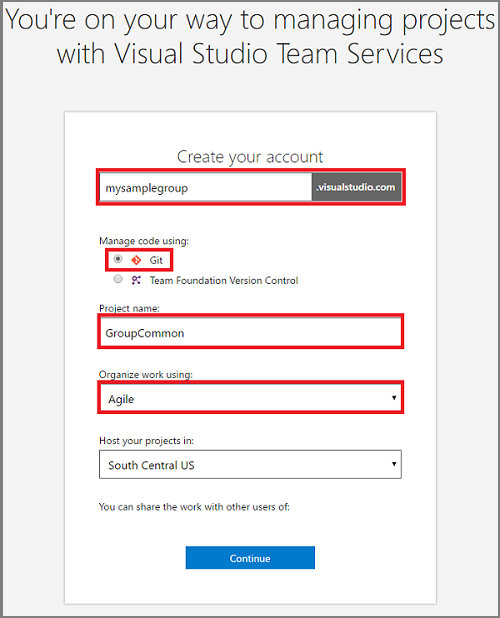

>[AZURE.NOTE] If you see the following pop-up window after you click **Create new account**, then you need to click **Change details** to display all the fields itemized.

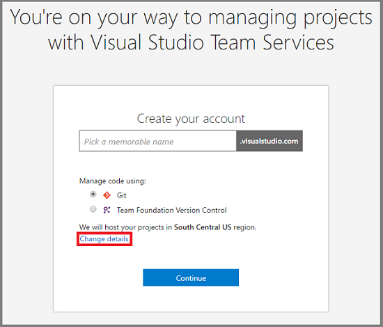

Click **Continue**. 

## 2. GroupCommon Project

The **GroupCommon** page (*https://\<servername\>.visualstudio.com/GroupCommon*) opens after your Azure DevOps Services is created.
							

## 3. Create the GroupUtilities (R2) repository

To create the **GroupUtilities** (R2) repository under Azure DevOps Services:

- To open the **Create a new repository** wizard, click **New repository** on the **Version Control** tab of your project. 

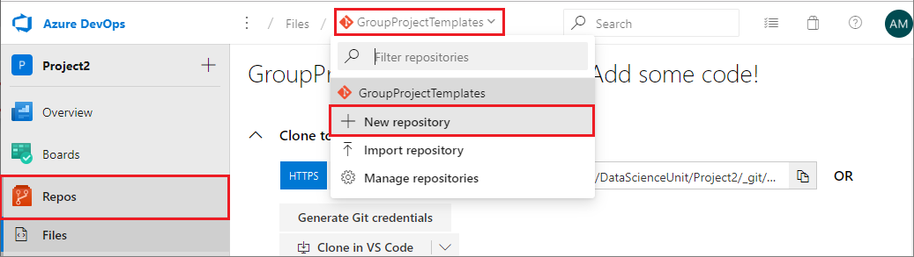 

- Select *Git* as the **Type**, and enter *GroupUtilities* as the **Name**, and then click **Create**. 

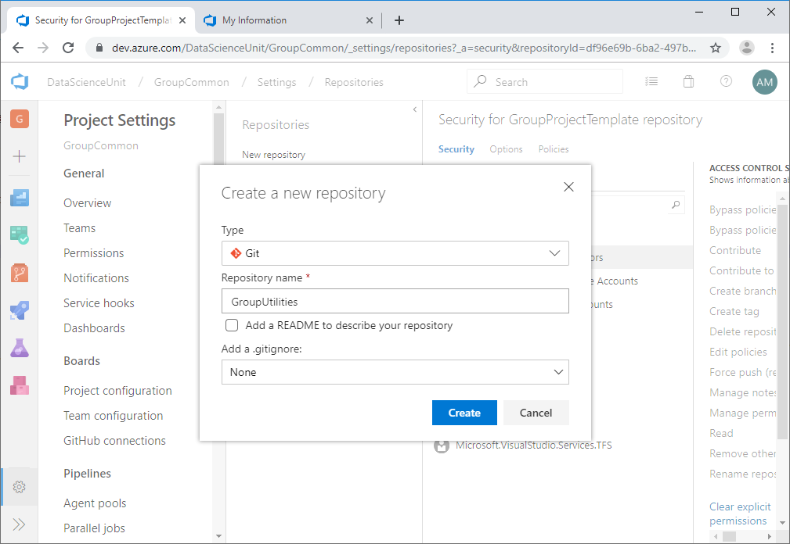
				
Now you should see two Git repositories **GroupProjectTemplate** and **GroupUtilities** in the left column of the **Version Control** page: 

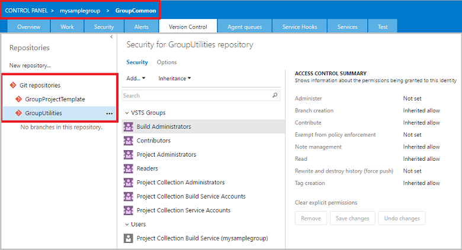

## 4. Create the GroupProjectTemplate (R1) repository

The setup of the repositories for the Azure DevOps group server consists of two tasks:

- Rename the default **GroupCommon** repository***GroupProjectTemplate***.
- Create the **GroupUtilities** repository on the Azure DevOps Services under project **GroupCommon**. 

Instructions for the first task are contained in this section after remarks on naming conventions or our repositories and directories. The instructions for the second task are contained in the following section for step 4.

### Rename the default GroupCommon repository

To rename the default **GroupCommon** repository as *GroupProjectTemplate* (referred as **R1** in this tutorial):
	
- Click **Collaborate on code** on the **GroupCommon** project page. This takes you to the default Git repository page of the project **GroupCommon**. Currently, this Git repository is empty. 

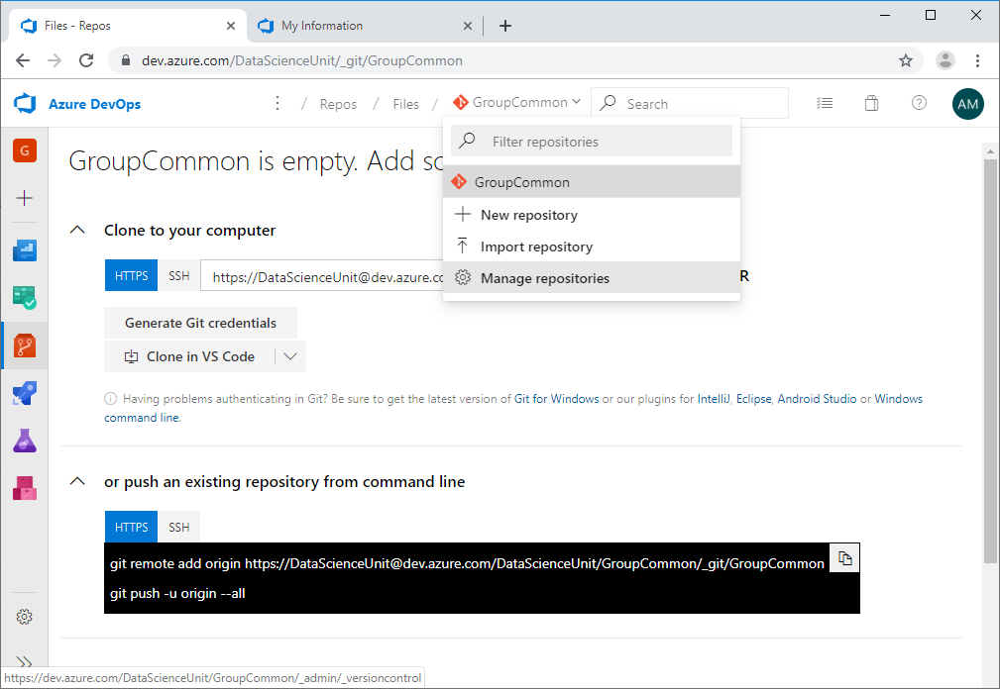
		
- Click **GroupCommon** on the top left corner (highlighted with a red box in the following figure) on the Git repository page of **GroupCommon** and select **Manage repositories** (highlighted with a green box in the following figure). This  procedure brings up the **CONTROL PANEL**. 
- Select the **Version Control** tab of your project. 

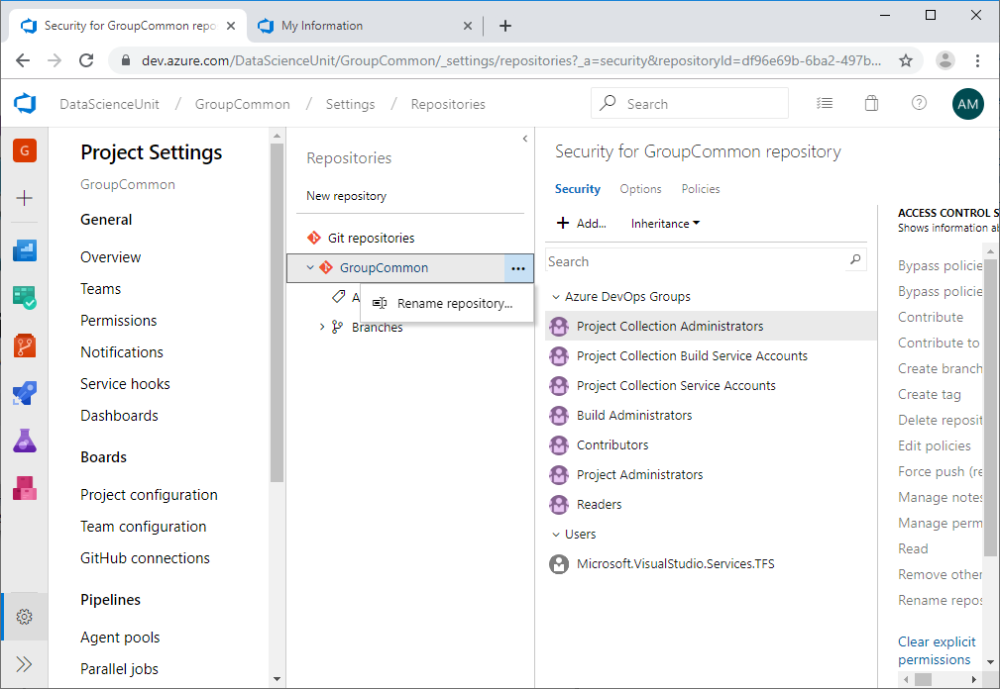

- Click the **...** to the right of the **GroupCommon** repository on the left panel, and select **Rename repository**. 

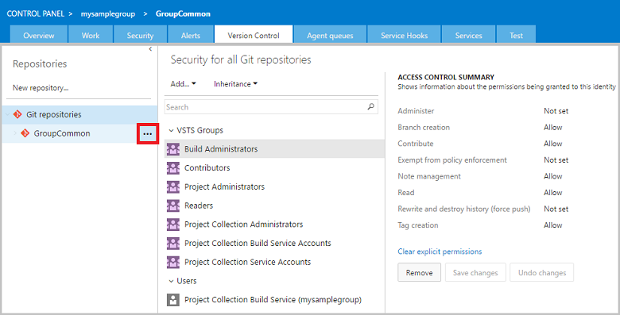
		
- In the **Rename the GroupCommon repository** wizard that pops up, enter *GroupProjectTemplate* in the **Repository name** box, and then click **Rename**. 

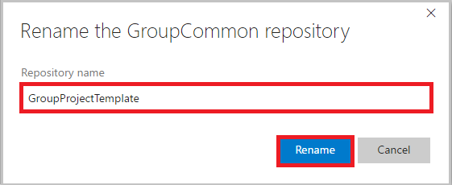

## 5. Seed the R1 & R2 repositories on the Azure DevOps Services

In this stage of the procedure, you seed the *GroupProjectTemplate* (R1) and *GroupUtilities* (R2) repositories that you set up in the previous section. These repositories are seeded with the ***ProjectTemplate*** (**G1**) and ***Utilities*** (**G2**) repositories that are managed by Microsoft for the Team Data Science Process. When this seeding is completed:

- your R1 repository is going to have the same set of directories and document templates that the G1 does
- your R2 repository is going to contain the set of data science utilities developed by Microsoft.

The seeding procedure uses the directories on your local DSVM as intermediate staging sites. Here are the steps followed in this section:

- G1 & G2 - cloned to -> LG1 & LG2
- R1 & R2 - cloned to -> LR1 & LR2
- LG1 & LG2 - files copied into -> LR1 & LR2
- (Optional) customization of LR1 & LR2
- LR1 & LR2 - contents add to -> R1 & R2

### Clone G1 & G2 repositories to your local DSVM

In this step, you clone the Team Data Science Process (TDSP) ProjectTemplate repository (G1) and Utilities (G2) from the TDSP github repositories to folders in your local DSVM as LG1 and LG2:

- Create a directory to serve as the root directory to host all your clones of the repositories. 
	-  In the Windows DSVM, create a directory *C:\GitRepos\TDSPCommon*. 
	-  In the Linux DSVM, create a directory *GitRepos\TDSPCommon* in your home directory. 

- Run the following set of commands from the *GitRepos\TDSPCommon* directory.

	`git clone https://github.com/Azure/Azure-TDSP-ProjectTemplate` 
	`git clone https://github.com/Azure/Azure-TDSP-Utilities`
        
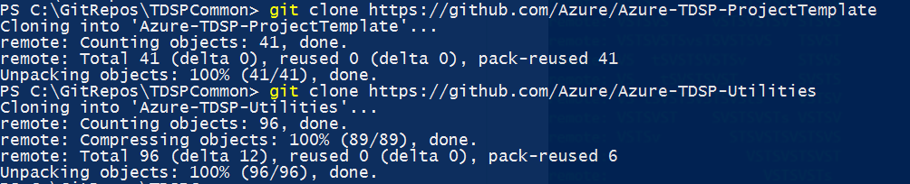

- Using our abbreviated repository names, this is what these scripts have achieved: 
	- G1 - cloned into -> LG1
	- G2 - cloned into -> LG2
- After the cloning is completed, you should be able to see two directories, _ProjectTemplate_ and _Utilities_, under **GitRepos\TDSPCommon** directory. 

### Clone R1 & R2 repositories to your local DSVM

In this step, you clone the GroupProjectTemplate repository (R1) and GroupUtilities repository (R2) on local directories (referred as LR1 and LR2, respectively) under **GitRepos\GroupCommon** on your DSVM.

- To get the URLs of the R1 and R2 repositories, go to your **GroupCommon** home page on Azure DevOps Services. This usually has the URL *https://\<Your Azure DevOps Services Name\>.visualstudio.com/GroupCommon*. 
- Click **CODE**. 
- Choose the **GroupProjectTemplate** and **GroupUtilities** repositories. Copy and save each of the URLs (HTTPS for Windows; SSH for Linux) from the **Clone URL** element, in turn, for use in the following scripts:  

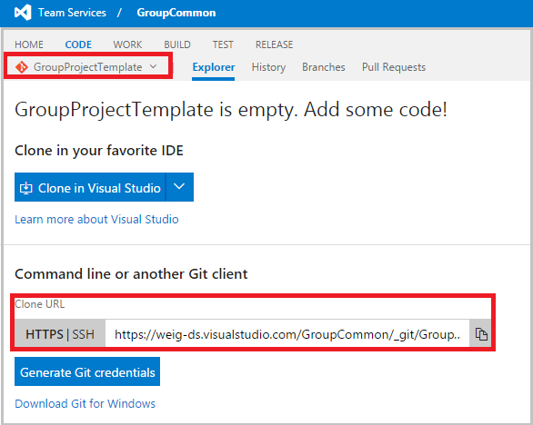

- Change into the **GitRepos\GroupCommon** directory on your Windows or Linux DSVM and run one of the following sets of commands to clone R1 and R2 into that directory.
		
Here are the Windows and Linux scripts:

	# Windows DSVM

	git clone <the HTTPS URL of the GroupProjectTemplate repository>
	git clone <the HTTPS URL of the GroupUtilities repository>

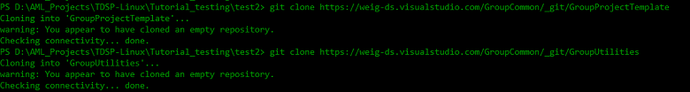

	# Linux DSVM

	git clone <the SSH URL of the GroupProjectTemplate repository>
	git clone <the SSH URL of the GroupUtilities repository>

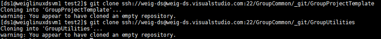

>[AZURE.NOTE] Expect to receive warning messages that LR1 and LR2 are empty. 	

- Using our abbreviated repository names, this is what these scripts have achieved: 
	- R1 - cloned into -> LR1
	- R2 - cloned into -> LR2	

### Seed your GroupProjectTemplate (LR1) and GroupUtilities (LR2)

Next, in your local machine, copy the content of ProjectTemplate and Utilities directories (except the metadata in the .git directories) under GitRepos\TDSPCommon to your GroupProjectTemplate and GroupUtilities directories under **GitRepos\GroupCommon**. Here are the two tasks to complete in this step:

- Copy the files in GitRepos\TDSPCommon\ProjectTemplate (**LG1**) to GitRepos\GroupCommon\GroupProjectTemplate (**LR1**) 
- Copy the files in GitRepos\TDSPCommon\Utilities (**LG2** to GitRepos\GroupCommon\Utilities (**LR2**). 

To achieve these two tasks, run the following scripts in PowerShell console (Windows) or Shell script console (Linux). You are prompted to input the complete paths to LG1, LR1, LG2, and LR2. The paths that you input are validated. If you input a directory that does not exist, you are asked to input it again. 

	# Windows DSVM		
	
    wget "https://raw.githubusercontent.com/Azure/Azure-MachineLearning-DataScience/master/Misc/TDSP/tdsp_local_copy_win.ps1" -outfile "tdsp_local_copy_win.ps1"
    .\tdsp_local_copy_win.ps1 1

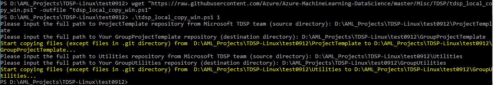

Now you can see that files in directories LG1 and LG1 (except files in the .git directory) have been copied to LR1 and LR2, respectively.

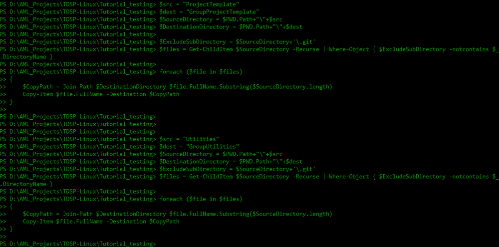

	# Linux DSVM

    wget "https://raw.githubusercontent.com/Azure/Azure-MachineLearning-DataScience/master/Misc/TDSP/tdsp_local_copy_linux.sh"
    bash tdsp_local_copy_linux.sh 1

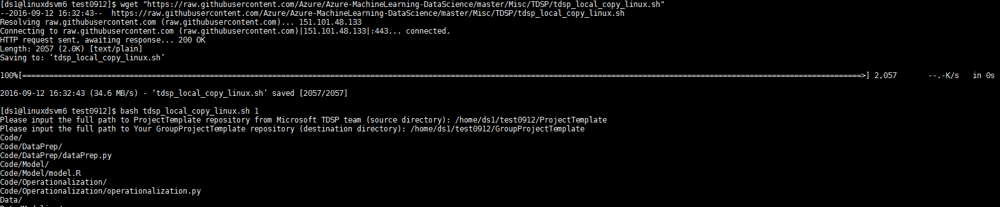
		
Now you see that the files in the two folders (except files in the .git directory) are copied to GroupProjectTemplate and GroupUtilities respectively.
	
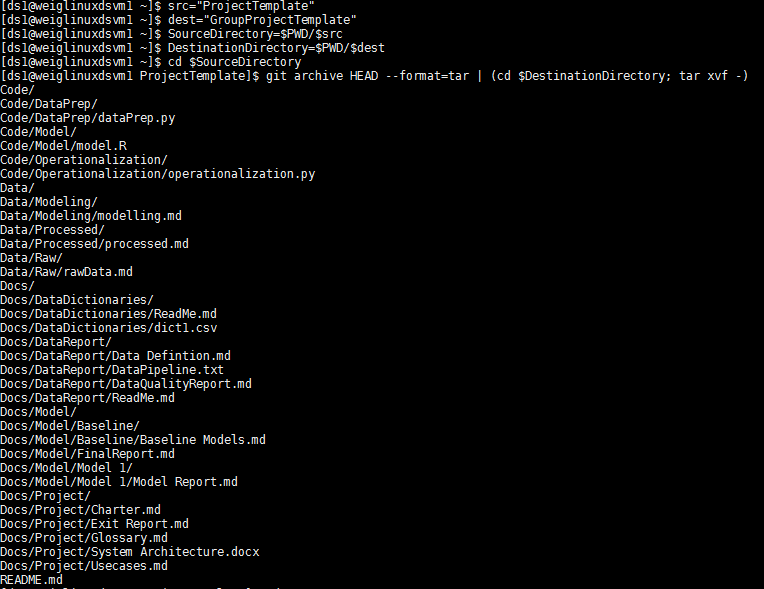

- Using our abbreviated repository names, this is what these scripts have achieved:
	- LG1 - files copied into -> LR1
	- LG2 - files copied into -> LR2

### Option to customize the contents of LR1 & LR2
	
If you want to customize the contents of LR1 and LR2 to meet the specific needs of your group, this is the stage of the procedure where that is appropriate. You can modify the template documents, change the directory structure, and add existing utilities that your group has developed or that are helpful for your entire group. 

### Add the contents in LR1 & LR2 to R1 & R2 on group server

Now, you need to add the contents in LR1 and LR2 to repositories R1 and R2. Here are the git bash commands you can run in either Windows PowerShell or Linux. 

Run the following commands from the GitRepos\GroupCommon\GroupProjectTemplate directory:

	git status
	git add .
	git commit -m"push from DSVM"
	git push

The -m option lets you set a message for your git commit.

You can see that in your group's Azure DevOps Services, in the GroupProjectTemplate repository, the files are synced instantly.

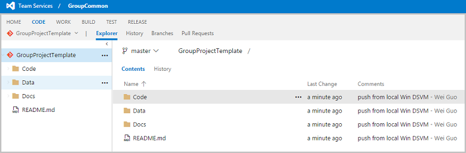

Finally, change to the **GitRepos\GroupCommon\GroupUtilities** directory and run the same set of git bash commands:

	git status
	git add .
	git commit -m"push from DSVM"
	git push

>[AZURE.NOTE] If this is the first time you commit to a Git repository, you need to configure global parameters *user.name* and *user.email* before you run the `git commit` command. Run the following two commands:
		
	git config --global user.name <your name>
	git config --global user.email <your email address>
 
>If you are committing to multiple Git repositories, use the same name and email address when you commit to each of them. Using the same name and email address proves convenient later on when you build PowerBI dashboards to track your Git activities on multiple repositories.

- Using our abbreviated repository names, this is what these scripts have achieved:
	- LR1 - contents add to -> R1
	- LR2 - contents add to -> R2

## 6. Add group members to the group server

From your group Azure DevOps Services's homepage, click the **gear icon** next to your user name in the upper right corner, then select the **Security** tab. You can add members to your group here with various permissions.

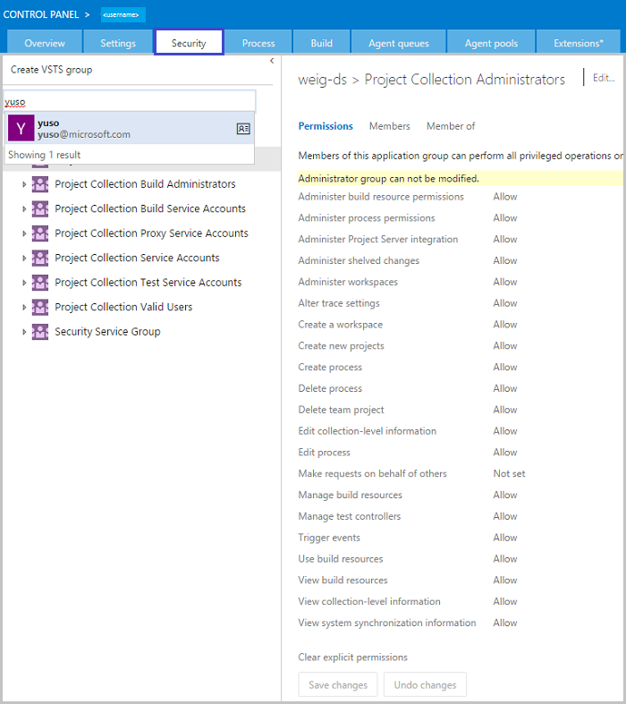 

## Next steps

Here are links to the more detailed descriptions of the roles and tasks defined by the Team Data Science Process:

- [Group Manager tasks for a data science team](group-manager-tasks.md)
- [Team Lead tasks for a data science team](team-lead-tasks.md)
- [Project Lead tasks for a data science team](project-lead-tasks.md)
- [Project Individual Contributors for a data science team](project-ic-tasks.md)