# Team Data Science Process group manager tasks

This article describes the tasks that a *group manager* completes for a data science organization. The group manager manages the entire data science unit in an enterprise. A data science unit may have several teams, each of which is working on many data science projects in distinct business verticals. The group manager's objective is to establish a collaborative group environment that standardizes on the [Team Data Science Process](overview.md) (TDSP). For an outline of all the personnel roles and associated tasks handled by a data science team standardizing on the TDSP, see [Team Data Science Process roles and tasks](roles-tasks.md).

The following diagram shows the six main group manager setup tasks. Group managers may delegate their tasks to surrogates, but the tasks associated with the role don't change.


1. Set up an **Azure DevOps organization** for the group.
2. Create the default **GroupCommon project** in the Azure DevOps organization.
3. Create the **GroupProjectTemplate** repository in Azure Repos.
4. Create the **GroupUtilities** repository in Azure Repos.
5. Import the contents of the Microsoft TDSP team's **ProjectTemplate** and **Utilities** repositories into the group common repositories.
6. Set up **membership** and **permissions** for team members to access the group.

The following tutorial walks through the steps in detail. 

> [!NOTE] 
> This article uses Azure DevOps to set up a TDSP group environment, because that is how to implement TDSP at Microsoft. If your group uses other code hosting or development platforms, the Group Manager's tasks are the same, but the way to complete them may be different.

## Create an organization and project in Azure DevOps

1. Go to [visualstudio.microsoft.com](https://visualstudio.microsoft.com), select **Sign in** at upper right, and sign into your Microsoft account. 
   
   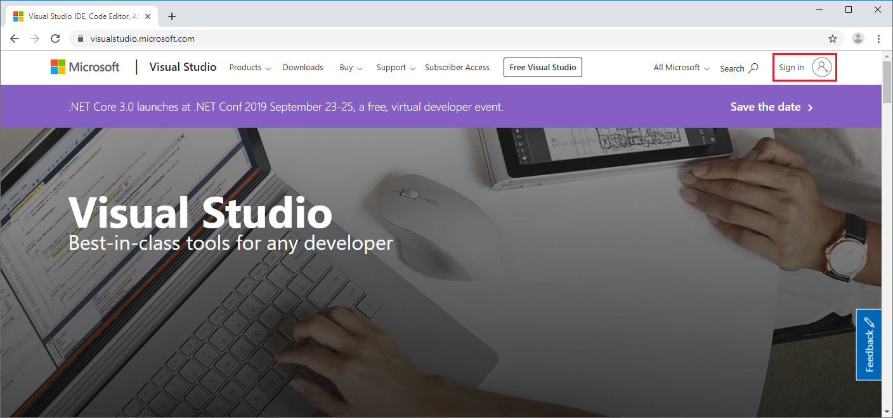
   
   If you don't have a Microsoft account, select **Sign up now**, create a Microsoft account, and sign in using this account. If your organization has a Visual Studio subscription, sign in with the credentials for that subscription.
   
1. After you sign in, at upper right on the Azure DevOps page, select **Create new organization**.
   
   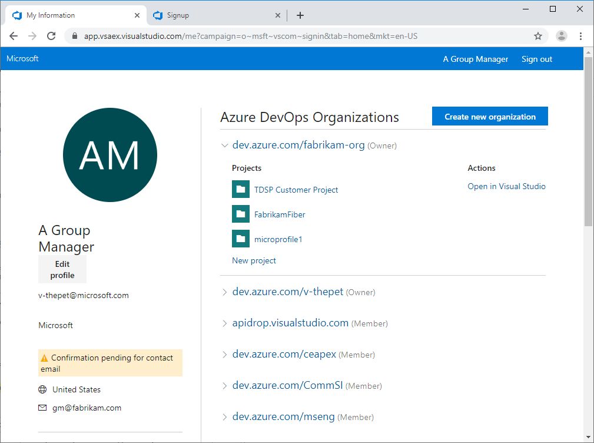
   
1. If you're prompted to agree to the Terms of Service, Privacy Statement, and Code of Conduct, select **Continue**.
   
1. In the signup dialog, name your Azure DevOps organization and accept the host region assignment, or drop down and select a different region. Then select **Continue**. 

1. Under **Create a project to get started**, enter *GroupCommon*, and then select **Create project**. 
   
   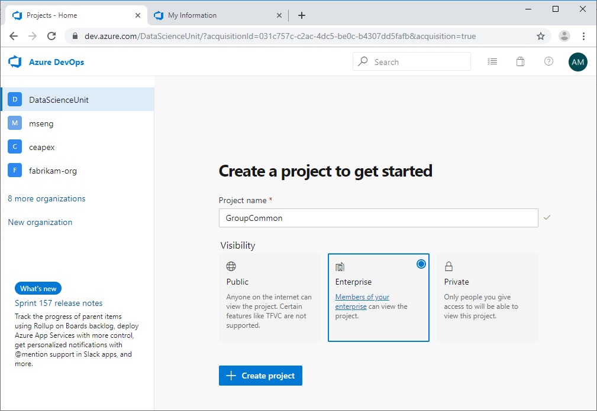

The **GroupCommon** project **Summary** page opens. The page URL is *https:\//\<servername>/\<organization-name>/GroupCommon*.

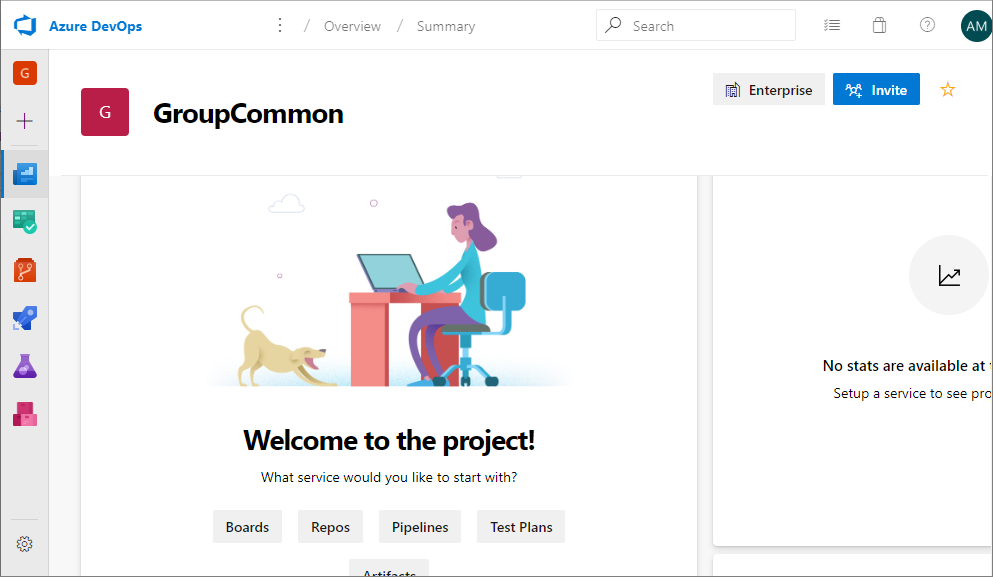

## Set up the group common repositories

Azure Repos hosts the following types of repositories for your group:

- **Group common repositories**: General-purpose repositories that multiple teams within a data science unit can adopt for many data science projects. 
- **Team repositories**:  Repositories for specific teams within a data science unit. These repositories are specific for a team's needs, and may be used for multiple projects within that team, but are not general enough to be used across multiple teams within a data science unit.
- **Project repositories**: Repositories for specific projects. Such repositories may not be general enough for multiple projects within a team, or for other teams in a data science unit.

To set up the group common repositories in your project, you: 
- Rename the default **GroupCommon** repository to **GroupProjectTemplate**
- Create a new **GroupUtilities** repository

### Rename the default project repository to GroupProjectTemplate

To rename the default **GroupCommon** project repository to **GroupProjectTemplate**:

1. On the **GroupCommon** project **Summary** page, select **Repos**. This action takes you to the default **GroupCommon** repository of the GroupCommon project, which is currently empty.
   
1. At the top of the page, drop down the arrow next to **GroupCommon** and select **Manage repositories**.
   
   
   
1. On the **Project Settings** page, select the **...** next to **GroupCommon**, and then select **Rename repository**. 
   
   
   
1. In the **Rename the GroupCommon repository** popup, enter *GroupProjectTemplate*, and then select **Rename**. 
   
   

### Create the GroupUtilities repository

To create the **GroupUtilities** repository:

1. On the **GroupCommon** project **Summary** page, select **Repos**. 
   
1. At the top of the page, drop down the arrow next to **GroupProjectTemplate** and select **New repository**.
   
   
   
1. In the **Create a new repository** dialog, select **Git** as the **Type**, enter *GroupUtilities* as the **Repository name**, and then select **Create**.
   
   
   
1. On the **Project Settings** page, select **Repositories** under **Repos** in the left navigation to see the two group repositories: **GroupProjectTemplate** and **GroupUtilities**.
   
   

## Import the Microsoft TDSP team repositories

In this part of the tutorial, you import the contents of the **ProjectTemplate** and **Utilities** repositories managed by the Microsoft TDSP team into your **GroupProjectTemplate** and **GroupUtilities** repositories. 

To import the TDSP team repositories:

1. From the **GroupCommon** project home page, select **Repos** in the left navigation. The default **GroupProjectTemplate** repo opens. 
   
1. On the **GroupProjectTemplate is empty** page, select **Import**. 
   
   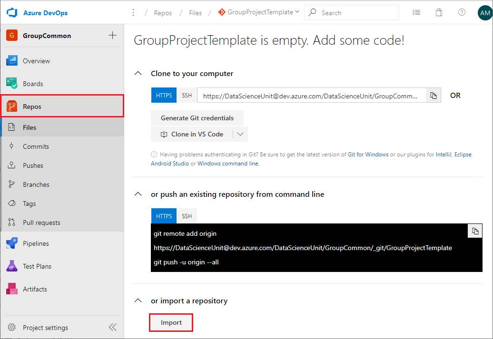
   
1. In the **Import a Git repository** dialog, select **Git** as the **Source type**, and enter *https:\//github.com/Azure/Azure-TDSP-ProjectTemplate.git* for the **Clone URL**. Then select **Import**. The contents of the Microsoft TDSP team ProjectTemplate repository are imported into your GroupProjectTemplate repository. 
   
   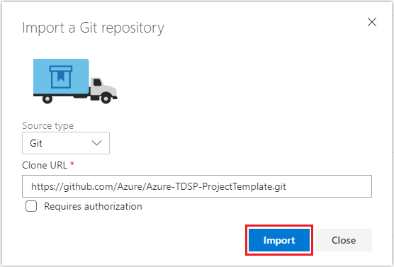
   
1. At the top of the **Repos** page, drop down and select the **GroupUtilities** repository.
   
1. Repeat the import process to import the contents of the Microsoft TDSP team **Utilities** repository, *https:\//github.com/Azure/Azure-TDSP-Utilities.git*, into your **GroupUtilities** repository. 
   
Each of your two group repositories now contains all the files, except those in the *.git* directory, from the Microsoft TDSP team's corresponding repository. 

## Customize the contents of the group repositories

If you want to customize the contents of your group repositories to meet the specific needs of your group, you can do that now. You can modify the files, change the directory structure, or add files that your group has developed or that are helpful for your group.

### Make changes in Azure Repos

To customize repository contents:

1. On the **GroupCommon** project **Summary** page, select **Repos**. 
   
1. At the top of the page, select the repository you want to customize.

1. In the repo directory structure, navigate to the folder or file you want to change. 
   
   - To create new folders or files, select the arrow next to **New**. 
     
     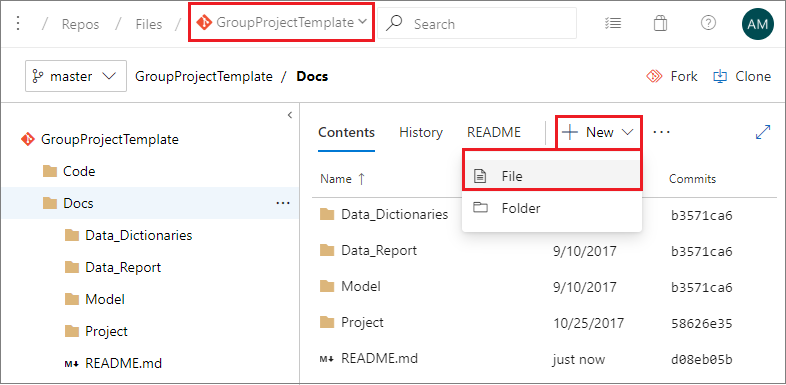
     
   - To upload files, select **Upload file(s)**. 
     
     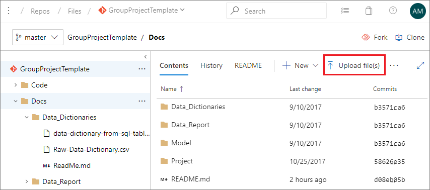
     
   - To edit existing files, navigate to the file and then select **Edit**. 
     
     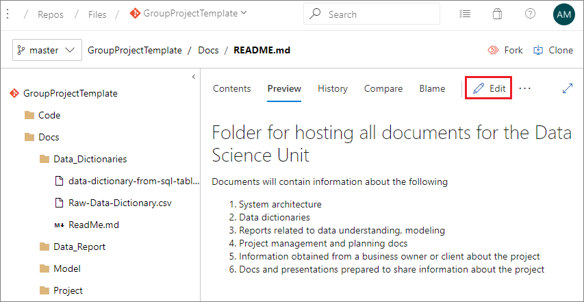
     
1. After adding or editing files, select **Commit**.
   
   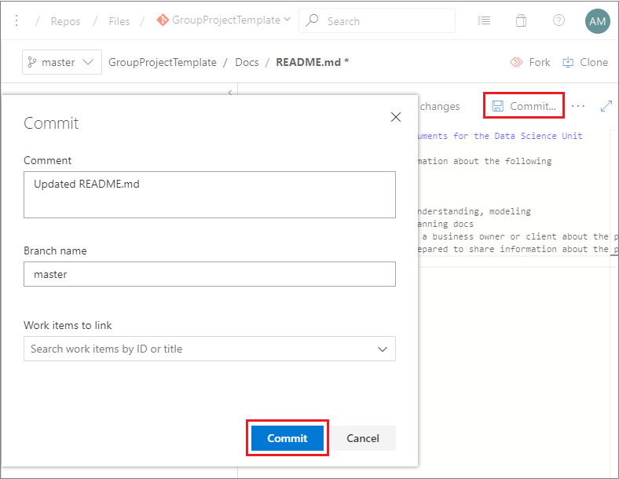

### Make changes using your local machine or DSVM

If you want to make changes using your local machine or DSVM and push the changes up to the group repositories, make sure you have the prerequisites for working with Git and DSVMs:

- An Azure subscription, if you want to create a DSVM.
- Git installed on your machine. If you're using a DSVM, Git is pre-installed. Otherwise, see the [Platforms and tools appendix](platforms-and-tools.md#appendix).
- If you want to use a DSVM, the Windows or Linux DSVM created and configured in Azure. For more information and instructions, see the [Data Science Virtual Machine Documentation](/azure/machine-learning/data-science-virtual-machine/).
- For a Windows DSVM, [Git Credential Manager (GCM)](https://github.com/Microsoft/Git-Credential-Manager-for-Windows) installed on your machine. In the *README.md* file, scroll down to the **Download and Install** section and select the **latest installer**. Download the *.exe* installer from the installer page and run it. 
- For a Linux DSVM, an SSH public key set up on your DSVM and added in Azure DevOps. For more information and instructions, see the **Create SSH public key** section in the [Platforms and tools appendix](platforms-and-tools.md#appendix). 

First, copy or *clone* the repository to your local machine. 
   
1. On the **GroupCommon** project **Summary** page, select **Repos**, and at the top of the page, select the repository you want to clone.
   
1. On the repo page, select **Clone** at upper right.
   
1. In the **Clone repository** dialog, select **HTTPS** for an HTTP connection, or **SSH** for an SSH connection, and copy the clone URL under **Command line** to your clipboard.
   
   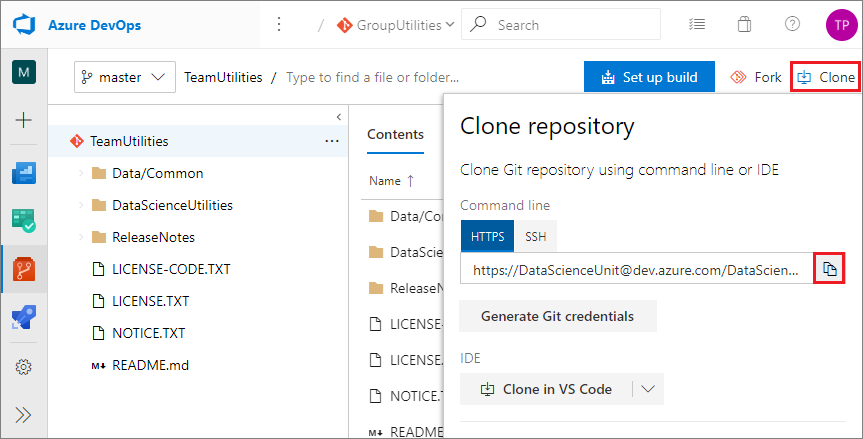
   
1. On your local machine, create the following directories:
   
   - For Windows: **C:\GitRepos\GroupCommon**
   - For Linux, **$/GitRepos/GroupCommon** on your home directory 
   
1. Change to the directory you created.
   
1. In Git Bash, run the command `git clone <clone URL>.`
   
   For example, either of the following commands clones the **GroupUtilities** repository to the *GroupCommon* directory on your local machine. 
   
   **HTTPS connection:**
   
   ```bash
   git clone https://DataScienceUnit@dev.azure.com/DataScienceUnit/GroupCommon/_git/GroupUtilities
   ```
   
   **SSH connection:**
   
   ```bash
   git clone git@ssh.dev.azure.com:v3/DataScienceUnit/GroupCommon/GroupUtilities
   ```

After making whatever changes you want in the local clone of your repository, you can push the changes to the shared group common repositories. 

Run the following Git Bash commands from your local **GroupProjectTemplate** or **GroupUtilities** directory.

```bash
git add .
git commit -m "push from local"
git push
```

> [!NOTE]
> If this is the first time you commit to a Git repository, you may need to configure global parameters *user.name* and *user.email* before you run the `git commit` command. Run the following two commands:
> 
> `git config --global user.name <your name>`
> 
> `git config --global user.email <your email address>`
> 
> If you're committing to several Git repositories, use the same name and email address for all of them. Using the same name and email address is convenient when building Power BI dashboards to track your Git activities in multiple repositories.

## Add group members and configure permissions

To add members to the group:

1. In Azure DevOps, from the **GroupCommon** project home page, select **Project settings** from the left navigation. 
   
1. From the **Project Settings** left navigation, select **Teams**, then on the **Teams** page, select the **GroupCommon Team**. 
   
   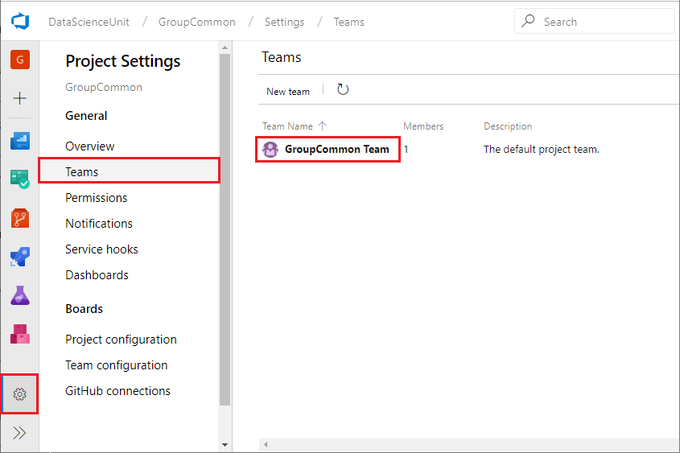
   
1. On the **Team Profile** page, select **Add**.
   
   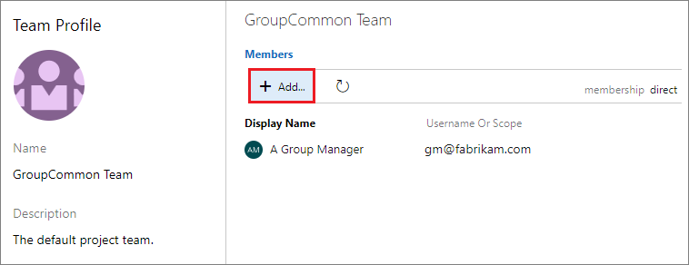
   
1. In the **Add users and groups** dialog, search for and select members to add to the group, and then select **Save changes**. 
   
   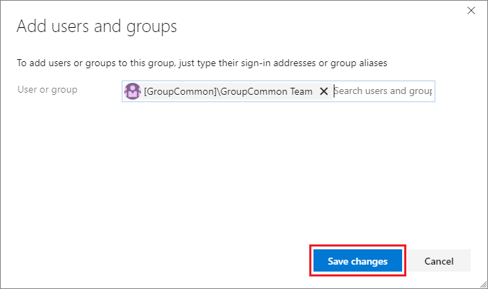
   

To configure permissions for members:

1. From the **Project Settings** left navigation, select **Permissions**. 
   
1. On the **Permissions** page, select the group you want to add members to. 
   
1. On the page for that group, select **Members**, and then select **Add**. 
   
1. In the **Invite members** popup, search for and select members to add to the group, and then select **Save**. 
   
   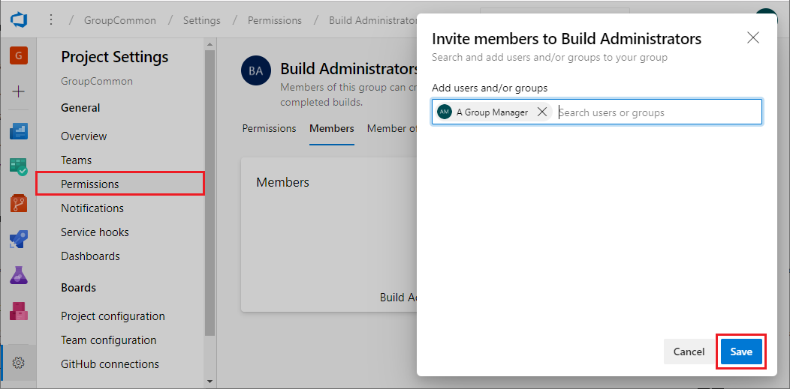

## Next steps

Here are links to detailed descriptions of the other roles and tasks in the Team Data Science Process:

- [Team Lead tasks for a data science team](team-lead-tasks.md)
- [Project Lead tasks for a data science team](project-lead-tasks.md)
- [Project Individual Contributor tasks for a data science team](project-ic-tasks.md)
