# The Team Data Science Process in action - Using an Azure HDInsight Hadoop Cluster on a 1 TB dataset

This walkthrough demonstrates how to use the Team Data Science Process in an end-to-end scenario with an [Azure HDInsight Hadoop cluster](https://azure.microsoft.com/services/hdinsight/) to store, explore, feature engineer, and down sample data from one of the publicly available [Criteo](https://labs.criteo.com/downloads/download-terabyte-click-logs/) datasets. It uses Azure Machine Learning to build a binary classification model on this data. It also shows how to publish one of these models as a Web service.

It is also possible to use an IPython notebook to accomplish the tasks presented in this walkthrough. Users who would like to try this approach should consult the [Criteo walkthrough using a Hive ODBC connection](https://github.com/Azure/Azure-MachineLearning-DataScience/blob/master/Misc/DataScienceProcess/iPythonNotebooks/machine-Learning-data-science-process-hive-walkthrough-criteo.ipynb) topic.

## Criteo Dataset Description
The Criteo data is a click prediction dataset that is approximately 370GB of gzip compressed TSV files (~1.3TB uncompressed), comprising more than 4.3 billion records. It is taken from 24 days of click data made available by [Criteo](https://labs.criteo.com/downloads/download-terabyte-click-logs/). For the convenience of data scientists, the data available to us to experiment with has been unzipped.

Each record in this dataset contains 40 columns:

* the first column is a label column that indicates whether a user clicks an **add** (value 1) or does not click one (value 0)
* next 13 columns are numeric, and
* last 26 are categorical columns

The columns are anonymized and use a series of enumerated names: "Col1" (for the label column) to 'Col40" (for the last categorical column).

Here is an excerpt of the first 20 columns of two observations (rows) from this dataset:

    Col1    Col2    Col3    Col4    Col5    Col6    Col7    Col8    Col9    Col10    Col11    Col12    Col13    Col14    Col15            Col16            Col17            Col18            Col19        Col20

    0       40      42      2       54      3       0       0       2       16      0       1       4448    4       1acfe1ee        1b2ff61f        2e8b2631        6faef306        c6fc10d3    6fcd6dcb
    0               24              27      5               0       2       1               3       10064           9a8cb066        7a06385f        417e6103        2170fc56        acf676aa    6fcd6dcb

There are missing values in both the numeric and categorical columns in this dataset. A simple method for handling the missing values is described. Additional details of the data are explored when storing them into Hive tables.

**Definition:** *Clickthrough rate (CTR):* This is the percentage of clicks in the data. In this Criteo dataset, the CTR is about 3.3% or 0.033.

## Examples of prediction tasks
Two sample prediction problems are addressed in this walkthrough:

1. **Binary classification**: Predicts whether a user clicked an add:

   * Class 0: No Click
   * Class 1: Click
2. **Regression**: Predicts the probability of an ad click from user features.

## Set Up an HDInsight Hadoop cluster for data science
**Note:** This is typically an **Admin** task.

Set up your Azure Data Science environment for building predictive analytics solutions with HDInsight clusters in three steps:

1. [Create a storage account](../../storage/common/storage-quickstart-create-account.md): This storage account is used to store data in Azure Blob Storage. The data used in HDInsight clusters is stored here.
2. [Customize Azure HDInsight Hadoop Clusters for Data Science](customize-hadoop-cluster.md): This step creates an Azure HDInsight Hadoop cluster with 64-bit Anaconda Python 2.7 installed on all nodes. There are two important steps (described in this topic) to complete when customizing the HDInsight cluster.

   * You must link the storage account created in step 1 with your HDInsight cluster when it is created. This storage account is used for accessing data that can be processed within the cluster.
   * You must enable Remote Access to the head node of the cluster after it is created. Remember the remote access credentials you specify here (different from those specified for the cluster at its creation): you need them to complete the following procedures.
3. [Create an Azure Machine Learning studio workspace](../studio/create-workspace.md): This Azure Machine Learning workspace is used for building machine learning models after an initial data exploration and down sampling on the HDInsight cluster.

## Get and consume data from a public source
The [Criteo](https://labs.criteo.com/downloads/download-terabyte-click-logs/) dataset can be accessed by clicking on the link, accepting the terms of use, and providing a name. A snapshot of what this looks like is shown here:

Click **Continue to Download** to read more about the dataset and its availability.

The data resides in a public [Azure blob storage](../../storage/blobs/storage-dotnet-how-to-use-blobs.md) location: wasb://criteo@azuremlsampleexperiments.blob.core.windows.net/raw/. The "wasb" refers to Azure Blob Storage location.

1. The data in this public blob storage consists of three subfolders of unzipped data.

   1. The subfolder *raw/count/* contains the first 21 days of data - from day\_00 to day\_20
   2. The subfolder *raw/train/* consists of a single day of data, day\_21
   3. The subfolder *raw/test/* consists of two days of data, day\_22 and day\_23
2. For those who want to start with the raw gzip data, these are also available in the main folder *raw/* as day_NN.gz, where NN goes from 00 to 23.

An alternative approach to access, explore, and model this data that does not require any local downloads is explained later in this walkthrough when we create Hive tables.

## Log in to the cluster headnode
To log in to the headnode of the cluster, use the [Azure portal](https://ms.portal.azure.com) to locate the cluster. Click the HDInsight elephant icon on the left and then double-click the name of your cluster. Navigate to the **Configuration** tab, double-click the CONNECT icon on the bottom of the page, and enter your remote access credentials when prompted. This takes you to the headnode of the cluster.

Here is what a typical first log in to the cluster headnode looks like:

On the left is the "Hadoop Command Line", which is our workhorse for the data exploration. Notice two useful URLs - "Hadoop Yarn Status" and "Hadoop Name Node". The yarn status URL shows job progress and the name node URL gives details on the cluster configuration.

Now you are set up and ready to begin first part of the walkthrough: data exploration using Hive and getting data ready for Azure Machine Learning.

##  Create Hive database and tables
To create Hive tables for our Criteo dataset, open the ***Hadoop Command Line*** on the desktop of the head node, and enter the Hive directory by entering the command

    cd %hive_home%\bin

> [!NOTE]
> Run all Hive commands in this walkthrough from the Hive bin/ directory prompt. This takes care of any path issues automatically. You can use the terms "Hive directory prompt", "Hive bin/ directory prompt", and "Hadoop Command Line" interchangeably.
>
> [!NOTE]
> To execute any Hive query, one can always use the following commands:
>
>

        cd %hive_home%\bin
        hive

After the Hive REPL appears with a "hive >"sign, simply cut and paste the query to execute it.

The following code creates a database "criteo" and then generates 4 tables:

* a *table for generating counts* built on days day\_00 to day\_20,
* a *table for use as the train dataset* built on day\_21, and
* two *tables for use as the test datasets* built on day\_22 and day\_23 respectively.

Split the test dataset into two different tables because one of the days is a holiday. The objective is to determine if the model can detect differences between a holiday and non-holiday from the click-through rate.

The script [sample&#95;hive&#95;create&#95;criteo&#95;database&#95;and&#95;tables.hql](https://github.com/Azure/Azure-MachineLearning-DataScience/blob/master/Misc/DataScienceProcess/DataScienceScripts/sample_hive_create_criteo_database_and_tables.hql) is displayed here for convenience:

    CREATE DATABASE IF NOT EXISTS criteo;
    DROP TABLE IF EXISTS criteo.criteo_count;
    CREATE TABLE criteo.criteo_count (
    col1 string,col2 double,col3 double,col4 double,col5 double,col6 double,col7 double,col8 double,col9 double,col10 double,col11 double,col12 double,col13 double,col14 double,col15 string,col16 string,col17 string,col18 string,col19 string,col20 string,col21 string,col22 string,col23 string,col24 string,col25 string,col26 string,col27 string,col28 string,col29 string,col30 string,col31 string,col32 string,col33 string,col34 string,col35 string,col36 string,col37 string,col38 string,col39 string,col40 string)
    ROW FORMAT DELIMITED FIELDS TERMINATED BY '\t'
    LINES TERMINATED BY '\n'
    STORED AS TEXTFILE LOCATION 'wasb://criteo@azuremlsampleexperiments.blob.core.windows.net/raw/count';

    DROP TABLE IF EXISTS criteo.criteo_train;
    CREATE TABLE criteo.criteo_train (
    col1 string,col2 double,col3 double,col4 double,col5 double,col6 double,col7 double,col8 double,col9 double,col10 double,col11 double,col12 double,col13 double,col14 double,col15 string,col16 string,col17 string,col18 string,col19 string,col20 string,col21 string,col22 string,col23 string,col24 string,col25 string,col26 string,col27 string,col28 string,col29 string,col30 string,col31 string,col32 string,col33 string,col34 string,col35 string,col36 string,col37 string,col38 string,col39 string,col40 string)
    ROW FORMAT DELIMITED FIELDS TERMINATED BY '\t'
    LINES TERMINATED BY '\n'
    STORED AS TEXTFILE LOCATION 'wasb://criteo@azuremlsampleexperiments.blob.core.windows.net/raw/train';

    DROP TABLE IF EXISTS criteo.criteo_test_day_22;
    CREATE TABLE criteo.criteo_test_day_22 (
    col1 string,col2 double,col3 double,col4 double,col5 double,col6 double,col7 double,col8 double,col9 double,col10 double,col11 double,col12 double,col13 double,col14 double,col15 string,col16 string,col17 string,col18 string,col19 string,col20 string,col21 string,col22 string,col23 string,col24 string,col25 string,col26 string,col27 string,col28 string,col29 string,col30 string,col31 string,col32 string,col33 string,col34 string,col35 string,col36 string,col37 string,col38 string,col39 string,col40 string)
    ROW FORMAT DELIMITED FIELDS TERMINATED BY '\t'
    LINES TERMINATED BY '\n'
    STORED AS TEXTFILE LOCATION 'wasb://criteo@azuremlsampleexperiments.blob.core.windows.net/raw/test/day_22';

    DROP TABLE IF EXISTS criteo.criteo_test_day_23;
    CREATE TABLE criteo.criteo_test_day_23 (
    col1 string,col2 double,col3 double,col4 double,col5 double,col6 double,col7 double,col8 double,col9 double,col10 double,col11 double,col12 double,col13 double,col14 double,col15 string,col16 string,col17 string,col18 string,col19 string,col20 string,col21 string,col22 string,col23 string,col24 string,col25 string,col26 string,col27 string,col28 string,col29 string,col30 string,col31 string,col32 string,col33 string,col34 string,col35 string,col36 string,col37 string,col38 string,col39 string,col40 string)
    ROW FORMAT DELIMITED FIELDS TERMINATED BY '\t'
    LINES TERMINATED BY '\n'
    STORED AS TEXTFILE LOCATION 'wasb://criteo@azuremlsampleexperiments.blob.core.windows.net/raw/test/day_23';

All these tables are external so you can simply point to their Azure Blob Storage (wasb) locations.

**There are two ways to execute ANY Hive query:**

1. **Using the Hive REPL command-line**: The first is to issue a "hive" command and copy and paste a query at the Hive REPL command-line. To do this, do:

        cd %hive_home%\bin
        hive

     Now at the REPL command-line, cutting and pasting the query executes it.
2. **Saving queries to a file and executing the command**: The second is to save the queries to a .hql file ([sample&#95;hive&#95;create&#95;criteo&#95;database&#95;and&#95;tables.hql](https://github.com/Azure/Azure-MachineLearning-DataScience/blob/master/Misc/DataScienceProcess/DataScienceScripts/sample_hive_create_criteo_database_and_tables.hql)) and then issue the following command to execute the query:

        hive -f C:\temp\sample_hive_create_criteo_database_and_tables.hql

### Confirm database and table creation
Next, confirm the creation of the database with the following command from the Hive bin/ directory prompt:

        hive -e "show databases;"

This gives:

        criteo
        default
        Time taken: 1.25 seconds, Fetched: 2 row(s)

This confirms the creation of the new database, "criteo".

To see what tables were created, simply issue the command here from the Hive bin/ directory prompt:

        hive -e "show tables in criteo;"

You should then see the following output:

        criteo_count
        criteo_test_day_22
        criteo_test_day_23
        criteo_train
        Time taken: 1.437 seconds, Fetched: 4 row(s)

##  Data exploration in Hive
Now you are ready to do some basic data exploration in Hive. You begin by counting the number of examples in the train and test data tables.

### Number of train examples
The contents of [sample&#95;hive&#95;count&#95;train&#95;table&#95;examples.hql](https://github.com/Azure/Azure-MachineLearning-DataScience/blob/master/Misc/DataScienceProcess/DataScienceScripts/sample_hive_count_train_table_examples.hql) are shown here:

        SELECT COUNT(*) FROM criteo.criteo_train;

This yields:

        192215183
        Time taken: 264.154 seconds, Fetched: 1 row(s)

Alternatively, one may also issue the following command from the Hive bin/ directory prompt:

        hive -f C:\temp\sample_hive_count_criteo_train_table_examples.hql

### Number of test examples in the two test datasets
Now count the number of examples in the two test datasets. The contents of [sample&#95;hive&#95;count&#95;criteo&#95;test&#95;day&#95;22&#95;table&#95;examples.hql](https://github.com/Azure/Azure-MachineLearning-DataScience/blob/master/Misc/DataScienceProcess/DataScienceScripts/sample_hive_count_criteo_test_day_22_table_examples.hql) are here:

        SELECT COUNT(*) FROM criteo.criteo_test_day_22;

This yields:

        189747893
        Time taken: 267.968 seconds, Fetched: 1 row(s)

As usual, you may also call the script from the Hive bin/ directory prompt by issuing the command:

        hive -f C:\temp\sample_hive_count_criteo_test_day_22_table_examples.hql

Finally, you examine the number of test examples in the test dataset based on day\_23.

The command to do this is similar to the one just shown (refer to [sample&#95;hive&#95;count&#95;criteo&#95;test&#95;day&#95;23&#95;examples.hql](https://github.com/Azure/Azure-MachineLearning-DataScience/blob/master/Misc/DataScienceProcess/DataScienceScripts/sample_hive_count_criteo_test_day_23_examples.hql)):

        SELECT COUNT(*) FROM criteo.criteo_test_day_23;

This gives:

        178274637
        Time taken: 253.089 seconds, Fetched: 1 row(s)

### Label distribution in the train dataset
The label distribution in the train dataset is of interest. To see this, show contents of [sample&#95;hive&#95;criteo&#95;label&#95;distribution&#95;train&#95;table.hql](https://github.com/Azure/Azure-MachineLearning-DataScience/blob/master/Misc/DataScienceProcess/DataScienceScripts/sample_hive_criteo_label_distribution_train_table.hql):

        SELECT Col1, COUNT(*) AS CT FROM criteo.criteo_train GROUP BY Col1;

This yields the label distribution:

        1       6292903
        0       185922280
        Time taken: 459.435 seconds, Fetched: 2 row(s)

Note that the percentage of positive labels is about 3.3% (consistent with the original dataset).

### Histogram distributions of some numeric variables in the train dataset
You can use Hive's native "histogram\_numeric" function to find out what the distribution of the numeric variables looks like. Here are the contents of [sample&#95;hive&#95;criteo&#95;histogram&#95;numeric.hql](https://github.com/Azure/Azure-MachineLearning-DataScience/blob/master/Misc/DataScienceProcess/DataScienceScripts/sample_hive_criteo_histogram_numeric.hql):

        SELECT CAST(hist.x as int) as bin_center, CAST(hist.y as bigint) as bin_height FROM
            (SELECT
            histogram_numeric(col2, 20) as col2_hist
            FROM
            criteo.criteo_train
            ) a
            LATERAL VIEW explode(col2_hist) exploded_table as hist;

This yields the following:

        26      155878415
        2606    92753
        6755    22086
        11202   6922
        14432   4163
        17815   2488
        21072   1901
        24113   1283
        27429   1225
        30818   906
        34512   723
        38026   387
        41007   290
        43417   312
        45797   571
        49819   428
        53505   328
        56853   527
        61004   160
        65510   3446
        Time taken: 317.851 seconds, Fetched: 20 row(s)

The LATERAL VIEW - explode combination in Hive serves to produce a SQL-like output instead of the usual list. Note that in the this table, the first column corresponds to the bin center and the second to the bin frequency.

### Approximate percentiles of some numeric variables in the train dataset
Also of interest with numeric variables is the computation of approximate percentiles. Hive's native "percentile\_approx" does this for us. The contents of [sample&#95;hive&#95;criteo&#95;approximate&#95;percentiles.hql](https://github.com/Azure/Azure-MachineLearning-DataScience/blob/master/Misc/DataScienceProcess/DataScienceScripts/sample_hive_criteo_approximate_percentiles.hql) are:

        SELECT MIN(Col2) AS Col2_min, PERCENTILE_APPROX(Col2, 0.1) AS Col2_01, PERCENTILE_APPROX(Col2, 0.3) AS Col2_03, PERCENTILE_APPROX(Col2, 0.5) AS Col2_median, PERCENTILE_APPROX(Col2, 0.8) AS Col2_08, MAX(Col2) AS Col2_max FROM criteo.criteo_train;

This yields:

        1.0     2.1418600917169246      2.1418600917169246    6.21887086390288 27.53454893115633       65535.0
        Time taken: 564.953 seconds, Fetched: 1 row(s)

The distribution of percentiles is closely related to the histogram distribution of any numeric variable usually.

### Find number of unique values for some categorical columns in the train dataset
Continuing the data exploration, find, for some categorical columns, the number of unique values they take. To do this, show contents of [sample&#95;hive&#95;criteo&#95;unique&#95;values&#95;categoricals.hql](https://github.com/Azure/Azure-MachineLearning-DataScience/blob/master/Misc/DataScienceProcess/DataScienceScripts/sample_hive_criteo_unique_values_categoricals.hql):

        SELECT COUNT(DISTINCT(Col15)) AS num_uniques FROM criteo.criteo_train;

This yields:

        19011825
        Time taken: 448.116 seconds, Fetched: 1 row(s)

Note that Col15 has 19M unique values! Using naive techniques like "one-hot encoding" to encode such high-dimensional categorical variables is not feasible. In particular, a powerful, robust technique called [Learning With Counts](https://blogs.technet.com/b/machinelearning/archive/2015/02/17/big-learning-made-easy-with-counts.aspx) for tackling this problem efficiently is explained and demonstrated.

Finally look at the number of unique values for some other categorical columns as well. The contents of [sample&#95;hive&#95;criteo&#95;unique&#95;values&#95;multiple&#95;categoricals.hql](https://github.com/Azure/Azure-MachineLearning-DataScience/blob/master/Misc/DataScienceProcess/DataScienceScripts/sample_hive_criteo_unique_values_multiple_categoricals.hql) are:

        SELECT COUNT(DISTINCT(Col16)), COUNT(DISTINCT(Col17)),
        COUNT(DISTINCT(Col18), COUNT(DISTINCT(Col19), COUNT(DISTINCT(Col20))
        FROM criteo.criteo_train;

This yields:

        30935   15200   7349    20067   3
        Time taken: 1933.883 seconds, Fetched: 1 row(s)

Again, note that except for Col20, all the other columns have many unique values.

### Co-occurrence counts of pairs of categorical variables in the train dataset

The co-occurrence counts of pairs of categorical variables is also of interest. This can be determined using the code in [sample&#95;hive&#95;criteo&#95;paired&#95;categorical&#95;counts.hql](https://github.com/Azure/Azure-MachineLearning-DataScience/blob/master/Misc/DataScienceProcess/DataScienceScripts/sample_hive_criteo_paired_categorical_counts.hql):

        SELECT Col15, Col16, COUNT(*) AS paired_count FROM criteo.criteo_train GROUP BY Col15, Col16 ORDER BY paired_count DESC LIMIT 15;

Reverse order the counts by their occurrence and look at the top 15 in this case. This gives us:

        ad98e872        cea68cd3        8964458
        ad98e872        3dbb483e        8444762
        ad98e872        43ced263        3082503
        ad98e872        420acc05        2694489
        ad98e872        ac4c5591        2559535
        ad98e872        fb1e95da        2227216
        ad98e872        8af1edc8        1794955
        ad98e872        e56937ee        1643550
        ad98e872        d1fade1c        1348719
        ad98e872        977b4431        1115528
        e5f3fd8d        a15d1051        959252
        ad98e872        dd86c04a        872975
        349b3fec        a52ef97d        821062
        e5f3fd8d        a0aaffa6        792250
        265366bf        6f5c7c41        782142
        Time taken: 560.22 seconds, Fetched: 15 row(s)

##  Down sample the datasets for Azure Machine Learning
Having explored the datasets and demonstrated how to do this type of exploration for any variables (including combinations), down sample the data sets so that models in Azure Machine Learning can be built. Recall that the focus of the problem is: given a set of example attributes (feature values from Col2 - Col40), predict if Col1 is a 0 (no click) or a 1 (click).

To down sample the train and test datasets to 1% of the original size, use Hive's native RAND() function. The next script, [sample&#95;hive&#95;criteo&#95;downsample&#95;train&#95;dataset.hql](https://github.com/Azure/Azure-MachineLearning-DataScience/blob/master/Misc/DataScienceProcess/DataScienceScripts/sample_hive_criteo_downsample_train_dataset.hql) does this for the train dataset:

        CREATE TABLE criteo.criteo_train_downsample_1perc (
        col1 string,col2 double,col3 double,col4 double,col5 double,col6 double,col7 double,col8 double,col9 double,col10 double,col11 double,col12 double,col13 double,col14 double,col15 string,col16 string,col17 string,col18 string,col19 string,col20 string,col21 string,col22 string,col23 string,col24 string,col25 string,col26 string,col27 string,col28 string,col29 string,col30 string,col31 string,col32 string,col33 string,col34 string,col35 string,col36 string,col37 string,col38 string,col39 string,col40 string)
        ROW FORMAT DELIMITED FIELDS TERMINATED BY '\t'
        LINES TERMINATED BY '\n'
        STORED AS TEXTFILE;

        ---Now downsample and store in this table

        INSERT OVERWRITE TABLE criteo.criteo_train_downsample_1perc SELECT * FROM criteo.criteo_train WHERE RAND() <= 0.01;

This yields:

        Time taken: 12.22 seconds
        Time taken: 298.98 seconds

The script [sample&#95;hive&#95;criteo&#95;downsample&#95;test&#95;day&#95;22&#95;dataset.hql](https://github.com/Azure/Azure-MachineLearning-DataScience/blob/master/Misc/DataScienceProcess/DataScienceScripts/sample_hive_criteo_downsample_test_day_22_dataset.hql) does it for test data, day\_22:

        --- Now for test data (day_22)

        CREATE TABLE criteo.criteo_test_day_22_downsample_1perc (
        col1 string,col2 double,col3 double,col4 double,col5 double,col6 double,col7 double,col8 double,col9 double,col10 double,col11 double,col12 double,col13 double,col14 double,col15 string,col16 string,col17 string,col18 string,col19 string,col20 string,col21 string,col22 string,col23 string,col24 string,col25 string,col26 string,col27 string,col28 string,col29 string,col30 string,col31 string,col32 string,col33 string,col34 string,col35 string,col36 string,col37 string,col38 string,col39 string,col40 string)
        ROW FORMAT DELIMITED FIELDS TERMINATED BY '\t'
        LINES TERMINATED BY '\n'
        STORED AS TEXTFILE;

        INSERT OVERWRITE TABLE criteo.criteo_test_day_22_downsample_1perc SELECT * FROM criteo.criteo_test_day_22 WHERE RAND() <= 0.01;

This yields:

        Time taken: 1.22 seconds
        Time taken: 317.66 seconds

Finally, the script [sample&#95;hive&#95;criteo&#95;downsample&#95;test&#95;day&#95;23&#95;dataset.hql](https://github.com/Azure/Azure-MachineLearning-DataScience/blob/master/Misc/DataScienceProcess/DataScienceScripts/sample_hive_criteo_downsample_test_day_23_dataset.hql) does it for test data, day\_23:

        --- Finally test data day_23
        CREATE TABLE criteo.criteo_test_day_23_downsample_1perc (
        col1 string,col2 double,col3 double,col4 double,col5 double,col6 double,col7 double,col8 double,col9 double,col10 double,col11 double,col12 double,col13 double,col14 double,col15 string,col16 string,col17 string,col18 string,col19 string,col20 string,col21 string,col22 string,col23 string,col24 string,col25 string,col26 string,col27 string,col28 string,col29 string,col30 string,col31 string,col32 string,col33 string,col34 string,col35 string,col36 string,col37 string,col38 string,col39 string,col40 srical feature; tring)
        ROW FORMAT DELIMITED FIELDS TERMINATED BY '\t'
        LINES TERMINATED BY '\n'
        STORED AS TEXTFILE;

        INSERT OVERWRITE TABLE criteo.criteo_test_day_23_downsample_1perc SELECT * FROM criteo.criteo_test_day_23 WHERE RAND() <= 0.01;

This yields:

        Time taken: 1.86 seconds
        Time taken: 300.02 seconds

With this, you are ready to use our down sampled train and test datasets for building models in Azure Machine Learning.

There is a final important component before moving on to Azure Machine Learning, which concerns the count table. In the next sub-section, the count table is discussed in some detail.

##  A brief discussion on the count table
As you saw, several categorical variables have a very high dimensionality. In the walkthrough, a powerful technique called [Learning With Counts](https://blogs.technet.com/b/machinelearning/archive/2015/02/17/big-learning-made-easy-with-counts.aspx) to encode these variables in an efficient, robust manner is presented. More information on this technique is in the link provided.

[!NOTE]
>In this walkthrough, the focus is on using count tables to produce compact representations of high-dimensional categorical features. This is not the only way to encode categorical features; for more information on other techniques, interested users can check out [one-hot-encoding](https://en.wikipedia.org/wiki/One-hot) and [feature hashing](https://en.wikipedia.org/wiki/Feature_hashing).
>

To build count tables on the count data, use the data in the folder raw/count. In the modeling section, users are shown how to build these count tables for categorical features from scratch, or alternatively to use a pre-built count table for their explorations. In what follows, when "pre-built count tables" are referred to, we mean using the count tables that have been provided. Detailed instructions on how to access these tables are provided in the next section.

##  Build a model with Azure Machine Learning
Our model building process in Azure Machine Learning follows these steps:

1. [Get the data from Hive tables into Azure Machine Learning](#step1)
2. [Create the experiment: clean the data and make it a feature with count tables](#step2)
3. [Build, train, and score the model](#step3)
4. [Evaluate the model](#step4)
5. [Publish the model as a web-service](#step5)

Now you are ready to build models in Azure Machine Learning studio. Our down sampled data is saved as Hive tables in the cluster. Use the Azure Machine Learning **Import Data** module to read this data. The credentials to access the storage account of this cluster are provided in what follows.

###  Step 1: Get data from Hive tables into Azure Machine Learning using the Import Data module and select it for a machine learning experiment
Start by selecting a **+NEW** -> **EXPERIMENT** -> **Blank Experiment**. Then, from the **Search** box on the top left, search for "Import Data". Drag and drop the **Import Data** module on to the experiment canvas (the middle portion of the screen) to use the module for data access.

This is what the **Import Data** looks like while getting data from the Hive table:

For the **Import Data** module, the values of the parameters that are provided in the graphic are just examples of the sort of values you need to provide. Here is some general guidance on how to fill out the parameter set for the **Import Data** module.

1. Choose "Hive query" for **Data Source**
2. In the **Hive database query** box, a simple SELECT * FROM <your\_database\_name.your\_table\_name> - is enough.
3. **Hcatalog server URI**: If your cluster is "abc", then this is simply: https://abc.azurehdinsight.net
4. **Hadoop user account name**: The user name chosen at the time of commissioning the cluster. (NOT the Remote Access user name!)
5. **Hadoop user account password**: The password for the user name chosen at the time of commissioning the cluster. (NOT the Remote Access password!)
6. **Location of output data**: Choose "Azure"
7. **Azure storage account name**: The storage account associated with the cluster
8. **Azure storage account key**: The key of the storage account associated with the cluster.
9. **Azure container name**: If the cluster name is "abc", then this is simply "abc", usually.

Once the **Import Data** finishes getting data (you see the green tick on the Module), save this data as a Dataset (with a name of your choice). What this looks like:

Right-click the output port of the **Import Data** module. This reveals a **Save as dataset** option and a **Visualize** option. The **Visualize** option, if clicked, displays 100 rows of the data, along with a right panel that is useful for some summary statistics. To save data, simply select **Save as dataset** and follow instructions.

To select the saved dataset for use in a machine learning experiment, locate the datasets using the **Search** box shown in the following figure. Then simply type out the name you gave the dataset partially to access it and drag the dataset onto the main panel. Dropping it onto the main panel selects it for use in machine learning modeling.

> [!NOTE]
> Do this for both the train and the test datasets. Also, remember to use the database name and table names that you gave for this purpose. The values used in the figure are solely for illustration purposes.**
>
>

###  Step 2: Create a simple experiment in Azure Machine Learning to predict clicks / no clicks
Our Azure Machine Learning studio experiment looks like this:

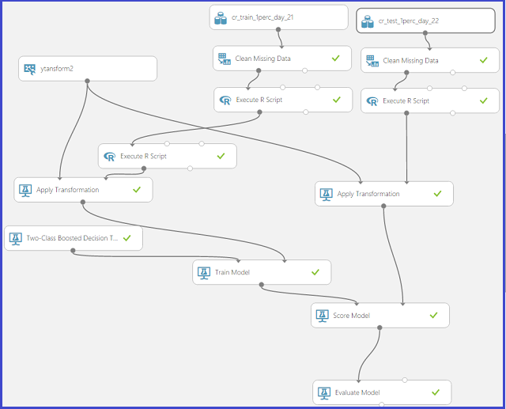

Now examine the key components of this experiment. Drag our saved train and test datasets on to our experiment canvas first.

#### Clean Missing Data
The **Clean Missing Data** module does what its name suggests:  it cleans missing data in ways that can be user-specified. Look into this module to see this:

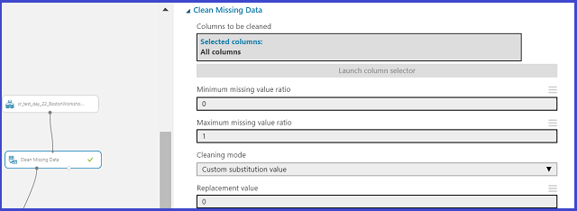

Here, chose to replace all missing values with a 0. There are other options as well, which can be seen by looking at the dropdowns in the module.

#### Feature engineering on the data
There can be millions of unique values for some categorical features of large datasets. Using naive methods such as one-hot encoding for representing such high-dimensional categorical features is entirely unfeasible. This walkthrough demonstrates how to use count features using built-in Azure Machine Learning modules to generate compact representations of these high-dimensional categorical variables. The end-result is a smaller model size, faster training times, and performance metrics that are quite comparable to using other techniques.

##### Building counting transforms
To build count features, use the **Build Counting Transform** module that is available in Azure Machine Learning. The module looks like this:

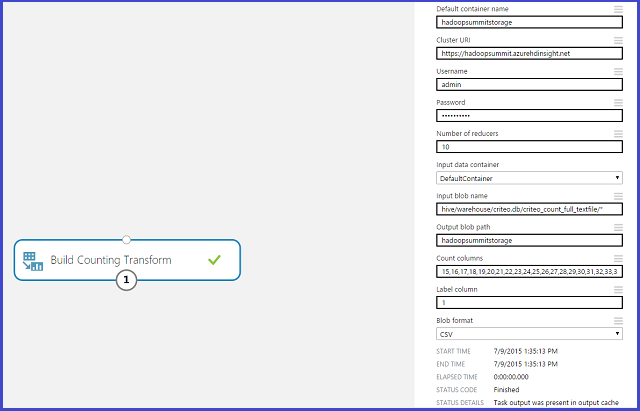

> [!IMPORTANT]
> In the **Count columns** box, enter those columns that you wish to perform counts on. Typically, these are (as mentioned) high-dimensional categorical columns. Remember that the Criteo dataset has 26 categorical columns: from Col15 to Col40. Here, count on all of them and give their indices (from 15 to 40 separated by commas as shown).
>

To use the module in the MapReduce mode (appropriate for large datasets), you need access to an HDInsight Hadoop cluster (the one used for feature exploration can be reused for this purpose as well) and its credentials. The  previous figures illustrate what the filled-in values look like (replace the values provided for illustration with those relevant for your own use-case).

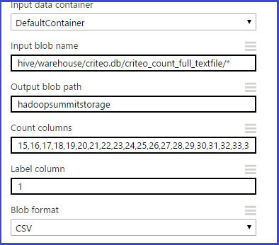

The preceding figure shows how to enter the input blob location. This location has the data reserved for building count tables on.

When this module finishes running, save the transform for later by right-clicking the module and selecting the **Save as Transform** option:

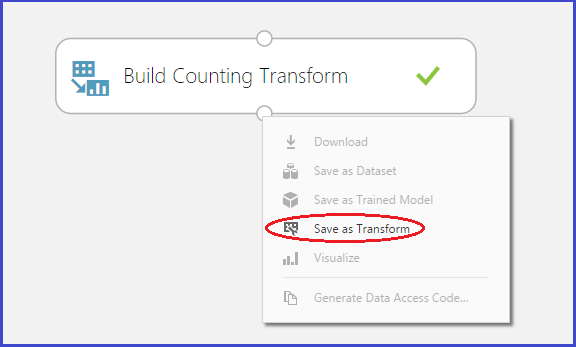

In our experiment architecture shown above, the dataset "ytransform2" corresponds precisely to a saved count transform. For the remainder of this experiment, it is assumed that the reader used a **Build Counting Transform** module on some data to generate counts, and can then use those counts to generate count features on the train and test datasets.

##### Choosing what count features to include as part of the train and test datasets
Once a count transform ready, the user can choose what features to include in their train and test datasets using the **Modify Count Table Parameters** module. For completeness, this module is shown here. But in interests of simplicity do not actually use it in our experiment.

In this case, as can be seen, the log-odds are to be used and the back off column is ignored. You can also set parameters such as the garbage bin threshold, how many pseudo-prior examples to add for smoothing, and whether to use any Laplacian noise or not. All these are advanced features and it is to be noted that the default values are a good starting point for users who are new to this type of feature generation.

##### Data transformation before generating the count features
Now the focus is on an important point about transforming our train and test data prior to actually generating count features. Note that there are two **Execute R Script** modules used before the count transform is applied to our data.

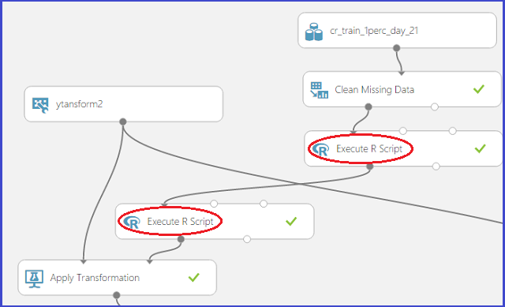

Here is the first R script:

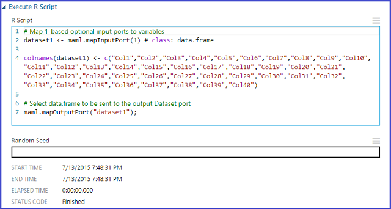

This R script renames our columns to names "Col1" to "Col40". This is because the count transform expects names of this format.

The second R script balances the distribution between positive and negative classes (classes 1 and 0 respectively) by down-sampling the negative class. The R script here shows how to do this:

In this simple R script, the "pos\_neg\_ratio" is used to set the amount of balance between the positive and the negative classes. This is important to do since improving class imbalance usually has performance benefits for classification problems where the class distribution is skewed (recall that in this case, you have 3.3% positive class and 96.7% negative class).

##### Applying the count transformation on our data
Finally, you can use the **Apply Transformation** module to apply the count transforms on our train and test datasets. This module takes the saved count transform as one input and the train or test datasets as the other input, and returns data with count features. It is shown here:

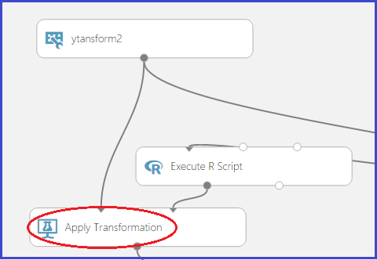

##### An excerpt of what the count features look like
It is instructive to see what the count features look like in our case. Here is an excerpt of this:

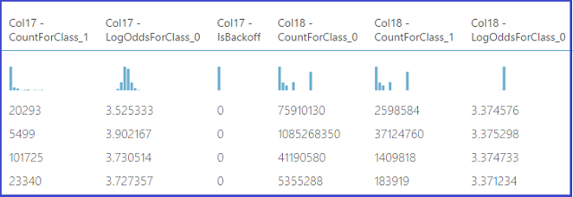

This excerpt shows that for the columns counted on, you get the counts and log odds in addition to any relevant backoffs.

You are now ready to build an Azure Machine Learning model using these transformed datasets. In the next section shows how this can be done.

###  Step 3: Build, train, and score the model

#### Choice of learner
First, you need to choose a learner. Use a two-class boosted decision tree as our learner. Here are the default options for this learner:

For the experiment, choose the default values. Note that the defaults are usually meaningful and a good way to get quick baselines on performance. You can improve on performance by sweeping parameters if you choose to once you have a baseline.

#### Train the model
For training, simply invoke a **Train Model** module. The two inputs to it are the Two-Class Boosted Decision Tree learner and our train dataset. This is shown here:

#### Score the model
Once you have a trained model, you are ready to score on the test dataset and to evaluate its performance. Do this by using the **Score Model** module shown in the following figure, along with an **Evaluate Model** module:

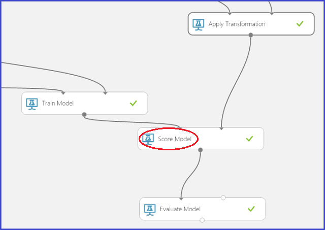

###  Step 4: Evaluate the model
Finally, you should analyze model performance. Usually, for two class (binary) classification problems, a good measure is the AUC. To visualize this, hook up the **Score Model** module to an **Evaluate Model** module for this. Clicking **Visualize** on the **Evaluate Model** module yields a graphic like the following one:

In binary (or two class) classification problems, a good measure of prediction accuracy is the Area Under Curve (AUC). The following section shows our results using this model on our test dataset. To get this, right-click the output port of the **Evaluate Model** module and then **Visualize**.

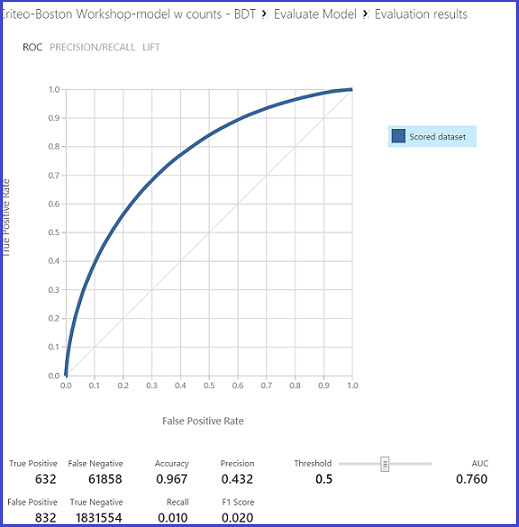

###  Step 5: Publish the model as a Web service
The ability to publish an Azure Machine Learning model as web services with a minimum of fuss is a valuable feature for making it widely available. Once that is done, anyone can make calls to the web service with input data that they need predictions for, and the web service uses the model to return those predictions.

To do this, first save our trained model as a Trained Model object. This is done by right-clicking the **Train Model** module and using the **Save as Trained Model** option.

Next, create input and output ports for our web service:

* an input port takes data in the same form as the data that you need predictions for
* an output port returns the Scored Labels and the associated probabilities.

#### Select a few rows of data for the input port
It is convenient to use an **Apply SQL Transformation** module to select just 10 rows to serve as the input port data. Select just these rows of data for our input port using the SQL query shown here:

#### Web service
Now you are ready to run a small experiment that can be used to publish our web service.

#### Generate input data for webservice
As a zeroth step, since the count table is large, take a few lines of test data and generate output data from it with count features. This can serve as the input data format for our webservice. This is shown here:

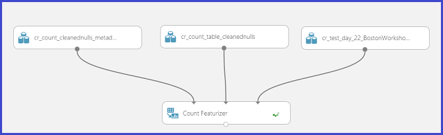

> [!NOTE]
> For the input data format, use the OUTPUT of the **Count Featurizer** module. Once this experiment finishes running, save the output from the **Count Featurizer** module as a Dataset. This Dataset is used for the input data in the webservice.
>
>

#### Scoring experiment for publishing webservice
First, it is shown what this looks like. The essential structure is a **Score Model** module that accepts our trained model object and a few lines of input data that were generated in the previous steps using the **Count Featurizer** module. Use "Select Columns in Dataset" to project out the Scored labels and the Score probabilities.

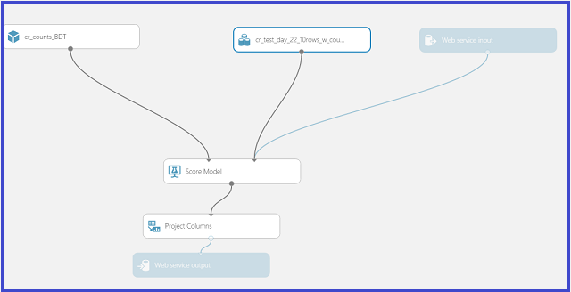

Notice how the **Select Columns in Dataset** module can be used for 'filtering' data out from a dataset. The contents are shown here:

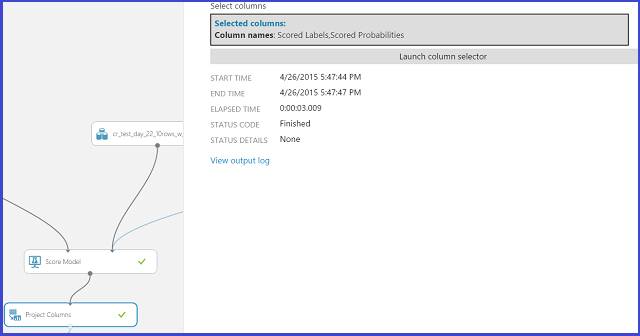

To get the blue input and output ports, you simply click **prepare webservice** at the bottom right. Running this experiment also allows us to publish the web service: click the **PUBLISH WEB SERVICE** icon at the bottom right, shown here:

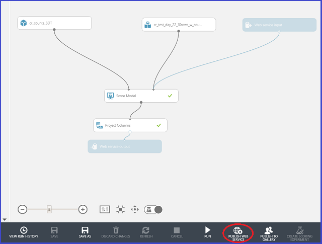

Once the webservice is published, get redirected to a page that looks thus:

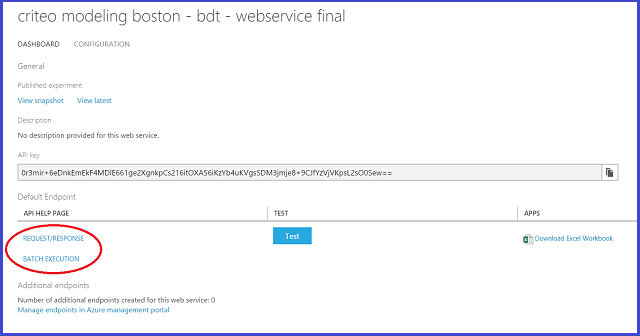

Notice the two links for webservices on the left side:

* The **REQUEST/RESPONSE** Service (or RRS) is meant for single predictions and is what has been utilized in this workshop.
* The **BATCH EXECUTION** Service (BES) is used for batch predictions and requires that the input data used to make predictions reside in Azure Blob Storage.

Clicking on the link **REQUEST/RESPONSE** takes us to a page that gives us pre-canned code in C#, python, and R. This code can be conveniently used for making calls to the webservice. Note that the API key on this page needs to be used for authentication.

It is convenient to copy this python code over to a new cell in the IPython notebook.

Here is a segment of python code with the correct API key.

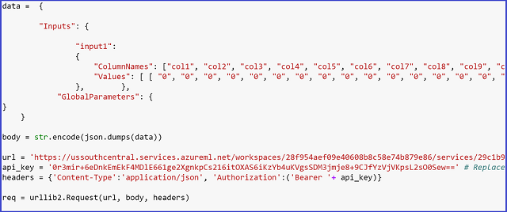

Note that the default API key has been replaced with our webservices's API key. Clicking **Run** on this cell in an IPython notebook yields the following response:

For the two test examples asked about (in the JSON framework of the python script), you get back answers in the form "Scored Labels, Scored Probabilities". In this case, the default values have been chosen that the pre-canned code provides (0's for all numeric columns and the string "value" for all categorical columns).

This concludes our walkthrough showing how to handle large-scale dataset using Azure Machine Learning. You started with a terabyte of data, constructed a prediction model, and deployed it as a web service in the cloud.

