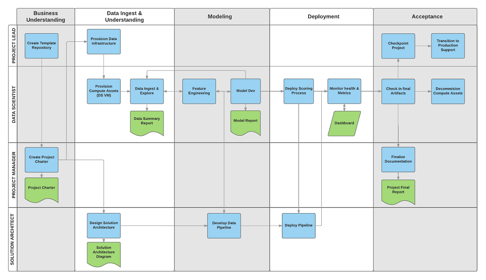
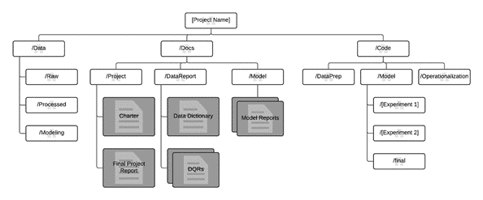
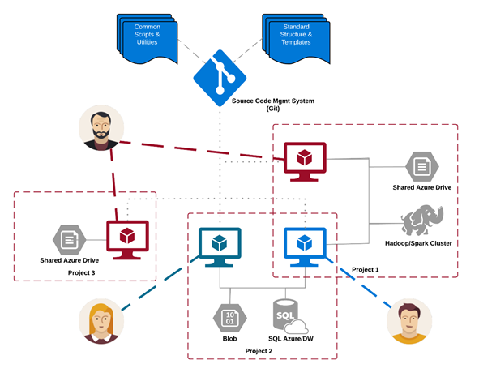

# What is the Team Data Science Process?

The Team Data Science Process (TDSP) is an agile, iterative data science methodology to deliver predictive analytics solutions and intelligent applications efficiently. TDSP helps improve team collaboration and learning. It contains a distillation of the best practices and structures from Microsoft and others in the industry that facilitate the successful implementation of data science initiatives. The goal is to help companies fully realize the benefits of their analytics program.

This article provides an overview of TDSP and its main components. We provide a generic description of the process here that can be implemented with a variety of tools. A more detailed description of the project tasks and roles involved in the lifecycle of the process is provided in additional linked topics. Guidance on how to implement the TDSP using a specific set of Microsoft tools and infrastructure that we use to implement the TDSP in our teams is also provided.

## Key components of the TDSP

TDSP comprises of the following key components:

- A **data science lifecycle** definition
- A **standardized project structure**
- **Infrastructure and resources** for data science projects
- **Tools and utilities** for project execution

## Data science lifecycle

The Team Data Science Process (TDSP) provides a lifecycle to structure the development of your data science projects. The lifecycle outlines the steps, from start to finish, that projects usually follow when they are executed.

If you are using another data science lifecycle, such as [CRISP-DM](https://wikipedia.org/wiki/Cross_Industry_Standard_Process_for_Data_Mining), [KDD](https://wikipedia.org/wiki/Data_mining#Process) or your organization's own custom process, you can still use the task-based TDSP in the context of those development lifecycles. At a high level, these different methodologies have much in common. 

This lifecycle has been designed for data science projects that ship as part of intelligent applications. These applications deploy machine learning or artificial intelligence models for predictive analytics. Exploratory data science projects or ad hoc analytics projects can also benefit from using this process. But in such cases some of the steps described may not be needed.    

The lifecycle outlines the major stages that projects typically execute, often iteratively:

* **Business Understanding**
* **Data Acquisition and Understanding**
* **Modeling**
* **Deployment**
* **Customer Acceptance**

Here is a visual representation of the **Team Data Science Process lifecycle**. 

 

The goals, tasks, and documentation artifacts for each stage of the lifecycle in TDSP are described in the [Team Data Science Process lifecycle](lifecycle.md) topic. These tasks and artifacts are associated with project roles:

- Solution architect
- Project manager
- Data scientist
- Project lead 

The following diagram provides a grid view of the tasks (in blue) and artifacts (in green) associated with each stage of the lifecycle (on the horizontal axis) for these roles (on the vertical axis). 

## Standardized project structure

Having all projects share a directory structure and use templates for project documents makes it easy for the team members to find information about their projects. All code and documents are stored in a version control system (VCS) like Git, TFS, or Subversion to enable team collaboration. Tracking tasks and features in an agile project tracking system like Jira, Rally, and Azure DevOps allows closer tracking of the code for individual features. Such tracking also enables teams to obtain better cost estimates. TDSP recommends creating a separate repository for each project on the VCS for versioning, information security, and collaboration. The standardized structure for all projects helps build institutional knowledge across the organization.

We provide templates for the folder structure and required documents in standard locations. This folder structure organizes the files that contain code for data exploration and feature extraction, and that record model iterations. These templates make it easier for team members to understand work done by others and to add new members to teams. It is easy to view and update document templates in markdown format. Use templates to provide checklists with key questions for each project to insure that the problem is well-defined and that deliverables meet the quality expected. Examples include:

- a project charter to document the business problem and scope of the project
- data reports to document the structure and statistics of the raw data
- model reports to document the derived features
- model performance metrics such as ROC curves or MSE

The directory structure can be cloned from [GitHub](https://github.com/Azure/Azure-TDSP-ProjectTemplate).

## Infrastructure and resources for data science projects  

TDSP provides recommendations for managing shared analytics and storage infrastructure such as:

- cloud file systems for storing datasets 
- databases
- big data (Hadoop or Spark) clusters 
- machine learning service 

The analytics and storage infrastructure can be in the cloud or on-premises. This is where raw and processed datasets are stored. This infrastructure enables reproducible analysis. It also avoids duplication, which can lead to inconsistencies and unnecessary infrastructure costs. Tools are provided to provision the shared resources, track them, and allow each team member to connect to those resources securely. It is also a good practice to have project members create a consistent compute environment. Different team members can then replicate and validate experiments.

Here is an example of a team working on multiple projects and sharing various cloud analytics infrastructure components.

 

## Tools and utilities for project execution

Introducing processes in most organizations is challenging. Tools provided to implement the data science process and lifecycle help lower the barriers to and increase the consistency of their adoption. TDSP provides an initial set of tools and scripts to jump-start adoption of TDSP within a team. It also helps automate some of the common tasks in the data science lifecycle such as data exploration and baseline modeling. There is a well-defined structure provided for individuals to contribute shared tools and utilities into their team’s shared code repository. These resources can then be leveraged by other projects within the team or the organization. TDSP also plans to enable the contributions of tools and utilities to the whole community. The TDSP utilities can be cloned from [GitHub](https://github.com/Azure/Azure-TDSP-Utilities).

## Next steps

[Team Data Science Process: Roles and tasks](https://github.com/Azure/Microsoft-TDSP/blob/master/Docs/roles-tasks.md) Outlines the key personnel roles and their associated tasks for a data science team that standardizes on this process. 
