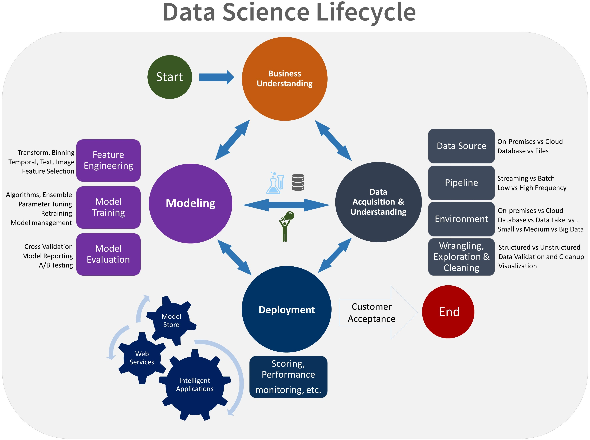
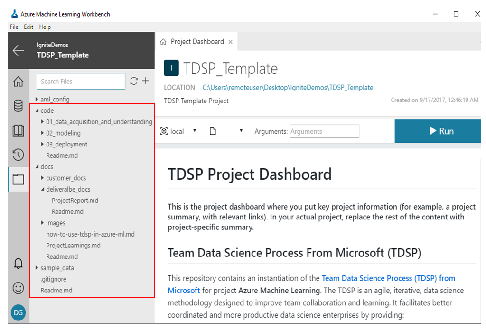
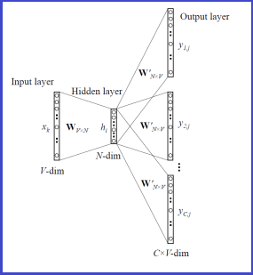
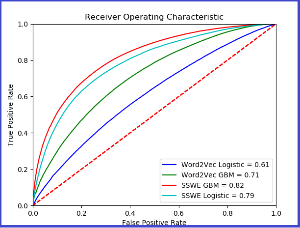
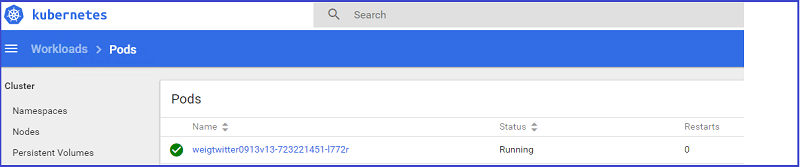

# Predict Twitter sentiment with word embeddings by using the Team Data Science Process

This article shows you how to collaborate effectively by using the _Word2Vec_ word embedding algorithm and the _Sentiment-Specific Word Embedding (SSWE)_ algorithm to predict Twitter sentiment with [Azure Machine Learning](../preview/index.yml). For more information on predicting Twitter sentiment polarity, see the [MachineLearningSamples-TwitterSentimentPrediction repository](https://github.com/Azure/MachineLearningSamples-TwitterSentimentPrediction) on GitHub. The key to facilitating effective team collaboration on data-science projects is to standardize the structure and documentation of the projects with an established data-science lifecycle. The [Team Data Science Process (TDSP)](overview.md) provides this type of structured [lifecycle](lifecycle.md). 

Creating data-science projects with the _TDSP template_ provides the standardized framework for Azure Machine Learning projects. Previously, the TDSP team released a [GitHub repository for the TDSP project structure and templates](https://github.com/Azure/Azure-TDSP-ProjectTemplate). Now Machine Learning projects that are instantiated with [TDSP templates for Azure Machine Learning](https://github.com/amlsamples/tdsp) are enabled. For instructions, see how to use [TDSP structure projects with the TDSP template](../preview/how-to-use-tdsp-in-azure-ml.md) in Azure Machine Learning. 

## Twitter sentiment polarity sample

This article uses a sample to show you how to instantiate and execute a Machine Learning project. The sample uses the TDSP structure and templates in Azure Machine Learning Workbench. The complete sample is provided in [this walkthrough](https://github.com/Azure/MachineLearningSamples-TwitterSentimentPrediction/blob/master/docs/deliverable_docs/Step_By_Step_Tutorial.md). The modeling task predicts sentiment polarity (positive or negative) by using the text from tweets. This article outlines the data-modeling tasks that are described in the walkthrough. The walkthrough covers the following tasks:

- Data exploration, training, and deployment of a machine learning model that address the prediction problem that's described in the use case overview. [Twitter sentiment data](http://cs.stanford.edu/people/alecmgo/trainingandtestdata.zip) is used for these tasks.
- Execution of the project by using the TDSP template from Azure Machine Learning for this project. For project execution and reporting, the TDSP lifecycle is used.
- Operationalization of the solution directly from Azure Machine Learning in Azure Container Service.

The project highlights the following features of Azure Machine Learning:

- Instantiation and use of the TDSP structure.
- Execution of code in Azure Machine Learning Workbench.
- Easy operationalization in Container Service by using Docker and Kubernetes.

## Team Data Science Process
To execute this sample, you use the TDSP project structure and documentation templates in Azure Machine Learning Workbench. The sample implements the [TDSP lifecycle](https://github.com/Azure/Microsoft-TDSP/blob/master/Docs/lifecycle-detail.md), as shown in the following figure:

The TDSP project is created in Azure Machine Learning Workbench based on [these instructions](https://github.com/amlsamples/tdsp/blob/master/docs/how-to-use-tdsp-in-azure-ml.md), as shown in the following figure:

 

## [Data acquisition and preparation](https://github.com/Azure/MachineLearningSamples-TwitterSentimentPrediction/tree/master/code/01_data_acquisition_and_understanding)
The first step in this sample is to download the sentiment140 dataset and divide the data into training and testing datasets. The sentiment140 dataset contains the actual content of the tweet (with emoticons removed). The dataset also contains the polarity of each tweet (negative=0, positive=4) with the neutral tweets removed. After the data is divided, the training data has 1.3 million rows and the testing data has 320,000 rows.

## [Model development](https://github.com/Azure/MachineLearningSamples-TwitterSentimentPrediction/tree/master/code/02_modeling)

The next step in the sample is to develop a model for the data. The modeling task is divided into three parts:

- Feature engineering: Generate features for the model by using different word embedding algorithms. 
- Model creation: Train different models to predict the sentiment of the input text. Examples of these models include _Logistic Regression_ and _Gradient Boosting_.
- Model evaluation: Evaluate the trained models over the testing data.

### [Feature Engineering](https://github.com/Azure/MachineLearningSamples-TwitterSentimentPrediction/tree/master/code/02_modeling/01_FeatureEngineering)

The Word2Vec and SSWE algorithms are used to generate word embeddings. 

#### Word2Vec algorithm

The Word2Vec algorithm is used in the Skip-Gram model. This model is explained in the paper by Tomas Mikolov, et al. "[Distributed Representations of Words and Phrases and their Compositionality. Advances in neural information processing systems.](https://arxiv.org/abs/1310.4546)" 2013.

The Skip-Gram model is a shallow neural network. The input is the target word that's encoded as a one-hot vector, which is used to predict nearby words. If **V** is the size of the vocabulary, then the size of the output layer is __C*V__ where C is the size of the context window. The following figure shows an architecture that's based on the Skip-Gram model:

The detailed mechanics of the Word2Vec algorithm and Skip-Gram model are beyond the scope of this sample. For more information, see the following references:

- [02_A_Word2Vec.py code with referenced TensorFlow examples](https://github.com/tensorflow/tensorflow/blob/master/tensorflow/examples/tutorials/word2vec/word2vec_basic.py) 
- [Vector Representations of Words](https://www.tensorflow.org/tutorials/word2vec)
- [How exactly does word2vec work?](http://www.1-4-5.net/~dmm/ml/how_does_word2vec_work.pdf)
- [Notes on Noise Contrastive Estimation and Negative Sampling](http://demo.clab.cs.cmu.edu/cdyer/nce_notes.pdf)

#### Sentiment-Specific Word Embedding algorithm
The SSWE algorithm tries to overcome a weakness of the Word2Vec algorithm where words with similar contexts and opposite polarity can have similar word vectors. The similarities can cause the Word2Vec algorithm to not perform accurately for tasks like sentiment analysis. The SSWE algorithm tries to handle this weakness by incorporating both the sentence polarity and the word's context into its loss function.

The sample uses a variant of the SSWE algorithm as follows:

- Both the original _ngram_ and the corrupted _ngram_ are used as inputs.
- A ranking style hinge loss function is used for both the syntactic loss and the semantic loss.
- The ultimate loss function is the weighted combination of both the syntactic loss and the semantic loss.
- For simplicity, only the semantic cross entropy is used as the loss function.

The sample shows that even with the simpler loss function, the performance of the SSWE embedding is better than the Word2Vec embedding. The following figure shows the convolutional model that's used to generate sentiment-specific word embedding:

After the training process is done, two embedding files in the tab-separated values (TSV) format are generated for the modeling stage.

For more information about the SSWE algorithms, see the paper by Duyu Tang, et al. "[Learning Sentiment-Specific Word Embedding for Twitter Sentiment Classification](http://www.aclweb.org/anthology/P14-1146)." Association for Computational Linguistics (1). 2014.

### [Model creation](https://github.com/Azure/MachineLearningSamples-TwitterSentimentPrediction/tree/master/code/02_modeling/02_ModelCreation)
After the word vectors are generated by using the SSWE or Word2Vec algorithm, the classification models are trained to predict the actual sentiment polarity. Two types of features: Word2Vec and SSWE, are applied to two models: the Gradient Boosting model and the Logistic Regression model. As a result, four different models are trained.

### [Model evaluation](https://github.com/Azure/MachineLearningSamples-TwitterSentimentPrediction/tree/master/code/02_modeling/03_ModelEvaluation)
After the models are trained, the models are used to test Twitter text data and evaluate each model's performance. The sample evaluates the following four models:

- Gradient Boosting over SSWE embedding.
- Logistic Regression over SSWE embedding.
- Gradient Boosting over Word2Vec embedding.
- Logistic Regression over Word2Vec embedding.

A comparison of the performance of the four models is shown in the following figure:

The Gradient Boosting model with the SSWE feature gives the best performance when comparing the models by using the area under curve (AUC) metric.

## [Deployment](https://github.com/Azure/MachineLearningSamples-TwitterSentimentPrediction/tree/master/code/03_deployment)

The final step is deployment of the trained sentiment prediction model to a web service on a cluster in Azure Container Service. The sample uses the Gradient Boosting model with the SSWE embedding algorithm as the trained model. The operationalization environment provisions Docker and Kubernetes in the cluster to manage the web-service deployment, as shown in the following figure: 

For more information on the operationalization process, see [Deploying an Azure Machine Learning model as a web service](https://docs.microsoft.com/azure/machine-learning/preview/model-management-service-deploy).

## Conclusion

In this article, you learned how to train a word-embedding model by using the Word2Vec and Sentiment-Specific Word Embedding algorithms. The extracted embeddings were used as features to train several models to predict sentiment scores for Twitter text data. The SSWE feature used with the Gradient Boosting model gave the best performance. The model was then deployed as a real-time web service in Container Service by using Azure Machine Learning Workbench.

## References

* [Team Data Science Process](https://docs.microsoft.com/azure/machine-learning/team-data-science-process/overview) 
* [How to use Team Data Science Process (TDSP) in Azure Machine Learning](https://aka.ms/how-to-use-tdsp-in-aml)
* [TDSP project templates for Azure Machine Learning](https://aka.ms/tdspamlgithubrepo)
* [Azure Machine Learning Workbench](https://docs.microsoft.com/azure/machine-learning/preview/)
* [US income data-set from UCI ML repository](https://archive.ics.uci.edu/ml/datasets/adult)
* [Biomedical entity recognition by using TDSP templates](https://docs.microsoft.com/azure/machine-learning/preview/scenario-tdsp-biomedical-recognition)
* [Mikolov, Tomas, et al. "Distributed Representations of Words and Phrases and their Compositionality. Advances in neural information processing systems." 2013.](https://arxiv.org/abs/1310.4546)
* [Tang, Duyu, et al. "Learning Sentiment-Specific Word Embedding for Twitter Sentiment Classification." ACL (1). 2014.](http://www.aclweb.org/anthology/P14-1146)
