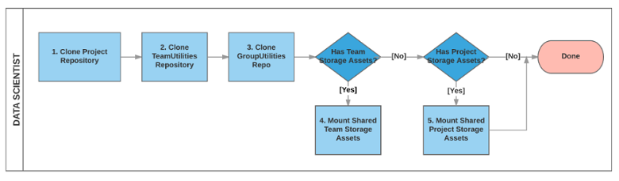
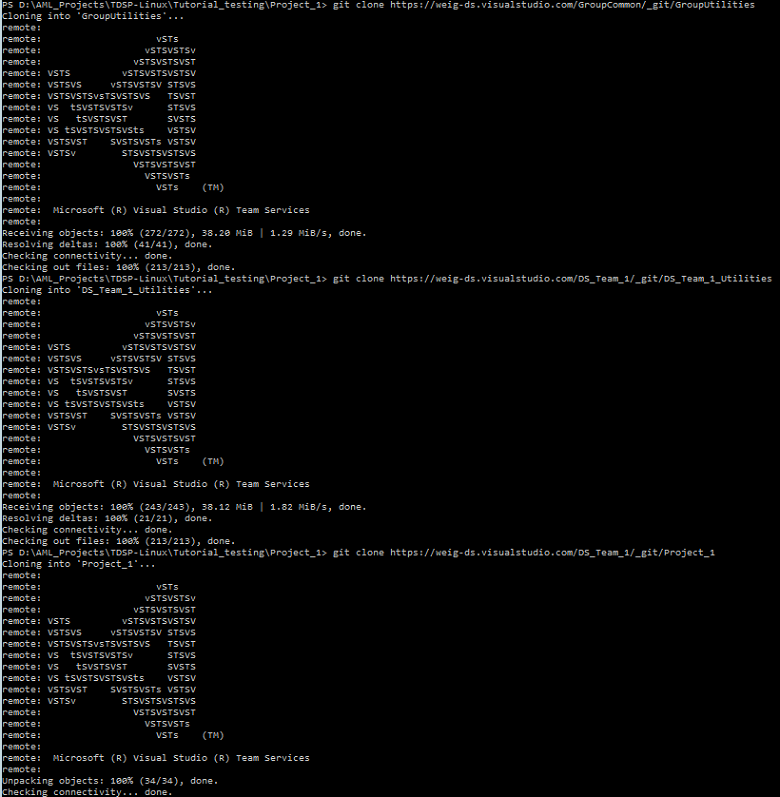
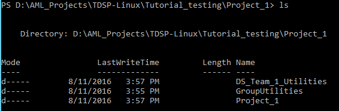
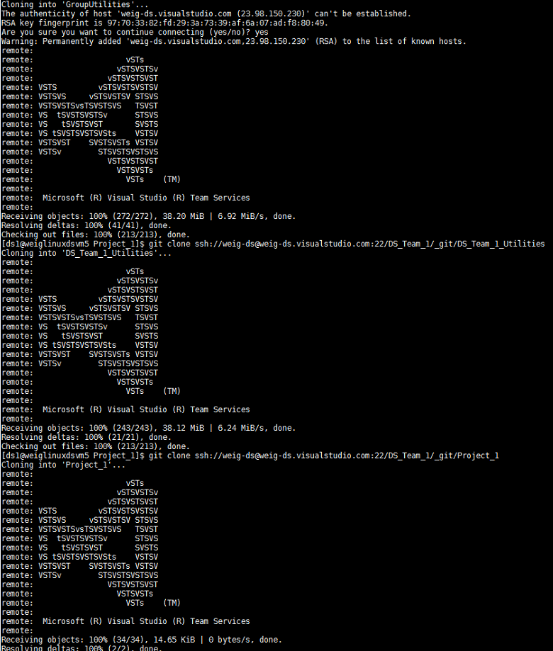
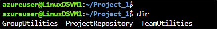

# Tasks for an individual contributor in the Team Data Science Process

This topic outlines the tasks that an individual contributor is expected to complete for their data science team. The objective is to establish collaborative team environment that standardizes on the [Team Data Science Process](overview.md) (TDSP). For an outline of the personnel roles and their associated tasks that are handled by a data science team standardizing on this process, see [Team Data Science Process roles and tasks](roles-tasks.md).

The tasks of project individual contributors (data scientists) to set up the TDSP environment for the project are depicted as follows: 

- **GroupUtilities** is the repository that your group is maintaining to share useful utilities across the entire group. 
- **TeamUtilities** is the repository that your team is maintaining specifically for your team. 

For instructions on how to execute a data science project under TDSP, see [Execution of Data Science Projects](project-execution.md). 

>[AZURE.NOTE] We outline the steps needed to set up a TDSP team environment using Azure DevOps in the following instructions. We specify how to accomplish these tasks with Azure DevOps because that is how we implement TDSP at Microsoft. If another code-hosting platform is used for your group, the tasks that need to be completed by the team lead generally do not change. But the way to complete these tasks is going to be different.

## Repositories and directories

This tutorial uses abbreviated names for repositories and directories. These names make it easier to follow the operations between the repositories and directories. This notation (**R** for Git repositories and **D** for local directories on your DSVM) is used in the following sections:

- **R2**: The GroupUtilities repository on Git that your group manager has set up on your Azure DevOps group server.
- **R4**: The TeamUtilities repository on Git that your team lead has set up.
- **R5**: The Project repository on Git that has been set up by your project lead.
- **D2**: The local directory cloned from R2.
- **D4**: The local directory cloned from R4.
- **D5**: The local directory cloned from R5.

## Step-0: Prerequisites

The prerequisites are satisfied by completing the tasks assigned to your group manager outlined in [Group Manager tasks for a data science team](group-manager-tasks.md). To summarize here, the following requirements need to be met before you begin the team lead tasks: 
- Your group manager has set up the **GroupUtilities** repository (if any). 
- Your team lead has set up the **TeamUtilities** repository (if any).
- Your project lead has set up the project repository. 
- You have been added to your project repository by your project lead with the privilege to clone from and push back to the project repository.

The second, **TeamUtilities** repository, prerequisite is optional, depending on whether your team has a team-specific utility repository. If any of other three prerequisites has not been completed, contact your team lead, your project lead, or their delegates to set it up by following the instructions for [Team Lead tasks for a data science team](team-lead-tasks.md) or for [Project Lead tasks for a data science team](project-lead-tasks.md).

- Git must be installed on your machine. If you are using a Data Science Virtual Machine (DSVM), Git has been pre-installed and you are good to go. Otherwise, see the [Platforms and tools appendix](platforms-and-tools.md#appendix).  
- If you are using a **Windows DSVM**, you need to have [Git Credential Manager (GCM)](https://github.com/Microsoft/Git-Credential-Manager-for-Windows) installed on your machine. In the README.md file, scroll down to the **Download and Install** section and click the *latest installer*. This takes you to the latest installer page. Download the .exe installer from here and run it. 
- If you are using **Linux DSVM**, create an SSH public key on your DSVM and add it to your group Azure DevOps Services. For more information about SSH, see the **Create SSH public key** section in the [Platforms and tools appendix](platforms-and-tools.md#appendix). 
- If your team and/or project lead has created some Azure file storage that you need to mount to your DSVM, you should get the Azure file storage information from them. 

## Step 1-3: Clone group, team, and project repositories to local machine

This section provides instructions on completing the first three tasks of project individual contributors: 

- Clone the **GroupUtilities** repository R2 to D2
- Clone the **TeamUtilities** repository R4 to D4 
- Clone the **Project** repository R5 to D5.

On your local machine, create a directory ***C:\GitRepos*** (for Windows) or ***$home/GitRepos*** (forLinux), and then change to that directory. 

Run the one of the following commands (as appropriate for your OS) to clone your **GroupUtilities**, **TeamUtilities**, and **Project** repositories to directories on your local machine: 

**Windows**
	
	git clone <the URL of the GroupUtilities repository>
	git clone <the URL of the TeamUtilities repository>
	git clone <the URL of the Project repository>
	

Confirm that you see the three folders under your project directory.

**Linux**
	
	git clone <the SSH URL of the GroupUtilities repository>
	git clone <the SSH URL of the TeamUtilities repository>
	git clone <the SSH URL of the Project repository>

Confirm that you see the three  folders under your project directory.

## Step 4-5: Mount Azure file storage to your DSVM (Optional)

To mount Azure file storage to your DSVM, see the instructions in Section 4 of the [Team lead tasks for a data science team](team-lead-tasks.md)

## Next steps

Here are links to the more detailed descriptions of the roles and tasks defined by the Team Data Science Process:

- [Group Manager tasks for a data science team](group-manager-tasks.md)
- [Team Lead tasks for a data science team](team-lead-tasks.md)
- [Project Lead tasks for a data science team](project-lead-tasks.md)
- [Project Individual Contributors for a data science team](project-ic-tasks.md)

