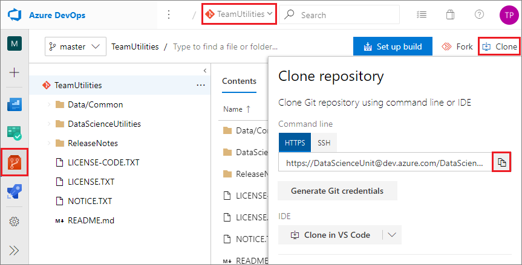

# Tasks for an individual contributor in the Team Data Science Process

This topic outlines the tasks that an *individual contributor* completes to set up a project in the [Team Data Science Process](overview.md) (TDSP). The objective is to work in a collaborative team environment that standardizes on the TDSP. The TDSP is designed to help improve collaboration and team learning. For an outline of the personnel roles and their associated tasks that are handled by a data science team standardizing on the TDSP, see [Team Data Science Process roles and tasks](roles-tasks.md).

The following diagram shows the tasks that project individual contributors (data scientists) complete to set up their team environment. For instructions on how to execute a data science project under the TDSP, see [Execution of data science projects](project-execution.md). 


- **ProjectRepository** is the repository your project team maintains to share project templates and assets.
- **TeamUtilities** is the utilities repository your team maintains specifically for your team. 
- **GroupUtilities** is the repository your group maintains to share useful utilities across the entire group. 

> [!NOTE] 
> This article uses Azure Repos and a Data Science Virtual Machine (DSVM) to set up a TDSP environment, because that is how to implement TDSP at Microsoft. If your team uses other code hosting or development platforms, the individual contributor tasks are the same, but the way to complete them may be different.

## Prerequisites

This tutorial assumes that the following resources and permissions have been set up by your [group manager](group-manager-tasks.md), [team lead](team-lead-tasks.md), and [project lead](project-lead-tasks.md):

- The Azure DevOps **organization** for your data science unit
- A **project repository** set up by your project lead to share project templates and assets
- **GroupUtilities** and **TeamUtilities** repositories set up by the group manager and team lead, if applicable
- Azure **file storage** set up for shared assets for your team or project, if applicable
- **Permissions** for you to clone from and push back to your project repository 

To clone repositories and modify content on your local machine or DSVM, or mount Azure file storage to your DSVM, you need to consider this checklist:

- An Azure subscription.
- Git installed on your machine. If you're using a DSVM, Git is pre-installed. Otherwise, see the [Platforms and tools appendix](platforms-and-tools.md#appendix).
- If you want to use a DSVM, the Windows or Linux DSVM created and configured in Azure. For more information and instructions, see the [Data Science Virtual Machine Documentation](/azure/machine-learning/data-science-virtual-machine/).
- For a Windows DSVM, [Git Credential Manager (GCM)](https://github.com/Microsoft/Git-Credential-Manager-for-Windows) installed on your machine. In the *README.md* file, scroll down to the **Download and Install** section and select the **latest installer**. Download the *.exe* installer from the installer page and run it. 
- For a Linux DSVM, an SSH public key set up on your DSVM and added in Azure DevOps. For more information and instructions, see the **Create SSH public key** section in the [Platforms and tools appendix](platforms-and-tools.md#appendix). 
- The Azure file storage information for any Azure file storage you need to mount to your DSVM. 

## Clone repositories

To work with repositories locally and push your changes up to the shared team and project repositories, you first copy or *clone* the repositories to your local machine. 

1. In Azure DevOps, go to your team's project Summary page at *https:\//\<server name>/\<organization name>/\<team name>*, for example, **https:\//dev.azure.com/DataScienceUnit/MyTeam**.
   
1. Select **Repos** in the left navigation, and at the top of the page, select the repository you want to clone.
   
1. On the repo page, select **Clone** at upper right.
   
1. In the **Clone repository** dialog, select **HTTPS** for an HTTP connection, or **SSH** for an SSH connection, and copy the clone URL under **Command line** to your clipboard.
   
   
   
1. On your local machine or DSVM, create the following directories:
   
   - For Windows: **C:\GitRepos**
   - For Linux: **$home/GitRepos**
   
1. Change to the directory you created.
   
1. In Git Bash, run the command `git clone <clone URL>` for each repository you want to clone. 
   
   For example, the following command clones the **TeamUtilities** repository to the *MyTeam* directory on your local machine. 
   
   **HTTPS connection:**
   
   ```bash
   git clone https://DataScienceUnit@dev.azure.com/DataScienceUnit/MyTeam/_git/TeamUtilities
   ```
   
   **SSH connection:**
   
   ```bash
   git clone git@ssh.dev.azure.com:v3/DataScienceUnit/MyTeam/TeamUtilities
   ```
   
1. Confirm that you can see the folders for the cloned repositories in your local project directory.
   
   

## Mount Azure file storage to your DSVM

If your team or project has shared assets in Azure file storage, mount the file storage to your local machine or DSVM. Follow the instructions at [Mount Azure file storage on your local machine or DSVM](team-lead-tasks.md#mount-azure-file-storage-on-your-local-machine-or-dsvm).

## Next steps

Here are links to detailed descriptions of the other roles and tasks defined by the Team Data Science Process:

- [Group Manager tasks for a data science team](group-manager-tasks.md)
- [Team Lead tasks for a data science team](team-lead-tasks.md)
- [Project Lead tasks for a data science team](project-lead-tasks.md)

