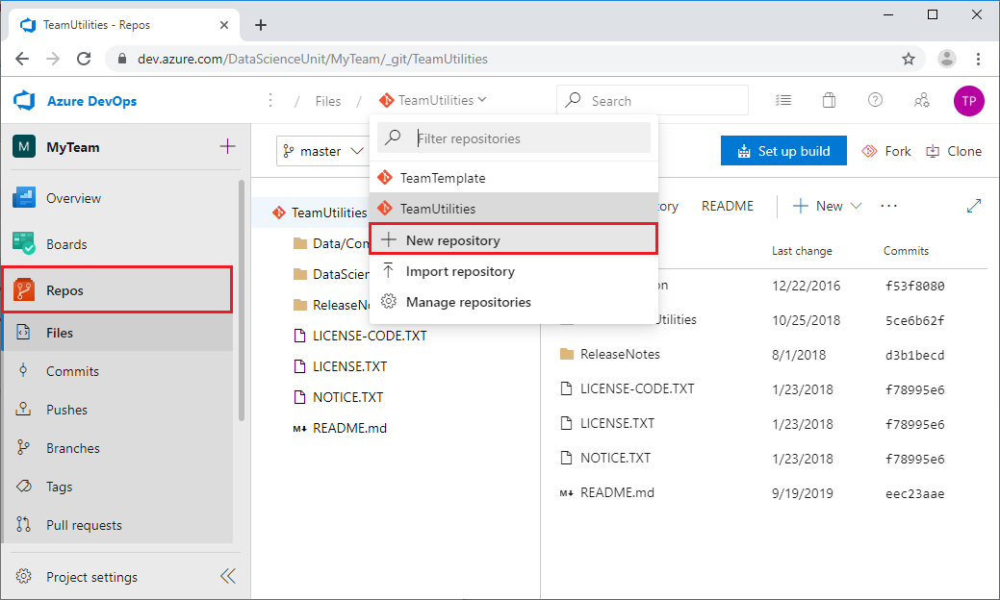

# Project lead tasks in the Team Data Science Process

This article describes tasks that a *project lead* completes to set up a repository for their project team in the [Team Data Science Process](overview.md) (TDSP). The TDSP is a framework developed by Microsoft that provides a structured sequence of activities to efficiently execute cloud-based, predictive analytics solutions. The TDSP is designed to help improve collaboration and team learning. For an outline of the personnel roles and associated tasks for a data science team standardizing on the TDSP, see [Team Data Science Process roles and tasks](roles-tasks.md).

A project lead manages the daily activities of individual data scientists on a specific data science project in the TDSP. The following diagram shows the workflow for project lead tasks:

This tutorial covers Step 1: Create project repository, and Step 2: Seed project repository from your team ProjectTemplate repository. 

For Step 3: Create Feature work item for project, and Step 4: Add Stories for project phases, see [Agile development of data science projects](agile-development.md).

For Step 5: Create and customize storage/analysis assets and share, if necessary, see [Create team data and analytics resources](team-lead-tasks.md#create-team-data-and-analytics-resources).

For Step 6: Set up security control of project repository, see [Add team members and configure permissions](team-lead-tasks.md#add-team-members-and-configure-permissions).

> [!NOTE] 
> This article uses Azure Repos to set up a TDSP project, because that is how to implement TDSP at Microsoft. If your team uses another code hosting platform, the project lead tasks are the same, but the way to complete them may be different.

## Prerequisites

This tutorial assumes that your [group manager](group-manager-tasks.md) and [team lead](team-lead-tasks.md) have set up the following resources and permissions:

- The Azure DevOps **organization** for your data unit
- A team **project** for your data science team
- Team template and utilities **repositories**
- **Permissions** on your organization account for you to create and edit repositories for your project

To clone repositories and modify content on your local machine or Data Science Virtual Machine (DSVM), or set up Azure file storage and mount it to your DSVM, you also need to consider this checklist:

- An Azure subscription.
- Git installed on your machine. If you're using a DSVM, Git is pre-installed. Otherwise, see the [Platforms and tools appendix](platforms-and-tools.md#appendix).
- If you want to use a DSVM, the Windows or Linux DSVM created and configured in Azure. For more information and instructions, see the [Data Science Virtual Machine Documentation](/azure/machine-learning/data-science-virtual-machine/).
- For a Windows DSVM, [Git Credential Manager (GCM)](https://github.com/Microsoft/Git-Credential-Manager-for-Windows) installed on your machine. In the *README.md* file, scroll down to the **Download and Install** section and select the **latest installer**. Download the *.exe* installer from the installer page and run it. 
- For a Linux DSVM, an SSH public key set up on your DSVM and added in Azure DevOps. For more information and instructions, see the **Create SSH public key** section in the [Platforms and tools appendix](platforms-and-tools.md#appendix). 

## Create a project repository in your team project

To create a project repository in your team's **MyTeam** project:

1. Go to your team's project **Summary** page at *https:\//\<server name>/\<organization name>/\<team name>*, for example, **https:\//dev.azure.com/DataScienceUnit/MyTeam**, and select **Repos** from the left navigation. 
   
1. Select the repository name at the top of the page, and then select **New repository** from the dropdown.
   
   
   
1. In the **Create a new repository** dialog, make sure **Git** is selected under **Type**. Enter *DSProject1* under **Repository name**, and then select **Create**.
   
   
   
1. Confirm that you can see the new **DSProject1** repository on your project settings page. 
   
   

## Import the team template into your project repository

To populate your project repository with the contents of your team template repository:

1. From your team's project **Summary** page, select **Repos** in the left navigation. 
   
1. Select the repository name at the top of the page, and select **DSProject1** from the dropdown.
   
1. On the **DSProject1 is empty** page, select **Import**. 
   
   
   
1. In the **Import a Git repository** dialog, select **Git** as the **Source type**, and enter the URL for your **TeamTemplate** repository under **Clone URL**. The URL is *https:\//\<server name>/\<organization name>/\<team name>/_git/\<team template repository name>*. For example: **https:\//dev.azure.com/DataScienceUnit/MyTeam/_git/TeamTemplate**. 
   
1. Select **Import**. The contents of your team template repository are imported into your project repository. 
   
   

If you need to customize the contents of your project repository to meet your project's specific needs, you can add, delete, or modify repository files and folders. You can work directly in Azure Repos, or clone the repository to your local machine or DSVM, make changes, and commit and push your updates to the shared project repository. Follow the instructions at [Customize the contents of the team repositories](team-lead-tasks.md#customize-the-contents-of-the-team-repositories).

## Next steps

Here are links to detailed descriptions of the other roles and tasks defined by the Team Data Science Process:

- [Group Manager tasks for a data science team](group-manager-tasks.md)
- [Team Lead tasks for a data science team](team-lead-tasks.md)
- [Individual Contributor tasks for a data science team](project-ic-tasks.md)
