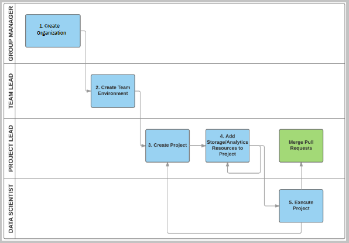
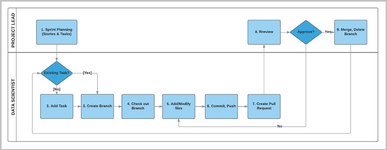

# Team Data Science Process roles and tasks

The Team Data Science Process is a framework developed by Microsoft that provides a structured methodology to build predictive analytics solutions and intelligent applications efficiently. This article outlines the key personnel roles, and their associated tasks that are handled by a data science team standardizing on this process. 

This introduction links to tutorials that provide instructions on how to set up the TDSP environment for the entire data science group, data science teams, and projects. 
It provides detailed guidance using Azure DevOps in the tutorials. Azure DevOps provides a code-hosting platform and agile planning tool to manage team tasks, control access, and manage the repositories. 

You can use this information to implement TDSP on your own code-hosting and agile planning tool. 

## Structures of data science groups and teams

Data science functions in enterprises may often be organized in the following hierarchy:

1. ***Data science group/s***

2. ***Data science team/s within group/s***

In such a structure, there are group and team leads. Typically, a data science project is done by a data science team, which may be composed of project leads (for project management and governance tasks) and data scientists or engineers (individual contributors / technical personnel) who will execute the data science and data engineering parts of the project. Prior to execution, the setup and governance is done by the group, team, or project leads.

## Definition of four TDSP roles
With the above assumption, there are four distinct roles for the team personnel:

1. ***Group Manager***. Group Manager is the manager of the entire data science unit in an enterprise. A data science unit might have multiple teams, each of which is working on multiple data science projects in distinct business verticals. A Group Manager might delegate their tasks to a surrogate, but the tasks associated with the role do not change.

2. ***Team Lead***. A team lead is managing a team in the data science unit of an enterprise. A team consists of multiple data scientists. For data science unit with only a small number of data scientists, the Group Manager and the Team Lead might be the same person.

3. ***Project Lead***. A project lead manages the daily activities of individual data scientists on a specific data science project.

4. ***Project Individual Contributor***. Data Scientist, Business Analyst, Data Engineer, Architect, etc. A project individual contributor executes a data science project. 

> [!NOTE]
> Depending on the structure in an enterprise, a single person may play more than one role OR there may be more than one person working on a role. This may frequently be the case in small enterprises or enterprises with a small number of personnel in their data science organization.

## Tasks to be completed by four personnel

The following picture depicts the top-level tasks for personnel by role in adopting and implementing the Team Data Science Process as conceptualized by Microsoft. 

This schema and the following, more detailed outline of tasks that are assigned to each role in the TDSP should help you choose the appropriate tutorial based on your responsibilities in the organization.

> [!NOTE]
> The following instructions show steps of how to set up a TDSP environment and complete other data science tasks in Azure DevOps. We specify how to accomplish these tasks with Azure DevOps because that is what we are using to implement TDSP at Microsoft. Azure DevOps facilitates collaboration by integrating the management of work items that track tasks and a code hosting service used to share utilities, organize versions, and provide role-based security. You are able to choose other platforms, if you prefer, to implement the tasks outlined by the TDSP. But depending on your platform, some features leveraged from Azure DevOps may not be available. 
>
>Instructions here also use the [Data Science Virtual Machine (DSVM)](http://aka.ms/dsvm) on the Azure cloud as the analytics desktop with several popular data science tools pre-configured and integrated with various Microsoft software and Azure services. You can use the DSVM or any other development environment to implement TDSP. 

## Group Manager tasks

The following tasks are completed by the Group Manager (or a designated TDSP system administrator) to adopt the TDSP:

- Create a **group account** on a code hosting platform (like Github, Git, Azure DevOps, or others)
- Create a **project template repository** on the group account, and seed it from the project template repository developed by Microsoft TDSP team. The TDSP project template repository from Microsoft 
    - provides a **standardized directory structure** including directories for data, code, and documents, 
    - provides a set of **standardized document templates** to guide an efficient data science process. 
- Create a **utility repository**, and seed it from the utility repository developed by Microsoft TDSP team. The TDSP utility repository from Microsoft provides 
    - a set of useful utilities to make the work of a data scientist more efficient, including utilities for interactive data exploration, analysis, and reporting, and for baseline modeling and reporting.
- Set up the **security control policy** of these two repositories on your group account.  

For detailed step-by-step instructions, see [Group Manager tasks for a data science team](group-manager-tasks.md). 

## Team Lead tasks

The following tasks are completed by the Team Lead (or a designated project administrator) to adopt the TDSP:

- If Azure DevOps is selected to be the code hosting platform for versioning and collaboration, create a **project** on the group's Azure DevOps Services. Otherwise, this task can be skipped.
- Create the **project template repository** under the project, and seed it from the group project template repository set up by your group manager or the delegate of the manager. 
- Create the **team utility repository**, and add the team-specific utilities to the repository. 
- (Optional) Create **[Azure file storage](https://azure.microsoft.com/services/storage/files/)** to be used to store data assets that can be useful for the entire team. Other team members can mount this shared cloud file store on their analytics desktops.
- (Optional) Mount the Azure file storage to the **Data Science Virtual Machine** (DSVM) of the team lead and add data assets on it.
- Set up the **security control** by adding team members and configure their privileges. 

For detailed step-by-step instructions, see [Team Lead tasks for a data science team](team-lead-tasks.md).  

## Project Lead tasks

The following tasks are completed by the Project Lead to adopt the TDSP:

- Create a **project repository** under the project, and seed it from the project template repository. 
- (Optional) Create **Azure file storage** to be used to store data assets of the project. 
- (Optional) Mount the Azure file storage to the **Data Science Virtual Machine** (DSVM) of the Project Lead and add project data assets on it.
- Set up the **security control** by adding project members and configure their privileges. 

For detailed step-by-step instructions, see [Project Lead tasks for a data science team](project-lead-tasks.md). 

## Project Individual Contributor tasks

The following tasks are completed by a Project Individual Contributor (usually a Data Scientist) to conduct the data science project using the TDSP:

- Clone the **project repository** set up by the project lead. 
- (Optional) Mount the shared **Azure file storage** of the team and project on their **Data Science Virtual Machine** (DSVM).
- Execute the project. 

 
For detailed step-by-step instructions for on-boarding onto a project, see [Project Individual Contributors for a data science team](project-ic-tasks.md). 

## Data science project execution
 
By following the relevant set of instructions, data scientists, project lead, and team leads can create work items to track all tasks and stages that a project needs from its beginning to its end. Using git also promotes collaboration among data scientists and ensures that the artifacts generated during project execution are version controlled and shared by all project members.

The instructions provided for project execution have been developed based on the assumption that both work items and project git repositories are on Azure DevOps. Using Azure DevOps for both allows you to link your work items with the Git branches of your project repositories. In this way, you can easily track what has been done for a work item. 

The following figure outlines this workflow for project execution using the TDSP.

The workflow includes steps that can be grouped into three activities:

- Sprint planning (Project Lead)
- Developing artifacts on git branches to address work items (Data Scientist)
- Code review and merging branches with master branches (Project Lead or other team members)

For detailed step-by-step instructions on project execution workflow, see [Execution of data science projects](project-execution.md).

## Project structure

Use this [project template repository](https://github.com/Azure/Azure-TDSP-ProjectTemplate) to support efficient project execution and collaboration. This repository gives you a standardized directory structure and document templates you can use for your own TDSP project.

## Next steps

Explore more detailed descriptions of the roles and tasks defined by the Team Data Science Process:

- [Group Manager tasks for a data science team](group-manager-tasks.md)
- [Team Lead tasks for a data science team](team-lead-tasks.md)
- [Project Lead tasks for a data science team](project-lead-tasks.md)
- [Project Individual Contributors for a data science team](project-ic-tasks.md)